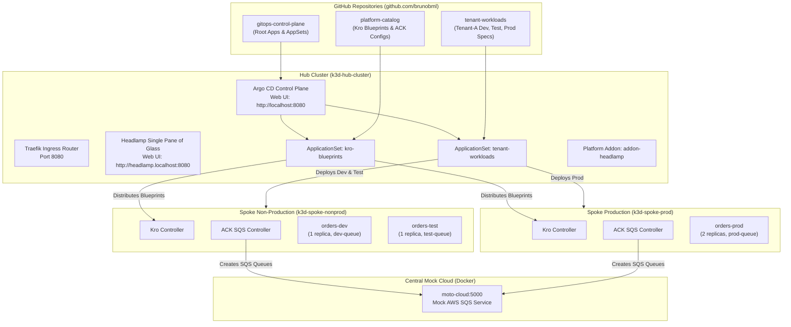

# GitOps Control Plane (Hub Cluster)

This repository serves as the central GitOps control plane for a multi-cluster **Hub-and-Spoke** architecture using **Argo CD**, **Kro (K8s Resource Orchestrator)**, and **AWS Controllers for Kubernetes (ACK)** against a local centralized mock AWS cloud (**Moto**).

---

## 🏛 Architecture Overview



---

## 📂 Repository Structure

```
├── addons/
│   └── headlamp/                     # 🧭 Single Pane of Glass multi-cluster dashboard
│       ├── README.md                 # Architecture, routing, and exploration guide
│       ├── values.yaml               # Headlamp Helm values (Ingress, resources, mounts)
│       └── setup-credentials.sh      # Assembles multi-cluster kubeconfig secret
├── applicationsets/
│   ├── addon-headlamp.yaml           # Deploys Headlamp dashboard to Hub cluster (Project: control-plane)
│   ├── kro-blueprints.yaml           # Distributes ResourceGraphDefinitions to all spoke clusters (Project: platform-catalog)
│   └── tenant-workloads.yaml         # One Application per tenant registration file in the tenant-workloads repo
│                                     #   (tenants/<tenant>/apps/<app>-<env>.yaml; env decides spoke + AWS account)
├── bootstrap/
│   └── root-app.yaml                 # App-of-Apps root application for Hub Argo CD (Project: control-plane)
├── clusters/
│   └── values-argocd-hub.yaml        # Argo CD Helm values with Lua health checks for Kro & ACK
├── projects/                         # 🛡️ Enterprise AppProject boundaries & security guardrails
│   ├── control-plane.yaml            # Control plane machinery isolation
│   ├── platform-catalog.yaml         # Platform engineering blueprint distribution
│   └── tenant-workloads.yaml         # Multi-tenant workload isolation and cluster guardrails
├── docs/
│   ├── developer-tutorial.md         # Comprehensive developer onboarding guide
│   ├── production-promotion-guardrails.md # Enterprise production promotion patterns & guardrails
│   ├── argocd-visual-design-and-naming-standards.md # UI/UX design standards, labels, deep links & naming conventions
│   ├── aws-well-architected-production-guide.md # 6-Pillar AWS Well-Architected audit & production transition blueprint
│   ├── lab-progression-and-next-steps.md # Advanced enterprise roadmap (KEDA, Rollouts, Kyverno, Chaos, Telemetry)
│   ├── assessments/2026-09-30-lab-assessment.md # Comprehensive hub-spoke lab assessment & maturity audit
│   ├── runbooks/host-reboot-and-cluster-lifecycle.md # Operational runbook for host reboots & lifecycle
│   └── remediation/2026-09-30-lab-remediation-plan.md # Targeted remediation plan for low-severity findings
├── scripts/
│   ├── setup-hub-spoke.sh            # Provisions Moto, k3d clusters, Traefik, Argo CD, Kro & ACK
│   ├── register-spokes.sh            # Creates tokens and registers spokes in Hub Argo CD
│   ├── smoke-test-hub-spoke.sh       # Verifies connectivity, controllers, and queues
│   ├── push-all.sh                   # Pushes all 3 local repos to GitHub
│   └── teardown-hub-spoke.sh         # Cleans up clusters, containers, and network
├── Makefile                          # Developer workflow automation
└── README.md
```

---

## 🚀 Quick Start Guide

### 1. Provision Multi-Cluster Environment
Run the automated setup to create the Docker network, Moto cloud, 3 k3d clusters, install Traefik, Argo CD, Headlamp, register the spokes, and install the Kro and ACK controllers:

```bash
make setup
```

Access Web Dashboards on Port 8080:
* **Argo CD UI (Desired State)**: [http://localhost:8080](http://localhost:8080) (or `http://argocd.localhost:8080`; "Log in via Keycloak" as `platform-user` or `tenant-a-user`; break-glass: local `platform-admin`; passwords via `make password`)
* **Headlamp UI (Runtime State)**: [http://headlamp.localhost:8080](http://headlamp.localhost:8080) (Single Pane of Glass across Hub, Non-Prod, and Prod clusters)

### 2. Push Repositories to GitHub
Make sure your 5 GitHub repositories are created under `https://github.com/brunobml`:
- `gitops-control-plane`
- `platform-catalog`
- `tenant-workloads`
- `orders-processor`
- `helm-charts`

Push all repositories to GitHub using the helper script or push from each repository:

```bash
# Push all local lab repositories
make push
```

### 3. Bootstrap the Control Plane
Deploy the root application onto the Hub cluster:

```bash
make bootstrap
```

Argo CD will automatically discover the ApplicationSets and synchronize:
1. `kro-blueprints` to `spoke-nonprod` and `spoke-prod`.
2. `orders-dev` and `orders-test` workloads to `spoke-nonprod`.
3. `orders-prod` workloads to `spoke-prod`.

### 4. Verify & Test
Run the end-to-end smoke test suite:

```bash
make test
```

Check resource statuses across all clusters and Moto SQS queues:

```bash
make status
```

---

## 🔄 Host Reboot & Lab Lifecycle

To pause or resume your local multi-cluster environment without losing state or re-provisioning:

```bash
# Gracefully stop clusters and Moto before host shutdown/reboot
make stop

# Resume clusters and Moto after host reboot
make start
```

For troubleshooting hanging Docker daemons, spoke connection errors, or token rotation, see the [Host Reboot & Lab Lifecycle Runbook](docs/runbooks/host-reboot-and-cluster-lifecycle.md).

---

## 🧹 Teardown

To completely clean up all clusters, mock cloud containers, and networks:

```bash
make teardown
```

## AI-Assisted Lab Assessment

This repository includes a carefully crafted prompt that lets an AI agent (with live access to the cluster and repositories) perform a structured, multi-layered assessment of the lab as a Master DevSecOps Architect.

The agent evaluates architecture, GitOps maturity, security posture, production parity with a real EKS hub-spoke design, and how easy the lab is for new engineers to understand and extend.

→ See [`docs/ai-agent-lab-assessment-prompt.md`](docs/ai-prompts/ai-agent-lab-assessment-prompt.md)
