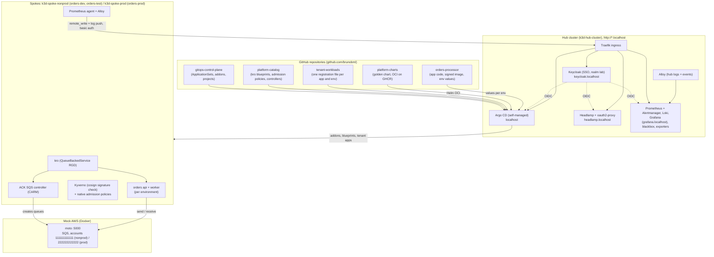

# GitOps Control Plane (Hub Cluster)

This repository serves as the central GitOps control plane for a multi-cluster **Hub-and-Spoke** architecture using **Argo CD**, **Kro (K8s Resource Orchestrator)**, and **AWS Controllers for Kubernetes (ACK)** against a local centralized mock AWS cloud (**Moto**).

---

## 🏛 Architecture Overview



* **Argo CD on the hub** deploys everything, to itself and to both spokes. Changes reach the clusters only through Git.
* **Platform catalog:** prod follows a release tag, nonprod follows `main` (`clusters/blueprint-revisions.env`, then `make promote-blueprints`).
* **Tenant apps:** one file per app and environment in `tenant-workloads`. A prod change is a commit there that sets a full commit SHA.
* **Supply chain:** tenant images must come from `ghcr.io/brunobml/`, and the `orders-processor` images must be cosign-signed.

---

## 📂 Repository Structure

```
├── .github/CODEOWNERS                # Review owners for prod-relevant paths
├── addons/                           # Hub add-ons deployed by the addon-* ApplicationSets
│   ├── headlamp/                     # 🧭 Multi-cluster dashboard (values, kubeconfig secret script, README)
│   ├── keycloak/                     # 🔐 Keycloak SSO: realm "lab", ingress, NetworkPolicy, CoreDNS rewrite
│   ├── observability/                # 📈 Prometheus, Loki, Alloy, Grafana, blackbox values; alert rules + tests;
│   │                                 #    dashboards; credential-expiry exporter
│   └── probes/                       # Synthetic end-to-end order probe (runs on the spokes)
├── applicationsets/                  # Everything Argo CD deploys:
│                                     #   addon-*         hub add-ons (Traefik, Keycloak, Headlamp, oauth2-proxy, observability)
│                                     #   addons-spoke-*  spoke add-ons (kro, ACK SQS, Kyverno, agents, logging, platform config)
│                                     #   argo-cd         Argo CD manages itself (manual sync)
│                                     #   kro-blueprints  platform-catalog blueprints per spoke (revision from clusters/)
│                                     #   tenant-workloads one Application per tenant registration file
│                                     #   platform-projects AppProjects
├── ci/                              # Track A CI toolkit: offline render, kubeconform, CEL, secret scan (`make ci*`)
├── bootstrap/                        # Root App-of-Apps and the hub deployer identity
├── clusters/
│   ├── blueprint-revisions.env       # Catalog revision per spoke (prod = release tag)
│   ├── platform-config/<spoke>/      # Per-spoke platform settings
│   └── values-argocd-hub.yaml        # Argo CD Helm values (OIDC, RBAC, health checks)
├── projects/                         # 🛡️ AppProject boundaries
├── docs/
│   ├── developer-tutorial.md         # Developer onboarding guide
│   ├── production-promotion-guardrails.md # Promotion patterns and guardrails
│   ├── argocd-visual-design-and-naming-standards.md # UI standards, labels, deep links, naming
│   ├── aws-well-architected-production-guide.md # Well-Architected review and production transition
│   ├── lab-progression-and-next-steps.md # Roadmap ideas
│   ├── ai-prompts/                   # Prompt for the AI-assisted lab assessment
│   ├── assessments/                  # Lab assessments (2026-09-30, 2026-10-03), one file per assessment
│   ├── runbooks/                     # Host reboot & lifecycle runbook, operational drills
│   ├── roadmaps/                     # Phase 6: production parity on AWS EKS
│   └── remediation/
│       ├── 2026-09-30-lab-assessment/ # Plans, reports and validations for the 2026-09-30 assessment (Phases 1–5)
│       └── 2026-10-03-lab-assessment/ # Remediation of the 2026-10-03 assessment
├── scripts/
│   ├── setup-hub-spoke.sh            # Docker network, moto, 3 k3d clusters, Argo CD; registers the spokes
│   ├── register-spokes.sh            # Spoke tokens and Argo CD cluster secrets
│   ├── post-bootstrap.sh             # Mandatory after bootstrap and after every start (credentials, SSO, sync, smoke test)
│   ├── smoke-test-hub-spoke.sh       # End-to-end checks (12 stages)
│   ├── promote-blueprints.sh         # Applies clusters/blueprint-revisions.env
│   ├── audit-impersonation.sh        # Checks that every Application syncs as its project's identity
│   ├── orphans.sh                    # Lists objects no Application owns
│   ├── setup-*-secrets.sh, setup-argocd-accounts.sh # Secrets generated into ~/.config/gitops-lab (never in Git)
│   ├── start-hub-spoke.sh / stop-hub-spoke.sh # Host reboot lifecycle
│   ├── push-all.sh                   # Pushes all 5 lab repos to GitHub
│   └── teardown-hub-spoke.sh         # Removes clusters, containers and network
├── Makefile                          # Developer workflow automation (`make help`)
└── README.md
```

---

## 🚀 Quick Start Guide

### 1. Provision Multi-Cluster Environment
Create the Docker network, the moto mock cloud, the three k3d clusters and Argo CD, and register the spokes:

```bash
make setup
```

### 2. Push Repositories to GitHub
The lab reads five repositories under `https://github.com/brunobml`, checked out side by side:
- `gitops-control-plane`
- `platform-catalog`
- `platform-charts`
- `tenant-workloads`
- `orders-processor`

```bash
# Push all five local lab repositories
make push
```

### 3. Bootstrap the Control Plane
```bash
make bootstrap        # AppProjects + root application; Argo CD deploys everything else from Git
make post-bootstrap   # Mandatory: worker cloud credentials, SSO prerequisites, Argo CD self-management,
                      # re-sync of anything stuck, then the smoke test
```

Without `make post-bootstrap` the lab is not complete:
* the workers have no SQS credentials;
* the `argo-cd` Application stays OutOfSync;
* smoke stages 9 and 12 fail.

### 4. Verify & Test
```bash
make test     # End-to-end smoke test (12 stages; post-bootstrap already ran it once)
make status   # Applications, spoke controllers and moto queues
```

---

## 🎁 What you get

| What | Where | Sign in |
|---|---|---|
| **Argo CD** (desired state, all clusters) | http://localhost or http://argocd.localhost | "Log in via Keycloak", or the local break-glass `platform-admin` |
| **Headlamp** (runtime state, all clusters) | http://headlamp.localhost | Keycloak (via oauth2-proxy) |
| **Grafana** (metrics, logs, alerts) | http://grafana.localhost | Keycloak: `platform-user` = Admin, `tenant-a-user` = Viewer |
| **Keycloak admin** | http://keycloak.localhost/admin/ | `kc-admin` |
| **Orders dashboards** | `make open-dev` / `open-test` / `open-prod` (port-forward) | — |

**HTTPS:** `https://<host>.localhost` redirects to the HTTP URL above, which is the path SSO uses. For no certificate warning, do this once on Windows: `winget install FiloSottile.mkcert`, then `mkcert -install`. After that, run `make local-tls`. Without mkcert, the lab uses a self-signed certificate, and the browser warns once before redirecting.

**SSO users** (Keycloak realm `lab`):
* `platform-user`: platform administrator.
* `tenant-a-user`: tenant role in Argo CD, Viewer in Grafana.

`make password` prints where every password is stored. Passwords are generated into `~/.config/gitops-lab` (mode 600) and are never committed.

**Grafana dashboards:**
* *Platform overview*: Application health, spoke connections, firing alerts, scrape targets, recent warning events.
* *Logs & events*: Loki logs and Kubernetes events from all three clusters.

The 19 alert rules are unit-tested with `make test-alert-rules` (and in CI, `make ci`).

**Guardrails you can try:**
* Images from outside `ghcr.io/brunobml/` are denied in tenant namespaces.
* Unsigned `orders-processor` images are denied.
* QueueBackedService objects that break the contract are denied.
* Drift is reverted by Argo CD and ACK.

See the [operational drills](docs/runbooks/operational-drills-and-failure-injection.md).

---

## 🔄 Host Reboot & Lab Lifecycle

To pause or resume your local multi-cluster environment without losing state or re-provisioning:

```bash
# Gracefully stop clusters and Moto before host shutdown/reboot
make stop

# Resume clusters and Moto after host reboot
make start
make post-bootstrap   # Mandatory after every start: moto restarts empty, so worker credentials are re-provisioned
```

For troubleshooting hanging Docker daemons, spoke connection errors, or token rotation, see the [Host Reboot & Lab Lifecycle Runbook](docs/runbooks/host-reboot-and-cluster-lifecycle.md).

---

## 🧹 Teardown

To completely clean up all clusters, mock cloud containers, and networks:

```bash
make teardown
```

## AI-Assisted Lab Assessment

This repository includes a carefully crafted prompt that lets an AI agent (with live access to the cluster and repositories) perform a structured, multi-layered assessment of the lab as a Master DevSecOps Architect.

The agent evaluates architecture, GitOps maturity, security posture, production parity with a real EKS hub-spoke design, and how easy the lab is for new engineers to understand and extend.

→ See [`docs/ai-prompts/ai-agent-lab-assessment-prompt.md`](docs/ai-prompts/ai-agent-lab-assessment-prompt.md)
