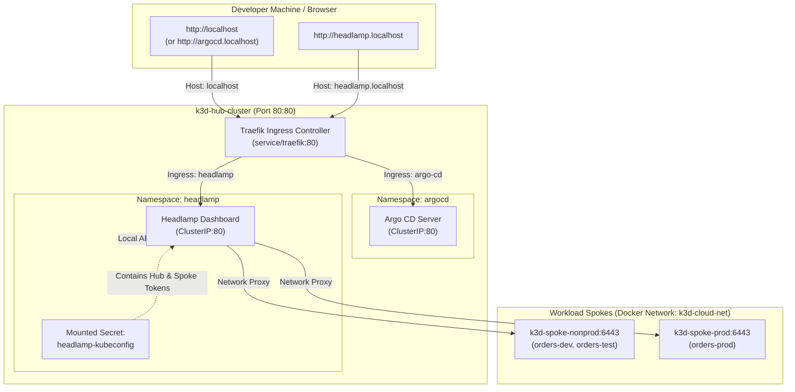

# Headlamp Kubernetes Multi-Cluster Dashboard

Headlamp is an open-source, web-based Kubernetes dashboard (part of [Kubernetes SIGs](https://github.com/kubernetes-sigs/headlamp)) designed to provide an extensible, user-friendly **Single Pane of Glass** for viewing and managing multiple Kubernetes clusters.

In this enterprise GitOps control plane architecture, Headlamp runs on the **Hub Cluster** (`k3d-hub-cluster`) as a platform add-on alongside Argo CD.

---

## 🧭 Why Headlamp + Argo CD?

| Capability | Argo CD (`http://localhost`) | Headlamp (`http://headlamp.localhost`) |
| :--- | :--- | :--- |
| **Primary Role** | **GitOps Desired State** Engine | **Live Runtime** Single Pane of Glass |
| **Focus** | Declarative sync, drift detection, Git commits, rollback | Cluster health, pods, real-time logs, pod exec, events |
| **Custom Resources** | Visualizes app dependency trees and health checks | Full CRUD, YAML editor, schema inspection for Kro & ACK |
| **Multi-Cluster** | Deploys manifests to Spoke clusters | Connects directly to Hub & Spokes via API proxy |

Together, they form a complete enterprise management stack:
* **Argo CD** ensures what *should* be running matches Git.
* **Headlamp** allows platform engineers and developers to inspect what *is* running in real time.

---

## 🏗️ Architecture & Traffic Flow

Both **Argo CD** and **Headlamp** share the hub's host port `80`. Traefik acts as the Hub Ingress Controller, routing incoming HTTP traffic based on standard `.localhost` subdomains (compliant with [RFC 6761](https://tools.ietf.org/html/rfc6761), which automatically resolve to `127.0.0.1` in modern browsers and OS resolvers):



---

## 🚀 Quick Access

1. Open your browser and navigate to:
   ```text
   http://headlamp.localhost
   ```
2. **No login prompt**: Headlamp is bound to `127.0.0.1` only, so it is reachable from your machine alone. It shows all three clusters **read-only**: it can list resources (including nodes) and read pod logs, but cannot read Secrets, write, or exec into pods. *(A basic-auth login was tried in Phase 3 and removed by owner decision: for a single-user lab it added repeated prompts for little protection, since the local kubeconfig is already cluster-admin. Production would use OIDC SSO, planned for Phase 4.)*

Alternatively, use the command line:
```bash
make open-headlamp
```

---

## 🌟 Exploring Your Clusters in Headlamp

### 1. Cluster Switching
In the top-left corner of the Headlamp UI, click the cluster selector dropdown to switch between:
* **`k3d-hub-cluster`**: View Argo CD, Traefik, ApplicationSets, and Hub control-plane components.
* **`k3d-spoke-nonprod`**: View Tenant-A Dev (`orders-dev`) and Test (`orders-test`) workloads, Kro Blueprints, and ACK controllers.
* **`k3d-spoke-prod`**: View Tenant-A Production (`orders-prod`) workloads with strict enterprise isolation.

### 2. Inspecting Platform Engineering CRDs
Under **Cluster** ➔ **Custom Resource Definitions** (or via the Search bar):
* **`ResourceGraphDefinition`** (`kro.run`): Inspect the schema that defines the `QueueBackedService` platform blueprint.
* **`QueueBackedService`** (`kro.run`): Inspect the instantiated composable platform resources powering `orders-dev`, `orders-test`, and `orders-prod`.
* **`Queue`** (`services.k8s.aws`): Inspect the AWS SQS queues dynamically provisioned by ACK and synced with Moto Cloud.

### 3. Live Pod Logs & Web Terminal (Exec)
Navigate to **Workloads** ➔ **Pods**:
* Click on any `orders-processor` pod.
* Click **Logs** to view real-time standard out / standard error streaming (e.g. SQS polling ticks, order receipts).
* Click **Terminal** to open an interactive in-browser shell into the pod.

### 4. Viewing Events & Health Status
Headlamp provides a unified **Events** tab highlighting:
* Deployment rollouts and image pulls.
* Liveness and readiness probe successes.
* Pod scheduling and resource utilization against requests/limits.

---

## ⚙️ How It Is Configured (GitOps)

Headlamp is deployed declaratively using the GitOps control plane:

### 1. Argo CD Application Manifest
[`applicationsets/addon-headlamp.yaml`](../../applicationsets/addon-headlamp.yaml) defines the Headlamp Helm release sourced directly from the official Kubernetes-SIGs repository:
```yaml
apiVersion: argoproj.io/v1alpha1
kind: Application
metadata:
  name: addon-headlamp
  namespace: argocd
spec:
  project: control-plane
  source:
    repoURL: https://kubernetes-sigs.github.io/headlamp/
    chart: headlamp
    targetRevision: 0.45.0
    helm:
      valuesObject:
        config:
          inCluster: false
          extraArgs:
            - "-kubeconfig=/home/headlamp/.kube/config"
            - "-insecure-ssl"
          oidc:
            secret:
              create: false
        probes:
          livenessProbe:
            initialDelaySeconds: 5
            periodSeconds: 10
          readinessProbe:
            initialDelaySeconds: 5
            periodSeconds: 10
        volumeMounts:
          - name: kubeconfig
            mountPath: /home/headlamp/.kube/config
            subPath: config
            readOnly: true
        volumes:
          - name: kubeconfig
            secret:
              secretName: headlamp-kubeconfig
        ingress:
          enabled: true
          ingressClassName: traefik
          annotations:
            argocd.argoproj.io/ignore-default-links: "true"
            link.argocd.argoproj.io/external-link: "http://headlamp.localhost"
          hosts:
            - host: headlamp.localhost
              paths:
                - path: /
                  type: Prefix
```

### 2. Multi-Cluster Credentials Secret
The script [`setup-credentials.sh`](setup-credentials.sh), run by `make rotate-spoke-tokens`:
1. Creates a dedicated `headlamp-access/headlamp-viewer` ServiceAccount on each of the three clusters, bound to the built-in **`view`** role. Aggregated roles add read access to kro and ACK resources, plus Argo CD objects on the hub. Secrets stay hidden.
2. Issues a 30-day TokenRequest token per cluster. These tokens are separate from Argo CD's credentials.
3. Builds a kubeconfig that verifies each API server against its cluster CA (`insecure-skip-tls-verify: false`), stores it in the `headlamp-kubeconfig` Secret, and restarts Headlamp so the pod picks it up (the Secret is mounted with `subPath`, which never refreshes in a running pod).

The Headlamp pod itself runs with no Kubernetes token mounted and has no cluster role.


---

## 🔍 Deep-Dive: Probes & Startup Behavior

### Why was `Readiness probe failed: ... dial tcp ... connection refused` observed?
When a container launches in Kubernetes, the `kubelet` initiates configured liveness and readiness probes against the container port (`:4466`).

* **Root Cause**: By default, the upstream Helm chart sets `initialDelaySeconds: 0`. This instructs `kubelet` to probe `http://<pod-ip>:4466/` immediately at $t = 0$ seconds. Because the Go-based `headlamp-server` takes approximately 1–2 seconds to initialize its runtime, parse mounted kubeconfig contexts, register API proxy routes, and bind to the TCP socket, the initial probe packet at $t=0$ receives an immediate TCP `RST` (`connection refused`).
* **Impact**: Kubernetes records a transient `Warning` event (`Readiness probe failed`). Because `failureThreshold` is set to 3, the pod does **not** fail or restart; once `headlamp-server` binds port 4466 (typically by second 2), the subsequent probe cycle at $t=10$ passes, and the pod transitions cleanly to `Ready 1/1`.
* **Resolution**: Setting `initialDelaySeconds: 5` on both `readinessProbe` and `livenessProbe` gives `headlamp-server` adequate startup buffer, preventing any transient warning events from appearing in cluster logs or event feeds.

---

## 🌐 Deep-Dive: CORS & The `-dev` Flag

When accessing Headlamp at `http://headlamp.localhost`, the React client runs directly in the browser and dispatches asynchronous requests (`credentials: "include"`) to the backend `/config` and `/clusters/...` endpoints.

* Without the `-dev` flag, `headlamp-server` enforces strict default origin checks, omitting `Access-Control-Allow-Origin` and `Access-Control-Allow-Credentials` headers on responses and serving `index.html` for HTTP `OPTIONS` preflight requests.
* Modern browsers block the `/config` fetch under CORS security policies if these headers are missing. In the frontend bundle, when the cluster list is `null`, the UI displays an indefinite loading spinner (`yo` component) under the "All Clusters" tab.
* Adding `-dev` to `extraArgs` instructs `headlamp-server` to allow cross-origin requests from the browser, respond to `OPTIONS` preflights with `200 OK`, and attach appropriate CORS headers.

---

## 🛠️ Maintenance & Common Tasks

### Re-generating Credentials
If the spoke clusters are deleted and recreated, refresh the Headlamp multi-cluster secret with:
```bash
bash addons/headlamp/setup-credentials.sh
kubectl --context k3d-hub-cluster -n headlamp rollout restart deployment headlamp
```

### Accessing via Argo CD Deep Links
Inside Argo CD (`http://localhost`), you can click the **Headlamp Cluster Explorer** external link icon directly on the `addon-headlamp` application card or resource views to jump straight to Headlamp.

### Troubleshooting Quick Reference

| Symptom | Cause | Solution |
| :--- | :--- | :--- |
| **Blue spinner under "All Clusters"** | Browser cached a failed `/config` or CORS preflight rejected | Ensure `-dev` is set in `extraArgs`, then hard-refresh browser (`Ctrl+Shift+R` or `Cmd+Shift+R`). |
| **`Readiness probe failed: connect refused`** | Probe fired at $t=0$ before server bound to `:4466` | Set `initialDelaySeconds: 5` in `probes.readinessProbe` and `probes.livenessProbe`. |
| **`Connect` button shown next to cluster** | Cluster has not yet been connected in current browser session | Click **Connect** (or click the cluster name directly); status will transition to `Active` and display the live Kubernetes version. |
| **404 when accessing `headlamp.localhost`** | Traefik ingress missing or host header not matching | Verify Traefik is running on hub port 80 and ingress host is `headlamp.localhost`. |

