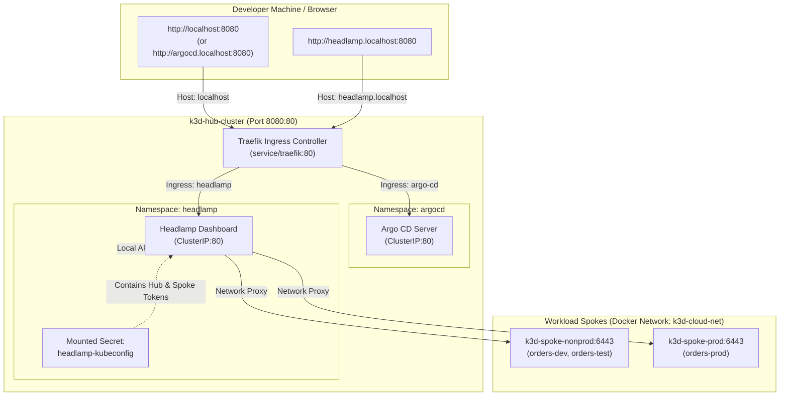

# Headlamp Kubernetes Multi-Cluster Dashboard

Headlamp is an open-source, web-based Kubernetes dashboard (part of [Kubernetes SIGs](https://github.com/kubernetes-sigs/headlamp)) designed to provide an extensible, user-friendly **Single Pane of Glass** for viewing and managing multiple Kubernetes clusters.

In this enterprise GitOps control plane architecture, Headlamp runs on the **Hub Cluster** (`k3d-hub-cluster`) as a platform add-on alongside Argo CD.

---

## 🧭 Why Headlamp + Argo CD?

| Capability | Argo CD (`http://localhost:8080`) | Headlamp (`http://headlamp.localhost:8080`) |
| :--- | :--- | :--- |
| **Primary Role** | **GitOps Desired State** Engine | **Live Runtime** Single Pane of Glass |
| **Focus** | Declarative sync, drift detection, Git commits, rollback | Cluster health, pods, real-time logs, pod exec, events |
| **Custom Resources** | Visualizes app dependency trees and health checks | Full CRUD, YAML editor, schema inspection for Kro & ACK |
| **Multi-Cluster** | Deploys manifests to Spoke clusters | Connects directly to Hub & Spokes via API proxy |

Together, they form a complete enterprise management stack:
* **Argo CD** ensures what *should* be running matches Git.
* **Headlamp** allows platform engineers and developers to inspect what *is* running in real time.

---

## 🏗️ Architecture & Traffic Flow

Both **Argo CD** and **Headlamp** share the Hub's host port `8080`. Traefik acts as the Hub Ingress Controller, routing incoming HTTP traffic based on standard `.localhost` subdomains (compliant with [RFC 6761](https://tools.ietf.org/html/rfc6761), which automatically resolve to `127.0.0.1` in modern browsers and OS resolvers):



---

## 🚀 Quick Access

1. Open your browser and navigate to:
   ```text
   http://headlamp.localhost:8080
   ```
2. **Zero Login Prompt**: Headlamp is pre-configured with the `headlamp-kubeconfig` secret mounted into the container. You are automatically logged in with full administrative visibility across all three clusters.

Alternatively, use the command line:
```bash
make open-headlamp
```

---

## 🌟 Exploring Your Clusters in Headlamp

### 1. Cluster Switching
In the top-left corner of the Headlamp UI, click the cluster selector dropdown to switch between:
* **`k3d-hub-cluster`**: View Argo CD, Traefik, ApplicationSets, and Hub control-plane components.
* **`k3d-spoke-nonprod`**: View Tenant-A Dev (`orders-dev`) and Test (`orders-test`) workloads, Kro Blueprints, and ACK controllers.
* **`k3d-spoke-prod`**: View Tenant-A Production (`orders-prod`) workloads with strict enterprise isolation.

### 2. Inspecting Platform Engineering CRDs
Under **Cluster** ➔ **Custom Resource Definitions** (or via the Search bar):
* **`ResourceGraphDefinition`** (`kro.run`): Inspect the schema that defines the `QueueBackedService` platform blueprint.
* **`QueueBackedService`** (`kro.run`): Inspect the instantiated composable platform resources powering `orders-dev`, `orders-test`, and `orders-prod`.
* **`Queue`** (`services.k8s.aws`): Inspect the AWS SQS queues dynamically provisioned by ACK and synced with Moto Cloud.

### 3. Live Pod Logs & Web Terminal (Exec)
Navigate to **Workloads** ➔ **Pods**:
* Click on any `orders-processor` pod.
* Click **Logs** to view real-time standard out / standard error streaming (e.g. SQS polling ticks, order receipts).
* Click **Terminal** to open an interactive in-browser shell into the pod.

### 4. Viewing Events & Health Status
Headlamp provides a unified **Events** tab highlighting:
* Deployment rollouts and image pulls.
* Liveness and readiness probe successes.
* Pod scheduling and resource utilization against requests/limits.

---

## ⚙️ How It Is Configured (GitOps)

Headlamp is deployed declaratively using the GitOps control plane:

### 1. Argo CD Application Manifest
[`applicationsets/addon-headlamp.yaml`](file:///home/bleite/repos/gitops-control-plane/applicationsets/addon-headlamp.yaml) defines the Headlamp Helm release sourced directly from the official Kubernetes-SIGs repository:
```yaml
apiVersion: argoproj.io/v1alpha1
kind: Application
metadata:
  name: addon-headlamp
  namespace: argocd
spec:
  project: control-plane
  source:
    repoURL: https://kubernetes-sigs.github.io/headlamp/
    chart: headlamp
    targetRevision: 0.45.0
    helm:
      valuesObject:
        config:
          inCluster: false
          extraArgs:
            - "-kubeconfig=/home/headlamp/.kube/config"
            - "-insecure-ssl"
...
```

### 2. Multi-Cluster Credentials Secret
The script [`addons/headlamp/setup-credentials.sh`](file:///home/bleite/repos/gitops-control-plane/addons/headlamp/setup-credentials.sh) extracts:
1. Hub service account token for `headlamp` (bound to `cluster-admin`).
2. Spoke Non-Prod token from Argo CD cluster secret (`cluster-spoke-nonprod`).
3. Spoke Prod token from Argo CD cluster secret (`cluster-spoke-prod`).

It packages them into a multi-context kubeconfig and stores it in the `headlamp-kubeconfig` secret inside the `headlamp` namespace.

---

## 🛠️ Maintenance & Common Tasks

### Re-generating Credentials
If the spoke clusters are deleted and recreated, refresh the Headlamp multi-cluster secret with:
```bash
bash addons/headlamp/setup-credentials.sh
kubectl --context k3d-hub-cluster -n headlamp rollout restart deployment headlamp
```

### Accessing via Argo CD Deep Links
Inside Argo CD (`http://localhost:8080`), you can click the **Headlamp Cluster Explorer** external link icon directly on any application card or resource view to jump straight to Headlamp.
