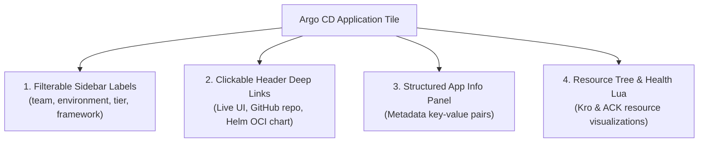

# Argo CD Visual Design, UI/UX Standards & Naming Best Practices

## Executive Summary

As a Kubernetes platform scales to dozens of development teams and hundreds of microservices, the **GitOps User Experience (DevEx)** becomes critical. When engineers, SREs, or on-call operators log into the Argo CD web dashboard, they need to answer three fundamental questions within seconds:
1. **What is this application?** (Domain & service identity)
2. **Where is it running and in what stage?** (Cluster target, namespace, and environment)
3. **How do I inspect its health, code, and live endpoints?** (Actionable deep links and metadata)

This guide documents the design rationale, naming conventions, and UI/UX configurations implemented in our enterprise GitOps control plane.

---

## 1. The Anti-Pattern: Generic Tenancy Naming

In early platform prototypes, applications are frequently given abstract identifiers such as `tenant-a-dev`, `tenant-b-test`, or `tenant-a-prod`.

```
❌ ANTI-PATTERN: Abstract Tenancy View
┌────────────────────────────────────────────────────────────────────────┐
│  📦 tenant-a-dev       [Healthy] [Synced]    Target: spoke-nonprod     │
│  📦 tenant-a-prod      [Healthy] [Synced]    Target: spoke-prod        │
│  📦 tenant-a-test      [Healthy] [Synced]    Target: spoke-nonprod     │
│  📦 tenant-b-dev       [Healthy] [Synced]    Target: spoke-nonprod     │
└────────────────────────────────────────────────────────────────────────┘
```

### Why This Fails at Scale:
* **Obscured Service Identity**: An on-call engineer during an incident has to guess which microservice `tenant-a` actually represents.
* **Broken Search & Filtering**: Typing `orders` or `billing` into the Argo CD search bar yields zero results.
* **Disjointed URLs & Namespaces**: Argo CD routes to `/applications/tenant-a-dev` and pods deploy into namespace `tenant-a-dev`, making `kubectl` debugging unintuitive.

---

## 2. The Solution: Convention 1 (`<app>-<env>`)

We adopt **Convention 1: `<app>-<env>`** as the standard application naming strategy across the platform:

```
✔ BEST PRACTICE: Domain-Driven View
┌─────────────────────────────────────────────────────────────────────────────────┐
│ Argo CD UI - Applications Grid View                                             │
├─────────────────────────────────────────────────────────────────────────────────┤
│                                                                                 │
│  📦 orders-dev        [Healthy] [Synced]    Labels: env=dev, team=e-commerce    │
│  Target: spoke-nonprod / ns: orders-dev                                         │
│  Links: [Live UI ↗] [GitHub ↗] [Helm Chart ↗] [AWS Moto ↗]                      │
│                                                                                 │
│  📦 orders-test       [Healthy] [Synced]    Labels: env=test, team=e-commerce   │
│  Target: spoke-nonprod / ns: orders-test                                        │
│  Links: [Live UI ↗] [GitHub ↗] [Helm Chart ↗] [AWS Moto ↗]                      │
│                                                                                 │
│  📦 orders-prod       [Healthy] [Synced]    Labels: env=prod, team=e-commerce   │
│  Target: spoke-prod    / ns: orders-prod                                        │
│  Links: [Live UI ↗] [GitHub ↗] [Helm Chart ↗] [AWS Moto ↗]                      │
│                                                                                 │
└─────────────────────────────────────────────────────────────────────────────────┘
```

### Key Advantages:
1. **Natural Alphabetical Sorting**: All lifecycle stages for a microservice (`orders-dev`, `orders-prod`, `orders-test`) sit side-by-side in the dashboard.
2. **Instant Search**: Typing `orders` immediately filters down to all stages of the orders microservice.
3. **Clean Kubernetes Parity**: Kubernetes namespaces mirror the application name (`orders-dev`, `orders-prod`), eliminating mapping confusion.
4. **Readable Deep Link URLs**: Directly browse to `http://localhost:8080/applications/orders-dev`.

---

## 3. The 4 Pillars of a Meaningful Argo CD UI

To transform Argo CD from a raw status dashboard into an **operational platform portal**, we implement four UI pillars:



### Pillar 1: Filterable Metadata Labels
Labels attached to `metadata.labels` appear as clickable filter chips in the Argo CD sidebar.

```yaml
metadata:
  labels:
    app.kubernetes.io/name: "orders"
    app: "orders"
    environment: "dev"       # Enables filtering by stage (dev / test / prod)
    team: "e-commerce"      # Enables filtering by owning team squad
    tier: "backend"         # Enables filtering by architectural layer
    framework: "kro-ack"    # Identifies composition platform
```

* **User Impact**: A platform engineer supporting 50 squads can click `team: e-commerce` in the sidebar to filter out all unrelated applications instantly.

---

### Pillar 2: Actionable Deep Links with Font-Awesome Icons
Rather than requiring users to manually lookup ingress hosts, repository URLs, or cloud consoles, Argo CD renders clickable action links on each application card and resource node.

Configured in `clusters/values-argocd-hub.yaml` (`configs.cm.application.links`):

```yaml
configs:
  cm:
    application.links: |
      - title: "Live Orders Dashboard (Dev)"
        url: "http://orders-dev.localhost:8081"
        description: "Open Dev Orders Dashboard"
        icon.class: "fa-external-link"
        if: "app.metadata.name == \"orders-dev\""

      - title: "Orders GitHub Repository"
        url: "https://github.com/brunobml/orders-processor"
        description: "Open Application Source Code on GitHub"
        icon.class: "fa-github"
        if: "app.metadata.name startsWith \"orders-\""

      - title: "Platform Golden Chart"
        url: "https://github.com/brunobml/platform-charts"
        description: "Open Platform Engineering Golden Path Chart"
        icon.class: "fa-cubes"
        if: "app.metadata.name startsWith \"orders-\""

      - title: "Central Moto Cloud API"
        url: "http://localhost:5000/moto-api/"
        description: "Inspect Mock AWS Cloud State (SQS & DynamoDB)"
        icon.class: "fa-cloud"
        if: "app.spec.project == \"tenant-workloads\""
```

* **External Link Annotation**: Setting `link.argocd.argoproj.io/external-link` on the Application creates an external link button in the upper right header of the application view.

---

### Pillar 3: Structured Information Panel (`spec.info`)
When clicking into an application, the **Summary** drawer displays descriptive metadata key-value pairs:

```yaml
spec:
  info:
    - name: "Application"
      value: "Orders Processor"
    - name: "Environment"
      value: "{{env}}"
    - name: "Team"
      value: "E-Commerce Squad"
    - name: "Live Dashboard"
      value: "http://orders-{{env}}.localhost:{{port}}"
    - name: "Source Code"
      value: "https://github.com/brunobml/orders-processor"
    - name: "Platform Golden Chart"
      value: "ghcr.io/brunobml/charts/message-processor:1.0.0"
    - name: "Central Moto Cloud"
      value: "http://localhost:5000/moto-api/"
```

---

### Pillar 4: Custom Resource Health Visualizations (Lua Scripts)
By default, custom resources from Kro (`ResourceGraphDefinition`, `MessageProcessor`) and AWS ACK (`services.k8s.aws/*`) appear with `Unknown` health in Argo CD.

We inject custom Lua health scripts in `clusters/values-argocd-hub.yaml` under `resource.customizations`:
* **Kro Blueprints**: Evaluates `status.state == "Active"` and condition `Ready == True` to report **Healthy** or **Progressing**.
* **ACK Cloud Resources**: Inspects condition `ACK.ResourceSynced == True` to show green checkmarks on cloud queues and database tables.

---

## 4. Complete ApplicationSet Reference Specification

Here is the production-ready ApplicationSet pattern implementing these standards:

```yaml
apiVersion: argoproj.io/v1alpha1
kind: ApplicationSet
metadata:
  name: tenant-workloads-nonprod
  namespace: argocd
spec:
  generators:
    - list:
        elements:
          - app: orders
            env: dev
            port: "8081"
          - app: orders
            env: test
            port: "8081"
  template:
    metadata:
      # 1. Convention 1 Naming
      name: "{{app}}-{{env}}"
      # 2. Filterable Labels
      labels:
        app.kubernetes.io/name: "{{app}}"
        app: "{{app}}"
        environment: "{{env}}"
        team: "e-commerce"
        tier: "backend"
        framework: "kro-ack"
      # 3. Deep Link Annotations
      annotations:
        link.argocd.argoproj.io/external-link: "http://orders-{{env}}.localhost:{{port}}"
        link.argocd.argoproj.io/source-code: "https://github.com/brunobml/orders-processor"
        link.argocd.argoproj.io/platform-chart: "https://github.com/brunobml/platform-charts"
        description: "Orders processing microservice with AWS SQS & DynamoDB via Kro"
    spec:
      project: tenant-workloads
      # 4. Info Metadata Table
      info:
        - name: "Application"
          value: "Orders Processor"
        - name: "Environment"
          value: "{{env}}"
        - name: "Team"
          value: "E-Commerce Squad"
        - name: "Live Dashboard"
          value: "http://orders-{{env}}.localhost:{{port}}"
        - name: "Source Code"
          value: "https://github.com/brunobml/orders-processor"
        - name: "Platform Golden Chart"
          value: "ghcr.io/brunobml/charts/message-processor:1.0.0"
      sources:
        - chart: message-processor
          repoURL: ghcr.io/brunobml/charts
          targetRevision: 1.0.0
          helm:
            valueFiles:
              - $values/deploy/values-{{env}}.yaml
        - repoURL: https://github.com/brunobml/orders-processor.git
          targetRevision: main
          ref: values
      destination:
        name: spoke-nonprod
        namespace: "{{app}}-{{env}}"
      syncPolicy:
        automated:
          prune: true
          selfHeal: true
        syncOptions:
          - CreateNamespace=true
```

---

## 5. Summary Checklist for New Microservices

When onboarding a new microservice to the platform:
- [ ] Name application following `<app>-<env>` (e.g. `billing-dev`, `billing-prod`).
- [ ] Deploy into matching namespace `<app>-<env>`.
- [ ] Add `team`, `tier`, `environment`, and `app` labels.
- [ ] Provide `link.argocd.argoproj.io/external-link` pointing to its ingress URL.
- [ ] Provide `source-code` and `platform-chart` annotations.
- [ ] Fill out `spec.info` key-value pairs so any team member can immediately discover relevant dashboards and repositories.
