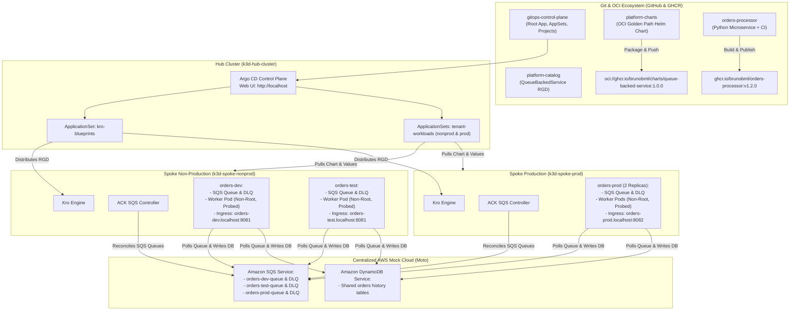
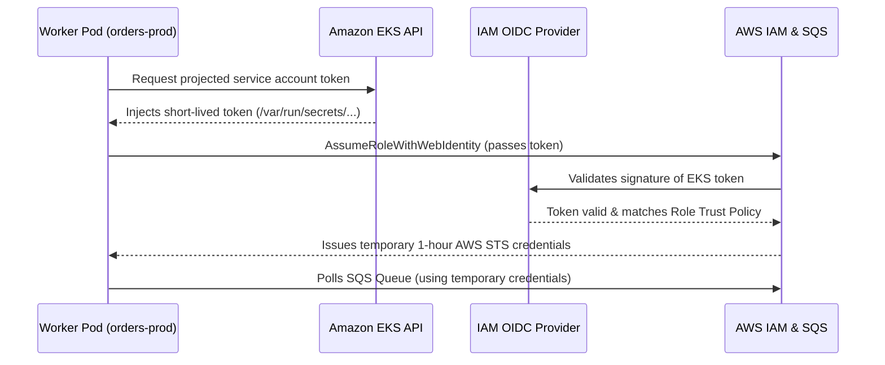

# AWS Well-Architected Framework & Enterprise GitOps Reference Guide

> **Status: Design reference.** Design rationale and target state. Examples and names may differ from what is deployed. For the running lab, see the [README](../README.md) and the [runbooks](runbooks/).

## 1. Executive Summary

This reference guide documents the production-grade architecture of our multi-cluster **Argo CD + Kro + AWS Controllers for Kubernetes (ACK)** platform. 

It audits the platform against all **six pillars of the AWS Well-Architected Framework (WAF)** and the **CNCF Platform Engineering White Paper**, detailing both the current hardened state and the direct mapping from our local lab to enterprise production on **Amazon Web Services (AWS)**.

---

## 2. Platform Architecture Overview



---

## 3. AWS Well-Architected Framework Audit

### Pillar 1: Operational Excellence

| Best Practice Requirement | Implementation in Our Platform |
| :--- | :--- |
| **Infrastructure as Code (IaC)** | 100% of cluster configurations, controllers, blueprints, and workloads are codified across dedicated Git repositories. |
| **Single Source of Truth** | Argo CD automatically detects and reconciles drift from Git. Manual `kubectl edit` changes are overwritten by automated self-healing. |
| **Separation of Concerns** | Application developers only modify `deploy/values-*.yaml`. Platform engineers maintain the `queue-backed-service` Helm chart and Kro blueprint. |
| **Automated CI/CD** | GitHub Actions builds container images on push, tags with semver and Git SHA, and publishes to GHCR. |
| **Workload Health Checks** | Container declares explicit **`livenessProbe`** (restarts hung containers) and **`readinessProbe`** (stops traffic during startup) against `/healthz`. |
| **Custom GitOps Lua Monitoring** | Injected custom Lua scripts into Argo CD so custom resources (`QueueBackedService`, `ResourceGraphDefinition`, ACK SQS Queues) report real-time **Healthy** or **Progressing** statuses in the UI. |

---

### Pillar 2: Security

| Best Practice Requirement | Implementation in Our Platform |
| :--- | :--- |
| **Blast Radius Isolation** | Hard physical separation: Non-production (`k3d-spoke-nonprod`) and Production (`k3d-spoke-prod`) run on separate Kubernetes clusters. |
| **Short-Lived Spoke Credentials (TokenRequest API)** | Spoke cluster authentication uses short-lived tokens generated via Kubernetes `TokenRequest` API with 30-day bounded lifespans (`--duration=720h`), eliminating static permanent `kubernetes.io/service-account-token` Secrets. Secret plaintext annotations (`last-applied-configuration`) are stripped before server-side apply. Rotation is managed via `make rotate-spoke-tokens`, and early revocation is executed by deleting and recreating the `argocd-manager` ServiceAccount. |
| **Production Target: EKS Access Entries & Pod Identity** | In AWS production environments, cluster registration transitions from bearer tokens to IAM-based authentication via **EKS Access Entries** and IAM Roles for Service Accounts (IRSA) / EKS Pod Identity. Argo CD running on the Hub assumes a cross-account IAM role with scoped `AmazonEKSClusterAdminPolicy` access entries, entirely removing stored bearer tokens. |
| **Dedicated ServiceAccounts & Token Shielding** | Workload pods run under dedicated ServiceAccounts (`${schema.spec.name}-${schema.spec.environment}-sa`) with `automountServiceAccountToken: false`, preventing unnecessary Kubernetes API credentials from mounting into application containers. |
| **Pod Security Standards (Restricted Profile)** | Containers enforce `seccompProfile.type: RuntimeDefault`, `readOnlyRootFilesystem: true` with temporary `emptyDir` mounts on `/tmp`, `allowPrivilegeEscalation: false`, and `capabilities.drop: ["ALL"]`, satisfying the Kubernetes Pod Security Standards Restricted profile. |
| **Non-Root Container Execution** | Containers run as unprivileged `appuser` (UID/GID `10001`) via Dockerfile and Kubernetes `securityContext.runAsNonRoot: true`. |
| **Linux Capability Dropping** | Pod security context specifies `capabilities.drop: ["ALL"]` and `allowPrivilegeEscalation: false` to eliminate privilege escalation exploits. |
| **Argo CD AppProject Guardrails** | AppProjects strictly restrict which Git repositories can be synced (`sourceRepos`), which clusters/namespaces can be targeted (`destinations`), and whitelist safe cluster resources. |
| **Blueprint Promotion Gates** | Platform catalog blueprints are promoted between environments using Git tags (`v1.0.0`, `v1.1.0`) referenced via `clusters/blueprint-revisions.env`, eliminating manual drift and silent rollbacks. |
| **Zero-Trust IAM Governance** | Workloads do not have cluster-admin privileges; cloud resource access is isolated per queue. |

---

### Pillar 3: Reliability

| Best Practice Requirement | Implementation in Our Platform |
| :--- | :--- |
| **Loose Coupling via Asynchronous Queuing** | Web endpoints submit orders to Amazon SQS; worker processes asynchronously dequeue and store them. If the database is busy, SQS buffers traffic without dropping transactions. |
| **Dead Letter Queue (DLQ) & Redrive** | Every queue is paired with an automatic DLQ (`orders-dev-dlq`). If a poison-pill message fails processing 5 times (`maxReceiveCount: 5`), SQS isolates it into the DLQ. |
| **Multi-Replica Redundancy** | Production runs with multiple worker replicas across nodes (`replicas: 2`). |
| **Pod Disruption Budgets (PDB)** | Multi-replica workloads automatically instantiate a `PodDisruptionBudget` (`minAvailable: 1`) via Kro CEL `includeWhen: [ ${schema.spec.replicas > 1} ]`, ensuring voluntary cluster disruptions (upgrades, node drains) never drop below required service capacity while avoiding PDB deadlocks on single-replica dev workloads. |
| **Zero-Downtime Rolling Updates** | Kubernetes Deployment rolling update strategy (`maxSurge: 25%`, `maxUnavailable: 0`) ensures a new healthy pod is ready before the old pod terminates. |
| **Automated Controller Self-Healing** | ACK continuously queries AWS APIs to ensure queues match the declared Kubernetes spec. |

---

### Pillar 4: Performance Efficiency

| Best Practice Requirement | Implementation in Our Platform |
| :--- | :--- |
| **Resource Quotas & Predictable Scheduling** | Every container explicitly defines **`requests`** (`cpu: 50m`, `memory: 64Mi`) and **`limits`** (`cpu: 200m`, `memory: 128Mi`), preventing node resource starvation and OOM cascades. |
| **Minimal Base Images** | Containers use `python:3.11-alpine`, keeping image size under 60MB for rapid node pulls and cold starts. |
| **Horizontal Pod Autoscaling (HPA) Ready** | Standardized metrics and resource requests allow scaling pods dynamically based on SQS queue depth or CPU utilization. |

---

### Pillar 5: Cost Optimization

| Best Practice Requirement | Implementation in Our Platform |
| :--- | :--- |
| **Tiered Message Retention** | SQS queue retention is tuned per environment to prevent runaway storage: Dev = 1 day (`86400s`), Test = 2 days (`172800s`), Prod = 7 days (`604800s`). |
| **DLQ Retention Window** | DLQs retain unhandled messages for 14 days (`1209600s`), allowing operations ample time to diagnose failures without paying for infinite storage. |
| **Zero-Dollar Local Lab Footprint** | Complete multi-cluster environment runs entirely on local Docker/k3d with a mock cloud container (Moto), incurring $0 cloud bills during development. |

---

### Pillar 6: Sustainability

| Best Practice Requirement | Implementation in Our Platform |
| :--- | :--- |
| **Ephemeral Cluster Lifecycle** | Complete lab can be spun up in 2 minutes (`make setup`) and completely eradicated (`make teardown`), leaving zero lingering resources. |
| **Optimized Compute Density** | Lightweight k3s distribution runs multiple Kubernetes clusters on a single laptop/workstation. |

---

## 4. Transition Blueprint: Local Lab to AWS Production

This platform was intentionally engineered to mirror AWS production. Here is how each component maps 1:1 to a real AWS environment:

| Lab Component | Local Implementation | AWS Enterprise Production Equivalent |
| :--- | :--- | :--- |
| **Kubernetes Clusters** | k3d clusters (`hub-cluster`, `spoke-nonprod`, `spoke-prod`) | **Amazon EKS** (Separate EKS clusters in distinct AWS Accounts/VPCs) |
| **Cluster Node Autoscaling** | Static Docker worker nodes | **AWS Karpenter** or **EKS Managed Node Groups** |
| **Mock Cloud Container** | Moto Docker container (`moto-cloud:5000`) | **Amazon SQS** & **Amazon DynamoDB** (Native AWS Managed Services) |
| **Cloud Authentication** | Mock AWS credentials secret | **IAM Roles for Service Accounts (IRSA)** or **EKS Pod Identity** |
| **Ingress Controller** | Traefik with host-based ports (`8081`, `8082`) | **AWS Load Balancer Controller** (Provisioning AWS ALB / NLB) |
| **DNS & Routing** | `.localhost` domain with port mapping | **Amazon Route 53** with ExternalDNS controller |
| **OCI Artifact Storage** | GitHub Container Registry (`ghcr.io`) | **Amazon Elastic Container Registry (ECR)** or **GHCR** |
| **Encryption at Rest** | Moto in-memory storage | **AWS Key Management Service (KMS)** CMK for SQS & DynamoDB |

---

## 5. How EKS Pod Identity Replaces Static Credentials in Production

In our local lab, ACK controllers and pods use mock credentials (`mock-key` / `mock-secret`) pointing to Moto. In production on AWS EKS, **no static credentials exist**:



### Production ServiceAccount Definition:
```yaml
apiVersion: v1
kind: ServiceAccount
metadata:
  name: orders-worker
  namespace: orders-prod
  annotations:
    eks.amazonaws.com/role-arn: arn:aws:iam::123456789012:role/orders-prod-worker-role
```

---

## 6. Summary of Key Architectural Decisions

1. **Convention 1 Naming (`<app>-<env>`)**:
   Eliminated abstract tenant tags (`tenant-a-dev`) in favor of domain-driven names (`orders-dev`, `orders-prod`) that align Git, Argo CD, and Kubernetes namespaces.
2. **`kind: QueueBackedService` Archetype**:
   Recognized that the Kro blueprint is a **reusable platform catalog pattern**, not a single app. Any microservice needing an HTTP endpoint and an SQS queue can use this template.
3. **Defense-in-Depth Container Security**:
   Non-root user `10001`, dropped Linux capabilities, and immutable read-only boundaries ensure containers comply with Pod Security Standards (Restricted).
4. **Resiliency with Dead Letter Queues**:
   Paired every application queue with a dedicated DLQ and a redrive policy to guarantee fault isolation for unprocessable orders.
