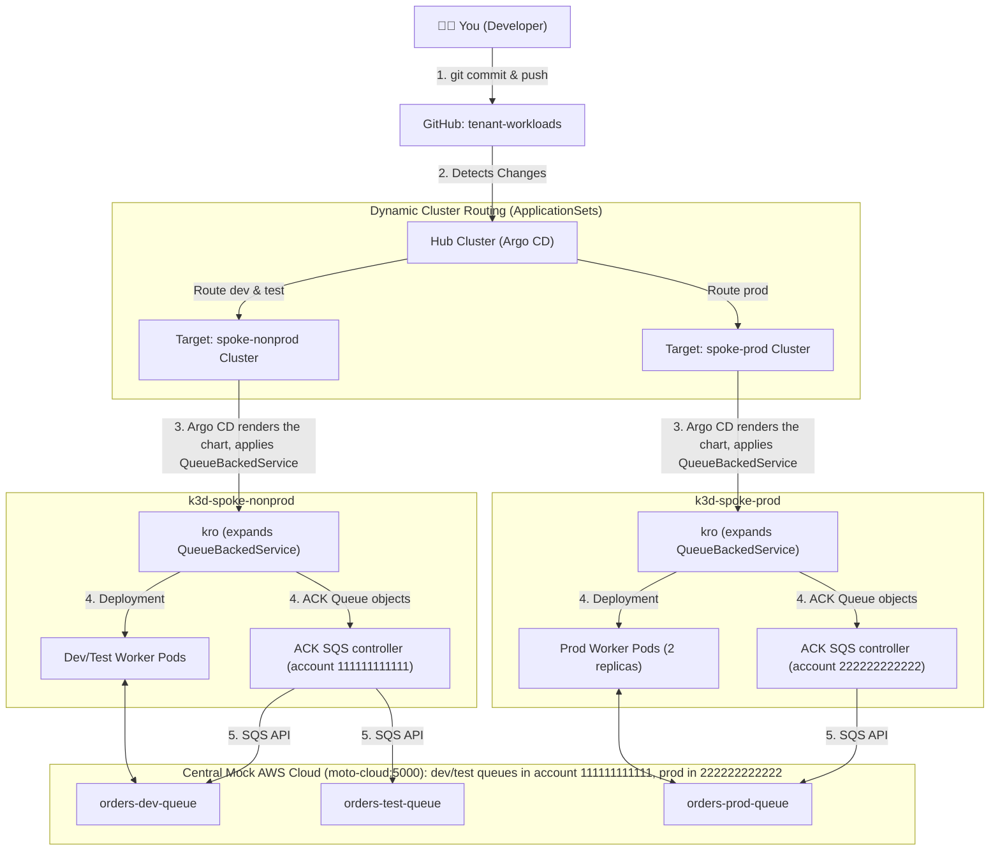

# Developer Tutorial: Building Cloud Apps on the Multi-Cluster Platform

> **Status: Current.** Describes the lab as it is today (reviewed 2026-10-03; examples re-verified on the lab 2026-10-06). Terms used here: [Concepts, Glossary & Self-Check](concepts-and-glossary.md).

Welcome! This tutorial guides you through using our enterprise **Multi-Cluster Hub-and-Spoke** platform as an **application developer**.

As a developer, you don't need real AWS cloud accounts, complex IAM policies, or direct Kubernetes cluster-admin access. You define what your application needs in a simple YAML file, push it to GitHub, and the GitOps platform takes care of:
1. **Routing** your workloads to the correct cluster (`spoke-nonprod` for DEV/TEST, `spoke-prod` for PROD).
2. **Provisioning** your Kubernetes pods and containers.
3. **Provisioning** simulated AWS infrastructure (like SQS Queues) in our central mock cloud (Moto).
4. **Wiring** the cloud resources directly into your containers via environment variables.

---

## 💡 How It Works Under the Hood



Four controllers take part, each with its own status: the Argo CD ApplicationSet controller, the Argo CD application controller, kro and the ACK SQS controller. The student guide's [One change, four reconcilers](runbooks/devops-student-rebuild-guide.md#one-change-four-reconcilers) shows what each watches and writes, and where to look when one stops.

---

## 📁 Repository Structure

Workload configurations live in [`orders-processor`](https://github.com/brunobml/orders-processor):

```text
deploy/
├── values-dev.yaml      # Deployed to spoke-nonprod (namespace: orders-dev)
├── values-test.yaml     # Deployed to spoke-nonprod (namespace: orders-test)
└── values-prod.yaml     # Deployed to spoke-prod (namespace: orders-prod)
```

Each environment is **registered by the tenant** with one small file in the `tenant-workloads` repository (Phase 4 C.2); the platform's per-tenant ApplicationSet ([`applicationsets/tenant-workloads-tenant-a.yaml`](../applicationsets/tenant-workloads-tenant-a.yaml), Track B.2) turns every file into an Argo CD Application:

```yaml
# tenant-workloads/tenants/tenant-a/apps/orders-dev.yaml
tenant: tenant-a
app: orders          # Application and namespace: orders-dev
env: dev             # dev | test | prod -> the platform picks the spoke and AWS account
port: "8081"
valuesRevision: main # prod must pin a full 40-character commit SHA
# valuesFile: deploy/values-dev.yaml   (optional; this is the default)
```

- `deploy/values-dev.yaml` / `values-test.yaml` $\rightarrow$ **`spoke-nonprod`**, namespaces `orders-dev` / `orders-test` (account 111111111111).
- `deploy/values-prod.yaml` $\rightarrow$ **`spoke-prod`**, namespace `orders-prod` (account 222222222222). **Promote to prod** by changing `valuesRevision` in `tenants/tenant-a/apps/orders-prod.yaml` to the reviewed commit SHA (pull request in `tenant-workloads`).
- New app or environment: add a file (pull request in `tenant-workloads`), then run `make post-bootstrap` once so its worker gets cloud credentials.

---

## 🚀 5-Minute Quickstart

### Step 1: Open Your Dashboards
- **Hub Argo CD UI**: [http://localhost](http://localhost)
  - Click **Log in via Keycloak** and sign in as `tenant-a-user` (developer access: view tenant apps, sync `orders-dev` / `orders-test`)
  - Password: run `make password` to see where it is stored (it is never kept in Git)
  - Here you will see all your tenant applications: `orders-dev`, `orders-test`, `orders-prod`. Production syncs only through a reviewed `valuesRevision` change, so `tenant-a-user` cannot sync `orders-prod`.
- **Central Moto Cloud API**: [http://localhost:5000/moto-api/](http://localhost:5000/moto-api/)

---

### Step 2: Understand What You Write vs What the Platform Renders

**What you write** is five Helm values in your own repository, `orders-processor/deploy/values-dev.yaml`:

```yaml
name: orders
environment: dev
replicas: 1
retentionPeriod: "86400"
image: ghcr.io/brunobml/orders-processor:v1.5.0@sha256:e95bb63320628d8541e984b668474bcc21066e54110d00ab20974132f1287510
```

**What lands on the spoke** is a `QueueBackedService` custom resource. Argo CD renders the platform's golden Helm chart (`queue-backed-service` 1.0.0 from GHCR, owned by `platform-charts`) with your values file and applies the result. See it with `kubectl --context k3d-spoke-nonprod -n orders-dev get queuebackedservice orders -o yaml` (trimmed):

```yaml
apiVersion: kro.run/v1alpha1
kind: QueueBackedService
metadata:
  name: orders
  namespace: orders-dev
  labels:
    app.kubernetes.io/managed-by: Helm   # rendered by the chart
    kro.run/owned: "true"                # kro now manages it
spec:
  environment: dev
  image: ghcr.io/brunobml/orders-processor:v1.5.0@sha256:e95bb63320628d8541e984b668474bcc21066e54110d00ab20974132f1287510
  messageRetentionPeriod: "86400"        # your value retentionPeriod, renamed by the chart template
  name: orders
  replicas: 1
```

Two different things happened, done by two different components:
1. **Helm render (Argo CD):** your values became a custom resource. The chart decides field names (`retentionPeriod` → `messageRetentionPeriod`) and defaults. You never write this resource by hand.
2. **Composition (kro):** the `QueueBackedService` blueprint (a kro ResourceGraphDefinition in `platform-catalog`) expands this one resource into a worker `Deployment`, `Service`, `Ingress`, `ConfigMap`, two `NetworkPolicies`, a `PodDisruptionBudget` **only when `replicas > 1`** (a kro `includeWhen` condition: prod has one, dev does not), and two **ACK `Queue` resources** (`orders-dev-queue` and its dead-letter queue `orders-dev-dlq`). It passes `QUEUE_URL` and `QUEUE_ARN` to your worker.

kro does **not** create the SQS queue in the cloud. It creates Kubernetes objects. The **ACK SQS controller** on the spoke watches the `Queue` objects and calls the SQS API in your environment's account (`111111111111` for dev). See *One change, four reconcilers* in the student guide for the whole chain.

> **Why the long image reference?** Tenant images must come from `ghcr.io/brunobml/` (a ValidatingAdmissionPolicy) and be signed by the orders-processor CI (Kyverno). The digest `@sha256:…` pins the exact signed build. An older unsigned tag such as `v1.2.0` is rejected at admission.

---

### Step 3: Inspecting Your Running Microservice

#### Check the Non-Prod Cluster (Dev & Test):
```bash
# View pods in dev namespace
kubectl --context k3d-spoke-nonprod -n orders-dev get pods

# View pods in test namespace
kubectl --context k3d-spoke-nonprod -n orders-test get pods
```

#### Check the Prod Cluster:
```bash
# View pods in prod namespace (notice 2 replicas in production!)
kubectl --context k3d-spoke-prod -n orders-prod get pods
```

#### Check Pod Logs (Real-Time SQS Message Processing):
```bash
kubectl --context k3d-spoke-nonprod -n orders-dev logs -l app=orders-dev-worker --tail=10
```
Output:
```text
🚀 Worker started for [dev] listening on http://moto-cloud:5000/111111111111/orders-dev-queue
🌐 HTTP Web Dashboard listening on port 8080 (Pod: orders-dev-worker-…)
📦 [dev on orders-dev-worker-…] Received Order from SQS: {"orderId": "ORD-1234", "customer": "Alice", "amount": 99.50} (MsgId: 18f4e1ca...)
✔ [dev on orders-dev-worker-…] Processed & recorded in DynamoDB: 18f4e1ca-…
```
The account in the queue URL is `111111111111`, the nonprod account, not moto's default `123456789012`: see Step 4. Messages named `synthetic-orders-dev-…` come from the platform's end-to-end probe, which sends one order every 5 minutes.

---

### Step 3b: Access the Interactive Microservice Web Dashboard

Every `QueueBackedService` automatically includes an internal Kubernetes `Service` and web interface!

To view your microservice in your web browser:

```bash
# In gitops-control-plane:
make open-dev

# Or directly with kubectl:
kubectl --context k3d-spoke-nonprod -n orders-dev port-forward svc/orders-dev 8001:80
```

Open your browser at **http://localhost:8001**:
- See live pod hostname and connected SQS queue.
- See real-time count of processed orders.
- Type in an order and click **"Send to SQS Queue"** to test producing and consuming live!
- See the recent order history feed.

---

### Step 4: Interacting with Simulated AWS via AWS CLI

Each environment has its **own AWS account**: dev and test live in `111111111111`, prod in `222222222222` (ACK's cross-account resource management, CARM: the namespace annotation `services.k8s.aws/owner-account-id` decides the account). Moto, like AWS, answers **in the account of the credentials you call with**. So first get credentials for the account you want to look at:

```bash
# Credentials for one moto account, the way the platform's controllers get them (STS AssumeRole)
aws_as() {
  local creds
  creds=$(AWS_ACCESS_KEY_ID=mock-key AWS_SECRET_ACCESS_KEY=mock-secret AWS_SESSION_TOKEN= \
    aws --endpoint-url=http://localhost:5000 --region us-east-1 sts assume-role \
    --role-arn "arn:aws:iam::$1:role/learner" --role-session-name learner --query Credentials --output json)
  export AWS_ACCESS_KEY_ID=$(jq -r .AccessKeyId <<<"$creds")
  export AWS_SECRET_ACCESS_KEY=$(jq -r .SecretAccessKey <<<"$creds")
  export AWS_SESSION_TOKEN=$(jq -r .SessionToken <<<"$creds")
  export AWS_DEFAULT_REGION=us-east-1
}

# Dev and test queues (and their dead-letter queues) are in the nonprod account
aws_as 111111111111
aws --endpoint-url=http://localhost:5000 sqs list-queues

# Publish a test order to the dev queue; look the URL up instead of typing the account
QUEUE_URL=$(aws --endpoint-url=http://localhost:5000 sqs get-queue-url --queue-name orders-dev-queue --output text)
echo "$QUEUE_URL"   # http://localhost:5000/111111111111/orders-dev-queue
aws --endpoint-url=http://localhost:5000 sqs send-message --queue-url "$QUEUE_URL" \
  --message-body '{"orderId": "ORD-1234", "customer": "Alice", "amount": 99.50}'

# The prod queue is only visible from the prod account
aws_as 222222222222
aws --endpoint-url=http://localhost:5000 sqs list-queues
```

Then watch the dev worker pick up the order (Step 3's log command): `📦 [dev on orders-dev-worker-…] Received Order from SQS: {"orderId": "ORD-1234", …}`.

> **Try this:** call `list-queues` with plain `mock-key` credentials. You get **nothing**: those credentials land in moto's default account `123456789012`, where the platform never creates anything. An empty answer here means "wrong account", not "no queues". `make moto-resources` lists every account at once.

---

### Step 5: Modifying or Scaling Your Service (GitOps)

Want to scale `orders-dev` from 1 replica to 3 replicas?

1. Edit `deploy/values-dev.yaml` in the `orders-processor` repository:
   ```yaml
   replicas: 3
   ```

2. Commit and push:
   ```bash
   git add deploy/values-dev.yaml
   git commit -m "scale orders dev workers to 3"
   git push origin main
   ```

3. Argo CD detects the commit on GitHub and automatically scales the deployment in `spoke-nonprod`:
   ```bash
   kubectl --context k3d-spoke-nonprod -n orders-dev get pods
   ```

---

## 📋 Developer Cheat Sheet

| Task | Command |
| :--- | :--- |
| **View Dev Pods** | `kubectl --context k3d-spoke-nonprod -n orders-dev get pods` |
| **View Test Pods** | `kubectl --context k3d-spoke-nonprod -n orders-test get pods` |
| **View Prod Pods** | `kubectl --context k3d-spoke-prod -n orders-prod get pods` |
| **View Worker Logs** | `kubectl --context k3d-spoke-nonprod -n orders-dev logs -l app=orders-dev-worker -f` |
| **List AWS Queues** | `aws_as 111111111111` (Step 4), then `aws --endpoint-url=http://localhost:5000 sqs list-queues`; all accounts at once: `make moto-resources` |
| **Send Test Message** | `aws_as 111111111111`, then `aws --endpoint-url=http://localhost:5000 sqs send-message --queue-url "$(aws --endpoint-url=http://localhost:5000 sqs get-queue-url --queue-name orders-dev-queue --output text)" --message-body '{"test": true}'` |
| **Argo CD UI** | [http://localhost](http://localhost) |
| **Moto Cloud API** | [http://localhost:5000/moto-api/](http://localhost:5000/moto-api/) |
