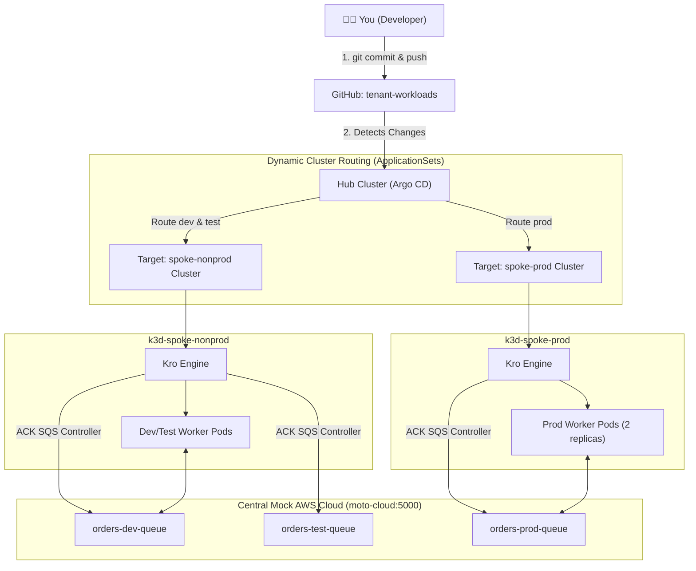

# Developer Tutorial: Building Cloud Apps on the Multi-Cluster Platform

Welcome! This tutorial guides you through using our enterprise **Multi-Cluster Hub-and-Spoke** platform as an **application developer**.

As a developer, you don't need real AWS cloud accounts, complex IAM policies, or direct Kubernetes cluster-admin access. You define what your application needs in a simple YAML file, push it to GitHub, and the GitOps platform takes care of:
1. **Routing** your workloads to the correct cluster (`spoke-nonprod` for DEV/TEST, `spoke-prod` for PROD).
2. **Provisioning** your Kubernetes pods and containers.
3. **Provisioning** simulated AWS infrastructure (like SQS Queues) in our central mock cloud (Moto).
4. **Wiring** the cloud resources directly into your containers via environment variables.

---

## 💡 How It Works Under the Hood



---

## 📁 Repository Structure

Workload configurations live in [`orders-processor`](https://github.com/brunobml/orders-processor):

```text
deploy/
├── values-dev.yaml      # Deployed to spoke-nonprod (namespace: orders-dev)
├── values-test.yaml     # Deployed to spoke-nonprod (namespace: orders-test)
└── values-prod.yaml     # Deployed to spoke-prod (namespace: orders-prod)
```

Environment mappings and deployment targets are explicitly declared in [`applicationsets/tenant-workloads-nonprod.yaml`](../applicationsets/tenant-workloads-nonprod.yaml) and [`applicationsets/tenant-workloads-prod.yaml`](../applicationsets/tenant-workloads-prod.yaml); the Helm values files are referenced by each ApplicationSet entry:
- `deploy/values-dev.yaml` $\rightarrow$ referenced by `tenant-workloads-nonprod` to target **`spoke-nonprod`** in namespace `orders-dev`.
- `deploy/values-test.yaml` $\rightarrow$ referenced by `tenant-workloads-nonprod` to target **`spoke-nonprod`** in namespace `orders-test`.
- `deploy/values-prod.yaml` $\rightarrow$ referenced by `tenant-workloads-prod` to target **`spoke-prod`** in namespace `orders-prod`.

---

## 🚀 5-Minute Quickstart

### Step 1: Open Your Dashboards
- **Hub Argo CD UI**: [http://localhost:8080](http://localhost:8080)
  - Click **Log in via Keycloak** and sign in as `tenant-a-user` (developer access: view tenant apps, sync `orders-dev` / `orders-test`)
  - Password: run `make password` to see where it is stored (it is never kept in Git)
  - Here you will see all your tenant applications: `orders-dev`, `orders-test`, `orders-prod`. Production syncs only through a reviewed `valuesRevision` change, so `tenant-a-user` cannot sync `orders-prod`.
- **Central Moto Cloud API**: [http://localhost:5000/moto-api/](http://localhost:5000/moto-api/)

---

### Step 2: Understand the Service Manifest

Look at `deploy/values-dev.yaml` in the `orders-processor` repository (or the rendered `QueueBackedService` CR):

```yaml
apiVersion: kro.run/v1alpha1
kind: QueueBackedService
metadata:
  name: orders
  namespace: orders-dev
spec:
  name: orders
  environment: dev
  replicas: 1
  messageRetentionPeriod: "86400"
  image: ghcr.io/brunobml/orders-processor:v1.2.0
```

Notice how minimal this is! You only specify:
- `kind: QueueBackedService`: The high-level blueprint from the platform catalog.
- `environment: dev`: Targets your environment naming.
- `replicas: 1`: Number of worker pods.
- `messageRetentionPeriod: "86400"`: SQS queue retention (in seconds).
- `image`: The container image for the service worker.

Under the hood, **Kro** automatically generates:
1. A Kubernetes `Deployment` (`orders-dev-worker`).
2. An AWS SQS Queue in Central Moto Cloud (`orders-dev-queue`).
3. Passes the `QUEUE_URL` and `QUEUE_ARN` directly to your worker container.

---

### Step 3: Inspecting Your Running Microservice

#### Check the Non-Prod Cluster (Dev & Test):
```bash
# View pods in dev namespace
kubectl --context k3d-spoke-nonprod -n orders-dev get pods

# View pods in test namespace
kubectl --context k3d-spoke-nonprod -n orders-test get pods
```

#### Check the Prod Cluster:
```bash
# View pods in prod namespace (notice 2 replicas in production!)
kubectl --context k3d-spoke-prod -n orders-prod get pods
```

#### Check Pod Logs (Real-Time SQS Message Processing):
```bash
kubectl --context k3d-spoke-nonprod -n orders-dev logs -l app=orders-dev-worker --tail=10
```
Output:
```text
🚀 Worker started for [dev] listening on http://moto-cloud:5000/123456789012/orders-dev-queue
🌐 HTTP Web Dashboard listening on port 8080
📦 [dev] Received Order from SQS: {"orderId": "ORD-999", "item": "Laptop"} (MsgId: f47add7a...)
✔ [dev] Processed and deleted order f47add7a... from queue
```

---

### Step 3b: Access the Interactive Microservice Web Dashboard

Every `QueueBackedService` automatically includes an internal Kubernetes `Service` and web interface!

To view your microservice in your web browser:

```bash
# In gitops-control-plane:
make open-dev

# Or directly with kubectl:
kubectl --context k3d-spoke-nonprod -n orders-dev port-forward svc/orders-dev 8001:80
```

Open your browser at **http://localhost:8001**:
- See live pod hostname and connected SQS queue.
- See real-time count of processed orders.
- Type in an order and click **"Send to SQS Queue"** to test producing and consuming live!
- See the recent order history feed.

---

### Step 4: Interacting with Simulated AWS via AWS CLI

From your host machine, you can interact with the mock cloud just like real AWS:

```bash
export AWS_ACCESS_KEY_ID=mock-key
export AWS_SECRET_ACCESS_KEY=mock-secret
export AWS_DEFAULT_REGION=us-east-1

# List all SQS queues across all environments
aws --endpoint-url=http://localhost:5000 sqs list-queues

# Publish a test message to your Dev Queue
aws --endpoint-url=http://localhost:5000 sqs send-message \
  --queue-url "http://localhost:5000/123456789012/orders-dev-queue" \
  --message-body '{"orderId": "ORD-1234", "customer": "Alice", "amount": 99.50}'
```

---

### Step 5: Modifying or Scaling Your Service (GitOps)

Want to scale `orders-dev` from 1 replica to 3 replicas?

1. Edit `deploy/values-dev.yaml` in the `orders-processor` repository:
   ```yaml
   replicas: 3
   ```

2. Commit and push:
   ```bash
   git add deploy/values-dev.yaml
   git commit -m "scale orders dev workers to 3"
   git push origin main
   ```

3. Argo CD detects the commit on GitHub and automatically scales the deployment in `spoke-nonprod`:
   ```bash
   kubectl --context k3d-spoke-nonprod -n orders-dev get pods
   ```

---

## 📋 Developer Cheat Sheet

| Task | Command |
| :--- | :--- |
| **View Dev Pods** | `kubectl --context k3d-spoke-nonprod -n orders-dev get pods` |
| **View Test Pods** | `kubectl --context k3d-spoke-nonprod -n orders-test get pods` |
| **View Prod Pods** | `kubectl --context k3d-spoke-prod -n orders-prod get pods` |
| **View Worker Logs** | `kubectl --context k3d-spoke-nonprod -n orders-dev logs -l app=orders-dev-worker -f` |
| **List AWS Queues** | `AWS_ACCESS_KEY_ID=mock-key AWS_SECRET_ACCESS_KEY=mock-secret aws --endpoint-url=http://localhost:5000 --region us-east-1 sqs list-queues` |
| **Send Test Message** | `AWS_ACCESS_KEY_ID=mock-key AWS_SECRET_ACCESS_KEY=mock-secret aws --endpoint-url=http://localhost:5000 --region us-east-1 sqs send-message --queue-url <URL> --message-body '{"test": true}'` |
| **Argo CD UI** | [http://localhost:8080](http://localhost:8080) |
| **Moto Cloud API** | [http://localhost:5000/moto-api/](http://localhost:5000/moto-api/) |
