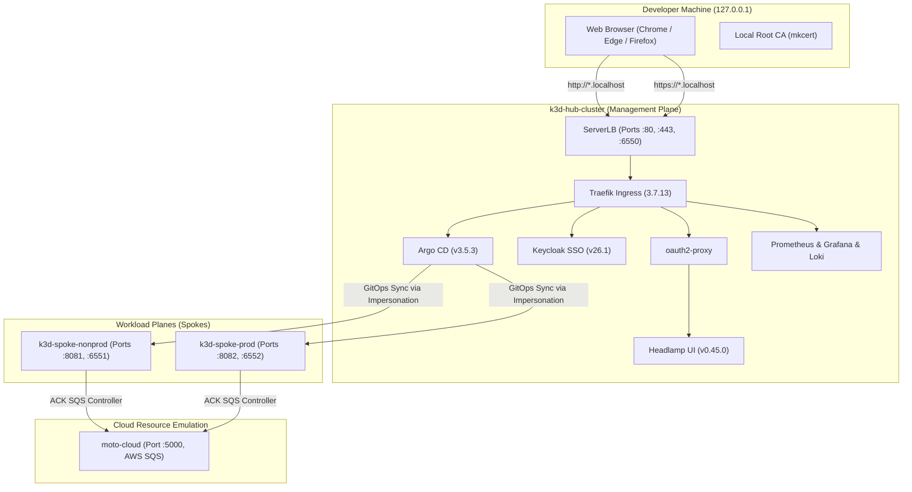
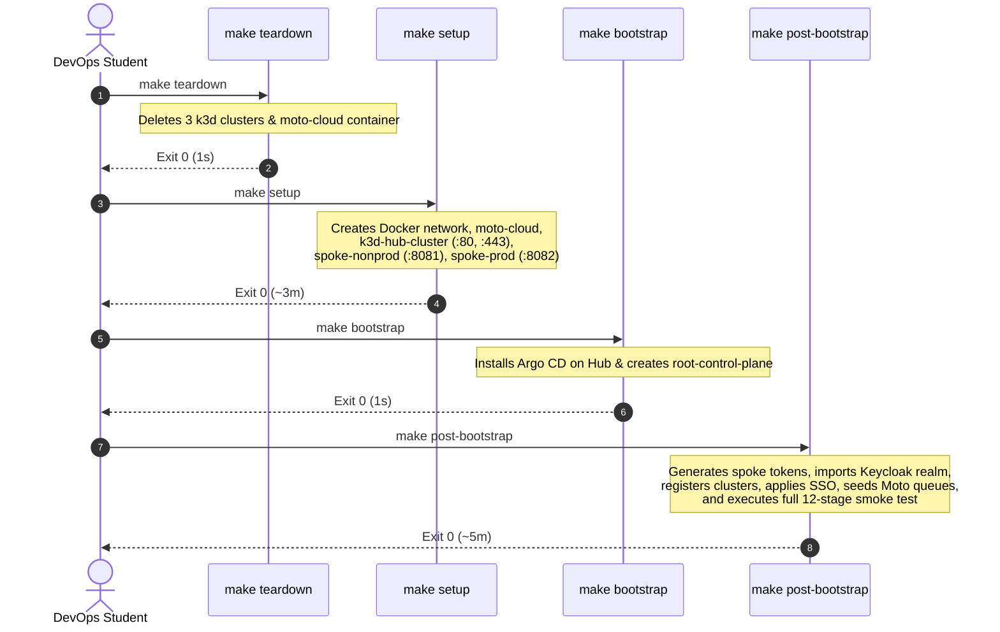
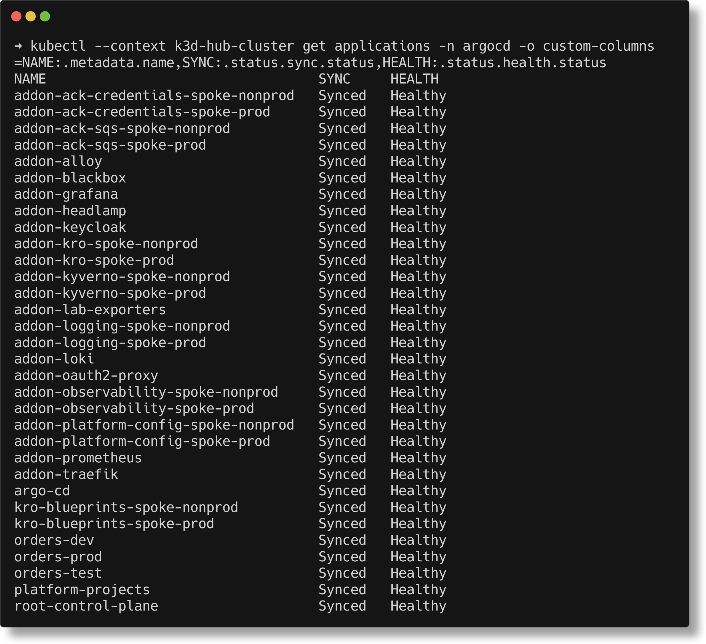
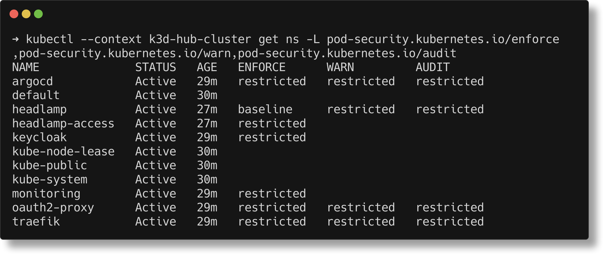
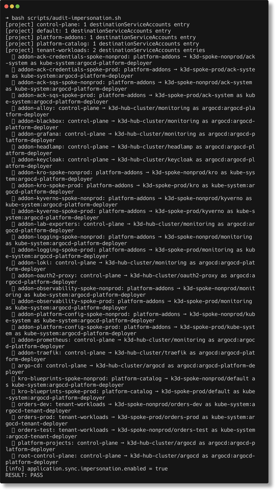
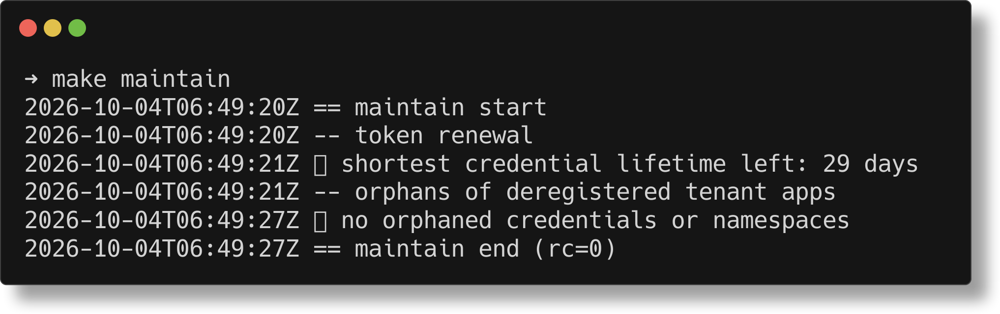
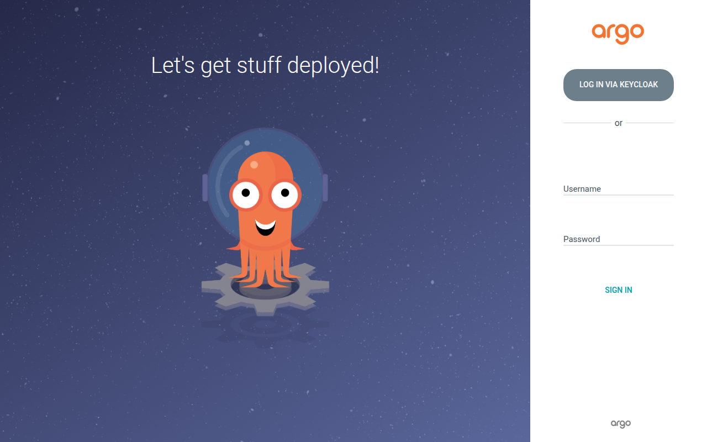
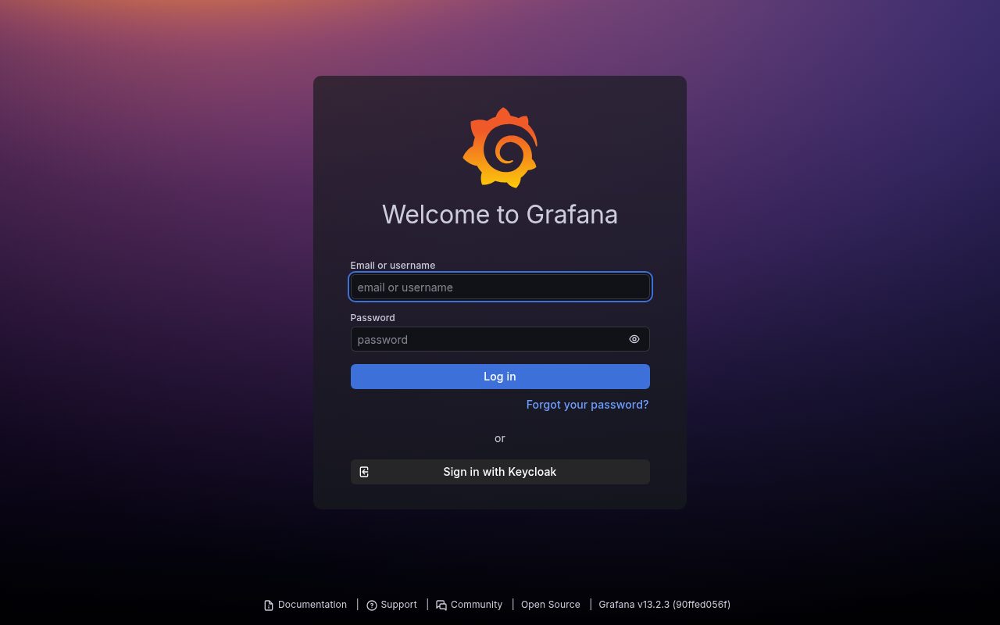
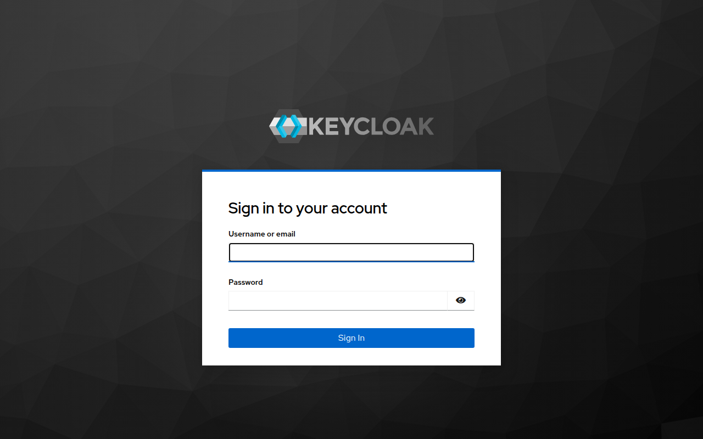
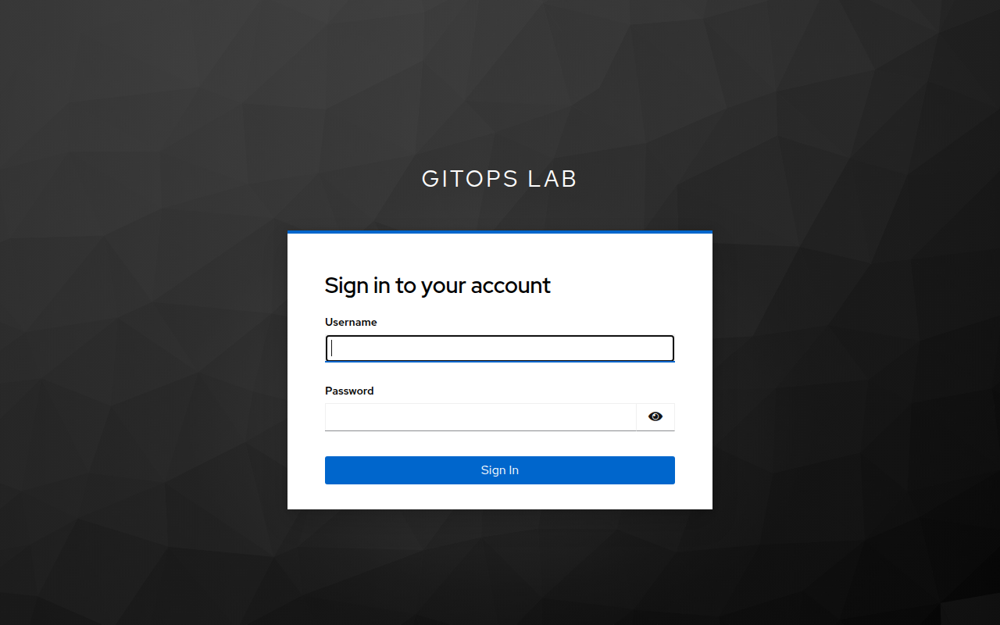

# A DevOps Student's Guide to Multi-Cluster GitOps Rebuild & Operations

> **Target Audience:** DevOps, Cloud Platform, and Site Reliability Engineering students.  
> **Repository:** [`gitops-control-plane`](../../README.md)  
> **Platform Version:** Lab Assessment v1.2 (Post-Remediation Acceptance)

---

## 1. What Are We Building?

This platform is a **multi-cluster GitOps control plane** modeling an enterprise Kubernetes environment on a local workstation using Docker and [k3d](https://k3d.io/).



### The Core Architectural Tenets
1. **Git as Single Source of Truth:** Everything running on all 3 clusters is declared in Git across 5 repositories (`gitops-control-plane`, `platform-catalog`, `platform-charts`, `tenant-workloads`, `orders-processor`).
2. **Least Privilege Impersonation:** Argo CD connects to clusters using restricted ServiceAccounts with targeted RBAC rather than raw `cluster-admin`.
3. **Supply-Chain Security:** Production container images are digest-pinned (`@sha256:…`), validated against supply-chain signatures by Kyverno, and constrained to approved registries by Kubernetes ValidatingAdmissionPolicy.
4. **Canonical URLs & Trusted TLS:** Hub web applications answer on standard ports **80** (HTTP) and **443** (HTTPS) via `*.localhost`. No non-standard ports (like 8080 or 8443) are used on the hub.
5. **Automated Lifecycle & Upkeep:** Routine maintenance (token rotation, orphan cleanup) runs unattended via `make maintain`.

---

## 2. Prerequisites & Preparation

Before running a rebuild, ensure the following are installed on your workstation (Linux or WSL2):
- **Docker Engine** (or Docker Desktop with WSL2 backend)
- **k3d** (v5.7+)
- **kubectl** & **helm**
- **mkcert** (local certificate authority)
- **jq**, **curl**, and **git**

### Secrets & TLS Leaf Setup
Secrets are **never** committed to Git. Instead, they reside in `~/.config/gitops-lab`:
```bash
# Check that your secrets directory exists and has secure permissions (0700)
ls -ld ~/.config/gitops-lab
```
If you do not have certificates yet, generate trusted local certificates:
```bash
./scripts/setup-local-tls.sh
```

---

## 3. The 4-Step Canonical Rebuild Workflow

To tear down an old environment and build a completely fresh, production-grade lab from Git, execute the 4 canonical steps in sequence.



---

### Step 1: Teardown
```bash
make teardown
```
* **What it does:** Destroys all running containers and networks belonging to the lab (`k3d-hub-cluster`, `k3d-spoke-nonprod`, `k3d-spoke-prod`, and `moto-cloud`).
* **Expected duration:** ~1–5 seconds (exit code 0).
* **Terminal output:**


> [!NOTE]
> Notice how the teardown is idempotent: deleting volumes and cluster definitions cleans state without touching external containers or other k3d clusters.

---

### Step 2: Setup
```bash
make setup
```
* **What it does:** 
  1. Verifies that host ports 80 and 443 are free.
  2. Creates the shared Docker bridge network `k3d-cloud-net`.
  3. Launches `moto-cloud` (port 5000) for local AWS emulation.
  4. Provisions 3 k3d Kubernetes clusters:
     - `k3d-hub-cluster`: binds load balancer exclusively to `127.0.0.1:80` and `127.0.0.1:443`.
     - `k3d-spoke-nonprod`: binds load balancer to `127.0.0.1:8081`.
     - `k3d-spoke-prod`: binds load balancer to `127.0.0.1:8082`.
  5. Deploys Traefik Ingress on the Hub and loads the mkcert trusted TLS secret.
  6. Installs Argo CD on the Hub and provisions enterprise `AppProject` definitions.
* **Expected duration:** ~3 minutes (exit code 0).
* **Terminal output:**


---

### Step 3: Bootstrap
```bash
make bootstrap
```
* **What it does:** Applies the root Argo CD application (`root-control-plane`), which instructs Argo CD to begin discovering and reconciling all platform add-ons and tenant workloads declared in Git.
* **Expected duration:** ~1–2 seconds (exit code 0).
* **Terminal output:**


---

### Step 4: Post-Bootstrap
```bash
make post-bootstrap
```
* **What it does:** 
  1. Issues short-lived cluster credentials (ServiceAccount tokens valid for 30 days) and registers spokes into Argo CD.
  2. Generates Headlamp viewer tokens and mounts them securely.
  3. Prepares Keycloak SSO realm and updates CoreDNS template overrides.
  4. Seeds AWS SQS queues and Dead-Letter Queues (DLQs) in Moto Cloud.
  5. Restarts worker pods to pick up their newly issued AWS credentials.
  6. Adopts the self-managed `argo-cd` application.
  7. Automatically triggers the full 12-stage smoke test to verify all systems.
* **Expected duration:** ~4–5 minutes (exit code 0).
* **Terminal output:**


---

## 4. Verification & Health Inspection

Once the rebuild completes, verify the state of your clusters using the following commands:

### 1. Verify Port Bindings (R-15 Compliance)
Ensure the Hub load balancer uses canonical ports 80/443 without legacy ports (8080/8443):
```bash
docker ps --format "table {{.Names}}\t{{.Status}}\t{{.Ports}}"
```


> [!TIP]
> Notice that `k3d-hub-cluster-serverlb` exposes strictly `80->80/tcp`, `443->443/tcp`, and `6550->6443/tcp`. Legacy ports 8080 and 8443 are completely eliminated.

---

### 2. Verify Argo CD Application Status
All 32 applications must report `Synced` and `Healthy`:
```bash
kubectl --context k3d-hub-cluster get applications -n argocd -o custom-columns=NAME:.metadata.name,SYNC:.status.sync.status,HEALTH:.status.health.status
```



---

### 3. Verify Pod Security Admission (Track C.1)
Platform namespaces must be protected with `restricted` (or `baseline` for Headlamp):
```bash
kubectl --context k3d-hub-cluster get ns -L pod-security.kubernetes.io/enforce,pod-security.kubernetes.io/warn,pod-security.kubernetes.io/audit
```



> [!IMPORTANT]
> The `restricted` standard enforces non-root containers, dropped Linux capabilities, and read-only root filesystems. `headlamp` is assigned `baseline` because it requires specific capability sets.

---

### 4. Verify Least-Privilege Impersonation
Confirm that Argo CD uses impersonation for sync operations across all clusters:
```bash
bash scripts/audit-impersonation.sh
```



---

### 5. Run the Automated Smoke Test Suite
Execute the automated end-to-end smoke test suite:
```bash
make test
```


---

## 5. Routine Operations: `make maintain` (Track G.3)

In real-world DevOps environments, ServiceAccount tokens expire (in our lab, they have a 30-day lifetime). Running a full post-bootstrap every week is disruptive and unnecessary.

Instead, run the streamlined upkeep command:
```bash
make maintain
```

* **What it does:**
  - Evaluates spoke and Headlamp token expiration times.
  - Automatically rotates tokens if fewer than 7 days remain.
  - Cleans up orphaned namespaces and secrets left behind by deleted tenant apps.
  - Logs results to `~/.config/gitops-lab/logs/maintain.log` (mode `0600`).
  - **Headless resilience:** If Docker or the cluster is stopped, it exits cleanly with code 0 instead of throwing an error.



---

## 6. Accessing the Web Interfaces

All web services are accessible via canonical subdomains of `localhost`:

| Service | Canonical URL | Credentials | Purpose |
|---|---|---|---|
| **Argo CD** | [http://argocd.localhost](http://argocd.localhost) | `admin` / Keycloak SSO | GitOps multi-cluster dashboard |
| **Grafana** | [http://grafana.localhost](http://grafana.localhost) | Keycloak SSO | Metrics, dashboards, and Loki logs |
| **Headlamp** | [http://headlamp.localhost](http://headlamp.localhost) | Keycloak SSO (`platform-user`) | Multi-cluster Kubernetes viewer |
| **Keycloak** | [http://keycloak.localhost](http://keycloak.localhost) | `admin` / `admin` | Central OIDC identity provider |

---

### Web Interface Gallery

#### Argo CD Web UI
Accessed at `http://argocd.localhost`. Features native Single Sign-On integration with Keycloak.



#### Grafana Observability Dashboard
Accessed at `http://grafana.localhost`. Displays Prometheus cluster metrics, Blackbox probe results, and Loki log streams.



#### Keycloak Identity Provider
Accessed at `http://keycloak.localhost`. Manages centralized realm users (`platform-user`, `tenant-a-user`) and RBAC group claims.



#### Headlamp Multi-Cluster Viewer
Accessed at `http://headlamp.localhost`. Protected by `oauth2-proxy` to enforce authenticated SSO sessions before granting cluster visibility.



---

## 7. Common Pitfalls & DevOps Lessons Learned

1. **Bash `set -euo pipefail` Hazard:**
   - *Problem:* When piping `docker ps ... | grep ...`, if `grep` finds no matches, it exits with return code 1. Under `set -e` and `pipefail`, this terminates the entire script unexpectedly.
   - *Fix:* Use `{ grep ... || true; }` inside pipelines that check for optional output.
2. **k3d Port Mutation:**
   - *Problem:* Modifying port mappings on running k3d load balancers with `k3d cluster edit --port-delete` is experimental and drops container proxy rules.
   - *Best Practice:* To change port models, update cluster creation scripts and execute a clean rebuild.
3. **Headless Maintenance Scripting:**
   - *Problem:* Automated maintenance scheduled via cron or Windows Task Scheduler can trigger false alarms if the laptop is sleeping or Docker is stopped.
   - *Fix:* Always include pre-flight readiness checks that exit cleanly with code 0 when the host environment is offline.
