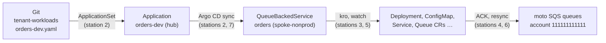

# Lab 0: Tour the Running Lab (about 60 minutes)

> **Status: Current (2026-10-07).** Start here if the lab is already running. You will follow one tenant application, `orders-dev`, from Git to the mock cloud. You will rebuild nothing and break nothing. Every action is read-only or is repaired by a controller within minutes; each station says how. Observations are measured on this lab, with the date. Every command block is tested by `make test-docs` (`MODE=live-mutating` for stations 5 and 6). Plan: [learner on-ramp, Track A](remediation/2026-10-06-lab-learning-assessment/2026-10-07-learner-on-ramp-plan.md).

**You need:** the running lab (someone ran the [rebuild](runbooks/devops-student-rebuild-guide.md)), a shell in `gitops-control-plane` with its sibling repositories next to it, `kubectl`, `argocd`, `aws`, `jq`, and a browser. **You should know** `kubectl get/describe` and what a controller is. Words in *italics* are defined in [Concepts, Glossary & Self-Check](concepts-and-glossary.md).

**How each station works:** read the **question**, write down your *prediction*, run the commands, compare with the **measured** result, then open *Explain*. You learn most when your prediction was wrong.



---

## Station 0: Before you start (5 min)

**Question:** is the lab healthy? Every later station compares against this baseline.

<!-- doc-test: covered by="bats:Gate 1" -->
```bash
make test        # every line "ok", none "not ok"
```

If anything says `not ok`, stop here and fix it with the [student guide](runbooks/devops-student-rebuild-guide.md#4-verification--health-inspection) first. Station 6 deletes a cloud queue and must not overlap a moto restart or another drill.

**Log in as a tenant, not as an admin.** You tour the platform as `tenant-a-user`, a member of team *tenant-a*. Get its password with `make password` (it reads `~/.config/gitops-lab`, never Git).

* **Browser:** open `http://localhost`, choose *Log in via Keycloak*, sign in as `tenant-a-user`.
* **CLI:** use a separate config file, so the session does not replace an admin session you already have:

<!-- doc-test: skip reason="interactive browser SSO login; the tour's CLI blocks are run by make test-docs with a break-glass session in a temporary config" -->
```bash
export ARGOCD_OPTS="--config $HOME/.config/argocd/lab0.config"
argocd login localhost --sso --grpc-web --plaintext --skip-test-tls   # WSL: add --sso-launch-browser=false
```

---

## Station 1: What can a tenant see? (10 min)

**Question:** the hub runs 42 Applications. How many does `tenant-a-user` see? May it sync `orders-prod`?

*Predict, then look:* in the browser, the Applications page. Then in the CLI:

<!-- doc-test: skip reason="needs the tenant-a-user SSO session from station 0 (interactive); the next block checks the same rules against the live policy" -->
```bash
argocd account get-user-info          # Groups: [lab-tenant-a]
argocd app list -o name               # argocd/orders-dev, argocd/orders-prod, argocd/orders-test
argocd account can-i sync applications tenant-workloads/orders-dev    # yes
argocd account can-i sync applications tenant-workloads/orders-prod   # no
```

Now ask the policy itself. This reads the live `argocd-rbac-cm` and evaluates it offline. Your tenant session is not involved, so it works even before you log in:

<!-- doc-test: run expect="orders-dev +sync: Yes\s+orders-test +sync: Yes\s+orders-prod +sync: No\s+addon-kro +get: +No" -->
```bash
policy=$(mktemp)
kubectl --context k3d-hub-cluster -n argocd get configmap argocd-rbac-cm -o jsonpath='{.data.policy\.csv}' > "$policy"
grep 'role:tenant-a' "$policy"
for app in orders-dev orders-test orders-prod; do
  printf '%-12s sync: ' "$app"
  argocd admin settings rbac can role:tenant-a sync applications "tenant-workloads/$app" --policy-file "$policy" --loglevel error || true   # exit 1 means "No"
done
printf '%-12s get:  ' addon-kro
argocd admin settings rbac can role:tenant-a get applications platform-addons/addon-kro-spoke-nonprod --policy-file "$policy" --loglevel error || true
rm -f "$policy"
```

**Measured (2026-10-07):** the hub had 42 Applications in five projects (`platform-addons` 20, `control-plane` 13, `platform-catalog` 4, `tenant-workloads` 3, `tenant-iac` 2). The tenant sees **3**. Policy answers: `orders-dev` sync **Yes**, `orders-test` **Yes**, `orders-prod` **No**, `addon-kro` get **No**.

<details><summary>Explain</summary>

Two layers decide. **RBAC** (`argocd-rbac-cm`) maps the Keycloak group `lab-tenant-a` to `role:tenant-a`, which may *get* every app in project `tenant-workloads` but *sync* only `orders-dev` and `orders-test`. Promotion to prod happens through a pinned commit in Git, never through a button. The **AppProject** `tenant-workloads` limits what any of its apps may deploy: only the repositories `orders-processor` and the chart registry, and only namespaces `orders-*`/`tenant-*`. So RBAC limits what a *person* may do, and the AppProject limits what an *app* may do. The platform's 39 other Applications are simply invisible to the tenant.
</details>

**How it goes back:** read-only.

---

## Station 2: From Git to Application (10 min)

**Question:** nobody ran `kubectl apply` for `orders-dev`. Where does the Application come from, and which two Git revisions does it render?

<!-- doc-test: run expect="valuesRevision: main" -->
```bash
cat ../tenant-workloads/tenants/tenant-a/apps/orders-dev.yaml          # the tenant's registration (data only)
kubectl --context k3d-hub-cluster -n argocd get applicationset tenant-workloads-tenant-a \
  -o jsonpath='{.spec.generators[0].git.repoURL} {.spec.generators[0].git.files[0].path}{"\n"}'
```

Then open `applicationsets/tenant-workloads-tenant-a.yaml` in this repository and find where `env` decides the cluster (`destination.name`) and the AWS account (`services.k8s.aws/owner-account-id`).

<!-- doc-test: run expect="1\.0\.0" -->
```bash
kubectl --context k3d-hub-cluster -n argocd get application orders-dev \
  -o jsonpath='{range .spec.sources[*]}{.repoURL} {.chart} @ {.targetRevision}{"\n"}{end}revisions: {.status.sync.revisions}{"\n"}'
```

**Measured (2026-10-07):** two sources: the chart `ghcr.io/brunobml/charts queue-backed-service @ 1.0.0`, and `orders-processor.git @ main` (`ref: values`). The revisions were `["1.0.0","6924cfd…"]`: the chart version, and the commit that `main` pointed to.

<details><summary>Explain</summary>

The *ApplicationSet* `tenant-workloads-tenant-a` has a **git files generator**: every `tenants/tenant-a/apps/*.yaml` in `tenant-workloads` becomes one Application. The tenant supplies data only (`app`, `env`, `port`, `valuesRevision`). The platform's template fixes everything else and rejects bad input, for example a prod file without a full commit SHA. The Application has **two sources**: the platform's golden chart, pinned at `1.0.0`, and the tenant's values file. The chart is rendered with `$values/deploy/values-dev.yaml`. So a chart upgrade is a platform change, and a replica change is a tenant commit. Both appear as separate revisions.
</details>

**How it goes back:** read-only.

---

## Station 3: From Application to objects (10 min)

**Question:** Argo CD applied **one** object to `spoke-nonprod`. How many objects exist for `orders`, and who created them?

<!-- doc-test: run expect="queue.sqs.services.k8s.aws/orders-dev-dlq" -->
```bash
kubectl --context k3d-spoke-nonprod -n orders-dev get queuebackedservice
kubectl --context k3d-spoke-nonprod -n orders-dev get \
  deploy,svc,configmap,serviceaccount,ingress,networkpolicy,queue.sqs.services.k8s.aws \
  -l kro.run/instance-name=orders -o name
kubectl --context k3d-spoke-nonprod -n orders-dev get deployment orders-dev-worker \
  -o jsonpath='owner: {.metadata.ownerReferences[0].kind}/{.metadata.ownerReferences[0].name} controller={.metadata.ownerReferences[0].controller}{"\n"}'
```

<!-- doc-test: run expect="111111111111" -->
```bash
kubectl --context k3d-spoke-nonprod -n orders-dev get queue.sqs.services.k8s.aws \
  -o custom-columns='NAME:.metadata.name,ACCOUNT:.status.ackResourceMetadata.ownerAccountID,SYNCED:.status.conditions[?(@.type=="ACK.ResourceSynced")].status'
kubectl --context k3d-spoke-nonprod get namespace orders-dev \
  -o jsonpath='namespace account: {.metadata.annotations.services\.k8s\.aws/owner-account-id}{"\n"}'
```

**Measured (2026-10-07):** one `QueueBackedService` `orders` (`ACTIVE`, `READY True`) and **9** children: Deployment, Service, ConfigMap, ServiceAccount, Ingress, two NetworkPolicies, and two ACK `Queue` objects. Each child is owned by `QueueBackedService/orders` with `controller=true`. Both queues are in account `111111111111`, which matches the namespace annotation.

<details><summary>Explain</summary>

*kro* turned one custom resource into nine. It acts as the *controller owner* of each child (`ownerReferences`, label `kro.run/owned=true`). Argo CD tracks only the `QueueBackedService` it applied; it shows the children in its tree only because of those owner references (station 7). The `Queue` objects are Kubernetes objects too. The cloud resources behind them belong to the next controller, *ACK*. ACK chooses the AWS account from the **namespace annotation** (*CARM*), which the ApplicationSet set from `env`. That is why the tenant cannot pick an account.
</details>

**How it goes back:** read-only.

---

## Station 4: From objects to the cloud (5 min)

**Question:** moto is one process that pretends to be AWS. Do all its callers see the same queues?

Without an account, as any client that just uses the mock keys:

<!-- doc-test: run expect="123456789012" -->
```bash
AWS_ACCESS_KEY_ID=mock-key AWS_SECRET_ACCESS_KEY=mock-secret AWS_SESSION_TOKEN= \
  aws --endpoint-url=http://localhost:5000 --region us-east-1 sts get-caller-identity --query Account --output text
AWS_ACCESS_KEY_ID=mock-key AWS_SECRET_ACCESS_KEY=mock-secret AWS_SESSION_TOKEN= \
  aws --endpoint-url=http://localhost:5000 --region us-east-1 sqs list-queues --query 'length(QueueUrls || `[]`)'
```

As account `111111111111` (nonprod), then `222222222222` (prod). `aws_as` is the helper from the [developer tutorial, Step 4](developer-tutorial.md). It assumes a role in that account and exports the temporary keys into your shell:

<!-- doc-test: run expect="orders-prod-queue" -->
```bash
aws_as() {
  local creds
  creds=$(AWS_ACCESS_KEY_ID=mock-key AWS_SECRET_ACCESS_KEY=mock-secret AWS_SESSION_TOKEN= \
    aws --endpoint-url=http://localhost:5000 --region us-east-1 sts assume-role \
    --role-arn "arn:aws:iam::$1:role/learner" --role-session-name learner --query Credentials --output json)
  export AWS_ACCESS_KEY_ID=$(jq -r .AccessKeyId <<<"$creds")
  export AWS_SECRET_ACCESS_KEY=$(jq -r .SecretAccessKey <<<"$creds")
  export AWS_SESSION_TOKEN=$(jq -r .SessionToken <<<"$creds")
  export AWS_DEFAULT_REGION=us-east-1
}
aws_as 111111111111
aws --endpoint-url=http://localhost:5000 sqs list-queues --query QueueUrls --output text | tr '\t' '\n'
aws_as 222222222222
aws --endpoint-url=http://localhost:5000 sqs list-queues --query QueueUrls --output text | tr '\t' '\n'
```

**Measured (2026-10-07):** the plain mock keys are account `123456789012`, with **0** queues. Account `111111111111` has the 4 nonprod queues (`orders-dev-queue`, `orders-dev-dlq`, `orders-test-queue`, `orders-test-dlq`); `222222222222` has the 2 prod queues.

<details><summary>Explain</summary>

moto keeps a separate state per account, like real AWS. The ACK controllers assume a role per account (CARM), so dev and prod resources are isolated, even though everything runs in one container. An empty answer under the default account does **not** mean the queues are gone. It means you asked the wrong account, which is a common mistake in real multi-account AWS too. After a moto restart, ACK briefly makes the same mistake (incident F-6; see Drill 1 in the student guide).
</details>

**How it goes back:** read-only. `aws_as` changes only the variables of your current shell.

---

## Station 5: Watch, fast (5 min)

**Question:** you scale a kro-owned Deployment by hand, and delete its ConfigMap. Who notices, and how fast? Does Argo CD show drift?

<!-- doc-test: mutating expect="(?m)^replicas now: 1$" -->
```bash
kubectl --context k3d-spoke-nonprod -n orders-dev scale deployment orders-dev-worker --replicas=3
sleep 2
kubectl --context k3d-spoke-nonprod -n orders-dev get deployment orders-dev-worker -o jsonpath='replicas now: {.spec.replicas}{"\n"}'
```

<!-- doc-test: mutating expect="Synced/" -->
```bash
kubectl --context k3d-spoke-nonprod -n orders-dev delete configmap orders-dev-config
sleep 2
kubectl --context k3d-spoke-nonprod -n orders-dev get configmap orders-dev-config -o jsonpath='recreated at: {.metadata.creationTimestamp}{"\n"}'
kubectl --context k3d-hub-cluster -n argocd get application orders-dev -o jsonpath='{.status.sync.status}/{.status.health.status}{"\n"}'
```

**Measured (2026-10-07 18:51 UTC):** `replicas` was back to **1** at the first poll, less than 1 s after the scale. The ConfigMap was recreated in the same second as the delete. Argo CD stayed **`Synced/Healthy`**. During the next few seconds, the tree view (station 7) showed an extra `Progressing` pod while it terminated; 20 s later, one pod ran again.

<details><summary>Explain</summary>

kro **watches** its children, and every change is an event. kro compares each child with the template of `QueueBackedService/orders` and corrects it at once. Argo CD does not report drift because it never applied these objects: its desired state is the one `QueueBackedService`, which did not change. To scale for real, change `replicas` in `orders-processor/deploy/values-dev.yaml` (see self-check question 1 in the concepts page). A hand edit to a controller-owned object is reverted, however good the reason.
</details>

**How it goes back:** kro restores both objects within about a second. `make test-docs MODE=live-mutating` confirms one replica and the ConfigMap afterwards.

---

## Station 6: Resync, slow (up to 5 min)

**Question:** now you delete the **cloud** queue behind `orders-dev-dlq`, not the Kubernetes object. Does kro notice? Does Argo CD? Does anything bring it back?

This is [Drill 4](runbooks/devops-student-rebuild-guide.md#6-milestone-watch-a-controller-heal-the-cloud-drill-4) of the student guide. The first command makes sure the queue exists, so you never delete during a repair:

<!-- doc-test: mutating with="aws_as 111111111111" -->
```bash
aws_as 111111111111
aws --endpoint-url=http://localhost:5000 sqs get-queue-url --queue-name orders-dev-dlq --output text \
  && aws --endpoint-url=http://localhost:5000 sqs delete-queue --queue-url http://localhost:5000/111111111111/orders-dev-dlq
```

**Observe** (repeat every 20 s until the queue is back):

<!-- doc-test: run with="aws_as 111111111111" expect="orders-dev-dlq" -->
```bash
aws --endpoint-url=http://localhost:5000 sqs get-queue-url --queue-name orders-dev-dlq --output text || echo "queue missing"
kubectl --context k3d-hub-cluster -n argocd get application orders-dev -o jsonpath='Argo CD: {.status.sync.status}/{.status.health.status}{"\n"}'
kubectl --context k3d-spoke-nonprod -n orders-dev get queue.sqs.services.k8s.aws orders-dev-dlq \
  -o jsonpath='ACK ResourceSynced: {.status.conditions[?(@.type=="ACK.ResourceSynced")].status}{"\n"}'
```

**Measured (2026-10-07, two consecutive runs of `make test-docs MODE=live-mutating`):** ACK recreated the queue at its next **resync**, after **113 s** and **290 s**, always within the 300 s resync period. Earlier runs recorded 11–150 s ([concepts page](concepts-and-glossary.md#4-self-check-questions)). How long you wait depends on where the controller is in its cycle. Argo CD stayed `Synced/Healthy` throughout, and kro did nothing. `make test-docs MODE=live-mutating` repeats this run and waits for the queue to return.

<details><summary>Explain</summary>

Nothing in Kubernetes changed, so no **watch** fires: kro and Argo CD see nothing. Only ACK compares the Kubernetes object with the cloud, and only on its periodic **resync**. Compare station 5: drift *inside* the cluster is repaired in about a second; drift *in the cloud* takes up to one resync period. GitOps alone cannot see cloud drift. The controller that owns the cloud resource has to look.
</details>

**How it goes back:** ACK recreates the queue, empty and with the same name and account. A real queue would lose its messages; that is the lesson of [Drill 1](runbooks/devops-student-rebuild-guide.md#7-milestone-lose-the-cloud-drill-1).

---

## Station 7: Read the status right (5 min)

**Question:** where does Argo CD keep the health of `Queue/orders-dev-dlq`?

<!-- doc-test: run with="argocd-session" expect="Queue/orders-dev-dlq" -->
```bash
argocd app get orders-dev --output tree
```

<!-- doc-test: run expect="QueueBackedService/orders" -->
```bash
kubectl --context k3d-hub-cluster -n argocd get application orders-dev \
  -o jsonpath='{range .status.resources[*]}{.kind}/{.name} status={.status} health={.health.status}{"\n"}{end}'
```

**Measured (2026-10-07):** the tree shows `QueueBackedService/orders` (`Synced`, `Healthy`) with 9 children under it: the Deployment, ReplicaSet and pod, the Service, Ingress and both queues are `Healthy`, while the ConfigMap, ServiceAccount and NetworkPolicies have no health. `status.resources` lists **only** `QueueBackedService/orders status=Synced`, with an **empty** health.

<details><summary>Explain</summary>

*Sync* status compares what Argo CD applied with Git, so it exists only for the one object Argo CD applied. *Health* comes from health checks. The checks for kro and ACK kinds are Lua scripts the lab adds (`clusters/values-argocd-hub.yaml`). Argo CD 3.x computes health for the tree but does not store per-resource health in `Application.status.resources`. For health, read the tree (UI or `--output tree`), not the Application YAML. The children appear in the tree through their `ownerReferences`, but they are not part of sync. That is why station 5 caused no drift.
</details>

**How it goes back:** read-only.

---

## Station 8: Check yourself (10 min)

Answer without looking back, then open the answer.

1. You run `kubectl scale deployment orders-dev-worker --replicas=3` in `orders-dev`. What do you see one second later, and why does Argo CD not complain?
   <details><summary>Answer</summary>One replica: kro watches its children and restores the template at once (station 5). Argo CD only tracks the <code>QueueBackedService</code>, which did not change. To scale, change the values file in Git.</details>
2. `aws sqs list-queues` with the mock keys returns nothing. Are the queues gone?
   <details><summary>Answer</summary>Not necessarily: the mock keys are account <code>123456789012</code>. The queues are in <code>111111111111</code> and <code>222222222222</code> (station 4, CARM).</details>
3. Someone deletes `orders-dev-dlq` in moto. Who notices, and when?
   <details><summary>Answer</summary>Only ACK, at its next resync (≤ 300 s). Argo CD and kro see no Kubernetes change ([concepts, question 3](concepts-and-glossary.md#4-self-check-questions); station 6).</details>
4. Why can `tenant-a-user` sync `orders-dev` but not `orders-prod`, and what limits what `orders-dev` itself may deploy?
   <details><summary>Answer</summary>RBAC: <code>role:tenant-a</code> may sync only <code>orders-dev</code> and <code>orders-test</code>; prod changes go through a pinned commit in Git. The AppProject <code>tenant-workloads</code> limits the app's repositories and namespaces (station 1).</details>
5. Where do you read the health of an ACK `Queue`, and where not?
   <details><summary>Answer</summary>In the tree view (UI or <code>argocd app get … --output tree</code>), computed by the lab's Lua health checks; not in <code>Application.status.resources</code> (station 7).</details>

---

## Optional: the Git side (5 min)

Station 2 used the local copy of the registration file. To see which commit Argo CD rendered, compare the values revision with the branch it follows:

<!-- doc-test: run expect="refs/heads/main" -->
```bash
kubectl --context k3d-hub-cluster -n argocd get application orders-dev -o jsonpath='rendered values commit: {.status.sync.revisions[1]}{"\n"}'
git ls-remote https://github.com/brunobml/orders-processor.git refs/heads/main
```

If they differ, Argo CD has not polled yet (every 3 minutes by default) or a webhook is missing. Proposing a change to `tenant-workloads` or `orders-processor` is a pull request. The [developer tutorial](developer-tutorial.md) walks through one; do not push to the shared repositories from this tour.

## Next

* **[Student guide](runbooks/devops-student-rebuild-guide.md):** rebuild the lab yourself, then Drill 1 (*Lose the Cloud*), the disruptive drill this tour avoids.
* **[Developer tutorial](developer-tutorial.md):** ship a change as a tenant.
* **Lab 1 (coming next):** write your own kro blueprint in a disposable sandbox cluster.
