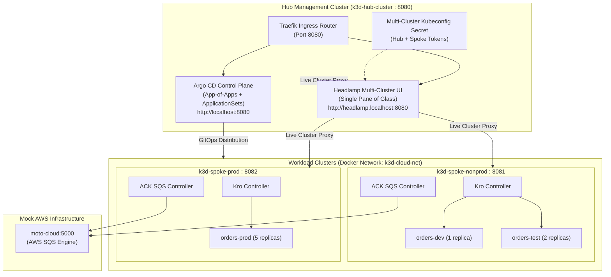
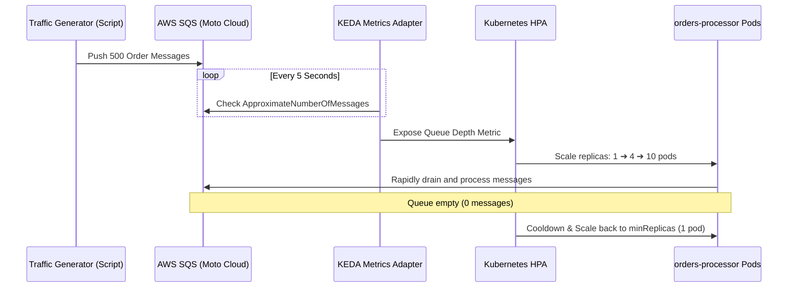
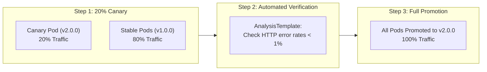
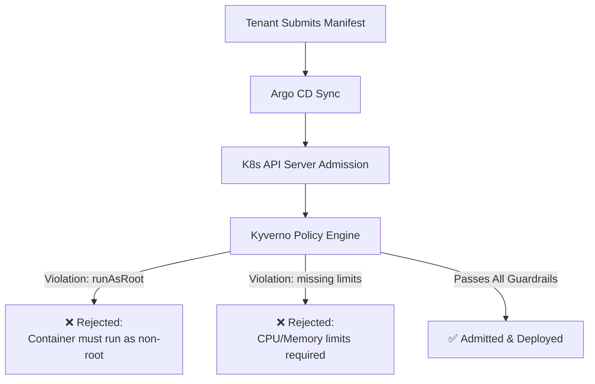
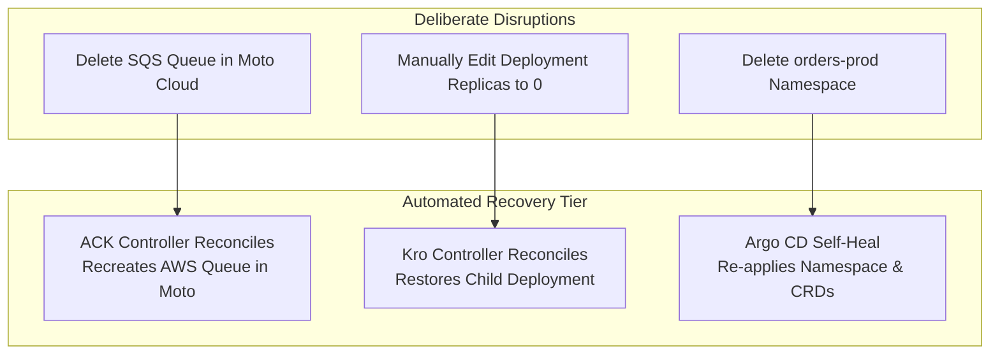
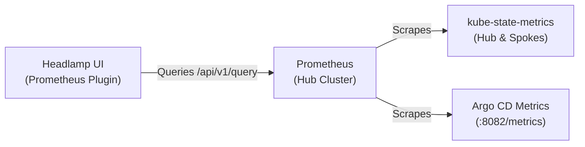

# Lab Progression & Advanced Enterprise Roadmap
## GitOps Control Plane + Platform Engineering with Kro, ACK, Argo CD & Headlamp

> **Status: Design reference.** Design rationale and target state. Examples and names may differ from what is deployed. For the running lab, see the [README](../README.md) and the [runbooks](runbooks/).

This document outlines recommended progression tracks to take this local multi-cluster lab from a functional foundation to a **production-grade enterprise platform engineering showcase**.

---

## 🧭 Current Architecture Baseline

Before advancing, ensure you understand what is currently deployed and running in the lab:



---

## 🎯 Progression Track Overview

| Track | Theme | Target Capability | Complexity | Key Technologies |
| :--- | :--- | :--- | :--- | :--- |
| **Track 1** | **Autoscaling** | Event-driven scaling based on SQS queue depth | Medium (20 min) | KEDA, AWS SQS, Kro |
| **Track 2** | **Progressive Delivery** | Canary rollouts with traffic shaping | Medium (30 min) | Argo Rollouts, AnalysisTemplates |
| **Track 3** | **Governance & Security** | Policy as Code & admission control | Medium (25 min) | Kyverno, CIS Benchmarks |
| **Track 4** | **Reliability & Chaos** | Automated self-healing & cloud drift recovery | Low (15 min) | GitOps selfHeal, ACK reconcile |
| **Track 5** | **Observability** | Telemetry, queue lag, and Headlamp metrics | Medium (30 min) | Prometheus, Headlamp plugins |
| **Track 6** | **Platform Onboarding** | Automated tenant onboarding & PR workflows | High (45 min) | ApplicationSet Generators, Backstage |

---

## Track 1: Event-Driven Autoscaling with KEDA

### The Problem
Currently, the `orders-processor` deployment uses static replica counts (1 in Dev, 2 in Test, 5 in Prod). In real-world microservices, queue processing workloads fluctuate drastically. Static replicas either waste compute resources during idle periods or fall behind during high-volume message bursts.

### The Solution: KEDA (Kubernetes Event-driven Autoscaling)
Deploy KEDA as a cluster add-on across the Spoke clusters and configure a `ScaledObject` that connects directly to AWS SQS (in Moto Cloud).



### Implementation Blueprint
1. **Deploy KEDA Add-on**:
   Add `addon-keda.yaml` into [`applicationsets/`](../applicationsets) targeting `spoke-nonprod` and `spoke-prod`.
2. **Extend the Kro Platform Blueprint**:
   Update the `QueueBackedService` `ResourceGraphDefinition` in [`platform-catalog`](https://github.com/brunobml/platform-catalog) to include an optional `autoscaling` block:
   ```yaml
   spec:
     autoscaling:
       enabled: true
       minReplicas: 1
       maxReplicas: 10
       queueLengthTarget: 10
   ```
3. **Generate KEDA ScaledObject**:
   Kro generates both the `Deployment` and the KEDA `ScaledObject` referencing the ACK SQS Queue URL.
4. **Traffic Generation Script (`make test-traffic`)**:
   A script that writes 500 mock orders to the SQS queue and watches pod scaling live in Headlamp (`http://headlamp.localhost:8080`).

---

## Track 2: Progressive Delivery with Argo Rollouts

### The Problem
Standard Kubernetes Deployments execute basic rolling updates. If a bad container image or regression is introduced, 100% of tenant traffic is exposed to errors before human operators can intervene.

### The Solution: Canary Deployments with Argo Rollouts
Replace the standard `Deployment` in the Kro blueprint with an `Argo Rollout` resource, supporting canary step weights, automated pauses, and Prometheus-based rollback criteria.



### Implementation Blueprint
1. **Deploy Argo Rollouts Controller**:
   Deploy the `argo-rollouts` chart onto `k3d-spoke-nonprod` and `k3d-spoke-prod`.
2. **Kro Blueprint Adaptation**:
   In `platform-catalog`, adapt `QueueBackedService` to optionally render `argoproj.io/v1alpha1.Rollout` with configurable canary steps:
   ```yaml
   strategy:
     canary:
       steps:
         - setWeight: 20
         - pause: { duration: 1m }
         - setWeight: 50
         - pause: { duration: 2m }
   ```
3. **Headlamp & Argo Rollouts Dashboard**:
   Inspect the live canary progression in real time directly from the Headlamp Pod view and the Argo CD UI.

---

## Track 3: Policy-as-Code & Security Guardrails (Kyverno)

### The Problem
Platform engineers must enforce organizational compliance rules without manually reviewing every pull request or manifest.

### The Solution: Kyverno Admission Policies
Deploy **Kyverno** to validate and mutate Kubernetes resources at admission time.



### Key Policies to Implement
1. **Enforce Non-Root Execution**:
   Require `securityContext.runAsNonRoot: true` and `securityContext.allowPrivilegeEscalation: false` across all workload pods.
2. **Mandatory Resource Limits**:
   Disallow any container that does not specify `resources.requests` and `resources.limits`.
3. **Required Enterprise Metadata**:
   Require labels: `app.kubernetes.io/part-of`, `cost-center`, and `environment`.
4. **Interactive Demonstration**:
   Submit a tenant manifest violating one of these policies. Watch Argo CD report an explicit sync failure with Kyverno's policy message displayed in the UI.

---

## Track 4: Chaos Engineering & Self-Healing Demonstrations

### The Problem
Engineers often hear that GitOps and Kubernetes controllers "self-heal", but rarely see automated recovery in action against deliberate infrastructure destruction.

### The Solution: Chaos Test Suite (`make test-chaos`)
A structured set of automated failure injections that demonstrate the three tiers of self-healing in this platform:



### Test Scenarios
1. **Cloud Resource Drift**:
   - Run `curl -X DELETE` against Moto Cloud to delete the SQS queue.
   - Within seconds, ACK's reconciliation loop detects that the AWS queue no longer exists and immediately recreates it.
2. **Application Drift**:
   - Run `kubectl scale deploy orders-processor --replicas=0`.
   - Argo CD detects cluster drift against the Git desired state and immediately triggers automated self-healing (`selfHeal: true`) to restore the desired replica count.
3. **Disaster Recovery**:
   - Delete the entire `orders-prod` namespace on `k3d-spoke-prod`.
   - Argo CD detects the missing resources, recreates the namespace, applies the `QueueBackedService`, and Kro/ACK provision the full stack within 30 seconds.

---

## Track 5: Unified Observability with Prometheus & Headlamp

### The Problem
Operating a multi-cluster control plane requires real-time metrics for cluster health, SQS queue latency, and Argo CD synchronization throughput.

### The Solution
Deploy a lightweight **Prometheus** instance to scrape metrics across all three clusters and display live telemetry directly in Headlamp:



### Key Metrics to Visualize
* **GitOps Sync Latency**: Time between Git commit push and spoke cluster convergence.
* **SQS Message Processing Rate**: Rate of messages consumed per second per pod.
* **Queue Lag**: `ApproximateNumberOfMessagesVisible` over time.
* **Node & Pod Saturation**: CPU/Memory utilization heatmaps rendered directly in Headlamp.

---

## Track 6: Multi-Tenant Self-Service Platform Portal

### The Problem
Currently, adding a new tenant application requires manually creating a directory and YAML file in `tenant-workloads`.

### The Solution: Declarative Onboarding & Developer Scaffolding
Create an automated onboarding workflow:

1. **ApplicationSet Git Generator**:
   Configure the `tenant-workloads` ApplicationSet to discover any directory matching `apps/*` containing a `service.yaml`.
2. **Onboarding CLI / Template**:
   Provide a single command to scaffold a new tenant:
   ```bash
   make new-tenant APP_NAME=payments-service TEAM=team-fintech ENV=nonprod
   ```
3. **Automatic PR Creation**:
   The script generates the `QueueBackedService` manifest in a new git branch, validates it against the Kro schema, and opens a Pull Request. Once approved, Argo CD automatically deploys the new service and its AWS SQS queue.

---

## 📅 Recommended Milestone Roadmap

```mermaid
gantt
    title Platform Engineering Lab Progression
    dateFormat  X
    axisFormat Day %d

    section Phase 1: Core Foundation
    Multi-Cluster Hub & Spokes       :done, 0, 1
    Kro Blueprints & ACK SQS         :done, 1, 2
    Headlamp Dashboard & Traefik     :done, 2, 3

    section Phase 2: Dynamic Capabilities
    Track 1: KEDA SQS Autoscaling    :active, 3, 5
    Track 4: Chaos & Self-Healing    :crit, 5, 6

    section Phase 3: Production Readiness
    Track 3: Kyverno Governance      : 6, 8
    Track 2: Argo Rollouts Canary    : 8, 10
    Track 5: Prometheus Telemetry    : 10, 12

    section Phase 4: Developer Platform
    Track 6: Self-Service Portal     : 12, 14
```



---

## 📚 Related Documentation
* [AWS Well-Architected Production Guide](aws-well-architected-production-guide.md)
* [Argo CD Visual Design Standards](argocd-visual-design-and-naming-standards.md)
* [Headlamp Dashboard Architecture & Troubleshooting](../addons/headlamp/README.md)
* [Developer Onboarding Tutorial](developer-tutorial.md)
