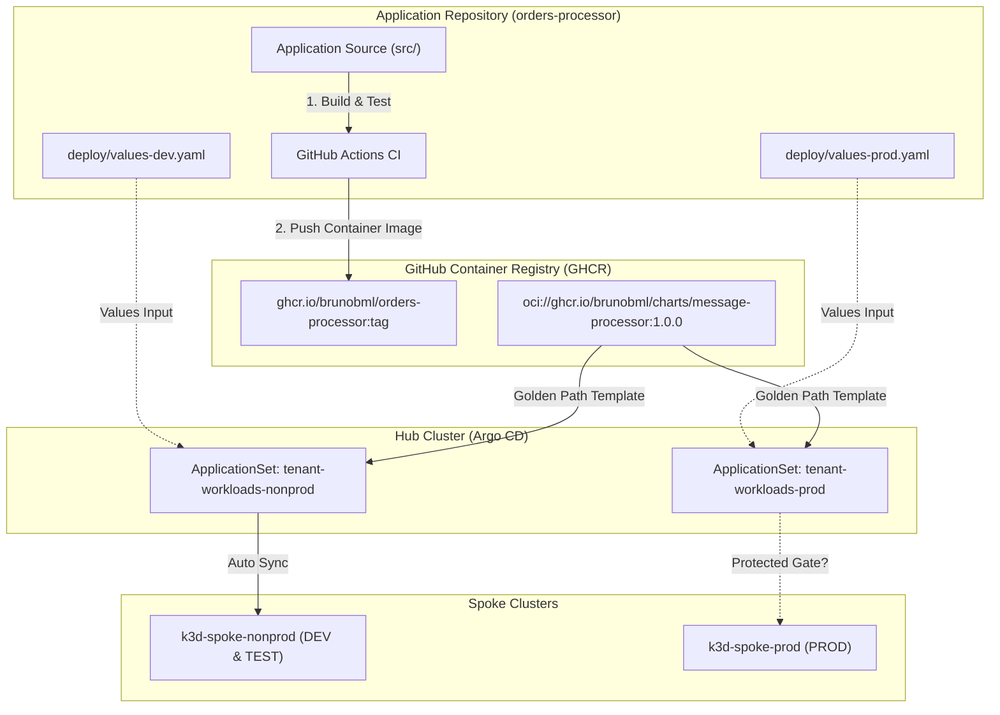
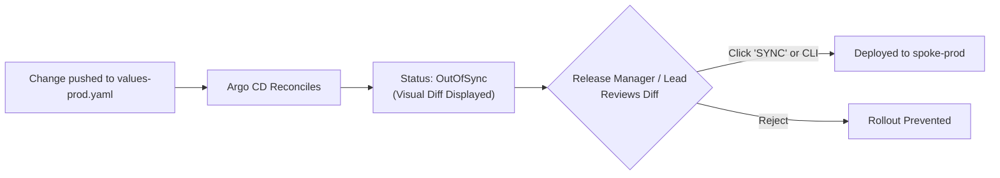
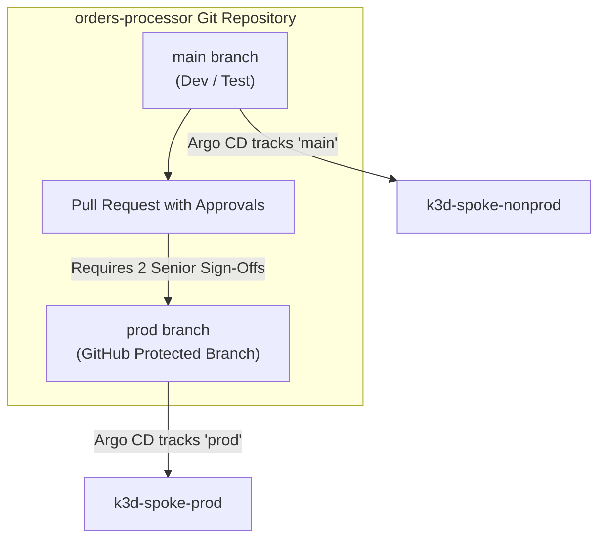
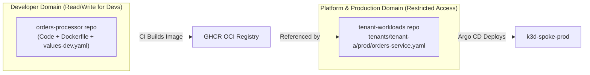
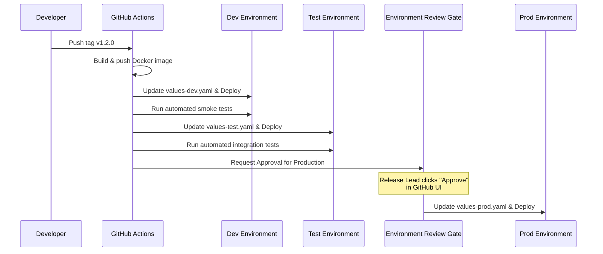

# Production Promotion Guardrails & Enterprise GitOps Patterns

> **Status: Design reference.** Design rationale and target state. Examples and names may differ from what is deployed. For the running lab, see the [README](../README.md) and the [runbooks](runbooks/).

> **Current implementation (Phase 4 C.2, 2026-10-02):** tenant environments are registered in the
> `tenant-workloads` repository (`tenants/<tenant>/apps/<app>-<env>.yaml`) and rendered by one
> ApplicationSet, `applicationsets/tenant-workloads-<tenant>.yaml` (one per tenant since 2026-10-03 Track B.2). Production promotion = a reviewed pull
> request in `tenant-workloads` that sets `valuesRevision` in `orders-prod.yaml` to a full commit SHA;
> the template refuses anything else for `prod`. Images must also be CI-signed (Kyverno, Phase 4 B.4).
> The `tenant-workloads-nonprod/prod.yaml` files named below are the pre-Phase-4 design examples.

## Executive Summary & Problem Statement

In a multi-cluster GitOps architecture, a common pitfall occurs when application repositories contain both non-production (`values-dev.yaml`) and production (`values-prod.yaml`) configurations on the same branch (e.g., `main`), coupled with Argo CD automated synchronization (`syncPolicy.automated`).

### The Risk of Uncontrolled Production Rollouts
If an application developer pushes a commit affecting `deploy/values-prod.yaml` directly to `main`:
1. **Uncontrolled Blast Radius**: Argo CD immediately reconciles the change against the production spoke cluster without human review, QA verification, or release window constraints.
2. **Privilege Escalation**: Developers effectively hold production deployment privileges without going through audit gates or change approval boards (CAB).
3. **Compliance Violations**: Violates separation-of-duties and change management requirements enforced by SOC 2 Type II, ISO 27001, and PCI-DSS.

This document outlines **four enterprise-grade patterns** to eliminate this risk and enforce production promotion guardrails.

---

## Architecture: Code CI vs GitOps CD Separation

Before evaluating guardrail patterns, understand how our three layers interact:



---

## Enterprise Guardrail Patterns

### Pattern 1: Manual Sync Gates in Argo CD (Platform-Enforced)

The most direct solution is to separate the Argo CD `syncPolicy` between non-production and production ApplicationSets.



#### Implementation:
* **Non-Production (`applicationsets/tenant-workloads-nonprod.yaml`)**:
  ```yaml
  syncPolicy:
    automated:
      prune: true
      selfHeal: true
    syncOptions:
      - CreateNamespace=true
  ```
* **Production (`applicationsets/tenant-workloads-prod.yaml`)**:
  ```yaml
  # Automated sync is completely disabled for production!
  syncPolicy:
    syncOptions:
      - CreateNamespace=true
  ```

#### Access Control with Argo CD RBAC:
In `clusters/values-argocd-hub.yaml`, configure RBAC policies to restrict who can trigger the manual sync:
```csv
p, role:developer, applications, get, tenant-workloads/*, allow
p, role:developer, applications, sync, tenant-workloads/*-dev, allow
p, role:developer, applications, sync, tenant-workloads/*-test, allow
# Developers CANNOT sync prod:
p, role:release-lead, applications, sync, tenant-workloads/*-prod, allow
```

---

### Pattern 2: Branch-per-Environment or Release Tag Promotion

Production does not track the `main` branch. Instead, Production tracks a protected `prod` branch or immutable Git release tags (e.g., `v*`).



#### Implementation in ApplicationSets:
* In `tenant-workloads-nonprod.yaml`:
  ```yaml
  sources:
    - chart: message-processor
      repoURL: ghcr.io/brunobml/charts
      targetRevision: 1.0.0
    - repoURL: https://github.com/brunobml/orders-processor.git
      targetRevision: main   # <-- Tracks active development
      ref: values
  ```
* In `tenant-workloads-prod.yaml`:
  ```yaml
  sources:
    - chart: message-processor
      repoURL: ghcr.io/brunobml/charts
      targetRevision: 1.0.0
    - repoURL: https://github.com/brunobml/orders-processor.git
      targetRevision: prod   # <-- Tracks strictly protected release branch
      ref: values
  ```

#### GitHub Branch Protection Rules:
* Branch pattern: `prod`
* Require pull request before merging (minimum 2 approvals).
* Restrict who can push to matching branches (Release Managers, Platform Engineers).
* Require status checks to pass (CI build, integration tests).

---

### Pattern 3: GitHub `CODEOWNERS` & Path-Based Access Control

If keeping a single `main` branch is preferred, use GitHub's native `CODEOWNERS` system to restrict file modifications by directory.

#### File: `orders-processor/.github/CODEOWNERS`
```text
# Default rule: application team can approve code and dev/test configurations
*                       @brunobml/backend-devs
src/                    @brunobml/backend-devs
deploy/values-dev.yaml  @brunobml/backend-devs
deploy/values-test.yaml @brunobml/qa-leads

# Production configuration strictly requires Release Management sign-off:
deploy/values-prod.yaml @brunobml/release-managers @brunobml/platform-leads
```

* **Result**: Even if a developer opens a PR modifying `deploy/values-prod.yaml`, GitHub will block merging until someone from `@brunobml/release-managers` explicitly approves the PR.

---

### Pattern 4: Strict Repository Separation (Split App vs Config)

A battle-tested enterprise pattern separating the **Application Code** repository from the **Production Workloads** repository.



* **Application Developers**: Have access only to `orders-processor`. They can freely test and deploy in Dev.
* **Platform / Operations**: Control `tenant-workloads`. Promoting to production requires an authorized promotion PR into `tenant-workloads`.
* **Zero Direct Access**: Developers cannot modify production because they literally do not have Git write access to the repository that feeds production Argo CD.

---

### Pattern 5: Automated Promotion Pipeline with Environment Gates

Rather than manual YAML edits, an automated promotion pipeline in GitHub Actions handles promotion across environments:



#### GitHub Actions Workflow Snippet (`.github/workflows/promote.yaml`):
```yaml
name: Promote to Production

on:
  workflow_dispatch:
    inputs:
      version:
        description: 'Image tag to deploy (e.g. v1.1.0)'
        required: true

jobs:
  deploy-prod:
    runs-on: ubuntu-latest
    environment: production  # Requires configured Environment Reviewers in GitHub!
    steps:
      - name: Checkout code
        uses: actions/checkout@v4

      - name: Update values-prod.yaml
        run: |
          sed -i "s|image:.*|image: ghcr.io/brunobml/orders-processor:${{ inputs.version }}|" deploy/values-prod.yaml
          git config user.name "github-actions[bot]"
          git config user.email "github-actions@github.com"
          git commit -am "chore(release): promote orders-processor to ${{ inputs.version }}"
          git push origin main
```

---

## Comparison Matrix & Trade-off Analysis

| Pattern | Operational Overhead | Developer Friction | Security & Compliance | Recommendation |
| :--- | :--- | :--- | :--- | :--- |
| **Pattern 1: Manual Argo CD Gate** | Low | Low | High (Argo CD RBAC enforced) | Simple alternative (not what the lab uses) |
| **Pattern 2: Branch/Tag Promotion** | Low | Low | Very High (Auditable in Git log) | **Best for Standard Release Cycles**; the lab's model (SHA pin) |
| **Pattern 3: GitHub CODEOWNERS** | Very Low | Low | High (GitHub PR enforced) | **Best for Single-Branch Repos** |
| **Pattern 4: Repository Separation** | Medium | Medium | Maximum (Hard organizational boundary)| **Best for Highly Regulated (PCI/HIPAA)** |
| **Pattern 5: GitHub Environment Gates** | Medium | Low | Very High (Complete automation + audit) | **Best for Fully Automated Enterprises** |

---

## Summary Recommendation for our Multi-Cluster Lab

1. **What the lab does today** (verified 2026-10-06):
   * Prod Applications sync **automatically** (`automated: {prune: true, selfHeal: true}` on `orders-prod`); there is no manual sync gate.
   * The gate is **in Git**: `tenants/tenant-a/apps/orders-prod.yaml` in `tenant-workloads` must pin `valuesRevision` to a full 40-character commit SHA (the ApplicationSet template refuses anything else for prod), so pushing to `main` in `orders-processor` does not change prod.
   * Promotion = a pull request in `tenant-workloads` that moves the SHA. The repository's ruleset requires the PR and the **required check `registration-checks`**; reviews are 0 in this single-maintainer lab, and CODEOWNERS only *requests* a review (Pattern 3 without enforcement).
   * In terms of this guide, that is Pattern 2 (an immutable revision is promoted) plus Pattern 3, not Pattern 1. Pattern 1 (manual sync) remains a valid alternative, but it is not configured.

> **Promotion is not progressive delivery.** The lab promotes an immutable *configuration* from one environment to the next through Git, and Kubernetes then does a normal rolling update. It does **not** shift traffic gradually or roll back on metrics (canary, blue/green, Argo Rollouts, Flagger). That is roadmap [Track 2](lab-progression-and-next-steps.md#track-2-progressive-delivery-with-argo-rollouts).

2. **Long Term (Target Production Architecture)**:
   * Combine **Pattern 2 (Protected `prod` branch / release tags)** with **Pattern 5 (GitHub Actions environment approval gates)**.
   * Developers never write YAML by hand for production; they promote verified release tags through an audited, approved CI/CD workflow.
