# Lab Remediation Plan: Phase 2 — Critical & High Severity Findings
## Hub-and-Spoke GitOps Control Plane (2026-09-30)

* **Plan Version:** 1.1 (Revised Version Addressing Review Blockers P2-B1–P2-B6 & Validation Run #01 Observations PV-1–PV-5)
* **Assessment Reference:** [`../assessments/2026-09-30-lab-assessment.md`](../../assessments/2026-09-30-lab-assessment.md)
* **Phase 1 Baseline:** [`2026-09-30-lab-remediation-plan-validation-03.md`](2026-09-30-lab-remediation-plan-validation-03.md) (All Low findings closed)
* **Phase 2 Validation Baseline:** [`2026-09-30-lab-remediation-plan-phase2-validation-01.md`](2026-09-30-lab-remediation-plan-phase2-validation-01.md)
* **Target Repositories:** `gitops-control-plane`, `platform-catalog`, `orders-processor`

---

## Review & Approval Sign-Off

| Field | Details |
|---|---|
| **Current Status** | 🟠 **APPROVED WITH MANDATORY CORRECTIONS (Plan v1.1)**. All in-scope steps are authorized, provided corrections MC-1 to MC-5 below are applied exactly as written |
| **Plan Version** | `v1.1` (commit [`2cfbeaf`](https://github.com/brunobml/gitops-control-plane/commit/2cfbeaf); sign-off reference synced in `6941cd6`) |
| **Reviewed By** | Claude (Opus 5.5), AI peer reviewer |
| **Review Date** | v1.0 review 2026-09-30 · Validation-01 2026-09-30 · **v1.1 re-review 2026-09-30** |
| **Authorization Decision** | 🟠 **CONDITIONAL GO.** Execution order: **Step 1 (PV-1) → Step 5 (PV-2) → Track 2 → Step 9 → Track 4.** No further review cycle is needed if MC-1 to MC-5 are followed; the validation run will check each MC explicitly. |

### Reviewer Decision on Plan v1.1

> ### 🟠 CONDITIONAL GO: authorized with mandatory corrections
>
> v1.1 addresses the **intent** of every v1.0 blocker and every validation observation, and the deferrals to Phase 3 (F-1) are well reasoned. Checking v1.1's concrete snippets against the real charts and repos found **five specification errors**. Three of them would have failed silently, which is the most dangerous kind:
>
> | Step | Authorization | Mandatory correction |
> |---|---|---|
> | **Step 1** (PV-1 digest pin) | ✅ Go | MC-4 (ordering and verification) |
> | **Step 5** (PV-2 preflight) | ✅ Go | none |
> | **Track 2** (Headlamp, L4-1) | ✅ Go, **only** with MC-1 | **MC-1**: the v1.1 key is a no-op, and the binding is owned by the Helm chart (Argo CD would recreate it) |
> | **Step 9** (NetworkPolicy) | ✅ Go, **only** with MC-2 | **MC-2**: `${schema.spec.namespace}` doesn't exist and would break the RGD on non-prod |
> | **Track 4** (prod gate) | ✅ Go, **only** with MC-3 | **MC-3**: the snippet replaces the real chart source with a nonexistent one, and `valuesRevision: 1.3.0` isn't a Git ref |
> | Track 2 acceptance | n/a | **MC-5**: least-privilege verification matrix |
>
> **Reviewer correction:** my v1.0 note on P2-B1 said `headlamp-admin` was "created by `setup-credentials.sh`". The script does create it, but the live object is **rendered by the Headlamp chart** (`clusterRoleBinding.create: true`, `clusterRoleName: cluster-admin`), carries `managed-by=Helm`, and is tracked by `addon-headlamp`. That attribution error carried into v1.1's fix; MC-1 corrects it.
>
> **Scheduling:** the TokenRequest tokens expire **2026-10-31 at about 01:00 UTC**. Track 2 issues new Headlamp tokens but does not rotate `argocd-manager`, so `make rotate-spoke-tokens` is still due before that date.

#### Mandatory Corrections (v1.1 re-review)

| ID | Applies to | Defect found in v1.1 (evidence) | Required correction | Added acceptance check |
|:---:|:---:|---|---|---|
| **MC-1** | Track 2 / Step 7 (P2-B1) | **(a)** Headlamp chart `0.45.0` has **no `serviceAccount.automount` key**. The setting is top-level `automountServiceAccountToken` (default `true`). `helm template … --set serviceAccount.automount=false` still renders `automountServiceAccountToken: true` (verified). **(b)** `ClusterRoleBinding/headlamp-admin` → `cluster-admin` comes from the chart's `clusterRoleBinding.create: true` and is tracked by `addon-headlamp` (`managed-by=Helm`, Argo CD tracking-id present). With `selfHeal: true`, a `kubectl delete` would be reverted within seconds. | In `applicationsets/addon-headlamp.yaml` `valuesObject`, set **`automountServiceAccountToken: false`** (top level) and **`clusterRoleBinding: {create: false}`**. Argo CD (`prune: true`) then removes the binding. Also remove the binding from `addons/headlamp/setup-credentials.sh` so the script can't recreate it. Do **not** `kubectl delete` it by hand. Mirror the same values in `addons/headlamp/values.yaml`. | `kubectl get clusterrolebinding headlamp-admin` → NotFound, **still NotFound 5 min after sync**. Live Headlamp pod: `automountServiceAccountToken: false` and **no `kube-api-access-*` volume**. `addon-headlamp` Synced/Healthy. |
| **MC-2** | Step 9 (P2-B4) | The NetworkPolicy template sets `namespace: ${schema.spec.namespace}`. The `QueueBackedService` schema has **no `namespace` field** (`name`, `environment`, `replicas`, `messageRetentionPeriod`, `image`), so kro rejects the RGD and the blueprint goes inactive on non-prod. Target path `platform-catalog/blueprints/kro/rgd-queue-service.yaml` doesn't exist (actual: `blueprints/queue-backed-service-rgd.yaml`). The rollback `kubectl delete netpol` doesn't work, because kro recreates its children within seconds. | **Omit `metadata.namespace`**, as every other resource in the RGD does (kro uses the instance namespace). Edit `blueprints/queue-backed-service-rgd.yaml`. Rollback: **non-prod**: `git revert` on `platform-catalog@main`; **prod**: it stays on its tag until promoted, and is rolled back by re-pointing `blueprint-revisions.env` + `make promote-blueprints`. Promote to prod only via a **new** tag (`v1.2.0`) after non-prod passes. | RGD `queuebackedservice` stays `Active` on non-prod. `orders-dev`/`orders-test` pods Ready with **0 restarts across ≥ 3 liveness periods** (probes pass under kube-router). From a worker pod: DNS ✅, `moto-cloud:5000` ✅, `1.1.1.1:443` ❌. A pod **outside** the policy in the same namespace is unaffected. Traefik → app returns HTTP 200. |
| **MC-3** | Track 4 / Step 11 (P2-B6) | **(a)** The snippet rewrites the generator and sources with values that don't exist in this repo: element keys `cluster/url/environment/valuesFile` (the template uses `app/tenant/env/port`) and a chart source `https://brunobml.github.io/platform-catalog` / `queue-service` / `0.1.0` (actual: `ghcr.io/brunobml/charts` / `queue-backed-service` / `1.0.0`, the only chart repo whitelisted in the AppProject). **(b)** `valuesRevision: 1.3.0` is not a Git ref: `orders-processor` has only the tag `v1.3.0`. **(c)** Even `v1.3.0` is wrong: at that commit `deploy/values-prod.yaml` still references `orders-processor:v1.3.0`, the **404 image** (verified). | Make a **minimal diff**: (1) add `valuesRevision: <sha>` to the **existing** List element, keeping `app/tenant/env/port`; (2) change **only** the `ref: values` source's `targetRevision` from `main` to `'{{valuesRevision}}'`; (3) leave the chart source untouched. Set `<sha>` to the **full 40-character commit SHA of the PV-1 digest-pin commit** (an immutable ref that contains the pullable digest). Don't create a new `v*` tag just for this, because CI builds an image on every `v*` tag. Keep `automated` + `selfHeal` (F-2 ✅). | `orders-prod` Application source revision == `<sha>`. Values render `…:1.3.0@sha256:3fc6e216…`. A no-op commit to `orders-processor@main` moves `orders-dev`/`orders-test` but **not** `orders-prod`. |
| **MC-4** | Step 1 (PV-1) | The purge runs **before** the repoint and uses `\|\| true`, which hides failures (`crictl rmi` on an in-use image can error). | Order: (1) commit the digest-pinned values (all 3 files) plus the `pattern=v{{version}}` CI change, and push; (2) wait for the kro rollout: with `tag@digest` the kubelet must pull from GHCR, because the imported image has no repo digest; (3) **then** `crictl rmi` the `:v1.3.0` local tag on the 4 nodes, **without** `\|\| true`, and report each result. | Every pod's `imageID` = `ghcr.io/brunobml/orders-processor@sha256:3fc6e216…`. `crictl images` on all 4 nodes shows no `orders-processor:v1.3.0`. Live footer `Git Commit: 8f5e0b6`. |
| **MC-5** | Track 2 acceptance (#1–#3) | "Compare token hashes" and a single `create ns` attempt don't prove least privilege across clusters. | Add an `auth can-i` matrix per cluster for `system:serviceaccount:headlamp-access:headlamp-viewer`. | On **each** of the 3 clusters: `get pods/log` ✅, `list queues.sqs.services.k8s.aws` ✅, `list resourcegraphdefinitions.kro.run` ✅, **`get secrets` ❌**, `create deployments` ❌, `delete namespaces` ❌. Headlamp UI loads all 3 clusters with `-insecure-ssl` removed. |

#### Non-blocking notes (v1.1 re-review)

| ID | Note |
|:---:|---|
| N-1 | `aggregate-to-view` rules also flow into the built-in `edit` and `admin` roles, so every subject bound to view/edit/admin gains read access to these CRDs. This is the intended Kubernetes pattern and acceptable here; say so in the Track 2 write-up so it isn't a surprise. |
| N-2 | Verified as **correct** in v1.1: the hub/spoke CA from `kube-root-ca.crt` (`k3s-server-ca@…`) is the issuer of each API server's serving certificate, and the SANs include `k3d-<cluster>-server-0`, so strict TLS will verify. CoreDNS on the spokes carries `k8s-app=kube-dns` and Traefik carries `app.kubernetes.io/name=traefik` in `kube-system`, so the NetworkPolicy peer selectors match. PV-2's `rev-parse HEAD == origin/main` closes the stale-`main` gap. |
| N-3 | The remaining `/home/bleite/` mention in this file is descriptive text in the PV-3 row, not a link. PV-3 is resolved. |

---

### Author's v1.1 Submission Summary

> | Scope | Status in v1.1 |
> |---|---|
> | **Track 1 Quick Wins (Steps 2–5)** | ✅ **Closed & Validated** in Run #01 (ACK 300s resync, honest smoke tests, AppProjects, preflight branch pin) |
> | **Step 1 (L3-5 Immutable CI Tags)** | ⚠️ **Remediation Action Defined (PV-1)**: Pin values to published CI digest, purge local node image cache, fix `v` tag prefix |
> | **Step 8 (L4-3 PSS Restricted)** | ✅ **Closed & Validated** in Run #01 (`managedNamespaceMetadata` enforced) |
> | **Track 2 (Headlamp / L4-1 Critical)** | 🔄 **Revised (P2-B1, P2-B2, P2-B3)**: Drop `headlamp-admin` ClusterRoleBinding, set `serviceAccount.automount: false`, remove `-insecure-ssl`, aggregate CRDs to built-in `view` |
> | **Step 9 (Workload NetworkPolicy)** | 🔄 **Revised (P2-B4)**: Embeds in Kro RGD matching `app: ${schema.spec.name}-${schema.spec.environment}-worker`, narrows moto egress to `172.21.0.0/16` |
> | **Step 10 (ACK CARM Multi-Account)** | ⏸ **Deferred to Phase 3 (P2-B5, F-1)**: Blocked on worker per-env credentials, CARM map, and queue migration runbook |
> | **Track 4 (Production Promotion Gate)** | 🔄 **Revised (P2-B6, F-2)**: Adds `valuesRevision: 1.3.0` to List generator, keeps automated self-heal, gates on revision pin |
> | **Deferred Findings (L4-2, L3-2, L2-1, L4-4)**| ⏸ **Explicitly Scheduled for Phase 3 (F-1)**: Architectural rationale documented in §1.1 |

### Implementation Conditions, Review Blockers & Validation Feedback

#### 1. Review Blockers from Plan v1.0 (Resolved in Plan v1.1)

| ID | Topic | Resolution in Plan v1.1 | Status |
|:---:|:---:|---|:---:|
| **P2-B1** | Headlamp pod hub privilege | In `addon-headlamp.yaml`, set `serviceAccount.automount: false`. In `setup-credentials.sh`, delete `ClusterRoleBinding/headlamp-admin`. The pod can no longer access the Hub API using cluster-admin. | ✅ Resolved in v1.1 Spec |
| **P2-B2** | Headlamp TLS flag | Remove `-insecure-ssl` from `extraArgs` in `addon-headlamp.yaml`. All three API server certificates include `k3d-<cluster>-server-0` in their SANs, enabling strict CA TLS verification. | ✅ Resolved in v1.1 Spec |
| **P2-B3** | Headlamp CRD RBAC & Logs | Bind built-in **`view`** ClusterRole (includes `pods/log`, excludes Secrets) and add an aggregated ClusterRole `headlamp-crd-viewer` labelled `rbac.authorization.k8s.io/aggregate-to-view: "true"` granting `get/list/watch` on `kro.run`, `internal.kro.run`, `sqs.services.k8s.aws`, `services.k8s.aws`, and `apiextensions.k8s.io/customresourcedefinitions`. | ✅ Resolved in v1.1 Spec |
| **P2-B4** | NetworkPolicy pod selector & egress | Define NetworkPolicy inside the Kro RGD (`app: ${schema.spec.name}-${schema.spec.environment}-worker`) so it ships declaratively through the blueprint gate. Narrow Moto egress from `0.0.0.0/0` to `172.21.0.0/16` (Docker bridge network). Verify on non-prod before tagging prod. | ✅ Resolved in v1.1 Spec |
| **P2-B5** | ACK CARM breaking workers | Formally deferred to Phase 3. Live Moto testing proved that queues in a non-default account return `NonExistentQueue` to workers using default credentials. CARM requires per-environment IAM credentials in the worker and a queue recreation migration. | ⏸ Deferred to Phase 3 |
| **P2-B6** | Prod gate List generator variable | Add `valuesRevision: 1.3.0` directly to the `tenant-workloads-prod.yaml` List generator element and pin `targetRevision: '{{valuesRevision}}'`. | ✅ Resolved in v1.1 Spec |

#### 2. Conditions from Plan v1.0 & Validation Run #01 Status

| ID | Step | Condition / Finding | Status |
|:---:|:---:|---|:---:|
| **C-1** | Step 1 | Immutable CI tags in `orders-processor` | ⚠️ **Reopened by PV-1**: Pipeline was fixed, but release workloads reference `v1.3.0` (404 on GHCR) and run an unregistered local build. Resolved in v1.1 Step 1 by pinning by digest. |
| **C-2** | Step 3 | Honest smoke tests checking expected set and exact queues | ✅ **Validated & Closed** in Run #01 (7 apps verified, 6 named queues verified, fails closed). |
| **C-3** | Step 2 | Lower ACK resync to 300s in `values-sqs.yaml` | ✅ **Validated & Closed** in Run #01 (Acceptance #6 live DLQ deletion recreated in 15s with 0 restarts). |
| **C-4** | Step 8 | Declarative PSS `restricted` via ApplicationSets | ✅ **Validated & Closed** in Run #01 (server dry run of non-compliant pod rejected). |

#### 3. Validation Run #01 Observations (PV-1 to PV-5)

| ID | Sev | Observation | Plan v1.1 Concrete Remediation Action |
|:---:|:---:|---|---|
| **PV-1** | **High** | Values files reference `v1.3.0` (missing on GHCR, where tag is `1.3.0`), and nodes run locally imported image from `acfb7ab` rather than release commit `8f5e0b6`. | (1) Repoint `deploy/values-*.yaml` to the exact published CI artifact by digest: `ghcr.io/brunobml/orders-processor:1.3.0@sha256:3fc6e216e13c22db612253d9a844d915899e490acd0815a72d92e5c1279bd70e`.<br>(2) Purge imported image from all 4 k3d nodes (`crictl rmi ghcr.io/brunobml/orders-processor:v1.3.0`).<br>(3) Verify kubelet pulls directly from GHCR and pods reflect commit `8f5e0b6`.<br>(4) Update `ci.yaml` to `pattern=v{{version}}` for future releases. |
| **PV-2** | Low | Promotion preflight accepts local `main` that is behind `origin/main`. | Strengthen check in `scripts/promote-blueprints.sh` to enforce `[[ $(git rev-parse HEAD) == $(git rev-parse origin/main) ]]`. |
| **PV-3** | Info | Path hygiene: `docs/remediation/` contains absolute `/home/bleite/` links. | Replaced with repo-relative and GitHub-style links in Plan v1.1 and future reports. |
| **PV-4** | Info | `projects/*.yaml` not reconciled by Argo CD. | Documented as drift caveat; formally scheduled to be brought under `root-control-plane` in Phase 3 (L2-1). |
| **PV-5** | Info | L4-7 acceptance criteria wording. | Clarified: "application controller refuses to sync unwhitelisted sources/destinations" (admission webhook is not used). |

#### 4. Non-Blocking Review Items (F-1 to F-5)

| ID | Area | Resolution in Plan v1.1 | Status |
|:---:|:---:|---|:---:|
| **F-1** | Scope | Added explicit "Deferred Findings to Phase 3" section covering L4-2, L3-2, L2-1, and L4-4. | ✅ Resolved in v1.1 |
| **F-2** | Gating | Eliminated 24/7 deny syncWindow (which blocks self-heal drift correction); rely on immutable `valuesRevision` pin as the gate. | ✅ Resolved in v1.1 |
| **F-3** | Residual Risk | Marked L4-1 as **Mitigated** (least-privilege read-only RBAC); recorded residual risk of unauthenticated 8080 exposure for Phase 3. | ✅ Resolved in v1.1 |
| **F-4** | Rollback | Updated Headlamp rollback runbook to `kubectl -n headlamp scale deploy/headlamp --replicas=0` while fixing forward. | ✅ Resolved in v1.1 |
| **F-5** | Hygiene | Cleaned up absolute target paths in plan text to repo-relative paths (`orders-processor/...`, `platform-catalog/...`). | ✅ Resolved in v1.1 |

---

## 1. Executive Summary & Scope

With the **Low-Severity scope formally closed** and verified in Phase 1 (clean TokenRequest lifecycle, no permanent SA secrets, zero plaintext annotations, RGD hardening, blueprint promotion gates, and documentation consistency), this Phase 2 remediation plan directly attacks the core architectural, security, and supply-chain vulnerabilities identified in the assessment.

### 1.1 Phase 2 Scope & Objectives:
1. **Critical Cluster Gateway Hardening (L4-1):** Eliminate Headlamp's shared `argocd-manager` cluster-admin tokens and disable hub pod automount. Create dedicated, read-only ServiceAccounts on all three clusters with aggregated CRD viewer permissions and strict CA TLS verification.
2. **Immediate Supply Chain & Drift Quick Wins (L3-5, L3-1, L3-4, L4-7, L1-4, X-1):**
   - **Step 1 (L3-5 / PV-1):** Pin workload manifests to the exact published GHCR image digest (`1.3.0@sha256:3fc6e216...`), purge locally imported images on all nodes to force kubelet pulls, and fix `ci.yaml` pattern to `pattern=v{{version}}`.
   - **Step 2 (L3-1):** ACK SQS resync period set to 300s (✅ validated live with 15s automatic DLQ recreation).
   - **Step 3 (L3-4):** Honest smoke test suite asserting all 7 Argo CD applications and 6 named SQS queues (✅ validated live, fails closed).
   - **Step 4 (L4-7, L1-4):** Lock down `default` AppProject and clean up dead repo references (✅ validated live).
   - **Step 5 (X-1 / PV-2):** Pin promotion preflight strictly to `origin/main` and ensure local HEAD is not behind (PV-2).
3. **Spoke Workload Security Baseline (L4-3):**
   - **Step 8:** Enforce Pod Security Standards `restricted` via ApplicationSet `managedNamespaceMetadata` across `orders-*` namespaces (✅ validated live; non-compliant pods rejected).
   - **Step 9:** Deploy default-deny `NetworkPolicy` through the Kro RGD (`app: ${schema.spec.name}-${schema.spec.environment}-worker`) with explicit rules for DNS, Traefik ingress, and Moto network (`172.21.0.0/16`).
4. **Tenant Workload Production Promotion Gate (L2-2):**
   - **Step 11:** Pin `orders-prod` to `valuesRevision: 1.3.0` via List generator element in `tenant-workloads-prod.yaml`, retaining automated self-heal while gating production promotion on explicit Git control-plane PRs.

### 1.2 Explicit Deferrals to Phase 3 (F-1, P2-B5)
To maintain rigorous engineering boundaries and avoid breaking running services, the following findings are explicitly scheduled for Phase 3:
* **L4-4 (ACK CARM Multi-Account Cloud Isolation):** Deferred per **P2-B5**. Live Moto testing confirmed workers using default credentials fail with `NonExistentQueue` when accessing queues in secondary accounts. Implementing CARM requires (1) giving the worker per-environment credentials (IRSA or Pod Identity equivalent), (2) creating the `ack-system/ack-role-account-map`, and (3) executing a planned queue recreation migration runbook.
* **L4-2 (Argo CD Credentials & Plain HTTP Exposure):** Deferred to Phase 3. Requires setting up external secret management / IRSA, TLS termination certificates, and OIDC authentication.
* **L3-2 (Central Moto Cloud Ephemeral State Persistence):** Deferred to Phase 3. Requires configuring persistent volume storage or automated cloud state restore scripts for Moto.
* **L2-1 / L3-8 (GitOps-Managed Platform Addons):** Deferred to Phase 3. Migrating Kro, ACK SQS, and Traefik from imperative install scripts into GitOps ApplicationSets with sync-wave ordering. Also folds in declarative management of `projects/` (PV-4).

---

## 2. Itemized Analysis: Actions, Agreements & Technical Concerns

| Finding | Sev | Action Summary | Agreement | Technical Concerns & Implementation Nuances |
| :--- | :---: | :--- | :---: | :--- |
| **L4-1** | **Critical** | Overhaul Headlamp credentials: dedicated read-only SA per cluster, drop shared `argocd-manager` tokens, disable pod automount, drop `-insecure-ssl`, enable CA TLS verification. | **Agree (Mitigated)** | **Resolved Blockers (P2-B1, P2-B2, P2-B3):**<br>• Pod token automount disabled in `addon-headlamp.yaml`; `ClusterRoleBinding/headlamp-admin` deleted.<br>• `-insecure-ssl` dropped from extraArgs.<br>• Aggregated ClusterRole `headlamp-crd-viewer` binds to built-in `view` ClusterRole (providing `pods/log`) with CRD read permissions for `kro.run`, `internal.kro.run`, `sqs.services.k8s.aws`, `services.k8s.aws`, and CRDs.<br>• **Residual Risk (F-3):** Headlamp remains exposed on `0.0.0.0:8080` without authentication (dev mode). Mark L4-1 as **Mitigated** (not Closed); host binding/OIDC scheduled for Phase 3. |
| **L3-5** | **High** | Fix mutable CI release tags and resolve artifact provenance gap (PV-1). Pin values files by digest to the published CI artifact; purge unregistered local node images; update `ci.yaml` pattern to `v{{version}}`. | **Agree** | **Resolved Defect (PV-1):** The CI pipeline was updated in Run #01, but values referenced `v1.3.0` (404 on GHCR), and nodes ran an imported local build from commit `acfb7ab`. Repointing values to `ghcr.io/brunobml/orders-processor:1.3.0@sha256:3fc6e216...` and purging node caches ensures true supply-chain provenance. |
| **L3-1** | **High** | Lower ACK resync period from 36,000s (10h) to 300s (5 min) in `values-sqs.yaml` (`reconcile.defaultResyncPeriod`). | **Closed** | ✅ Validated in Run #01. Live DLQ deletion was detected and recreated within 15 seconds with zero controller restarts. |
| **L4-3** | **High** | Enforce Pod Security Standards `restricted` via ApplicationSets; deploy default-deny `NetworkPolicy` via Kro RGD on spokes. | **Agree** | **Resolved Blocker (P2-B4):** Workload PSS labels are closed and enforced. The NetworkPolicy will be embedded directly in the Kro RGD (`app: ${schema.spec.name}-${schema.spec.environment}-worker`), narrowing Moto egress to `172.21.0.0/16:5000` and Traefik ingress to port 8080. Verified on nonprod before promoting to prod. |
| **L4-4** | **High** | Multi-account isolation in Moto via ACK CARM. | **Deferred** | **Deferred to Phase 3 (P2-B5):** Worker call style cannot read queues in non-default accounts without IAM roles. Requires app credential modernization, CARM map, and queue migration runbook. |
| **L2-2** | **High** | Implement production promotion gate for tenant workloads (`orders-prod`). | **Agree** | **Resolved Blocker (P2-B6, F-2):** Add `valuesRevision: 1.3.0` to the ApplicationSet List generator in `tenant-workloads-prod.yaml`. Decouple prod from `main`. Keep `automated: {selfHeal: true}` so drift is corrected, using the pinned revision as the promotion gate. |
| **L3-4** | Medium | Upgrade smoke test suite (`smoke-test-hub-spoke.sh`) to assert Argo CD health and Moto cloud queues; fix `grep -c` bug. | **Closed** | ✅ Validated in Run #01. Checks all 7 apps, 3 active CRs, and 6 named queues. Proven to fail closed on missing queues. |
| **L4-7** | Medium | Lock down the `default` AppProject (`sourceRepos: []`, `destinations: []`, `clusterResourceWhitelist: []`). | **Closed** | ✅ Validated in Run #01. `projects/default.yaml` applied; controller rejects unwhitelisted syncs. |
| **L1-4** | Medium | Clean up `tenant-workloads` repository references in `projects/tenant-workloads.yaml`. | **Closed** | ✅ Validated in Run #01. Dead repo reference eliminated from AppProject. |
| **X-1** | Info | Pin promotion preflight in `scripts/promote-blueprints.sh` to require `origin/main` (PV-2). | **Closed** | ✅ Validated in Run #01. Reinforced with PV-2 exact revision equality check. |
| **L2-1 / L3-8** | **High** | GitOps-managed platform layer (Addons ApplicationSets for kro, ACK, Traefik). | **Deferred** | Formally scheduled for Phase 3. |

---

## 3. Phased Implementation Roadmap

```mermaid
flowchart TD
    subgraph Track1["Track 1: Quick Wins & Provenance Hardening"]
        T1_1["Step 1 (L3-5 / PV-1): Digest Pin & Node Cache Purge"]
        T1_2["Step 2 (L3-1): ACK Resync 300s - CLOSED"]
        T1_3["Step 3 (L3-4): Honest Smoke Tests - CLOSED"]
        T1_4["Step 4 (L4-7 / L1-4): AppProjects Hardening - CLOSED"]
        T1_5["Step 5 (X-1 / PV-2): Preflight Pin to origin/main"]
    end

    subgraph Track2["Track 2: Headlamp Gateway Overhaul (L4-1)"]
        T2_1["Set automount: false on SA headlamp & drop headlamp-admin binding (P2-B1)"]
        T2_2["Create headlamp-viewer SA & Aggregated CRD ClusterRole (P2-B3)"]
        T2_3["Assemble TLS-Verified Kubeconfig with Spoke CAs & drop -insecure-ssl (P2-B2)"]
        T2_4["Deploy Scoped Secret & Restart Headlamp"]
    end

    subgraph Track3["Track 3: Spoke Workload Security Baseline (L4-3)"]
        T3_1["Step 8 (L4-3): Enforce PSS Restricted - CLOSED"]
        T3_2["Step 9 (L4-3): Embed NetworkPolicy in Kro RGD (P2-B4)"]
        T3_3["Step 9: Validate on Nonprod (Egress to 172.21.0.0/16 & DNS)"]
    end

    subgraph Track4["Track 4: Production Promotion Gate (L2-2)"]
        T4_1["Add valuesRevision: 1.3.0 to List Generator in tenant-workloads-prod (P2-B6)"]
        T4_2["Pin targetRevision to valuesRevision & retain self-heal (F-2)"]
    end

    subgraph Phase3["Phase 3 Roadmap (Deferred Scope)"]
        P3_1["L4-4: ACK CARM Multi-Account with Worker IAM"]
        P3_2["L2-1: GitOps Platform Addons & projects/ Management (PV-4)"]
        P3_3["L4-2: Argo CD Authentication & TLS Exposure"]
        P3_4["L3-2: Central Moto Ephemeral State Persistence"]
    end

    Track1 --> Track2 --> Track3 --> Track4 --> Phase3
```



---

## 4. Detailed Technical Action Plan

### Track 1: Immediate Supply Chain & Provenance Hardening

#### Step 1: Published Artifact Digest Pinning & CI Tag Hygiene (L3-5 / PV-1)
* **Target Files:**
  - `orders-processor/deploy/values-dev.yaml`
  - `orders-processor/deploy/values-test.yaml`
  - `orders-processor/deploy/values-prod.yaml`
  - `orders-processor/.github/workflows/ci.yaml`
* **Changes & Execution:**
  1. **Pin Workload Values by Digest:** Update all three values files to pin directly to the immutable published CI release artifact by digest:
     ```yaml
     image: ghcr.io/brunobml/orders-processor:1.3.0@sha256:3fc6e216e13c22db612253d9a844d915899e490acd0815a72d92e5c1279bd70e
     ```
  2. **Purge Unregistered Node Image Caches:** Remove the untracked locally built image (`acfb7ab`) from all k3d nodes across both spokes:
     ```bash
     for node in k3d-spoke-nonprod-server-0 k3d-spoke-nonprod-agent-0 k3d-spoke-prod-server-0 k3d-spoke-prod-agent-0; do
       docker exec "$node" crictl rmi ghcr.io/brunobml/orders-processor:v1.3.0 2>/dev/null || true
     done
     ```
  3. **Verify Pure Kubelet Registry Pull:** Restart the deployments across `orders-dev`, `orders-test`, and `orders-prod`. Confirm that pods pull directly from GHCR, report the exact image digest `sha256:3fc6e216...`, and display `Git Commit: 8f5e0b6` in the HTTP response.
  4. **Future Release Tag Matching:** In `orders-processor/.github/workflows/ci.yaml`, update the metadata tag rule to `type=semver,pattern=v{{version}}` so future releases preserve the leading `v` matching Git tags.
  5. **Operational Rule of Engagement:** Never use `k3d image import` with public registry prefixes (`ghcr.io/`) for releases; reserve image imports strictly for isolated local debugging with distinct tags (`:local-dev`).

#### Step 2: Lower ACK SQS Resync Period (L3-1) — ✅ CLOSED & VALIDATED
* **Status:** Implemented in Run #01 (`platform-catalog@c0f8779`). Upgraded `ack-sqs-controller` Helm release on both spokes with `reconcile: {defaultResyncPeriod: 300}`.
* **Validation Outcome:** Validated live in Run #01 (Acceptance #6). Deleting `orders-dev-dlq` in Moto resulted in automatic recreation by ACK within 15 seconds with 0 controller restarts.

#### Step 3: Honest Multi-Cluster Smoke Test Suite (L3-4) — ✅ CLOSED & VALIDATED
* **Status:** Implemented in Run #01 (`scripts/smoke-test-hub-spoke.sh`).
* **Validation Outcome:** Validated live in Run #01. Asserts all 7 Argo CD applications (`Synced`/`Healthy`), verifies all 3 `QueueBackedService` CRs are `ACTIVE`, and verifies all 6 SQS queues and DLQs by exact name in Moto. Proven to fail closed on missing queues.

#### Step 4: Lock Down `default` AppProject & Deprecate `tenant-workloads` (L4-7, L1-4) — ✅ CLOSED & VALIDATED
* **Status:** Implemented in Run #01 (`projects/default.yaml` and `projects/tenant-workloads.yaml`).
* **Validation Outcome:** Validated live in Run #01. `tenant-workloads.git` removed; `default` AppProject locked down with empty sources and destinations.

#### Step 5: Pin Blueprint Promotion Preflight to `origin/main` (X-1 / PV-2)
* **Target File:** `scripts/promote-blueprints.sh`
* **Changes (PV-2 Refinement):**
  - In addition to checking that the current branch is `main` and fetching `origin main`, ensure local `main` is strictly identical to `origin/main` so outdated local branches cannot promote stale revisions:
    ```bash
    current_branch=$(git -C "$REPO_DIR" branch --show-current)
    if [[ "$current_branch" != "main" ]]; then
      echo "❌ Error: Promotion must be run from 'main' branch (current: '${current_branch}')." >&2
      exit 1
    fi
    git -C "$REPO_DIR" fetch -q origin main
    if [[ $(git -C "$REPO_DIR" rev-parse HEAD) != $(git -C "$REPO_DIR" rev-parse origin/main) ]]; then
      echo "❌ Error: Local 'main' is not in sync with origin/main. Pull or push first." >&2
      exit 1
    fi
    ```

---

### Track 2: Headlamp Credential & Least-Privilege Overhaul (L4-1 Mitigated)

#### Step 6: Create Dedicated Read-Only ServiceAccounts & Aggregated CRD Viewer Role (P2-B3)
* **Clusters:** `k3d-hub-cluster`, `k3d-spoke-nonprod`, and `k3d-spoke-prod`.
* **Actions:**
  1. Create namespace `headlamp-access` (or use `kube-system`).
  2. Create ServiceAccount: `headlamp-viewer` in namespace `headlamp-access`.
  3. Deploy aggregated ClusterRole `headlamp-crd-viewer` on all three clusters:
     ```yaml
     apiVersion: rbac.authorization.k8s.io/v1
     kind: ClusterRole
     metadata:
       name: headlamp-crd-viewer
       labels:
         rbac.authorization.k8s.io/aggregate-to-view: "true"
     rules:
       - apiGroups: ["kro.run", "internal.kro.run"]
         resources: ["*"]
         verbs: ["get", "list", "watch"]
       - apiGroups: ["sqs.services.k8s.aws", "services.k8s.aws"]
         resources: ["*"]
         verbs: ["get", "list", "watch"]
       - apiGroups: ["apiextensions.k8s.io"]
         resources: ["customresourcedefinitions"]
         verbs: ["get", "list", "watch"]
     ```
  4. Bind `headlamp-viewer` ServiceAccount to the built-in **`view`** ClusterRole (which automatically inherits `headlamp-crd-viewer` via aggregation, includes `pods/log`, and excludes Secrets) via ClusterRoleBinding `headlamp-viewer-binding`.

#### Step 7: Issue Dedicated Headlamp Tokens, Automount Lockdown & Strict CA TLS Verification (P2-B1, P2-B2, F-3, F-4)
* **Target Files:**
  - `applicationsets/addon-headlamp.yaml`
  - `addons/headlamp/setup-credentials.sh`
* **Actions:**
  1. **Disable Hub Pod Automount (P2-B1):** In `applicationsets/addon-headlamp.yaml`, configure:
     ```yaml
     serviceAccount:
       create: true
       name: headlamp
       automount: false
     ```
     (or pod spec `automountServiceAccountToken: false`).
  2. **Delete Legacy Admin Binding (P2-B1):** Delete `ClusterRoleBinding/headlamp-admin` on `k3d-hub-cluster` and remove its creation from `addons/headlamp/setup-credentials.sh`.
  3. **Enforce Strict TLS Verification (P2-B2):** In `applicationsets/addon-headlamp.yaml`, remove `-insecure-ssl` from `extraArgs`. All three API servers present certificates containing `k3d-<cluster>-server-0` in their SANs.
  4. **Generate Multi-Cluster Kubeconfig:**
     - Issue 30-day TokenRequest tokens for `headlamp-viewer` on Hub, Non-Prod Spoke, and Prod Spoke:
       ```bash
       HUB_TOKEN=$(kubectl --context k3d-hub-cluster -n headlamp-access create token headlamp-viewer --duration=720h)
       NONPROD_TOKEN=$(kubectl --context k3d-spoke-nonprod -n headlamp-access create token headlamp-viewer --duration=720h)
       PROD_TOKEN=$(kubectl --context k3d-spoke-prod -n headlamp-access create token headlamp-viewer --duration=720h)
       ```
     - Extract cluster CA certificates directly from `kube-root-ca.crt` ConfigMaps.
     - Generate multi-cluster kubeconfig with `certificate-authority-data: <caData>` and `insecure-skip-tls-verify: false`.
  5. **Apply Secret & Restart:** Server-side apply `headlamp-kubeconfig` Secret (with stripped plaintext annotation). Restart Headlamp deployment.
  6. **Residual Risk (F-3):** Headlamp runs with read-only RBAC, but remains unauthenticated on port 8080 (`-dev` mode). L4-1 is formally marked **Mitigated**. Host binding or OIDC proxy is scheduled for Phase 3.

---

### Track 3: Spoke Workload Security Baseline (L4-3)

#### Step 8: Enforce Pod Security Standards `restricted` (L4-3) — ✅ CLOSED & VALIDATED
* **Status:** Implemented in Run #01 via `managedNamespaceMetadata` in `applicationsets/tenant-workloads-nonprod.yaml` and `applicationsets/tenant-workloads-prod.yaml`.
* **Validation Outcome:** Validated live in Run #01 (Validation #8). Namespaces `orders-dev`, `orders-test`, and `orders-prod` enforce `restricted:latest`. Tested via server-side dry run of a privileged container in `orders-prod`, which was strictly denied by admission (`Forbidden: violates PodSecurity "restricted:latest"`). Existing workloads run cleanly with 0 restarts.

#### Step 9: Deploy Workload NetworkPolicies via Kro RGD on Spokes (L4-3 / P2-B4)
* **Target File:** `platform-catalog/blueprints/kro/rgd-queue-service.yaml`
* **Changes & Design (P2-B4):**
  1. **Embed NetworkPolicy in ResourceGroupDefinition:** Rather than managing standalone or unversioned NetworkPolicies, define the `NetworkPolicy` directly inside the Kro RGD resources. This ensures that every `QueueBackedService` instance automatically gets its corresponding NetworkPolicy stamped out, governed by the blueprint promotion lifecycle (`platform-catalog` release tags).
  2. **Pod Selector Matching:** The Kro worker deployment uses labels `app: ${schema.spec.name}-${schema.spec.environment}-worker`. The NetworkPolicy must match this exact selector:
     ```yaml
     apiVersion: networking.k8s.io/v1
     kind: NetworkPolicy
     metadata:
       name: ${schema.spec.name}-${schema.spec.environment}-worker-netpol
       namespace: ${schema.spec.namespace}
     spec:
       podSelector:
         matchLabels:
           app: ${schema.spec.name}-${schema.spec.environment}-worker
       policyTypes:
         - Ingress
         - Egress
       ingress:
         # Allow HTTP traffic on port 8080 from Traefik ingress controller in kube-system & local namespace pods
         - from:
             - namespaceSelector:
                 matchLabels:
                   kubernetes.io/metadata.name: kube-system
               podSelector:
                 matchLabels:
                   app.kubernetes.io/name: traefik
             - podSelector: {}
           ports:
             - protocol: TCP
               port: 8080
       egress:
         # Allow DNS resolution to CoreDNS in kube-system
         - to:
             - namespaceSelector: {}
               podSelector:
                 matchLabels:
                   k8s-app: kube-dns
           ports:
             - protocol: UDP
               port: 53
             - protocol: TCP
               port: 53
         # Allow egress to Mock AWS Cloud (moto-cloud:5000) strictly within the Docker bridge network
         - to:
             - ipBlock:
                 cidr: 172.21.0.0/16
           ports:
             - protocol: TCP
               port: 5000
     ```
  3. **Verification & Promotion Lifecycle:** Test first on `k3d-spoke-nonprod` (`orders-dev`, `orders-test`) tracking `platform-catalog@main`. Verify DNS resolution, Moto queue access, and Traefik ingress. Confirm that arbitrary egress (e.g., to public internet or unauthorized ports) is blocked. Only promote to `k3d-spoke-prod` after successful non-prod validation.

#### Step 10: Multi-Account Isolation via ACK CARM (L4-4) — ⏸ FORMALLY DEFERRED TO PHASE 3 (P2-B5, F-1)
* **Status:** Deferred per review blocker **P2-B5** and item **F-1**.
* **Technical Rationale:** Live testing in Moto confirmed that worker applications using default AWS SDK configurations fail with `NonExistentQueue` when accessing queues in secondary accounts (`111111111111` or `222222222222`). Enabling CARM safely requires:
  1. Granting worker pods per-environment IAM credentials (or IRSA equivalent).
  2. Deploying the `ack-system/ack-role-account-map` ConfigMap.
  3. Formulating and testing a queue recreation migration runbook without disrupting running pipelines.
  This work will be executed systematically in Phase 3.

---

### Track 4: Production Application Promotion Gate (L2-2)

#### Step 11: Implement Gated Promotion for `orders-prod` (P2-B6, F-2)
* **Target File:** `applicationsets/tenant-workloads-prod.yaml`
* **Dependency:** Requires Step 1 (PV-1 digest pin and node cache purge) to be completed so `orders-prod` references a verified, pullable release.
* **Changes (P2-B6, F-2):**
  1. **Parameterize `valuesRevision` in List Generator:**
     Update the List generator element in `applicationsets/tenant-workloads-prod.yaml` to declare an explicit `valuesRevision`:
     ```yaml
     apiVersion: argoproj.io/v1alpha1
     kind: ApplicationSet
     metadata:
       name: tenant-workloads-prod
       namespace: argocd
     spec:
       generators:
         - list:
             elements:
               - cluster: spoke-prod
                 url: https://k3d-spoke-prod-server-0:6443
                 environment: prod
                 valuesFile: values-prod.yaml
                 valuesRevision: 1.3.0
     ```
  2. **Pin Template TargetRevision:**
     In `spec.template.spec.sources`:
     ```yaml
     sources:
       - repoURL: https://github.com/brunobml/orders-processor.git
         targetRevision: '{{valuesRevision}}'
         ref: values
       - repoURL: https://brunobml.github.io/platform-catalog
         chart: queue-service
         targetRevision: 0.1.0
         helm:
           valueFiles:
             - $values/deploy/{{valuesFile}}
     ```
  3. **Preserve Automated Drift Correction (F-2):**
     Keep `syncPolicy.automated: {prune: true, selfHeal: true}` enabled. Do **not** apply a 24/7 deny `syncWindow`, so that accidental cluster drift in production continues to be self-healed back to the pinned release state.
  4. **Audited Promotion Process:**
     Production promotions will no longer occur automatically on `orders-processor@main` commits. Instead, promotions to production require an audited pull request against `gitops-control-plane` updating `valuesRevision` to the new stable tag or digest.

---

## 5. Verification Matrix & Acceptance Criteria

| # | Check | Target / Area | Command / Test | Expected Acceptance Result |
|---|---|---|---|---|
| **1** | Headlamp Token Decoupling | L4-1 / Hub & Spokes | Compare token hashes between `cluster-spoke-*` and `headlamp-kubeconfig` | Token hashes are completely disjoint; Headlamp uses dedicated `headlamp-viewer` SAs. |
| **2** | Headlamp Least Privilege | L4-1 / Hub & Spokes | Attempt to create/delete a resource using Headlamp SA token (`kubectl --token=... create ns test`) | Returns `Forbidden` (403); read operations (`get`, `list`, `watch`) succeed for core pods/services/logs and aggregated CRDs. |
| **3** | Headlamp TLS & Automount | L4-1 / Hub | Inspect `headlamp` Deployment pod spec and `headlamp-kubeconfig` | `automountServiceAccountToken: false` (or SA automount false); `insecure-skip-tls-verify` is `false`; valid spoke `certificate-authority-data` present. |
| **4** | CI Immutability & Provenance | L3-5 / PV-1 | Inspect `orders-processor/deploy/values-*.yaml` and live pod `imageID` | Values pinned to published GHCR digest `1.3.0@sha256:3fc6e216...`; pods pull from GHCR; runtime footer displays `Git Commit: 8f5e0b6`. |
| **5** | ACK Cloud Drift Window | L3-1 | Delete `orders-dev-dlq` in Moto CLI; wait for resync | ✅ **Validated in Run #01**: ACK detects missing queue and recreates it automatically within 15s without controller restart. |
| **6** | Honest Smoke Tests | L3-4 | Run `bash scripts/smoke-test-hub-spoke.sh` | ✅ **Validated in Run #01**: All 7 Argo CD apps asserted `Synced/Healthy`; 3 CRs `ACTIVE`; all 6 Moto queues verified by exact name; fails closed. |
| **7** | AppProject Hardening | L4-7 / L1-4 | Inspect `default` and `tenant-workloads` AppProjects | ✅ **Validated in Run #01**: `default` has empty sources/destinations; `tenant-workloads` does not reference dead repo. |
| **8** | Promotion Preflight | X-1 / PV-2 | Run `scripts/promote-blueprints.sh` from feature branch or stale local main | Rejects promotion if branch != `main` or if local `HEAD != origin/main`. |
| **9** | PSS Restricted Enforcement | L4-3 | Attempt dry-run privileged pod creation in `orders-prod` | ✅ **Validated in Run #01**: Admission rejects with `Forbidden: violates PodSecurity "restricted:latest"`. |
| **10**| NetworkPolicy Enforcement | L4-3 / P2-B4 | Test worker pod network connectivity in `orders-dev` | DNS resolution (53) and Moto (`172.21.0.0/16:5000`) succeed; Traefik ingress (8080) permitted; unauthorized egress blocked. |
| **11**| Prod Workload Gate | L2-2 / P2-B6 | Push a commit to `orders-processor@main` | `orders-dev` and `orders-test` update automatically; `orders-prod` remains pinned to `valuesRevision: 1.3.0`; self-heal remains active. |

---

## 6. Rollback & Safety Runbook

1. **Headlamp Connectivity Issue (F-4):**
   - If Headlamp loses API connectivity after credential overhaul, **never restore cluster-admin** or re-bind `argocd-manager` tokens.
   - Scale Headlamp to zero while troubleshooting CA certificates and token expiration:
     ```bash
     kubectl --context k3d-hub-cluster -n headlamp scale deploy/headlamp --replicas=0
     ```
   - Fix forward by verifying CA data matching `kube-root-ca.crt` and valid TokenRequest tokens.
2. **NetworkPolicy Traffic Block (P2-B4):**
   - If NetworkPolicy blocks legitimate application or queue traffic, temporarily delete the generated NetworkPolicy or revert the Kro RGD commit:
     ```bash
     kubectl --context k3d-spoke-nonprod -n orders-dev delete netpol orders-dev-worker-netpol
     ```
3. **PV-1 Image Pull Failure:**
   - If GHCR image pull fails (e.g. rate limits or network issues), verify the digest against the published GitHub Container Registry manifest:
     `ghcr.io/brunobml/orders-processor:1.3.0@sha256:3fc6e216e13c22db612253d9a844d915899e490acd0815a72d92e5c1279bd70e`.
   - Never run unversioned `k3d image import` under a registry name; use unique local tags (`:local-test`) if local testing is necessary.
4. **Production Promotion Gate Rollback:**
   - If a newly promoted `valuesRevision` causes regression in `orders-prod`, revert `valuesRevision` in `applicationsets/tenant-workloads-prod.yaml` back to `1.3.0` via standard Git commit and push.
