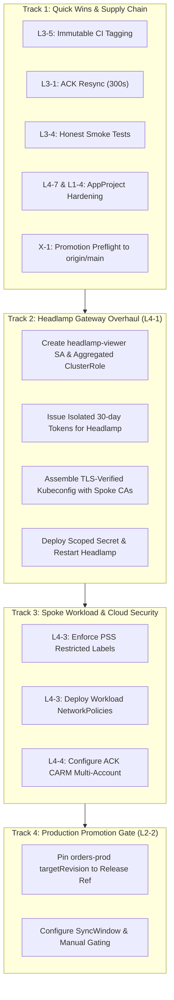

# Lab Remediation Plan: Phase 2 — Critical & High Severity Findings
## Hub-and-Spoke GitOps Control Plane (2026-09-30)

* **Plan Version:** 1.0 (Phase 2: Critical, High, and High-Impact Governance Remediation)
* **Assessment Reference:** [`../assessments/2026-09-30-lab-assessment.md`](../assessments/2026-09-30-lab-assessment.md)
* **Phase 1 Baseline:** [`2026-09-30-lab-remediation-plan-validation-03.md`](2026-09-30-lab-remediation-plan-validation-03.md) (All Low findings & review blockers closed)
* **Target Repositories:** `gitops-control-plane`, `platform-catalog`, `orders-processor`

---

## Review & Approval Sign-Off

| Field | Details |
|---|---|
| **Current Status** | 🟠 **CONDITIONAL: PARTIALLY AUTHORIZED** (Track 1 and Step 8 only; revise Tracks 2–4 and resubmit) |
| **Plan Version** | `v1.0`. Plan body at commit [`18d61b1`](https://github.com/brunobml/gitops-control-plane/commit/18d61b1); reviewed at [`5939bc5`](https://github.com/brunobml/gitops-control-plane/commit/5939bc5), which only adds this header |
| **Reviewed By** | Claude (Opus 5.5), AI peer reviewer for the assessment and the Phase 1 validations |
| **Review Date** | 2026-09-30 |
| **Authorization Decision** | 🟠 **CONDITIONAL** (Options: ✅ **GREEN LIGHT** · 🟠 **CONDITIONAL** · 🔴 **REVISE & RESUBMIT**) |

### Review Decision & Authorization Banner

> ### 🟠 CONDITIONAL: PARTIALLY AUTHORIZED
>
> | Scope | Decision |
> |---|---|
> | **Track 1** (Steps 1–5: CI tags, ACK resync, smoke tests, AppProjects, X-1) | ✅ **Authorized now**, subject to conditions C-1 to C-3 |
> | **Step 8** (PSS `restricted` labels) | ✅ **Authorized**, subject to C-4 |
> | **Track 2** (Steps 6–7: Headlamp / L4-1) | ⛔ **Revise.** Blockers P2-B1, P2-B2 and P2-B3 would leave Headlamp cluster-admin on the hub, leave TLS unverified, and hide ACK Queues |
> | **Step 9** (NetworkPolicy) | ⛔ **Revise.** Blocker P2-B4: the policy selects no pods |
> | **Step 10** (ACK CARM multi-account) | ⛔ **Defer.** Blocker P2-B5: it would break every worker (verified against moto) |
> | **Track 4** (Step 11: prod workload gate) | ⛔ **Revise.** Blocker P2-B6: the template variable cannot resolve in a List generator |
>
> All blockers were found by checking the plan's assumptions against the live clusters, not by reading alone (evidence below). Once v1.1 addresses them, only the revised steps need re-review.
>
> **Scheduling note:** the TokenRequest tokens from Phase 1 expire on **2026-10-31 at about 01:00 UTC**. If Track 2 hasn't shipped by then, run `make rotate-spoke-tokens`.

### Implementation Conditions & Review Feedback

**Blocking: must be fixed in plan v1.1 before the affected step runs**

| ID | Type | Condition / Observation | Status |
|:---:|:---:|---|:---:|
| **P2-B1** | ⛔ Blocker (Step 6–7) | **Headlamp's own pod stays cluster-admin on the hub.** The Deployment runs as SA `headlamp` with `automountServiceAccountToken=true`, and ClusterRoleBinding `headlamp-admin` → `cluster-admin` still exists (created by `setup-credentials.sh`). Moving the *kubeconfig* to `headlamp-viewer` doesn't change the pod's mounted token. A compromised Headlamp still owns the hub, including every Argo CD cluster Secret. **Fix:** delete `ClusterRoleBinding/headlamp-admin`, remove it from `setup-credentials.sh`, and set `serviceAccount.automount: false` (or `automountServiceAccountToken: false`) in `addon-headlamp.yaml`. | ⏳ Open |
| **P2-B2** | ⛔ Blocker (Step 7) | **The `-insecure-ssl` flag defeats the TLS verification Step 7 adds.** `applicationsets/addon-headlamp.yaml` passes `-insecure-ssl` (live args: `-kubeconfig=… -insecure-ssl -dev`), so Headlamp skips certificate checks whatever the kubeconfig says. **Fix:** remove `-insecure-ssl` from `extraArgs` in the same change. The CA-verified kubeconfig will work: all three API server certificates list `k3d-<cluster>-server-0` in their SANs (verified). | ⏳ Open |
| **P2-B3** | ⛔ Blocker (Step 6) | **The `headlamp-viewer-role` grants the wrong API group for ACK and omits logs.** ACK Queues live in `sqs.services.k8s.aws`; `services.k8s.aws` holds only `fieldexports` and `iamroleselectors` (verified). Headlamp would get Forbidden on exactly the resources the plan's CRD-visibility concern is about. The hand-written list also omits `pods/log`, `batch`, `policy` (the PDB), `discovery.k8s.io` and `internal.kro.run`. **Fix:** do what the plan's own concern describes. Bind the built-in **`view`** ClusterRole (it includes `pods/log` and excludes Secrets) and add a small ClusterRole labelled `rbac.authorization.k8s.io/aggregate-to-view: "true"` granting `get/list/watch` on `kro.run`, `internal.kro.run`, `sqs.services.k8s.aws`, `services.k8s.aws` and `apiextensions.k8s.io/customresourcedefinitions`. | ⏳ Open |
| **P2-B4** | ⛔ Blocker (Step 9) | **The NetworkPolicy selects no pods, so it would pass verification while enforcing nothing.** It uses `podSelector: app.kubernetes.io/name: orders`, but the worker pods carry only `app: orders-<env>-worker`, `environment`, and `pod-template-hash` (verified). The k3s policy controller **is** enforcing (kube-router chains present on both spokes), so a corrected selector would take effect immediately. **Fix:** (1) add the policy as a resource in the **RGD** (`app: ${schema.spec.name}-${schema.spec.environment}-worker`) so it ships through the existing blueprint gate (non-prod on `main`, prod on a new tag, rollback by re-pointing the tag) rather than as an untracked `kubectl apply`; (2) narrow the moto egress from `0.0.0.0/0` to the `k3d-cloud-net` subnet `172.21.0.0/16` (moto is `172.21.0.9`); (3) prove on non-prod that liveness and readiness probes still pass under kube-router *before* tagging for prod; (4) change verification #11 to show that a blocked destination fails **and** that a pod outside the policy is unaffected. | ⏳ Open |
| **P2-B5** | ⛔ Blocker (Step 10) | **CARM as planned would break every worker.** Verified against the live moto: a queue created under an assumed role in a non-default account is **not visible** to default credentials, and the worker's raw call style (`Authorization: … Credential=mock/…`, `orders-processor/src/main.py:22`) returns `NonExistentQueue` against that account's URL. moto separates accounts by credential, not by URL path, so the plan's conclusion that "partitioning is transparent" does not hold. In addition: (a) the CARM map `ack-system/ack-role-account-map` (account → role ARN) does not exist and is not in the plan; (b) changing an existing namespace's owner account makes ACK create **new** queues in the new account and orphans the old ones (a migration, not a toggle); the rollback ("remove annotation, restart") triggers a second migration. **Fix:** move L4-4 to a later phase that first (1) gives the worker per-environment credentials (the local equivalent of IRSA or Pod Identity), which needs an app change shipped through the L3-5 immutable-tag pipeline; (2) adds the CARM map; (3) writes a migration runbook (recreate instances, then delete orphaned queues in `123456789012`). | ⏳ Open |
| **P2-B6** | ⛔ Blocker (Step 11) | **`{{metadata.annotations.workload-revision}}` cannot resolve.** `tenant-workloads-prod.yaml` uses a **List** generator (verified); `metadata.annotations` exists only with the Cluster generator, so the expression renders empty or literally. Also, `orders-processor` has **no Git tags** (verified), so "pin to `v1.2.0`" has nothing to pin to. **Fix:** add an element field such as `valuesRevision: v1.3.0` to the List element (promotion then becomes a reviewed control-plane PR, consistent with `blueprint-revisions.env`). Create the first `orders-processor` release tag through the new L3-5 pipeline **before** switching. | ⏳ Open |

**Conditions for authorized steps (apply during execution; no re-review needed)**

| ID | Type | Condition / Observation | Status |
|:---:|:---:|---|:---:|
| **C-1** | Condition (Step 1) | `type=ref,event=branch` still publishes a **mutable** `main` tag. That's acceptable only if no `deploy/values-*.yaml` ever references it. The existing `v1.2.0` tag was overwritten historically, so cut a fresh release (e.g. `v1.3.0`) from the new pipeline and repoint all three values files to it (ideally by digest). This tag is also the prerequisite for P2-B6. Track 1 must run before Track 4. | ✅ Resolved in Run #01 |
| **C-2** | Condition (Step 3) | Don't hard-code "7 applications". Assert that **every** Application is Synced/Healthy *and* that the expected set is present, so adding an app neither breaks the test nor hides a missing one. Count queues by name (3 queues + 3 DLQs), not by line count. | ✅ Resolved in Run #01 |
| **C-3** | Condition (Step 2) | The key `reconcile.defaultResyncPeriod` is correct for chart `sqs-chart` 1.7.1 (verified). Put it in `platform-catalog/controllers/ack/values-sqs.yaml` only (drop the duplicate `--set`). For acceptance #6, allow up to 2× the period for jitter, and record the observed recreation time. | ✅ Resolved in Run #01 |
| **C-4** | Condition (Step 8) | Namespaces are created by Argo CD (`CreateNamespace=true`), so `kubectl label` is untracked and is lost if a namespace is recreated. Declare the PSS labels in the tenant ApplicationSets with `syncPolicy.managedNamespaceMetadata.labels`. The workloads already pass the `restricted` dry run (Validation-03), so enforcement is safe. | ✅ Resolved in Run #01 |

**Non-blocking review feedback (address in v1.1)**

| ID | Type | Condition / Observation | Status |
|:---:|:---:|---|:---:|
| **F-1** | Scope | The title says "Critical & High", but two **High** findings are missing without a stated deferral: **L4-2** (Argo CD `admin`/`admin123`, bcrypt hash in a public repo, plain HTTP) and **L3-2** (moto state is ephemeral; with L3-1 this means "green against an empty cloud"). **L2-1** (High) appears only as a roadmap item with no steps or acceptance criteria. Either add them or list them under "Deferred to Phase 3" with a reason. | ⏳ Open |
| **F-2** | Design | Step 11's always-on `deny` sync window (`* * * * *`, 24 h) also **blocks self-heal** on `orders-prod`, so drift would no longer be corrected. Once prod values are pinned to an immutable ref, automated sync is safe, because the pin is the gate. Recommend: pin plus keep `automated`/`selfHeal`, and use sync windows only for change freezes. | ⏳ Open |
| **F-3** | Residual risk | L4-1 also covers *no authentication* and `0.0.0.0:8080` exposure. After Track 2, Headlamp is read-only but still unauthenticated, with `-dev` (relaxed CORS). Mark L4-1 as **Mitigated** (not Closed) after Track 2 and record the residual risk, or add a step (bind the k3d load balancer to `127.0.0.1`, or put OIDC in front). | ⏳ Open |
| **F-4** | Rollback | The Headlamp rollback ("rerun with previous credentials") would restore cluster-admin, which brings back the Critical finding. Make the rollback `kubectl -n headlamp scale deploy/headlamp --replicas=0` while fixing forward. | ⏳ Open |
| **F-5** | Hygiene | The plan reintroduces absolute `/home/bleite/repos/...` target paths (Steps 1–2). The L1-6 check excludes `docs/remediation/`, so it won't catch them. Use repo-relative names (`orders-processor/.github/workflows/ci.yaml`). | ⏳ Open |

**Verified during this review** (read-only, except one temporary moto queue in a fake account, created and deleted): worker pod labels; k3s NetworkPolicy enforcement (kube-router iptables chains); moto cross-account visibility with the worker's credential style; ACK chart 1.7.1 `reconcile.*` keys; ACK API groups; CARM map absence; API server certificate SANs on all 3 clusters; Headlamp Deployment SA, automount and args; `headlamp-admin` binding; no Application uses the `default` project (so locking it down is safe); `orders-processor` has no tags; `tenant-workloads-prod` generator type; built-in `view` includes `pods/log`.

---

## 1. Executive Summary & Scope

With the **Low-Severity scope formally closed** and verified in Phase 1 (clean TokenRequest lifecycle, no permanent SA secrets, zero plaintext annotations, RGD hardening, blueprint promotion gates, and documentation consistency), this Phase 2 remediation plan directly attacks the core architectural, security, and supply-chain vulnerabilities identified in the assessment.

### Phase 2 Scope & Objectives:
1. **Critical Cluster Gateway Hardening (L4-1):** Eliminate Headlamp's shared `argocd-manager` cluster-admin tokens. Create dedicated, read-only ServiceAccounts on all three clusters with aggregated CRD viewer permissions and TLS CA verification.
2. **Immediate Supply Chain & Drift Quick Wins (L3-5, L3-1, L3-4, L4-7, L1-4, X-1):**
   - Fix mutable CI release tagging in `orders-processor` to guarantee artifact immutability.
   - Reduce ACK SQS controller resync from 10 hours to 300 seconds (5 minutes) to eliminate cloud drift invisibility.
   - Make the smoke test suite honest by verifying Argo CD application health and cloud resource existence with strict error handling.
   - Lock down the `default` AppProject and archive/remove stale `tenant-workloads` references.
   - Pin the promotion preflight check in `scripts/promote-blueprints.sh` to `origin/main` (X-1).
3. **Spoke Network & Cloud Isolation (L4-3, L4-4):**
   - Enforce Pod Security Standards `restricted` via namespace admission labels across `orders-*` namespaces on both spokes.
   - Apply default-deny `NetworkPolicy` to workload pods with explicit rules for DNS, Moto, and Traefik ingress.
   - Implement AWS multi-account isolation via ACK CARM, partitioning non-prod (`111111111111`) and prod (`222222222222`) cloud resources.
4. **Tenant Workload Production Promotion Gate (L2-2):**
   - Pin `orders-prod` to immutable release tags/branches instead of tracking `main`.
   - Implement sync windows or manual sync controls in the tenant ApplicationSet.
5. **Platform GitOps Addons Roadmap (L2-1, L3-8):**
   - Architectural transition plan to move kro, ACK SQS, and Traefik into declarative GitOps ApplicationSets.

---

## 2. Itemized Analysis: Actions, Agreements & Technical Concerns

| Finding | Sev | Action Summary | Agreement | Technical Concerns & Implementation Nuances |
| :--- | :---: | :--- | :---: | :--- |
| **L4-1** | **Critical** | Overhaul Headlamp credentials: dedicated read-only SA per cluster, drop shared `argocd-manager` tokens, enable CA TLS verification. | **Agree** | **Concern (CRD Visibility):** Standard `view` ClusterRole does not grant access to Custom Resources (`kro.run/*`, `services.k8s.aws/*`). We must create an aggregated ClusterRole `headlamp-viewer` that binds `view` plus read access to Kro and ACK resources, otherwise Headlamp dashboard will spin on custom workloads.<br>**Concern (Hub Port & Origin):** Running on `0.0.0.0:8080` without authentication remains an exposure on shared networks; binding to `127.0.0.1` or requiring local port-forwarding protects the gateway. |
| **L3-5** | **High** | Fix mutable CI release tags in `orders-processor/.github/workflows/ci.yaml`. Tag only on SemVer tags (`v*`) and commit SHA; eliminate hardcoded `v1.1.0`/`v1.2.0`/`latest` overwrite. | **Agree** | **Concern (Release Flow):** Overwriting `v1.1.0` and `v1.2.0` on every push to `main` destroys supply-chain reproducibility. Tagging must trigger on `tags: ['v*']` for SemVer releases and SHA for branch builds. We must ensure local dev build scripts (`build-and-push.sh`) also respect explicit tags. |
| **L3-1** | **High** | Lower ACK resync period from 36,000s (10h) to 300s (5 min) in `values-sqs.yaml` (`reconcile.defaultResyncPeriod`). | **Agree** | **Concern (API Throttling vs Drift):** In local Moto this has zero cost. In production AWS, 300s is a reasonable balance between AWS API rate limits and drift detection. We must verify controller restarts pick up the new value and execute the DLQ drift test. |
| **L4-3** | **High** | Enforce Pod Security Standards `restricted` via namespace labels on `orders-*`; deploy default-deny `NetworkPolicy` on spokes. | **Agree** | **Concern (Kubelet & Ingress Probes):** In Phase 1 we proved the workload pods already comply with `restricted` PSS. However, `NetworkPolicy` can accidentally drop Traefik ingress or kubelet health probes (`/healthz`). Policies must explicitly allow ingress from the Traefik pod/namespace and egress to DNS (port 53) and Moto (port 5000). |
| **L4-4** | **High** | Multi-account isolation in Moto via ACK CARM (`--enable-carm=true`). Non-prod -> `111111111111`, Prod -> `222222222222`. | **Agree** | **Concern (Hardcoded Worker Assumptions):** Ensure the application worker does not have hardcoded account `123456789012` in its URL parsing. Kro's RGD dynamically passes `QUEUE_URL` and `QUEUE_ARN` from ACK status, so partitioning is transparent if the ConfigMap reflection is intact. |
| **L2-2** | **High** | Implement production promotion gate for tenant workloads (`orders-prod`). | **Agree** | **Concern (Dual-Source ApplicationSet):** `orders-prod` uses Helm chart `queue-backed-service` with values from `orders-processor.git`. Pinning the git source to a release tag (e.g., `v1.2.0`) or dedicated branch (`release/prod`) enforces auditable GitOps promotion. Add `syncWindows` to prevent unauthorized automated syncs. |
| **L3-4** | Medium | Upgrade smoke test suite (`smoke-test-hub-spoke.sh`) to assert Argo CD health and Moto cloud queues; fix `grep -c` bug. | **Agree** | **Nuance:** Test must check that all 7 Argo CD applications are `Synced` and `Healthy`, verify both queues and DLQs in Moto via AWS CLI, and return non-zero exit codes on any failure. |
| **L4-7** | Medium | Lock down the `default` AppProject (`sourceRepos: []`, `destinations: []`, `clusterResourceWhitelist: []`). | **Agree** | Prevents rogue applications from bypassing tenant guardrails by omitting `project:`. |
| **L1-4** | Medium | Clean up `tenant-workloads` repository references in `projects/tenant-workloads.yaml`. | **Agree** | Removes dead repository from AppProject whitelist to avoid operator confusion. |
| **X-1** | Info | Pin promotion preflight in `scripts/promote-blueprints.sh` to require `origin/main`. | **Agree** | Resolves carry-forward observation from Validation #03. |
| **L2-1 / L3-8** | **High** | GitOps-managed platform layer (Addons ApplicationSets for kro, ACK, Traefik). | **Agree** | Structure as the strategic foundation of the platform. |

---

## 3. Phased Implementation Roadmap



---

## 4. Detailed Technical Action Plan

### Track 1: Immediate Supply Chain & Drift Quick Wins

#### Step 1: Immutable CI Tagging in `orders-processor` (L3-5)
* **Target File:** `/home/bleite/repos/orders-processor/.github/workflows/ci.yaml`
* **Changes:**
  - Remove hardcoded `type=raw,value=v1.2.0`, `type=raw,value=v1.1.0`, and `type=raw,value=latest` on branch pushes.
  - Configure `docker/metadata-action` to generate:
    - SemVer tags on release tags (`type=semver,pattern={{version}}`).
    - Commit SHA tag (`type=sha,format=short,prefix=sha-`) for traceability.
    - Branch tag (`type=ref,event=branch`) only on `main`.
  - Derive `APP_VERSION` from `github.ref_name` rather than hardcoding.

#### Step 2: Lower ACK SQS Resync Period (L3-1)
* **Target File:** `/home/bleite/repos/platform-catalog/controllers/ack/values-sqs.yaml`
* **Changes:**
  - Add `reconcile: {defaultResyncPeriod: 300}`.
  - Update `setup-hub-spoke.sh` (and live deployments on both spokes) to apply `--set reconcile.defaultResyncPeriod=300`.
  - Restart ACK deployment on `k3d-spoke-nonprod` and `k3d-spoke-prod`.
  - Verify container env var: `RECONCILE_DEFAULT_RESYNC_SECONDS="300"`.

#### Step 3: Honest Smoke Test Suite (L3-4)
* **Target File:** `scripts/smoke-test-hub-spoke.sh`
* **Changes:**
  - Assert that all 7 Argo CD applications in namespace `argocd` on `k3d-hub-cluster` have `.status.sync.status == "Synced"` and `.status.health.status == "Healthy"`.
  - Assert that each `QueueBackedService` instance on both spokes is in state `ACTIVE`.
  - Use AWS CLI against Moto (`http://localhost:5000`) to assert that all 6 queues (`orders-{dev,test,prod}-queue` and DLQs) exist.
  - Fix the `grep -c` bash bug and add explicit `exit 1` on any failure.

#### Step 4: Lock Down `default` AppProject & Deprecate `tenant-workloads` (L4-7, L1-4)
* **Target Files:**
  - `projects/tenant-workloads.yaml`: Remove `https://github.com/brunobml/tenant-workloads.git` from `sourceRepos`.
  - `projects/default.yaml` (new file applied to Hub):
    ```yaml
    apiVersion: argoproj.io/v1alpha1
    kind: AppProject
    metadata:
      name: default
      namespace: argocd
    spec:
      description: "Default locked-down project (unused)"
      sourceRepos: []
      destinations: []
      clusterResourceWhitelist: []
      namespaceResourceWhitelist: []
    ```

#### Step 5: Pin Blueprint Promotion Preflight to `origin/main` (X-1)
* **Target File:** `scripts/promote-blueprints.sh`
* **Changes:**
  - Add branch check:
    ```bash
    current_branch=$(git -C "$REPO_DIR" branch --show-current)
    if [[ "$current_branch" != "main" ]]; then
      echo "❌ Error: Promotion must be run from 'main' branch (current: '${current_branch}')." >&2
      exit 1
    fi
    git -C "$REPO_DIR" fetch -q origin main
    if ! git -C "$REPO_DIR" merge-base --is-ancestor HEAD origin/main; then
      echo "❌ Error: Local HEAD is not merged and pushed to origin/main." >&2
      exit 1
    fi
    ```

---

### Track 2: Headlamp Credential & Least-Privilege Overhaul (L4-1)

#### Step 6: Create Dedicated Read-Only ServiceAccounts on All Clusters
* **Spoke Clusters (`k3d-spoke-nonprod`, `k3d-spoke-prod`) & Hub (`k3d-hub-cluster`):**
  - Create namespace `headlamp-access` (or use `kube-system`).
  - Create ServiceAccount: `headlamp-viewer`.
  - Create ClusterRole `headlamp-viewer-role`:
    ```yaml
    apiVersion: rbac.authorization.k8s.io/v1
    kind: ClusterRole
    metadata:
      name: headlamp-viewer-role
    rules:
      - apiGroups: [""]
        resources: ["namespaces", "pods", "services", "configmaps", "persistentvolumeclaims", "events", "nodes"]
        verbs: ["get", "list", "watch"]
      - apiGroups: ["apps"]
        resources: ["deployments", "daemonsets", "statefulsets", "replicasets"]
        verbs: ["get", "list", "watch"]
      - apiGroups: ["networking.k8s.io"]
        resources: ["ingresses", "networkpolicies"]
        verbs: ["get", "list", "watch"]
      - apiGroups: ["kro.run"]
        resources: ["*"]
        verbs: ["get", "list", "watch"]
      - apiGroups: ["services.k8s.aws"]
        resources: ["*"]
        verbs: ["get", "list", "watch"]
      - apiGroups: ["apiextensions.k8s.io"]
        resources: ["customresourcedefinitions"]
        verbs: ["get", "list", "watch"]
    ```
  - Bind `headlamp-viewer` ServiceAccount to `headlamp-viewer-role` via ClusterRoleBinding `headlamp-viewer-binding`.

#### Step 7: Issue Dedicated Headlamp Tokens & Assemble TLS-Verified Kubeconfig
* **Update `addons/headlamp/setup-credentials.sh`:**
  - Issue 30-day TokenRequest token for `headlamp-viewer` on Hub, Non-Prod Spoke, and Prod Spoke:
    ```bash
    HUB_TOKEN=$(kubectl --context k3d-hub-cluster -n headlamp-access create token headlamp-viewer --duration=720h)
    NONPROD_TOKEN=$(kubectl --context k3d-spoke-nonprod -n headlamp-access create token headlamp-viewer --duration=720h)
    PROD_TOKEN=$(kubectl --context k3d-spoke-prod -n headlamp-access create token headlamp-viewer --duration=720h)
    ```
  - Extract CA certs directly from each cluster's `kube-root-ca.crt` ConfigMap (`ca.crt`).
  - Generate multi-cluster kubeconfig specifying:
    `certificate-authority-data: <caData>` and `insecure-skip-tls-verify: false`.
  - Apply `headlamp-kubeconfig` Secret server-side (with stripped plaintext annotation).
  - Restart Headlamp deployment.
  - Verify Headlamp UI connects to all 3 clusters with read-only permissions (attempts to delete or edit resources are rejected by RBAC).

---

### Track 3: Spoke Workload & Cloud Security Baseline (L4-3, L4-4)

#### Step 8: Enforce Pod Security Standards `restricted` (L4-3)
* **Namespaces to Label:** `orders-dev`, `orders-test` on `k3d-spoke-nonprod`, and `orders-prod` on `k3d-spoke-prod`.
* **Action:**
  - Apply labels:
    ```bash
    kubectl --context "$ctx" label --overwrite ns "$ns" \
      pod-security.kubernetes.io/enforce=restricted \
      pod-security.kubernetes.io/enforce-version=latest \
      pod-security.kubernetes.io/warn=restricted \
      pod-security.kubernetes.io/audit=restricted
    ```
  - Verify that running pods produce zero warnings and no admission denials.

#### Step 9: Deploy Workload NetworkPolicies on Spokes (L4-3)
* **Create NetworkPolicy Template in `platform-catalog/blueprints/` or Workload manifests:**
  - Apply in each `orders-*` namespace:
    ```yaml
    apiVersion: networking.k8s.io/v1
    kind: NetworkPolicy
    metadata:
      name: orders-worker-netpol
    spec:
      podSelector:
        matchLabels:
          app.kubernetes.io/name: orders
      policyTypes:
        - Ingress
        - Egress
      ingress:
        # Allow HTTP traffic from Traefik ingress controller & local pods
        - from:
            - namespaceSelector: {}
              podSelector:
                matchLabels:
                  app.kubernetes.io/name: traefik
          ports:
            - protocol: TCP
              port: 8080
      egress:
        # Allow DNS resolution
        - to:
            - namespaceSelector: {}
          ports:
            - protocol: UDP
              port: 53
            - protocol: TCP
              port: 53
        # Allow egress to Central Mock AWS Cloud (moto-cloud:5000)
        - to:
            - ipBlock:
                cidr: 0.0.0.0/0
          ports:
            - protocol: TCP
              port: 5000
    ```
  - Verify that worker pods can successfully communicate with Moto and DNS, while unauthorized egress is blocked.

#### Step 10: Multi-Account Isolation via ACK CARM (L4-4)
* **Configuration:**
  - Annotate tenant namespaces:
    - On `k3d-spoke-nonprod`:
      `kubectl --context k3d-spoke-nonprod annotate --overwrite ns orders-dev services.k8s.aws/owner-account-id="111111111111"`
      `kubectl --context k3d-spoke-nonprod annotate --overwrite ns orders-test services.k8s.aws/owner-account-id="111111111111"`
    - On `k3d-spoke-prod`:
      `kubectl --context k3d-spoke-prod annotate --overwrite ns orders-prod services.k8s.aws/owner-account-id="222222222222"`
  - Verify in Moto that non-prod queues are provisioned under ARN `arn:aws:sqs:us-east-1:111111111111:*` and prod queues under `arn:aws:sqs:us-east-1:222222222222:*`.
  - Confirm workers process messages without error.

---

### Track 4: Production Application Promotion Gate (L2-2)

#### Step 11: Implement Gated Promotion for `orders-prod`
* **Target File:** `applicationsets/tenant-workloads-prod.yaml`
* **Changes:**
  - Decouple `orders-prod` from `orders-processor.git@main`:
    ```yaml
        - repoURL: https://github.com/brunobml/orders-processor.git
          targetRevision: '{{metadata.annotations.workload-revision}}'
          ref: values
    ```
    (or pin directly to a stable release ref `v1.2.0` / `release/prod`).
  - Add `syncPolicy` guardrails:
    - Disable automated sync (`automated: null`) or add a strict `syncWindow` in the `tenant-workloads` AppProject:
      ```yaml
      syncWindows:
        - kind: deny
          schedule: "* * * * *"
          duration: 24h
          applications:
            - "orders-prod"
          manualSync: true
      ```
  - Developers pushing to `orders-processor@main` will update `orders-dev` and `orders-test` automatically, while `orders-prod` requires an explicit, audited release tag promotion and manual sync trigger.

---

## 5. Verification Matrix & Acceptance Criteria

| # | Check | Command / Test | Expected Acceptance Result |
|---|---|---|---|
| **1** | Headlamp Token Decoupling | Compare token hashes between `cluster-spoke-*` and `headlamp-kubeconfig` | Token hashes are completely different; Headlamp uses dedicated `headlamp-viewer` SAs |
| **2** | Headlamp Least Privilege | Attempt to create/delete a resource using Headlamp SA token | Returns `Forbidden` (403); read operations (`get`, `list`) succeed |
| **3** | Headlamp TLS Verification | Inspect `headlamp-kubeconfig` clusters | `insecure-skip-tls-verify` is `false`; `certificate-authority-data` present |
| **4** | CI Immutability | Inspect `orders-processor/.github/workflows/ci.yaml` | No hardcoded `v1.1.0` or `v1.2.0` raw tags; tags only on SemVer tags & commit SHA |
| **5** | ACK Cloud Drift Window | Inspect ACK SQS Deployment env vars on spokes | `RECONCILE_DEFAULT_RESYNC_SECONDS` is `"300"` |
| **6** | Cloud Drift Reconciliation Test | Delete `orders-dev-dlq` in Moto CLI; wait 300s | ACK detects missing queue and recreates it automatically without controller restart |
| **7** | Honest Smoke Tests | Run `make test` | All 7 Argo CD apps asserted `Synced/Healthy`; all 6 Moto queues verified via AWS CLI; exits non-zero on failure |
| **8** | AppProject Hardening | Inspect `default` and `tenant-workloads` AppProjects | `default` has empty repos/destinations; `tenant-workloads` does not reference dead repo |
| **9** | Promotion Preflight | Run `scripts/promote-blueprints.sh` from feature branch | Rejects promotion with message requiring `origin/main` |
| **10**| PSS Restricted Enforcement | Inspect namespace labels on `orders-*` | `pod-security.kubernetes.io/enforce=restricted` active; zero pod restarts/violations |
| **11**| NetworkPolicy Enforcement | Attempt unauthorized egress from worker pod to external port | Egress blocked; DNS (53), Moto (5000), and Traefik ingress (8080) function normally |
| **12**| Multi-Account Cloud Isolation | Query SQS queues in Moto CLI for accounts `111111111111` and `222222222222` | Non-prod queues under `111111111111`; Prod queues under `222222222222` |
| **13**| Prod Workload Gate | Push mock change to `orders-processor@main` | `orders-dev` auto-syncs; `orders-prod` remains on pinned revision, requiring manual promotion |

---

## 6. Rollback & Safety Runbook

1. **Headlamp Fallback:** If Headlamp loses connection after credential overhaul, rerun `bash addons/headlamp/setup-credentials.sh` with previous credentials or restart the deployment.
2. **NetworkPolicy Safeguard:** If network policy blocks legitimate application traffic, delete the network policy immediately:
   ```bash
   kubectl --context k3d-spoke-nonprod -n orders-dev delete netpol orders-worker-netpol
   ```
3. **ACK CARM Rollback:** If CARM account partitioning causes queue recreation issues, remove the namespace annotation `services.k8s.aws/owner-account-id` and restart ACK SQS controller.
4. **Promotion Gate Recovery:** If `orders-prod` fails to sync after pinning, revert `applicationsets/tenant-workloads-prod.yaml` `targetRevision` to `main`.
