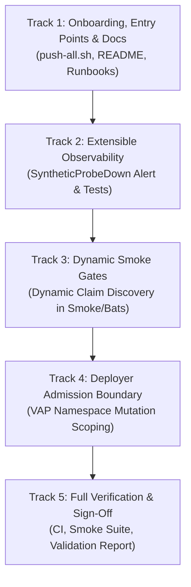

# Lab Remediation Plan — 2026-10-06 Assessment: Multi-Tenant Extensibility, Observability Integrity & Deployer Boundary Hardening
## Hub-and-Spoke GitOps Control Plane (2026-10-06)

> **Status: Draft / Proposed.** Active remediation plan responding to the [2026-10-06 assessment](../../assessments/2026-10-06-lab-assessment.md).

* **Plan Version:** 1.0
* **Assessment:** [`../../assessments/2026-10-06-lab-assessment.md`](../../assessments/2026-10-06-lab-assessment.md) (maturity 8.4 / 10)
* **Baseline:** Phase P5 complete and accepted ([`../../roadmaps/2026-10-04-tenant-iac-team-clusters-plan-validated-09.md`](../../roadmaps/2026-10-04-tenant-iac-team-clusters-plan-validated-09.md)); commit [`4c226dc`](https://github.com/brunobml/gitops-control-plane/commit/4c226dc); 42 Applications Synced & Healthy; 27/27 Bats tests passed.
* **Target Repositories:** `gitops-control-plane`, `platform-catalog`, `platform-charts`, `orders-processor`, `tenant-workloads`, `tenant-iac`
* **Author:** Antigravity (Advanced Agentic AI)

---

## Review & Approval Sign-Off

| Field | Details |
|---|---|
| **Current Status** | 🟡 **PROPOSED (Awaiting Peer Review)** |
| **Plan Version** | `v1.0` |
| **Author** | Antigravity (Advanced Agentic AI) |
| **Peer Reviewer / Validator** | Codex / Claude |
| **Target Completion** | 2026-10-07 |
| **Execution / Validation Model** | The party that executes a step authors `…-implemented-NN.md`; the independent validator authors `…-validation-NN.md`. The executor never validates its own implementation. |

### Operational Guardrails

| ID | Focus Area | Reviewer Remark & Operational Guardrail | Status |
|:---:|:---:|---|:---:|
| **R-0** | Track 1 (Onboarding & Scripts) | **Six-Repo Synchronization:** `scripts/push-all.sh` must iterate across all 6 checked-out repositories in `${REPOS_DIR}`. Fail gracefully if a repository directory is missing or uninitialized. | 🛡️ Proposed |
| **R-1** | Track 2 (Probe Alerting) | **Promtool Unit Test Coverage:** Any new alert rule (`SyntheticProbeDown`) must include full unit tests in `addons/observability/alert-rules.test.yaml` verifying firing under down/absent conditions and silence under healthy conditions before applying manifests. | 🛡️ Proposed |
| **R-2** | Track 3 (Dynamic Smoke Discovery) | **Backward Compatibility:** Dynamic tenant claim discovery in `scripts/smoke-test-hub-spoke.sh` and Bats must default to discovering live `TeamEKSCluster` claims from `kubectl` or Argo CD without breaking when zero claims or extra claims are present. | 🛡️ Proposed |
| **R-3** | Track 4 (Namespace Admission Scoping) | **Dry-Run Admission Validation:** The admission boundary restricting `system:serviceaccount:kube-system:argocd-iac-deployer` must be dry-run server-side against existing namespaces (`orders-*`, `platform-*`, `iac-*`, `kube-system`) to guarantee that legitimate `iac-*` reconcile operations are never blocked. | 🛡️ Proposed |
| **R-4** | Track 5 (Regression Prevention) | **Full Smoke Suite Green:** After applying all remediation changes, the 27-test Bats suite (`scripts/smoke-test-hub-spoke-bats.sh`) and `make ci` must pass with zero failures. | 🛡️ Proposed |

---

## 1. Executive Summary & Scope

The third lab assessment ([2026-10-06-lab-assessment.md](../../assessments/2026-10-06-lab-assessment.md)) measured platform maturity at **8.4 / 10** following the successful delivery of **Tenant IaC (Phases P0–P5)**.

The estate is fully operational and healthy. However, the assessment identified four clear operational and security gaps:
1. **Repository Inventory Divergence (L1-2):** Documentation and push automation (`push-all.sh`) omit the sixth repository (`tenant-iac`).
2. **Conflicting Change-Control Guidance (L1-3, L2-1, L2-3):** Runbook instructions conflate single-contributor automated PR checks with multi-user code owner approvals, and do not clearly differentiate mock Moto API readiness from full production EKS convergence.
3. **Static Telemetry & Smoke Discovery (L3-1, L3-2):** Smoke checks hardcode existing claims (`analytics-dev`, `analytics-prod`), and Prometheus lacks an unattended alert if a spoke synthetic probe crashes or stops exporting metrics.
4. **Deployer Identity Namespace Mutation Scope (L4-1):** The spoke ServiceAccount `argocd-iac-deployer` possesses cluster-wide namespace patch rights, allowing potential mutations to `kube-system` or `platform-network`.

### 1.1 Objectives

| Track | Theme | Target Findings | Scope |
|---|---|---|---|
| **Track 1** | **Onboarding, Entry Points & Documentation Hygiene** | L1-2, L1-3, L2-1, L2-3 | Update `push-all.sh`, `README.md`, student guide, and runbooks to fully integrate `tenant-iac` and clarify mock vs production acceptance signals. |
| **Track 2** | **Extensible Observability & Unattended Probe Alerting** | L3-2 | Add `SyntheticProbeDown` alert rule to hub Prometheus with Promtool unit tests and runbook documentation. |
| **Track 3** | **Dynamic Multi-Tenant Smoke Gates** | L3-1 | Refactor `scripts/smoke-test-hub-spoke.sh` and Bats suite to dynamically discover all live registered team claims and assert their readiness. |
| **Track 4** | **Least-Privilege Deployer Admission & Namespace Scoping** | L4-1 | Constrain `argocd-iac-deployer` namespace mutations via a native `ValidatingAdmissionPolicy` on spokes ensuring it only modifies `iac-*` namespaces. |
| **Track 5** | **Acceptance Rebuild, Verification & Residual Register** | L4-2, L4-3, L4-4 | Run full CI/smoke validation, ensure zero regression, and formalize Phase 6 transition triggers. |

### 1.2 Residual Register (2026-10-06 Point-in-Time)

| Item | Finding | Rationale for Lab Deferral | Compensating Controls Today | Phase 6 Revisit Trigger |
|---|---|---|---|---|
| **Platform Namespace NetworkPolicies** | L4-2 | High breakage risk on single-user laptop (API webhooks, metrics, UIs) with low risk gain. | Tenant namespaces, Keycloak, Loki, and exporters have strict policies; endpoints bound to `127.0.0.1`. | Phase 6 (multi-user AWS EKS). |
| **Tenant Resource Quotas** | L4-2 | Current team claims only deploy cloud resources (Moto EKS records) without in-cluster pods; quotas could artificially block valid claims. | Golden chart enforces fixed replica bounds; VAP contracts enforce node scaling limits (`maxSize ≤ 3` dev, `≤ 5` prod). | Onboarding a second tenant with container workloads. |
| **Secrets Encryption at Rest & Audit Logging** | L4-2 | Laptop filesystem storage; local audit logs consume disk with no reviewer. | No secrets in Git; local files mode `0600`; 30-day tokens with expiry alerts; Argo CD audit logging. | Real AWS EKS with KMS envelope encryption and CloudTrail / EKS audit logs. |
| **Spoke Traefik 3.7 GitOps Parity** | L3-3 | Spokes run bundled Traefik 3.6.13; tenant ingress works reliably; replacing it requires spoke recreation. | Synthetic probes and smoke test continuously monitor ingress traffic. | Next planned spoke cluster recreation or Traefik CVE. |
| **Enforced Multi-User Review Approvals** | L4-4 | Single maintainer cannot approve their own PRs on GitHub without blocking velocity. | Required PRs with automated `cluster-checks` CI workflows; CODEOWNERS rules defined. | Multi-user team onboarding or production AWS rollout. |

---

## 2. Track 1: Onboarding, Entry Points & Documentation Hygiene

### Step 1.1: Add `tenant-iac` to Repository Automation
- **File:** `scripts/push-all.sh`
- **Change:** Extend `REPOS` array to include `"tenant-iac"`:
  ```bash
  REPOS=("gitops-control-plane" "platform-catalog" "tenant-workloads" "orders-processor" "platform-charts" "tenant-iac")
  ```
- **Verification:** Execute `scripts/push-all.sh` and verify all 6 repositories push to `main` without error.

### Step 1.2: Update Root README and Student Guide
- **Files:** `README.md`, `docs/runbooks/devops-student-rebuild-guide.md`
- **Change:**
  - Add `tenant-iac` to the Git Repository Architecture map and inventory table.
  - Document the self-service team cluster workflow alongside application workloads.
  - Explain the 6-repository separation of concerns:
    1. `gitops-control-plane`: Argo CD root application, cluster configuration, platform add-ons.
    2. `platform-catalog`: Reusable Kro blueprints, ACK configurations, baseline admission policies.
    3. `platform-charts`: Golden Helm charts (`queue-backed-service`, `team-cluster`).
    4. `orders-processor`: Application source code and container builds.
    5. `tenant-workloads`: Application workload specifications (`QueueBackedService` claims).
    6. `tenant-iac`: Team infrastructure specifications (`TeamEKSCluster` claims).

### Step 1.3: Align Runbook Review and Approval Instructions
- **File:** `docs/runbooks/tenant-iac-operations.md`
- **Change:**
  - Explicitly document the two operational models:
    - **Current Lab Reality (Single Contributor):** GitHub ruleset enforces PR creation and passing `cluster-checks` CI; approving review count is `0` to prevent blocking the single developer.
    - **Enterprise Target (Multi-Contributor):** Production claims (`*-prod.yaml`) require code-owner approval (`@brunobml`) before merge.

### Step 1.4: Clarify Mock EKS vs Production EKS Convergence
- **File:** `docs/runbooks/tenant-iac-operations.md`, `docs/roadmaps/2026-10-02-phase6-production-parity-eks-roadmap.md`
- **Change:**
  - Document that Moto EKS creates API records where `status.status == ACTIVE` but `ACK.ResourceSynced` remains `False` due to simulated late-initialization.
  - Clearly specify that in the local lab, `TeamEKSCluster` `Ready=True` confirms cloud orchestration, whereas real AWS EKS acceptance requires full Kubernetes API reachability, node registration, and pod scheduling.

---

## 3. Track 2: Extensible Observability & Unattended Alerting

### Step 2.1: Add `SyntheticProbeDown` Alert Rule
- **File:** `addons/observability/values-prometheus-hub.yaml`
- **Rule Definition:** Under `name: lab.probes`:
  ```yaml
  - alert: SyntheticProbeDown
    # Alert if agent is reporting from a spoke but synthetic-order-probe is down or absent
    expr: (count by (cluster) (up{job="agent"} == 1) unless count by (cluster) (up{job="synthetic-order-probe"} == 1)) or (up{job="synthetic-order-probe"} == 0)
    for: 5m
    labels: {severity: critical}
    annotations:
      summary: "Synthetic order probe is not running on {{ $labels.cluster }}: e2e and team cluster monitoring is interrupted"
      runbook: docs/runbooks/host-reboot-and-cluster-lifecycle.md#alert-ordersnotprocessed
      logs: "http://grafana.localhost/d/lab-logs?var-cluster={{ $labels.cluster }}&var-namespace=monitoring"
  ```

### Step 2.2: Add Promtool Unit Test Coverage
- **File:** `addons/observability/alert-rules.test.yaml`
- **Test Scenarios:**
  1. `SyntheticProbeDown` fires when `up{job="synthetic-order-probe"}` goes to `0` or disappears while agent is `1`.
  2. `SyntheticProbeDown` stays silent when probe reports `1`.
- **Verification:** Run `make test-alert-rules` and confirm 22 rules pass.

### Step 2.3: Update Runbook
- **File:** `docs/runbooks/host-reboot-and-cluster-lifecycle.md`
- **Change:** Add entry for `SyntheticProbeDown` describing diagnosis steps (`kubectl get pods -n monitoring -l app=synthetic-order-probe`).

---

## 4. Track 3: Dynamic Multi-Tenant Smoke Gates

### Step 4.1: Dynamic Claim Discovery in Legacy Smoke Test
- **File:** `scripts/smoke-test-hub-spoke.sh`
- **Refactoring:** In Stage 12:
  - Dynamically discover all active `TeamEKSCluster` claims from `spoke-nonprod` and `spoke-prod` using `kubectl`:
    ```bash
    claims=$(kubectl --context k3d-spoke-nonprod get teamekscluster -A -o jsonpath='{range .items[*]}{.spec.name}{"\n"}{end}'; \
             kubectl --context k3d-spoke-prod get teamekscluster -A -o jsonpath='{range .items[*]}{.spec.name}{"\n"}{end}' | sort -u)
    ```
  - Iterate through every discovered claim and assert `lab_team_cluster_ready{name="<claim>"} == 1`.
  - Fail if any claim is missing from metrics or reports `== 0`.

### Step 4.2: Dynamic Claim Discovery in Bats Smoke Suite
- **File:** `tests/smoke/06_observability.bats`
- **Refactoring:**
  - Update `Gate 12d` to query all registered `TeamEKSCluster` resources dynamically across spokes.
  - Verify every discovered team cluster reports `lab_team_cluster_ready == 1`.

### Step 4.3: Dynamic Argo CD Application Count Validation
- **File:** `scripts/smoke-test-hub-spoke.sh`, `tests/smoke/02_gitops_applications.bats`
- **Refactoring:**
  - Instead of hardcoding exactly 42 applications, verify that all currently registered applications in Argo CD are `Synced` and `Healthy`, and that the count matches or exceeds the known baseline (≥ 42).

---

## 5. Track 4: Least-Privilege Deployer Admission & Namespace Scoping

### Problem (Finding L4-1)
On both spokes, `argocd-iac-deployer` has cluster-scoped `patch`, `update`, `create` verbs on `namespaces`. Consequently:
```bash
kubectl auth can-i patch namespaces/kube-system --as=system:serviceaccount:kube-system:argocd-iac-deployer
# Returns: yes
```
This violates least privilege: a compromised `argocd-iac-deployer` token could modify labels, annotations, or configurations on platform namespaces (`kube-system`, `platform-network`, `traefik`).

### Solution: Native ValidatingAdmissionPolicy Guardrail
Implement a cluster-wide Kubernetes `ValidatingAdmissionPolicy` on both spokes:
- **Policy Name:** `iac-deployer-namespace-boundary`
- **Target:** `operations: ["CREATE", "UPDATE", "PATCH"]` on `resources: ["namespaces"]`
- **Match Constraint:** When `request.userInfo.username == "system:serviceaccount:kube-system:argocd-iac-deployer"`
- **Validation Rule:** `object.metadata.name.matches('^iac-.*$')`
- **Failure Message:** `"argocd-iac-deployer is only authorized to manage namespaces prefixed with iac-"`

### Step 5.1: Create Policy Manifest
- **File:** `platform-catalog/blueprints/iac-deployer-policy.yaml` (or `clusters/addons/iac-deployer-policy.yaml`)
- Declare `ValidatingAdmissionPolicy` and `ValidatingAdmissionPolicyBinding`.

### Step 5.2: Deploy Policy across Spokes
- Deploy via the existing `addons-platform-config-spoke-*` or Kyverno/policy ApplicationSet.

### Step 5.3: Verification Drill
1. Server-side dry-run patch on `kube-system` as `argocd-iac-deployer`: Must be **DENIED**.
2. Server-side dry-run patch on `platform-network` as `argocd-iac-deployer`: Must be **DENIED**.
3. Server-side dry-run patch on `iac-team-data-dev` as `argocd-iac-deployer`: Must be **ADMITTED**.

---

## 6. Track 5: Verification & Acceptance

### Step 6.1: Quality & CI Validation
1. `make ci`: Verify 35+ scripts shellcheck clean, manifests valid, promtool alert rules valid, secret scan clean.
2. `make test-alert-rules`: Confirm all alert rule unit tests pass (including `SyntheticProbeDown`).
3. `make ci-iac`: Confirm tenant IaC schema tests pass.
4. `make orphans`: Confirm zero orphaned resources.

### Step 6.2: Smoke Test Suite
Execute `./scripts/smoke-test-hub-spoke-bats.sh` and confirm all 27 tests pass across all 6 modules.

### Step 6.3: Implementation & Validation Recording
- Author `docs/remediation/2026-10-06-lab-assessment/2026-10-06-lab-remediation-plan-implemented-01.md`.
- Submit for independent validation and sign-off in `…-validation-01.md`.

---

## 7. Execution Phasing & Sequencing



| Phase | Tracks | Primary Files Changed | Estimated Effort |
|:---:|:---:|---|:---:|
| **Phase 1** | Track 1 | `scripts/push-all.sh`, `README.md`, `docs/runbooks/devops-student-rebuild-guide.md`, `docs/runbooks/tenant-iac-operations.md` | Small |
| **Phase 2** | Track 2 | `addons/observability/values-prometheus-hub.yaml`, `addons/observability/alert-rules.test.yaml`, `docs/runbooks/host-reboot-and-cluster-lifecycle.md` | Small |
| **Phase 3** | Track 3 | `scripts/smoke-test-hub-spoke.sh`, `tests/smoke/06_observability.bats`, `tests/smoke/02_gitops_applications.bats` | Medium |
| **Phase 4** | Track 4 | `scripts/apply-argocd-spoke-rbac.sh`, `platform-catalog/blueprints/iac-deployer-policy.yaml` | Medium |
| **Phase 5** | Track 5 | Full suite execution, report authoring, peer validation sign-off | Small |
