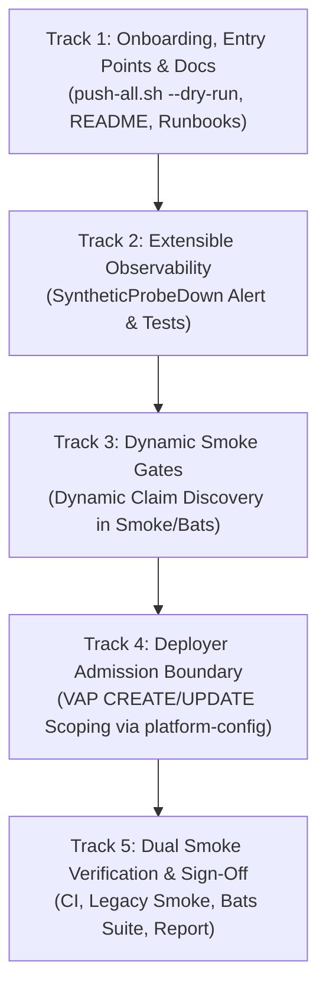

# Lab Remediation Plan — 2026-10-06 Assessment: Multi-Tenant Extensibility, Observability Integrity & Deployer Boundary Hardening
## Hub-and-Spoke GitOps Control Plane (2026-10-06)

> **Status: Revised (v1.1).** Incorporates peer review feedback from Codex. Ready for approval and execution.

* **Plan Version:** 1.1 (Revised 2026-10-06)
* **Assessment:** [`../../assessments/2026-10-06-lab-assessment.md`](../../assessments/2026-10-06-lab-assessment.md) (maturity 8.4 / 10)
* **Baseline:** Phase P5 complete and accepted ([`../../roadmaps/2026-10-04-tenant-iac-team-clusters-plan-validated-09.md`](../../roadmaps/2026-10-04-tenant-iac-team-clusters-plan-validated-09.md)); commit [`822d9ef`](https://github.com/brunobml/gitops-control-plane/commit/822d9ef); 42 Applications Synced & Healthy; 27/27 Bats tests passed.
* **Target Repositories:** `gitops-control-plane`, `platform-catalog`, `platform-charts`, `orders-processor`, `tenant-workloads`, `tenant-iac`
* **Author:** Antigravity (Advanced Agentic AI)

---

## Review & Approval Sign-Off

| Field | Details |
|---|---|
| **Current Status** | 🟡 **REVISED v1.1 (Awaiting Reviewer Sign-Off)** |
| **Plan Version** | `v1.1` (Addresses all 6 Codex review points) |
| **Author** | Antigravity (Advanced Agentic AI) |
| **Peer Reviewer / Validator** | Codex |
| **Target Completion** | 2026-10-07 |
| **Execution / Validation Model** | The party that executes a step authors `…-implemented-NN.md`; the independent validator authors `…-validation-NN.md`. The executor never validates its own implementation. |

### Operational Guardrails

| ID | Focus Area | Reviewer Remark & Operational Guardrail | Status |
|:---:|:---:|---|:---:|
| **R-0** | Track 1 (Push Script Robustness) | **Fail-Closed Push Script & Dry-Run Testing:** `scripts/push-all.sh` must support `--dry-run`, validate existence of all 6 repositories before attempting operations, track push failures across iterations, and exit non-zero if any repository is missing or fails to push. Test via `--dry-run` without pushing unreviewed commits. | 🛡️ Addressed (v1.1) |
| **R-1** | Track 2 (Probe Alert Precision) | **Single-Alert Scoping & Namespace Accuracy:** `SyntheticProbeDown` must produce exactly one alert per affected spoke (using label `{cluster="<spoke>"}` via `unless`). Diagnostic annotations and runbook links must point to namespace `platform-probes` and pod label `app.kubernetes.io/name=synthetic-order-probe`. Promtool unit tests must verify firing on `up=0` and absence, and silence when `up=1`. | 🛡️ Addressed (v1.1) |
| **R-2** | Track 3 (Dynamic Claim Discovery) | **Metadata Identity & Fail-Closed Discovery:** Dynamic claim discovery must read `.metadata.name` (matching Prometheus metric label `name`), compare full `(cluster, namespace, name)` tuples, fail closed on discovery query errors, and assert discovered count matches registered tenant Applications (preventing silent passes on empty lists). | 🛡️ Addressed (v1.1) |
| **R-3** | Track 3 (Baseline Application Guard) | **Platform Baseline Invariant:** Application existence assertions must preserve the fixed baseline of required platform and core applications (asserting each exists by name), discover tenant applications dynamically, and assert both sets are `Synced` and `Healthy`. | 🛡️ Addressed (v1.1) |
| **R-4** | Track 4 (Valid VAP & Proven Route) | **Valid Admission Operations & Delivery Route:** The VAP must use standard admission operations `["CREATE", "UPDATE"]` (not `PATCH`), filter username `system:serviceaccount:kube-system:argocd-iac-deployer` in `matchConditions`, set `failurePolicy: Fail`, and deliver via `clusters/platform-config/{{ .name }}` (`gitops-control-plane` `main`) ensuring synchronized deployment to both spokes without cross-repo promotion blockers. | 🛡️ Addressed (v1.1) |
| **R-5** | Track 5 (Dual Smoke Execution) | **Dual Smoke Suite Verification:** Final acceptance requires running both the legacy 12-stage smoke test (`scripts/smoke-test-hub-spoke.sh`) and the 27-test modular Bats suite (`scripts/smoke-test-hub-spoke-bats.sh`), plus full `make ci`. | 🛡️ Addressed (v1.1) |

---

## 1. Executive Summary & Scope

The third lab assessment ([2026-10-06-lab-assessment.md](../../assessments/2026-10-06-lab-assessment.md)) measured platform maturity at **8.4 / 10** following the delivery of **Tenant IaC (Phases P0–P5)**.

This remediation plan resolves all findings identified in the assessment while incorporating the six peer-review improvements:
1. **Repository Inventory Divergence (L1-2):** Integrate `tenant-iac` into `scripts/push-all.sh`, `README.md`, and student guides, adding `--dry-run` and fail-closed error handling.
2. **Conflicting Change-Control Guidance (L1-3, L2-1, L2-3):** Reconcile runbook review instructions between current single-contributor automated gates and target multi-contributor approvals; document the distinction between mock Moto EKS API records and real AWS cluster convergence.
3. **Static Telemetry & Smoke Discovery (L3-1, L3-2):** Implement `SyntheticProbeDown` alerting on `platform-probes` outage (exactly 1 alert per spoke); refactor smoke tests to dynamically discover team claims by `.metadata.name` across `(cluster, namespace, name)` tuples while preserving the platform application baseline.
4. **Deployer Identity Namespace Mutation Scope (L4-1):** Restrict `argocd-iac-deployer` namespace mutations via a native `ValidatingAdmissionPolicy` on spokes using `CREATE, UPDATE`, `matchConditions`, and fail-closed enforcement, delivered via `clusters/platform-config/`.

### 1.1 Objectives

| Track | Theme | Target Findings | Scope |
|---|---|---|---|
| **Track 1** | **Onboarding, Entry Points & Documentation Hygiene** | L1-2, L1-3, L2-1, L2-3 | Harden `push-all.sh` (6 repos, `--dry-run`, fail-closed); update `README.md` and rebuild guides; align runbook review and mock-vs-real EKS definitions. |
| **Track 2** | **Extensible Observability & Unattended Probe Alerting** | L3-2 | Add `SyntheticProbeDown` alert rule to hub Prometheus (single alert per spoke, `platform-probes` namespace) with Promtool unit tests and runbook documentation. |
| **Track 3** | **Dynamic Multi-Tenant Smoke Gates** | L3-1 | Refactor `scripts/smoke-test-hub-spoke.sh` and Bats suite to dynamically discover all live registered team claims by `.metadata.name` and assert their readiness while preserving the fixed platform application baseline. |
| **Track 4** | **Least-Privilege Deployer Admission & Namespace Scoping** | L4-1 | Deploy a native Kubernetes `ValidatingAdmissionPolicy` (`iac-deployer-namespace-boundary`) via `clusters/platform-config/` on both spokes ensuring `argocd-iac-deployer` can only mutate `iac-*` namespaces. |
| **Track 5** | **Dual Smoke Verification & Residual Register** | L4-2, L4-3, L4-4 | Run full CI, legacy 12-stage smoke, and Bats suite; carry forward all documented residuals into the formal register. |

### 1.2 Comprehensive Residual Register

Carried forward from the [2026-10-03 remediation register](../2026-10-03-lab-assessment/2026-10-03-lab-remediation-plan.md#13-residual-register-v12-close-out) and updated for the 2026-10-06 assessment:

| Item | Finding | Rationale for Lab Deferral | Compensating Controls Today | Phase 6 Revisit Trigger |
|---|---|---|---|---|
| **Platform Namespace NetworkPolicies** | L4-2, L4-5 | High breakage risk on single-user laptop (API webhooks, metrics scrapes, UIs) with low risk gain. | Tenant namespaces, Keycloak, Loki, and exporters have strict policies; endpoints bound to `127.0.0.1`. | Phase 6 (multi-user AWS EKS). |
| **Tenant Resource Quotas** | L4-2, L4-6 | Current team claims only deploy cloud resources (Moto EKS records) without in-cluster pods; quotas could artificially block valid claims. | Golden chart enforces fixed replica bounds; VAP contracts enforce node scaling limits (`maxSize ≤ 3` dev, `≤ 5` prod). | Onboarding a second tenant with container workloads. |
| **Secrets Encryption at Rest & Audit Logging** | L4-2, L4-4 | Laptop filesystem storage; local audit logs consume disk with no reviewer. | No secrets in Git; local files mode `0600`; 30-day tokens with expiry alerts; Argo CD audit logging. | Real AWS EKS with KMS envelope encryption and CloudTrail / EKS control-plane audit logs. |
| **Spoke Traefik 3.7 GitOps Parity** | L3-3, L2-5 | Spokes run bundled Traefik 3.6.13; tenant ingress works reliably; replacing it requires spoke recreation. | Synthetic probes and smoke test continuously monitor ingress traffic. | Next planned spoke cluster recreation or Traefik CVE. |
| **Signed Golden Helm Charts** | L3-3, L4-3 | Chart versions immutable (`release.yaml` digest check); single maintainer. | Chart immutability check, `chart-checks` CI, CODEOWNERS. | Multiple chart publishers or external consumers. |
| **Automated Dependency Updates (Renovate)** | L3-3, L3-2 | Bot PR review overhead on single-maintainer lab; all images/actions pinned by digest. | All images and actions digest-pinned; CI verifies bumps. | Dependency pins older than 3 months or active CVEs. |
| **Scheduled Credential Renewal (Windows Task Scheduler)** | L3-3, O-10 | Owner prefers running `make maintain` manually over background Windows scheduled task. | `SpokeTokenExpiringSoon` alert (7-day window); `make post-bootstrap` auto-renews. | Missed manual renewal or owner requests automation. |
| **Alert Delivery Channels & Notifications** | L3-3, O-3 | External notification channels (ntfy, webhooks) require internet routing / external setup. | In-cluster Alertmanager, Grafana dashboard, Loki logs, and CI alert monitoring. | Dedicated on-call rotation or external alerting requirement. |
| **Service-Level CARM IAM Roles (R-1)** | L3-3, O-8 | All ACK controllers currently assume `role/ack-sqs-controller`; Moto does not enforce per-service role boundaries. | Mock Moto environment accepts shared role; credentials scoped to CARM account IDs. | Transition to real AWS EKS (Pod Identity with distinct per-controller roles). |
| **Enforced Multi-User Review Approvals** | L4-4 | Single maintainer cannot approve their own PRs on GitHub without blocking velocity. | Required PRs with automated `cluster-checks` CI workflows; CODEOWNERS rules defined. | Multi-user team onboarding or production AWS rollout. |

---

## 2. Track 1: Onboarding, Entry Points & Documentation Hygiene

### Step 1.1: Harden `scripts/push-all.sh` (Fail-Closed, Dry-Run & 6 Repos)
- **File:** `scripts/push-all.sh`
- **Requirements (addressing review point 5):**
  1. Add `"tenant-iac"` to `REPOS` array.
  2. Implement `--dry-run` flag support (passes `--dry-run` to `git push`).
  3. Validate existence of each repository directory `${REPOS_DIR}/${repo}`. If any repository directory is missing, report error and mark failure.
  4. Track failures across the loop and exit with non-zero exit code (`exit 1`) if any repository fails to push.
  5. **Verification:** Test via `bash scripts/push-all.sh --dry-run` to confirm all 6 repos are checked without executing unreviewed remote pushes.

### Step 1.2: Update Root README and Student Guide
- **Files:** `README.md`, `docs/runbooks/devops-student-rebuild-guide.md`
- **Changes:**
  - Add `tenant-iac` to the Git Repository Architecture diagram and inventory table.
  - Document the self-service team cluster workflow alongside application workloads.
  - Clarify the 6-repository structure:
    1. `gitops-control-plane`: Argo CD control plane, cluster configuration, platform add-ons.
    2. `platform-catalog`: Reusable Kro blueprints, ACK configurations, baseline admission policies.
    3. `platform-charts`: Golden Helm charts (`queue-backed-service`, `team-cluster`).
    4. `orders-processor`: Application source code and container builds.
    5. `tenant-workloads`: Application workload specifications (`QueueBackedService` claims).
    6. `tenant-iac`: Team infrastructure specifications (`TeamEKSCluster` claims).

### Step 1.3: Align Runbook Review and Approval Instructions
- **File:** `docs/runbooks/tenant-iac-operations.md`
- **Changes:**
  - Explicitly document the two operational models:
    - **Current Lab Reality (Single Contributor):** GitHub ruleset `24519842` enforces PR creation and passing `cluster-checks` CI; approving review count is `0` to prevent blocking the single developer.
    - **Enterprise Target (Multi-Contributor):** Production claims (`teams/*/clusters/*-prod.yaml`) require code-owner approval (`@brunobml`) before merge.

### Step 1.4: Clarify Mock EKS vs Production EKS Convergence
- **Files:** `docs/runbooks/tenant-iac-operations.md`, `docs/roadmaps/2026-10-02-phase6-production-parity-eks-roadmap.md`
- **Changes:**
  - Document that in Moto, ACK EKS Cluster CRs report `status.status == ACTIVE` while `ACK.ResourceSynced` remains `False` due to simulated late-initialization fields.
  - Explicitly state that in the local lab, `TeamEKSCluster` `Ready=True` confirms cloud resource orchestration, whereas real AWS EKS acceptance requires full Kubernetes API reachability, node registration, pod scheduling, and VPC CNI networking.

---

## 3. Track 2: Extensible Observability & Unattended Alerting

### Step 2.1: Add `SyntheticProbeDown` Alert Rule
- **File:** `addons/observability/values-prometheus-hub.yaml`
- **Rule Definition (addressing review point 4):**
  - Use `unless` between agent and probe metrics so the alert emits exactly **one alert per affected spoke** with matching label `{cluster="<spoke>"}`:
  ```yaml
  - alert: SyntheticProbeDown
    # Alert if agent is reporting from a spoke but synthetic-order-probe is down or absent
    expr: count by (cluster) (up{job="agent"} == 1) unless count by (cluster) (up{job="synthetic-order-probe"} == 1)
    for: 5m
    labels: {severity: critical}
    annotations:
      summary: "Synthetic order probe is not running on {{ $labels.cluster }}: e2e and team cluster monitoring is interrupted"
      runbook: docs/runbooks/host-reboot-and-cluster-lifecycle.md#alert-syntheticprobedown
      logs: "http://grafana.localhost/d/lab-logs?var-cluster={{ $labels.cluster }}&var-namespace=platform-probes"
  ```
  *(Note: This rule fires if `up{job="synthetic-order-probe"}` evaluates to 0 or is absent from Prometheus metrics, emitting exactly one series per cluster without duplicate labels).*

### Step 2.2: Add Promtool Unit Test Coverage
- **File:** `addons/observability/alert-rules.test.yaml`
- **Test Scenarios:**
  1. `SyntheticProbeDown` fires when `up{job="synthetic-order-probe"}` becomes `0` or disappears on `spoke-nonprod` while agent is `1`.
  2. Verify that **exactly one alert** is emitted with labels `{severity: critical, cluster: spoke-nonprod}`.
  3. `SyntheticProbeDown` remains silent when both agent and probe report `1`.
- **Verification:** Run `make test-alert-rules` and confirm all 22 rules pass.

### Step 2.3: Update Runbook Diagnostic Instructions
- **File:** `docs/runbooks/host-reboot-and-cluster-lifecycle.md`
- **Changes:** Add section `#alert-syntheticprobedown` documenting diagnosis in the correct namespace:
  ```bash
  kubectl --context k3d-<cluster> -n platform-probes get pods -l app.kubernetes.io/name=synthetic-order-probe
  kubectl --context k3d-<cluster> -n platform-probes logs deploy/synthetic-order-probe
  ```

---

## 4. Track 3: Dynamic Multi-Tenant Smoke Gates

### Step 3.1: Dynamic Claim Discovery in Legacy Smoke Test
- **File:** `scripts/smoke-test-hub-spoke.sh`
- **Refactoring (addressing review points 1 and 3):**
  - **Preserve Fixed Platform Baseline:** Retain explicit existence checks for all 40 core platform and workload applications (`argo-cd`, `root-control-plane`, `platform-*`, `addon-*`, `kro-blueprints-*`, `orders-*`).
  - **Dynamic Tenant Claim Discovery:**
    1. Query live `TeamEKSCluster` claims from `spoke-nonprod` and `spoke-prod` using `.metadata.name`, `.metadata.namespace`, and cluster name:
       ```bash
       get_claims() {
         local ctx="$1" cluster="$2"
         kubectl --context "$ctx" get teamekscluster -A -o jsonpath='{range .items[*]}{"'${cluster}'\t"}{.metadata.namespace}{"\t"}{.metadata.name}{"\n"}{end}' 2>/dev/null
       }
       ```
    2. Fail closed if `kubectl` returns a non-zero exit code.
    3. Assert discovered claims count is `> 0` and matches registered `tenant-iac` applications in Argo CD (fails if claims unexpectedly disappear).
    4. For each discovered `(cluster, namespace, name)` tuple, query Prometheus for:
       ```text
       lab_team_cluster_ready{cluster="<cluster>",namespace="<namespace>",name="<name>"} == 1
       ```
    5. Poll with a 60s timeout for cold-start scrape completion. Fail if any claim is unready or missing.

### Step 3.2: Dynamic Claim Discovery in Bats Smoke Suite
- **Files:** `tests/smoke/02_gitops_applications.bats`, `tests/smoke/06_observability.bats`
- **Refactoring:**
  - `Gate 3a`: Assert all fixed baseline platform applications exist by name, and assert all dynamically discovered `tenant-workloads` and `tenant-iac` applications exist and are healthy.
  - `Gate 12d`: Query discovered `TeamEKSCluster` tuples `(cluster, namespace, name)` across spokes, asserting `lab_team_cluster_ready == 1` for each discovered claim.

---

## 5. Track 4: Least-Privilege Deployer Admission & Namespace Scoping

### Problem (Finding L4-1)
On both spokes, `argocd-iac-deployer` has cluster-scoped `create, update, patch` verbs on `namespaces` in `scripts/apply-argocd-spoke-rbac.sh`. Consequently:
```bash
kubectl auth can-i patch namespaces/kube-system --as=system:serviceaccount:kube-system:argocd-iac-deployer
# Returns: yes
```
This violates least privilege: a compromised `argocd-iac-deployer` token could modify labels, annotations, or configurations on platform namespaces (`kube-system`, `platform-network`, `traefik`).

### Solution: Valid Kubernetes ValidatingAdmissionPolicy
Deploy a native cluster-wide `ValidatingAdmissionPolicy` on both spokes (addressing review point 2):
- **Valid Operations:** `["CREATE", "UPDATE"]` (standard Kubernetes admission operations; patch requests are evaluated as `UPDATE`).
- **Match Condition:** Evaluates `request.userInfo.username == "system:serviceaccount:kube-system:argocd-iac-deployer"`.
- **Enforcement:** `failurePolicy: Fail` (fail-closed).
- **Rule:** `object.metadata.name.matches('^iac-.*$')`.
- **Failure Message:** `"argocd-iac-deployer is only authorized to manage namespaces prefixed with iac-"`.

### Step 5.1: Create Policy Manifest
- **File:** `clusters/platform-config/common/iac-deployer-namespace-policy.yaml`
```yaml
apiVersion: admissionregistration.k8s.io/v1
kind: ValidatingAdmissionPolicy
metadata:
  name: iac-deployer-namespace-boundary
spec:
  failurePolicy: Fail
  matchConstraints:
    resourceRules:
      - apiGroups: [""]
        apiVersions: ["v1"]
        operations: ["CREATE", "UPDATE"]
        resources: ["namespaces"]
  matchConditions:
    - name: is-argocd-iac-deployer
      expression: 'request.userInfo.username == "system:serviceaccount:kube-system:argocd-iac-deployer"'
  validations:
    - expression: 'object.metadata.name.matches("^iac-.*$")'
      message: "argocd-iac-deployer is only authorized to manage namespaces prefixed with iac-"
---
apiVersion: admissionregistration.k8s.io/v1
kind: ValidatingAdmissionPolicyBinding
metadata:
  name: iac-deployer-namespace-boundary-binding
spec:
  policyName: iac-deployer-namespace-boundary
  validationActions: [Deny, Audit]
```

### Step 5.2: Delivery Path (Addressing Review Point 2)
- **Delivery Route:** Placed under `clusters/platform-config/spoke-nonprod/` and `clusters/platform-config/spoke-prod/` in `gitops-control-plane`.
- Managed by `addons-spoke-platform-config` ApplicationSet which targets `targetRevision: main` of `gitops-control-plane.git` on both spokes.
- This avoids cross-repo release promotion blockers and ensures synchronous delivery to both `spoke-nonprod` and `spoke-prod`.
- Also applied via `scripts/apply-argocd-spoke-rbac.sh` during cluster setup for pre-bootstrap enforcement.

### Step 5.3: Verification Drill
1. Server-side dry-run patch on `kube-system` as `argocd-iac-deployer`: Must be **DENIED by policy**.
2. Server-side dry-run patch on `platform-network` as `argocd-iac-deployer`: Must be **DENIED by policy**.
3. Server-side dry-run patch on `iac-team-data-dev` as `argocd-iac-deployer`: Must be **ADMITTED**.

---

## 6. Track 5: Verification, Dual Smoke Suite Execution & Sign-Off

### Step 6.1: Quality & Pre-Merge CI Validation
1. `make ci`: Verify all shell scripts shellcheck clean, manifests valid, promtool alert rules valid (22 rules), secret scan clean.
2. `make test-alert-rules`: Confirm all alert rule unit tests pass.
3. `make ci-iac`: Confirm tenant IaC schema tests pass.
4. `make orphans`: Confirm zero orphaned resources.

### Step 6.2: Dual Smoke Test Suite Execution (Addressing Review Point 6)
1. Run legacy 12-stage smoke test: `bash scripts/smoke-test-hub-spoke.sh`.
2. Run modular 27-test Bats suite: `bash scripts/smoke-test-hub-spoke-bats.sh`.
3. Confirm 100% pass across both suites.

### Step 6.3: Implementation & Validation Recording
- Author `docs/remediation/2026-10-06-lab-assessment/2026-10-06-lab-remediation-plan-implemented-01.md`.
- Submit for independent validation and sign-off in `…-validation-01.md`.

---

## 7. Execution Phasing & Sequencing



| Phase | Tracks | Primary Files Changed | Estimated Effort |
|:---:|:---:|---|:---:|
| **Phase 1** | Track 1 | `scripts/push-all.sh`, `README.md`, `docs/runbooks/devops-student-rebuild-guide.md`, `docs/runbooks/tenant-iac-operations.md` | Small |
| **Phase 2** | Track 2 | `addons/observability/values-prometheus-hub.yaml`, `addons/observability/alert-rules.test.yaml`, `docs/runbooks/host-reboot-and-cluster-lifecycle.md` | Small |
| **Phase 3** | Track 3 | `scripts/smoke-test-hub-spoke.sh`, `tests/smoke/06_observability.bats`, `tests/smoke/02_gitops_applications.bats` | Medium |
| **Phase 4** | Track 4 | `clusters/platform-config/*/iac-deployer-namespace-policy.yaml`, `scripts/apply-argocd-spoke-rbac.sh` | Medium |
| **Phase 5** | Track 5 | Full suite execution (legacy + Bats), report authoring, peer validation sign-off | Small |
