# Architecture & Engineering Roadmap: Phase 6 — Production Parity & AWS EKS Translation
## Translating the Local Multi-Cluster GitOps Control Plane to Real Cloud Infrastructure

> **Status: Design reference.** Design rationale and target state. Examples and names may differ from what is deployed. For the running lab, see the [README](../../README.md) and the [runbooks](../runbooks/).

* **Document Version:** 1.0
* **Status:** Draft / Strategic Roadmap
* **Target Audience:** Principal Platform Engineers, Cloud Architects, and Enterprise Leadership
* **Lab Baseline:** Phase 5 v1.1 Complete (Argo CD v3.5.3, Kro v0.9.4, ACK SQS 1.7.1, Keycloak OIDC, Prometheus, Loki)

---

## 1. Executive Summary & Core Architectural Principle

Across Phases 1–5, this project engineered a fully validated, multi-cluster GitOps platform across three local clusters (`hub`, `spoke-nonprod`, `spoke-prod`), featuring declarative resource composition (Kro), AWS cloud orchestration (ACK), single sign-on (Keycloak), supply-chain trust (Kyverno + Cosign), and unified observability (Prometheus + Loki + Grafana).

The primary objective of **Phase 6** is to translate this platform to **production AWS infrastructure (Amazon EKS)** with **zero alteration to the tenant contract**:

> ### 🏛️ The Principle of Platform Contract Invariance
> 
> A platform’s success is measured by the stability of its developer abstraction. In transitioning from the local k3d/Moto lab to enterprise AWS EKS:
> 1. **The Tenant Contract is Unchanged:** Tenants continue defining identical `QueueBackedService` resources in `tenant-workloads`.
> 2. **The Golden Path is Unchanged:** `platform-catalog` continues publishing the same Kro ResourceGraphDefinitions and Helm blueprints.
> 3. **The Tenancy Model is Unchanged:** Argo CD continues using the same GoTemplate matrix generator and AppProject boundaries.
> 
> Only the underlying **plumbing** (compute nodes, cloud authentication, secret backends, and networking) transitions from simulated laptop infrastructure to managed AWS primitives.

---

## 2. Architecture Delta: Lab (k3d / Moto) vs Production (AWS EKS)

The table below outlines the exact architectural translation between the current local lab baseline and the target AWS production platform:

| Architectural Domain | Lab Baseline (Phase 5 v1.1) | Production Target (Phase 6 AWS EKS) | Justification & Production Advantage |
|---|---|---|---|
| **Cluster Compute** | `k3d` (k3s in Docker containers) | **Amazon EKS** (Managed Node Groups + **Karpenter**) | Auto-scaling compute, spot-instance optimization, multi-AZ high availability. |
| **Cloud Authentication** | Mock static keys in K8s Secrets + CARM accounts | **EKS Pod Identity** + Cross-Account IAM Roles | Eliminates static credentials; IAM tokens minted dynamically with short TTLs. |
| **Secret Management** | Local scripts in `~/.config/gitops-lab/` (0600) | **External Secrets Operator (ESO)** + **AWS Secrets Manager** | Centralized KMS encryption, automated secret rotation, GitOps-native secret synchronization. |
| **Spoke Registration** | 30-day `TokenRequest` tokens in K8s Secrets | **EKS Access Entries** + Hub IAM Role Assumption | Zero token rotation chore; authentication governed by IAM policies and AWS STS. |
| **Cloud Infrastructure** | `moto-cloud:5000` (in-memory mock AWS) | **Real AWS Services** (SQS Standard/FIFO, DynamoDB) | Multi-region durability, 99.999% SLA, real cloud scaling and compliance auditing. |
| **Account Boundary** | Mock accounts `111111111111` & `222222222222` | **AWS Organizations Member Accounts** | Physical blast-radius isolation, separate cloud billing, Service Control Policies (SCPs). |
| **Ingress & Networking** | Traefik on Docker network (`*.localhost`) | **AWS Load Balancer Controller (ALB)** + **Amazon Route 53** | Native AWS network integration, WAF protection, public/private split horizons. |
| **TLS & Encryption** | Plain HTTP over loopback (`127.0.0.1`) | **AWS Certificate Manager (ACM)** | Automatic TLS issuance, wildcard certificates, automated renewal. |
| **Identity & SSO** | In-cluster Keycloak (`realm-lab.json`) | **AWS IAM Identity Center** / **Okta** / **Entra ID** | Enterprise corporate directory federation, MFA enforcement, SCIM group provisioning. |
| **Metrics Backend** | Hub Prometheus server (local-path PVC) | **Amazon Managed Service for Prometheus (AMP)** | Multi-AZ managed time-series storage, SigV4 ingestion, horizontal scalability. |
| **Log Storage** | SingleBinary Loki (local-path PVC) | **Grafana Loki on Amazon S3** | Infinitely scalable log storage, S3 Intelligent-Tiering, multi-year compliance retention. |
| **Dashboards** | In-cluster Grafana (distroless container) | **Amazon Managed Grafana (AMG)** | Fully managed visualization with native AWS SSO and IAM integration. |
| **Image Promotion** | Manual Git commit to `blueprint-revisions.env` | **Kargo** / **Argo CD Image Updater** | Automated progressive delivery across dev $\rightarrow$ test $\rightarrow$ prod with approval gates. |

---

## 3. Target Production Architecture Diagram

```mermaid
flowchart TD
    subgraph Users["Platform Operators & Tenant Developers"]
        Browser["Host Browser / Developer Workstation"]
        IdP["Corporate IdP\n(AWS IAM Identity Center / Okta)"]
    end

    subgraph ManagementAccount["AWS Account: Management / Control Plane"]
        subgraph HubEKS["Amazon EKS: Hub Control Plane Cluster"]
            ArgoCD["Argo CD Control Plane\n(AppProjects & ApplicationSets)"]
            ESO["External Secrets Operator"]
            HubAlloy["Alloy Log Shipper"]
            TraefikHub["Internal Ingress Controller"]
        end
        SecretsMgrHub["AWS Secrets Manager\n(Admin & SSO Credentials)"]
        AMP["Amazon Managed Service\nfor Prometheus (AMP)"]
        AMG["Amazon Managed Grafana\n(SSO via Identity Center)"]
        S3Logs["Amazon S3 Bucket\n(Loki Log Storage)"]
    end

    subgraph NonProdAccount["AWS Account: Spoke Non-Prod (111111111111)"]
        subgraph NonProdEKS["Amazon EKS: Spoke Non-Prod Cluster"]
            KroNP["Kro Controller (0.9.x)"]
            AckNP["ACK SQS Controller"]
            KyvernoNP["Kyverno HA (2 Replicas + PDB)"]
            PromAgentNP["Prometheus Agent (Remote Write)"]
            AlloyNP["Alloy (API Log Shipper)"]
            DevApp["orders-dev (1 replica)"]
            TestApp["orders-test (2 replicas)"]
        end
        SQSNonProd["Amazon SQS Queues & DLQs\n(dev & test)"]
        DynamoNonProd["Amazon DynamoDB Tables\n(dev & test history)"]
    end

    subgraph ProdAccount["AWS Account: Spoke Prod (222222222222)"]
        subgraph ProdEKS["Amazon EKS: Spoke Prod Cluster"]
            KroP["Kro Controller (0.9.x)"]
            AckP["ACK SQS Controller"]
            KyvernoP["Kyverno HA (2 Replicas + PDB)"]
            PromAgentP["Prometheus Agent (Remote Write)"]
            AlloyP["Alloy (API Log Shipper)"]
            ProdApp["orders-prod (High Availability)"]
        end
        SQSProd["Amazon SQS Queues & DLQs\n(prod-queue & prod-dlq)"]
        DynamoProd["Amazon DynamoDB Tables\n(prod history)"]
    end

    %% SSO & User Access
    Browser -->|OIDC Login| IdP
    IdP -.->|SAML / OIDC| ArgoCD
    IdP -.->|SSO| AMG

    %% GitOps Distribution
    ArgoCD -->|EKS Access Entry / STS AssumeRole| NonProdEKS
    ArgoCD -->|EKS Access Entry / STS AssumeRole| ProdEKS

    %% Cloud Orchestration via ACK
    AckNP -->|EKS Pod Identity| SQSNonProd
    AckP -->|EKS Pod Identity| SQSProd

    %% Telemetry Ingestion
    PromAgentNP -->|SigV4 Remote Write| AMP
    PromAgentP -->|SigV4 Remote Write| AMP
    AlloyNP -->|SigV4 Push| S3Logs
    AlloyP -->|SigV4 Push| S3Logs

    %% Visualization
    AMG -->|PromQL Query| AMP
    AMG -->|LogQL Query| S3Logs
```



---

## 4. Phased Implementation Tracks

### Track 6.0: Infrastructure-as-Code & Multi-Cluster Bootstrap
* **Tooling:** Terraform / OpenTofu using the official `terraform-aws-modules/eks/aws`.
* **VPC Architecture:** Dedicated VPC per cluster with private subnets, NAT Gateways, and VPC Endpoints for SQS, Secrets Manager, STS, and ECR.
* **GitOps Bridge Pattern:** Terraform provisions the EKS clusters and writes Argo CD cluster registration secrets into the Hub cluster with metadata annotations matching the lab's `clusters/blueprint-revisions.env`.
* **Node Autoscaling:** Deploy **Karpenter** on all clusters for sub-minute node provisioning and consolidation.

### Track 6.1: Cloud Identity & EKS Pod Identity
* **Elimination of Static Keys:** Remove all `credentials-secret.yaml` files.
* **EKS Pod Identity Agent:** Install the native EKS Pod Identity add-on on all clusters.
* **ACK Controller IAM Roles:** 
  - Define an IAM Role `AckSqsControllerRole` in the spoke account.
  - Establish a Pod Identity Association mapping `ack-system:ack-sqs-controller` to `AckSqsControllerRole`.
  - Attach IAM policies granting `sqs:*` restricted to tenant queue prefixes.
* **Worker Pod IAM Roles:**
  - Define per-environment IAM roles: `OrdersWorkerDevRole`, `OrdersWorkerProdRole`.
  - Associate them with the tenant ServiceAccounts generated by the Kro ResourceGraphDefinition.

### Track 6.2: Secret Management with External Secrets Operator (ESO)
* **Addon Deployment:** Deploy `addon-external-secrets` via Argo CD across Hub and Spokes.
* **ClusterSecretStore:** Configure `ClusterSecretStore` pointing to AWS Secrets Manager using EKS Pod Identity.
* **ExternalSecret Definitions:**
  - Replace out-of-band secret setup scripts (`setup-observability-secrets.sh`, `setup-keycloak-secrets.sh`) with declarative `ExternalSecret` manifests.
  - Automatically fetch Grafana admin passwords, OAuth client secrets, and database encryption keys directly from AWS Secrets Manager with automated 30-day rotation.

### Track 6.3: Spoke Registration via EKS Access Entries
* **Elimination of TokenRequest Secrets:** Completely remove `register-spokes.sh` and 30-day token rotation routines.
* **IAM Trust Policy:**
  - Hub Argo CD runs under an IAM Role `ArgoCDHubDeployerRole`.
  - Spoke EKS clusters define an **EKS Access Entry** for `arn:aws:iam::<HubAccount>:role/ArgoCDHubDeployerRole`.
  - Access policies attach `AmazonEKSClusterAdminPolicy` or a scoped GitOps deployer policy.
* **Argo CD Cluster Secret:**
  - The cluster Secret on the Hub uses `awsAuthConfig`:
    ```yaml
    apiVersion: v1
    kind: Secret
    metadata:
      name: cluster-spoke-prod
      labels:
        argocd.argoproj.io/secret-type: cluster
        environment: prod
    stringData:
      name: spoke-prod
      server: https://<EKS_API_ENDPOINT>
      config: |
        {
          "awsAuthConfig": {
            "clusterName": "eks-spoke-prod",
            "roleARN": "arn:aws:iam::<ProdAccount>:role/ArgoCDSpokeDeployerRole"
          },
          "tlsClientConfig": {
            "insecure": false,
            "caData": "<BASE64_CA>"
          }
        }
    ```

### Track 6.4: Ingress, TLS & Enterprise Single Sign-On
* **AWS Load Balancer Controller:** Install via the `platform-addons` ApplicationSet.
* **Route 53 & ExternalDNS:** Automatically create DNS records in the corporate hosted zone (e.g., `argocd.platform.example.com`, `grafana.platform.example.com`).
* **ACM Wildcard Certificate:** Provision public or private certificates in ACM and annotate Ingress objects with `alb.ingress.kubernetes.io/certificate-arn`.
* **IdP Migration:** Configure Argo CD and Grafana OIDC to federate directly against **AWS IAM Identity Center** or Okta, preserving the group-to-role mappings (`platform-admins` $\rightarrow$ Admin, `tenant-a` $\rightarrow$ Viewer).

### Track 6.5: Cloud-Native Observability (AMP + AMG + S3 Loki)
* **Metrics to AMP:** Spoke Prometheus agents remote-write directly to Amazon Managed Service for Prometheus (AMP) using `sigv4` authentication via an in-cluster AWS SigV4 proxy sidecar.
* **Logs to S3:** Loki deployed in `SimpleScalable` mode on the Hub with chunk and index directories stored directly in an Amazon S3 bucket with S3 Intelligent-Tiering and 90-day lifecycle expiration.
* **Amazon Managed Grafana (AMG):** Provision AMG workspace via Terraform, automatically connected to AMP and Loki datasources with native AWS SSO login.

### Track 6.6: Progressive Delivery & Automated Promotion
* **Kargo Pipeline:** Deploy **Kargo** to automate promotion between environments:
  ```
  Git Commit (orders-processor) ──► Dev (Auto-sync) ──► Smoke Stage Verification ──► Test (Auto-sync) ──► Owner Approval Gate ──► Prod Release Tag
  ```
* **Argo Rollouts Integration:** Extend the Kro `QueueBackedService` RGD to support `kind: Rollout` instead of standard `kind: Deployment`, providing automated Canary deployments with traffic analysis and automated rollback on SQS processing errors.

---

## 5. Blueprint & Tenant Contract Portability Audit

To verify that the platform contract remains 100% invariant, consider the tenant registration manifest:

```yaml
# File: tenant-workloads/tenants/tenant-a/apps/orders-prod.yaml
name: orders
environment: prod
cluster: spoke-prod
namespace: orders-prod
```

### How the Contract Translates Automatically

1. **ApplicationSet Resolution:**
   - In both lab and AWS: The GoTemplate matrix generator reads this file and creates the Argo CD Application `orders-prod`.
2. **Kro RGD Execution:**
   - In both lab and AWS: Kro instantiates `QueueBackedService/orders` in namespace `orders-prod`.
   - In the lab: Kro renders ACK `Queue` pointing to `MOTO_ENDPOINT`.
   - In AWS: Kro renders ACK `Queue` pointing to the real AWS SQS endpoint.
3. **IAM Authentication:**
   - In the lab: CARM resolves account `222222222222` and injects mock Secret `orders-prod-aws`.
   - In AWS: EKS Pod Identity injects temporary STS credentials via the Pod Identity agent without any K8s Secret!
4. **Result:**
   - The application code (`orders-processor`) runs byte-for-byte identical code, consuming standard AWS SDK environment variables (`AWS_REGION`, `QUEUE_URL`), completely unaware whether it runs on a laptop or in Amazon EKS.

---

## 6. Strategic Implementation Phasing & Next Actions

| Milestone | Scope | Estimated Duration | Primary Deliverable |
|:---:|---|:---:|---|
| **Phase 6.1** | IaC Foundation (Terraform + EKS Clusters + VPCs) | 1–2 Weeks | Multi-cluster EKS estate with Karpenter and private networking. |
| **Phase 6.2** | GitOps Bridge & Argo CD EKS Access Entries | 1 Week | Hub Argo CD managing Spoke EKS clusters via IAM roles. |
| **Phase 6.3** | Cloud Identity (Pod Identity + Real ACK SQS) | 1 Week | Real SQS queues provisioned across AWS member accounts. |
| **Phase 6.4** | Secret Governance (ESO + Secrets Manager) | 3–5 Days | Declarative external secrets synchronization. |
| **Phase 6.5** | Ingress, ACM & Enterprise IdP Federation | 3–5 Days | ALB Ingresses with TLS and corporate SSO. |
| **Phase 6.6** | Cloud Observability (AMP + S3 Loki + AMG) | 1 Week | Production telemetry and centralized dashboards. |
| **Phase 6.7** | Progressive Delivery (Kargo / Argo Rollouts) | 1 Week | Automated canary promotions and delivery gates. |

---

## 7. Conclusion

By completing Phases 1–5, the hard platform engineering work is done. The architectural separation of concerns, the declarative composition DAG, the GitOps tenancy boundaries, and the automated verification suites are proven and production-ready.

Phase 6 represents a purely infrastructural translation: swapping Docker and Moto for Amazon EKS and AWS managed services, while preserving the clean developer experience and GitOps contracts established in this lab.
