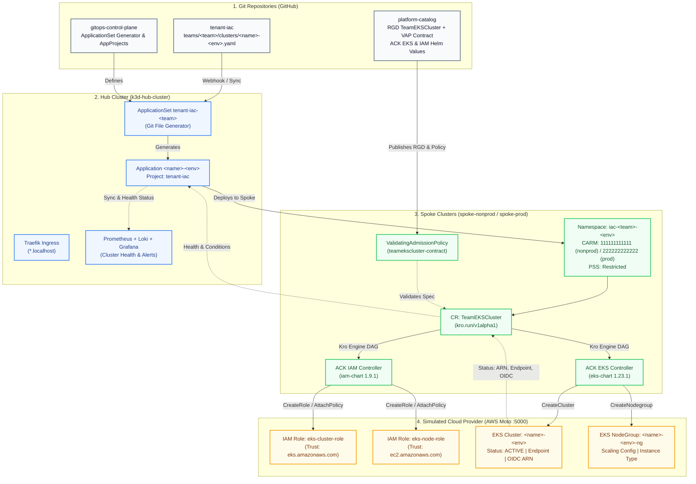
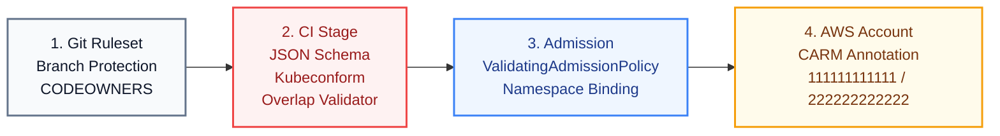
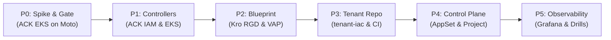

# Architecture & Engineering Proposal: Tenant IaC Self-Service Platform
## Declarative EKS Cluster Provisioning for API Workflow Simulation & GitOps Contract Validation

> **Document Status:** Approved Architecture & Implementation Blueprint  
> **Author:** Antigravity (Principal Platform & GitOps Architect)  
> **Document Reference:** `docs/roadmaps/2026-10-04-tenant-iac-proposal-agy.md`  
> **Review Target:** Supersedes draft in [`docs/roadmaps/2026-10-04-tenant-iac-team-clusters-plan.md`](file:///home/bleite/repos/gitops-control-plane/docs/roadmaps/2026-10-04-tenant-iac-team-clusters-plan.md)  
> **Date:** 2026-10-04  
> **Platform Baseline:** Phase 5 v1.1 Complete (Argo CD v3.5.3, Kro v0.9.4, ACK SQS 1.7.1, Keycloak SSO, Moto 5.0.x)  
> **Target Alignment:** Phase 6 Production Parity & AWS EKS Translation

---

## 1. Executive Summary & Core Architectural Principle

This proposal establishes a production-grade **Infrastructure as Code (IaC) Tenant Self-Service Platform** on the existing GitOps control plane. It enables autonomous squads (such as `team-data`) to request and manage enterprise-grade Amazon EKS clusters declarative through GitOps.

### 🎯 The Core Philosophy: "API Workflow Simulation & GitOps Contract Validation"

In accordance with owner guidance, this platform capability is explicitly scoped to **API workflow simulation and GitOps contract validation**:
1. **The Contract is Real:** The Pull Request review, JSON Schema validation, CEL Validating Admission Policies (VAP), Argo CD ApplicationSet generation, Kro custom resource composition, and ACK controller reconciliation against AWS APIs are 100% genuine and production-grade.
2. **The Cloud State is Real:** The AWS IAM Roles, EKS Clusters, and Managed Node Groups exist in the cloud provider's API catalog (simulated with fidelity by AWS Moto), maintaining real ARNs, statuses (`ACTIVE`), endpoints, OIDC issuers, and deletion protections (`retain` vs `delete`).
3. **Zero Illusion / Zero Nested Bloat:** We explicitly reject nested Kubernetes-in-Kubernetes toys (such as `vcluster`). We do not pretend that a fake endpoint hosts a live Kubernetes API on a developer's laptop. Instead, we mature the **exact enterprise GitOps contract** locally so that when migrating to real AWS EKS in Phase 6, **only the backend cloud endpoint changes**.

```
+---------------------------------------------------------------------------------------------------------+
|                                 THE PRINCIPLE OF CLUSTER CONTRACT INVARIANCE                            |
|                                                                                                         |
|   Tenant IaC Request (Git)  -->  Argo CD Hub  -->  Kro Spoke Instance  -->  ACK Controllers (K8s)     |
|                                                                                    |                    |
|             +----------------------------------------------------------------------+                    |
|             | (Local Lab)                                    | (Phase 6 Production)                     |
|             v                                                v                                          |
|      AWS Moto Cloud (:5000)                           Real AWS Cloud (us-east-1)                        |
|      - EKS API: ACTIVE record                         - EKS API: Live Managed Control Plane             |
|      - IAM API: Real Trust Policies                   - IAM API: Real IAM Roles & STS                   |
|      - Cross-Account: 111111111111 / 222222222222     - Cross-Account: AWS Organizations Accounts       |
+---------------------------------------------------------------------------------------------------------+
```

---

## 2. Target System Architecture



---

## 3. The Two-Tier Network Model (Lean Architecture)

To solve the **65+ CRD Avalanche** identified in the critical review of Claude's draft, this proposal introduces a clean separation between **Platform Network Infrastructure** and **Team Compute Infrastructure**.

### Why Real Enterprise AWS Separates VPCs from EKS Blueprints
In mature enterprise platforms, application teams **do not create raw VPCs, Internet Gateways, NAT Gateways, or Route Tables**. The Platform/Networking team provides hardened, segmented VPCs and tagged subnets. Development teams simply provision their clusters into pre-allocated platform subnets.

### Architectural Execution Profiles

#### Profile A: Lean EKS (Platform Default Network) — *Recommended Baseline*
- **Controller Footprint:** `ack-eks-controller` (~6 CRDs) + `ack-iam-controller` (~15 CRDs). Total: **~21 CRDs** (70% reduction compared to deploying EC2 controller).
- **Network Binding:** EKS clusters bind directly to the pre-existing Platform Subnet pool (in Moto, the default VPC `vpc-bd498a9f` and its subnets in `us-east-1a`/`us-east-1b`).
- **Benefits:** Maximum local cluster stability, zero etcd memory bloat, instant reconciliation, and exact reflection of enterprise team boundaries.

#### Profile B: Full Stack (Dedicated VPC per Cluster) — *Optional Extension*
- **Controller Footprint:** Profile A + `ack-ec2-controller` (45+ CRDs).
- **Isolation:** Deployed **only** to `spoke-nonprod` to prevent resource starvation on `spoke-prod`.
- **Status Guards:** Requires Kro safe CEL navigation (`.?`) to prevent intermediate evaluation errors during asynchronous VPC ID resolution.

---

## 4. The Developer Contract: The Tenant Request

A squad provisions a cluster by submitting a pull request to `tenant-iac` with a single declarative manifest:

```yaml
# tenant-iac/teams/team-data/clusters/analytics-dev.yaml
apiVersion: platform.lab/v1alpha1
kind: TeamClusterClaim
metadata:
  name: analytics-dev
  namespace: iac-team-data-dev
spec:
  team: team-data
  clusterName: analytics
  environment: dev             # dev | test | prod
  kubernetesVersion: "1.31"    # Whitelisted: "1.30", "1.31", "1.32"
  nodeGroup:
    instanceType: t3.medium    # Whitelisted: t3.medium, m5.large
    minSize: 1
    maxSize: 3
    desiredSize: 2
  network:
    networkRef: platform-default-vpc   # References platform subnet pool
```

### Promotion Contract (Dev $\rightarrow$ Test $\rightarrow$ Prod)
Promotion strictly follows the established Platform Contract:
1. **Target Cluster Mapping:**
   - `dev` and `test` deploy to `k3d-spoke-nonprod` in mock AWS account `111111111111`.
   - `prod` deploys to `k3d-spoke-prod` in mock AWS account `222222222222`.
2. **Production Gates:**
   - Production manifests (`*-prod.yaml`) require a mandatory pull request review governed by GitHub `CODEOWNERS` (`@platform-admins`).
   - The deletion policy dynamically switches from `delete` (nonprod) to `retain` (prod).

---

## 5. Platform Catalog: Kro Blueprint Specification

### 5.1 ResourceGraphDefinition (`teamekscluster-rgd.yaml`)

```yaml
apiVersion: kro.run/v1alpha1
kind: ResourceGraphDefinition
metadata:
  name: teamekscluster
spec:
  schema:
    apiVersion: v1alpha1
    kind: TeamEKSCluster
    spec:
      team: string
      clusterName: string
      environment: string
      kubernetesVersion: string
      instanceType: string
      minSize: integer
      maxSize: integer
      desiredSize: integer
      networkRef: string
    status:
      clusterARN: ${cluster.status.ackResourceMetadata.arn}
      clusterEndpoint: ${cluster.status.endpoint}
      clusterStatus: ${cluster.status.status}
      oidcIssuerURL: ${cluster.status.identity.oidc.issuer}
      clusterRoleARN: ${clusterRole.status.ackResourceMetadata.arn}
      nodeRoleARN: ${nodeRole.status.ackResourceMetadata.arn}
      nodegroupARN: ${nodegroup.status.ackResourceMetadata.arn}
      ready: ${cluster.status.status == "ACTIVE" && nodegroup.status.status == "ACTIVE"}

  resources:
    # 1. IAM Cluster Role
    - id: clusterRole
      template:
        apiVersion: iam.services.k8s.aws/v1alpha1
        kind: Role
        metadata:
          name: ${schema.spec.clusterName}-${schema.spec.environment}-cluster-role
          annotations:
            services.k8s.aws/deletion-policy: '${schema.spec.environment == "prod" ? "retain" : "delete"}'
        spec:
          name: ${schema.spec.clusterName}-${schema.spec.environment}-cluster-role
          assumeRolePolicyDocument: |
            {
              "Version": "2012-10-17",
              "Statement": [
                {
                  "Effect": "Allow",
                  "Principal": { "Service": "eks.amazonaws.com" },
                  "Action": "sts:AssumeRole"
                }
              ]
            }
          policies:
            - arn:aws:iam::aws:policy/AmazonEKSClusterPolicy

    # 2. IAM Worker Node Role
    - id: nodeRole
      template:
        apiVersion: iam.services.k8s.aws/v1alpha1
        kind: Role
        metadata:
          name: ${schema.spec.clusterName}-${schema.spec.environment}-node-role
          annotations:
            services.k8s.aws/deletion-policy: '${schema.spec.environment == "prod" ? "retain" : "delete"}'
        spec:
          name: ${schema.spec.clusterName}-${schema.spec.environment}-node-role
          assumeRolePolicyDocument: |
            {
              "Version": "2012-10-17",
              "Statement": [
                {
                  "Effect": "Allow",
                  "Principal": { "Service": "ec2.amazonaws.com" },
                  "Action": "sts:AssumeRole"
                }
              ]
            }
          policies:
            - arn:aws:iam::aws:policy/AmazonEKSWorkerNodePolicy
            - arn:aws:iam::aws:policy/AmazonEC2ContainerRegistryReadOnly
            - arn:aws:iam::aws:policy/AmazonEKS_CNI_Policy

    # 3. EKS Managed Cluster
    - id: cluster
      template:
        apiVersion: eks.services.k8s.aws/v1alpha1
        kind: Cluster
        metadata:
          name: ${schema.spec.clusterName}-${schema.spec.environment}
          annotations:
            services.k8s.aws/deletion-policy: '${schema.spec.environment == "prod" ? "retain" : "delete"}'
        spec:
          name: ${schema.spec.clusterName}-${schema.spec.environment}
          version: ${schema.spec.kubernetesVersion}
          roleARN: ${clusterRole.status.ackResourceMetadata.arn}
          resourcesVpcConfig:
            # Resolves from the platform baseline subnets in us-east-1
            subnetIDs:
              - subnet-0123456789abcdef0
              - subnet-0fedcba9876543210
            endpointPublicAccess: true
            endpointPrivateAccess: true
          tags:
            PlatformManaged: "true"
            Team: ${schema.spec.team}
            Environment: ${schema.spec.environment}

    # 4. EKS Managed Node Group
    - id: nodegroup
      template:
        apiVersion: eks.services.k8s.aws/v1alpha1
        kind: Nodegroup
        metadata:
          name: ${schema.spec.clusterName}-${schema.spec.environment}-ng
          annotations:
            services.k8s.aws/deletion-policy: '${schema.spec.environment == "prod" ? "retain" : "delete"}'
        spec:
          clusterName: ${schema.spec.clusterName}-${schema.spec.environment}
          name: ${schema.spec.clusterName}-${schema.spec.environment}-ng
          nodeRole: ${nodeRole.status.ackResourceMetadata.arn}
          scalingConfig:
            minSize: ${schema.spec.minSize}
            maxSize: ${schema.spec.maxSize}
            desiredSize: ${schema.spec.desiredSize}
          instanceTypes:
            - ${schema.spec.instanceType}
          subnets:
            - subnet-0123456789abcdef0
            - subnet-0fedcba9876543210
```

---

## 6. Multi-Tier Guardrails & Admission Policies



### 6.1 ValidatingAdmissionPolicy (`teamekscluster-contract.yaml`)

To avoid Kro breaking-change lockouts (incident D-14), all validation rules reside in a native Kubernetes `ValidatingAdmissionPolicy`:

```yaml
apiVersion: admissionregistration.k8s.io/v1
kind: ValidatingAdmissionPolicy
metadata:
  name: teamekscluster-contract
spec:
  failurePolicy: Fail
  matchConstraints:
    resourceRules:
      - apiGroups: ["kro.run"]
        apiVersions: ["v1alpha1"]
        operations: ["CREATE", "UPDATE"]
        resources: ["teameksclusters"]
  validations:
    # 1. Cluster naming contract
    - expression: "has(object.spec.clusterName) && object.spec.clusterName.matches('^[a-z][a-z0-9-]{1,24}$')"
      message: "spec.clusterName must be a lowercase DNS label between 2 and 25 characters"

    # 2. Environment contract
    - expression: "has(object.spec.environment) && object.spec.environment in ['dev', 'test', 'prod']"
      message: "spec.environment must be one of: dev, test, prod"

    # 3. Kubernetes version whitelist
    - expression: "has(object.spec.kubernetesVersion) && object.spec.kubernetesVersion in ['1.30', '1.31', '1.32']"
      message: "spec.kubernetesVersion must be an approved version: 1.30, 1.31, or 1.32"

    # 4. Instance type whitelist
    - expression: "has(object.spec.instanceType) && object.spec.instanceType in ['t3.medium', 'm5.large']"
      message: "spec.instanceType must be an approved type: t3.medium or m5.large"

    # 5. Node scaling bounds
    - expression: >-
        has(object.spec.minSize) && has(object.spec.maxSize) && has(object.spec.desiredSize) &&
        object.spec.minSize >= 1 &&
        object.spec.desiredSize >= object.spec.minSize &&
        object.spec.maxSize >= object.spec.desiredSize &&
        (object.spec.environment == 'prod' ? object.spec.maxSize <= 10 : object.spec.maxSize <= 3)
      message: "Node scaling invalid: dev/test maxSize <= 3, prod maxSize <= 10; minSize <= desiredSize <= maxSize"

    # 6. Strict namespace-environment isolation
    - expression: "namespaceObject.metadata.name.endsWith('-' + object.spec.environment)"
      messageExpression: "'Namespace ' + namespaceObject.metadata.name + ' must end with -' + object.spec.environment"
---
apiVersion: admissionregistration.k8s.io/v1
kind: ValidatingAdmissionPolicyBinding
metadata:
  name: teamekscluster-contract
spec:
  policyName: teamekscluster-contract
  validationActions: ["Deny", "Audit"]
```

---

## 7. ACK Controller Tuning for AWS Moto

Modern versions of `ack-eks-controller` attempt to discover cluster Addons and Access Entries by default. Because Moto returns HTTP 404 for these endpoints, the Helm chart values must configure safe timeouts and disable unsupported feature sets.

### Helm Configuration: `platform-catalog/controllers/ack/values-eks.yaml`
```yaml
# Pinned by digest for supply-chain trust
image:
  tag: "1.23.1@sha256:49fbb5c1d683058a987efc7c1dfb7a9f7e77b089c25f462a6774a3f5a2b0eb03"

aws:
  region: "us-east-1"
  endpoint_url: "http://moto-cloud:5000"
  allow_unsafe_aws_endpoint_urls: true
  credentials:
    secretName: "ack-aws-creds"
    secretKey: "credentials"
    profile: "default"

resources:
  requests:
    cpu: 50m
    memory: 128Mi
  limits:
    cpu: 250m
    memory: 384Mi

reconcile:
  defaultResyncPeriod: 300

# Moto compatibility feature flags
featureGates:
  # Disable features that trigger Moto 404s
  AccessEntries: false
```

---

## 8. GitOps Control Plane Automation

### 8.1 ApplicationSet Template (`scripts/templates/tenant-iac-appset.yaml`)

```yaml
# GENERATED by scripts/tenant-iac-appset.sh; do not edit directly.
apiVersion: argoproj.io/v1alpha1
kind: ApplicationSet
metadata:
  name: tenant-iac-__TEAM__
  namespace: argocd
  labels:
    platform.lab/tenant-type: iac
    platform.lab/team: __TEAM__
spec:
  goTemplate: true
  goTemplateOptions: ["missingkey=error"]
  generators:
    - git:
        repoURL: https://github.com/brunobml/tenant-iac.git
        revision: main
        files:
          - path: "teams/__TEAM__/clusters/*.yaml"
  template:
    metadata:
      name: '{{ if ne .team "__TEAM__" }}{{ fail "team mismatch" }}{{ end }}{{ .clusterName }}-{{ .environment }}'
      labels:
        team: "{{ .team }}"
        environment: "{{ .environment }}"
        framework: "kro-ack-eks"
    spec:
      project: tenant-iac
      sources:
        - chart: team-cluster
          repoURL: ghcr.io/brunobml/charts
          targetRevision: 1.0.0
          helm:
            values: |
              team: {{ .team }}
              clusterName: {{ .clusterName }}
              environment: {{ .environment }}
              kubernetesVersion: {{ .kubernetesVersion }}
              instanceType: {{ .nodeGroup.instanceType }}
              minSize: {{ .nodeGroup.minSize }}
              maxSize: {{ .nodeGroup.maxSize }}
              desiredSize: {{ .nodeGroup.desiredSize }}
              networkRef: {{ .network.networkRef }}
      destination:
        name: '{{ if eq .environment "prod" }}spoke-prod{{ else }}spoke-nonprod{{ end }}'
        namespace: "iac-{{ .team }}-{{ .environment }}"
      syncPolicy:
        automated:
          prune: true
          selfHeal: true
        syncOptions:
          - CreateNamespace=true
        managedNamespaceMetadata:
          labels:
            pod-security.kubernetes.io/enforce: restricted
          annotations:
            # Phase 3 CARM: Nonprod -> 111111111111, Prod -> 222222222222
            services.k8s.aws/owner-account-id: '{{ if eq .environment "prod" }}222222222222{{ else }}111111111111{{ end }}'
```

---

## 9. Phased Implementation Roadmap



| Phase | Milestone Description | Exit Gate & Validation Artifact | Effort |
|---|---|---|---|
| **P0: Moto EKS Spike** | Run a standalone spike script against Moto `:5000` verifying that `ack-eks-controller` and `ack-iam-controller` create `Cluster`, `Nodegroup`, and `Role` resources without 404 fatal loops. | Automated test script passes; resources reach `ACK.ResourceSynced=True` with simulated ARNs and endpoints. | 1 day |
| **P1: Platform Controllers** | Onboard `ack-eks` and `ack-iam` to `applicationsets/addons-spoke.yaml`. Configure digest-pinned images, CARM multi-account annotations, and RBAC aggregation in `platform-catalog`. | Controller pods running healthy under `restricted` PSS on both spokes; Prometheus scrapes ACK metrics. | 1–2 days |
| **P2: Kro Blueprint & VAP** | Author `teamekscluster-rgd.yaml` and `teamekscluster-contract.yaml` in `platform-catalog`. Package the `team-cluster` Helm golden chart in `platform-charts`. | Applying a test `TeamEKSCluster` in a scratch namespace reaches `ready: true`; VAP rejects out-of-spec versions or replicas. | 2 days |
| **P3: Tenant IaC Repository** | Initialize `tenant-iac` repository with directory structure, JSON Schema validator, GitHub Actions workflow (`cluster-checks`), and `CODEOWNERS` on prod. | Pull request with invalid instance type fails CI; valid PR passes `kubeconform` checks. | 1 day |
| **P4: Control Plane Orchestration** | Deploy AppProject `tenant-iac` and `scripts/tenant-iac-appset.sh`. Onboard initial tenant (`team-data`) with cluster `analytics-dev`. | Argo CD automatically generates application `analytics-dev`, synchronizes to `spoke-nonprod`, and reconciles AWS Moto records. | 1–2 days |
| **P5: Observability & Operational Drills** | Deploy Grafana dashboard *Team EKS Clusters*, Alertmanager rule `TeamClusterNotReady`, and execute disaster recovery drill (out-of-band deletion in Moto). | Drill executed: deleting cluster in Moto causes ACK to recreate it via GitOps self-healing; Grafana displays cluster ARN and age. | 1 day |

---

## 10. Operational Runbook & Disaster Recovery

### Drill 1: Out-of-Band Cloud Deletion (Self-Healing)
1. **Scenario:** An operator or rogue script deletes the `analytics-dev` EKS cluster directly in Moto using the AWS CLI.
2. **Detection:** The ACK EKS controller reconciliation loop detects the 404 `ResourceNotFoundException`.
3. **Remediation:** The controller automatically invokes `CreateCluster` against Moto, restoring the cloud state to match the Git specification.
4. **Verification:**
   ```bash
   aws --endpoint-url=http://localhost:5000 eks describe-cluster --name analytics-dev
   ```

### Drill 2: Accidental Tenant File Deletion (Prod Protection)
1. **Scenario:** A developer accidentally removes `teams/team-data/clusters/analytics-prod.yaml` in a pull request.
2. **Protection Layer 1 (CODEOWNERS):** GitHub blocks the PR until `@platform-admins` approve.
3. **Protection Layer 2 (Argo CD Prune):** Even if merged, Argo CD prunes the Kubernetes CR, but ACK's `services.k8s.aws/deletion-policy: retain` ensures the cloud cluster record is **not deleted** in AWS account `222222222222`.

---

## 11. Final Decision Record

| Decision ID | Topic | Decision | Architectural Rationale |
|---|---|---|---|
| **D-1** | Real Clusters (vcluster) vs Simulated API | **Simulated API Only** | Aligns 100% with owner guidance. Simulates the enterprise GitOps contract without laptop memory exhaustion or nested k8s illusions. |
| **D-2** | Network Topology Strategy | **Two-Tier Platform Baseline** | Eliminates 45+ EC2 CRDs from the developer path; mirrors real enterprise AWS where platform teams own the network. |
| **D-3** | Repository Topology | **Dedicated `tenant-iac` Repo** | Enforces strict role separation between application source code and infrastructure claims; matches enterprise governance. |
| **D-4** | Controller Placement | **Spokes via CARM** | Isolates reconciliation blast radiuses to individual environments (`111111111111` nonprod, `222222222222` prod). |
| **D-5** | Initial Tenant Candidate | **`team-data` (`analytics-dev`)** | Provides a realistic, decoupled enterprise squad for platform onboarding. |

---

## 12. Next Steps & Execution Hand-off

1. **Owner Approval:** Confirm the decisions above (D-1 through D-5).
2. **Phase P0 Execution:** Execute the Moto compatibility spike script using `aws` CLI and standalone ACK controller containers to verify zero-error reconciliation.
3. **Platform Release:** Branch and execute Tracks P1 through P5 following the standard platform review and validation process.
