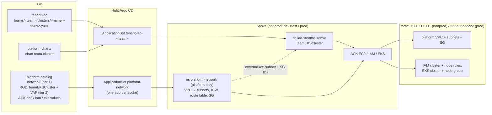

# Plan: Tenant IaC — Self-Service Team Clusters on the Lab Platform

> **Status: v0.2 for peer review (2026-10-04).** Not executed. This version replaces v0.1 (`b019ed9`) and merges [Antigravity's review](2026-10-04-tenant-iac-plan-review.md) and [proposal](2026-10-04-tenant-iac-proposal-agy.md) with [Claude's response](2026-10-04-tenant-iac-plan-review-claude.md), plus the owner's decisions (§8). Next: Antigravity sign-off, then P0. Executor and validator are different parties, as usual.

| | |
|---|---|
| **Goal** (owner) | **API workflow simulation and GitOps contract validation.** Mature the flow locally so that moving to real AWS later only changes the cloud endpoint and the identities |
| **Idea in one line** | A team requests an EKS cluster with one small file in a new `tenant-iac` repo. The platform reconciles it, through the same GitOps path as tenant apps, into IAM roles, an EKS cluster and a node group in the team's environment account (moto), placed in a **platform-owned network** |
| **Not in scope** | Usable Kubernetes behind the cluster (moto's EKS is an API record; no vcluster, see §1); per-controller IAM roles (O-8, deferred to the real-AWS move) |
| **Reuses** | per-tenant ApplicationSets (B.2), golden chart (`platform-charts`), kro blueprints + VAP contract (`platform-catalog`), ACK + CARM, required PR checks (Track A), the CI toolkit, monitoring |
| **Author** | Claude (Opus 5.5) |

---

## 1. What moto gives us (verified 2026-10-04)

| Capability | moto | Consequence |
|---|---|---|
| VPC, subnets, internet gateway, route table, security group | ✅ | the platform network can be fully declared |
| Default VPC per account (`172.31.0.0/16`) | ✅, but **IDs are random per account and change after every moto restart** (in-memory) | never hard-code IDs; read them from objects (§2) |
| IAM roles | ✅ | |
| AWS-managed policies (`AmazonEKSClusterPolicy`, …) | ❌ `NoSuchEntity` **by default** | load them: `MOTO_IAM_LOAD_MANAGED_POLICIES=true` (O-7) |
| EKS `CreateCluster` | ✅ immediately `ACTIVE`: ARN, version, endpoint, CA, **OIDC issuer** | a **cloud record only**: the endpoint is fake, there is no Kubernetes behind it |
| EKS node group, Fargate profile | ✅ `ACTIVE` records | no real nodes |
| EKS access entries, add-ons, cluster versions | ❌ HTTP 404 | not used by the blueprint; the controllers are limited to the kinds we use (`reconcile.resources`) |

ACK charts: `ec2-chart` 1.21.2 (20 CRDs), `iam-chart` 1.9.1 (7), `eks-chart` 1.23.1 (8), plus 2 shared ACK CRDs that the SQS chart already installs. Total new CRDs per spoke: **35**.

## 2. Design: two tiers



**Tier 1: platform network (owned by the platform, O-3 = GitOps).**
- One network per environment account: `spoke-nonprod` (account 111…, shared by dev and test) and `spoke-prod` (222…).
- Declared as plain ACK objects in `platform-catalog/network/`, in namespace `platform-network`, which teams cannot write to.
- Delivered by a new ApplicationSet `platform-network` (clusters generator, `addons-managed=true`). The CARM account comes from the cluster label `environment` (`nonprod` → 111…, `prod` → 222…).

| Object (name in `platform-network`) | nonprod | prod |
|---|---|---|
| `VPC platform-vpc` | 10.10.0.0/16 | 10.20.0.0/16 |
| `Subnet platform-subnet-a` / `-b` (us-east-1a / 1b) | 10.10.0.0/20, 10.10.16.0/20 | 10.20.0.0/20, 10.20.16.0/20 |
| `InternetGateway`, `RouteTable` (0.0.0.0/0 → IGW) | ✓ | ✓ |
| `SecurityGroup platform-cluster-sg` | ✓ | ✓ |

All tier-1 objects use `deletion-policy: retain`. Public subnets keep the lab simple (private + NAT later if wanted).

**Tier 2: team cluster (kro RGD `TeamEKSCluster`).**
- **Reads** the network with kro `externalRef`. This is supported in kro 0.9.4 (`externalRef.metadata.{name,namespace}`). The references are `platform-subnet-a`, `platform-subnet-b` and `platform-cluster-sg` in `platform-network`, and the blueprint uses their `status` IDs.
- **No ID is ever written in Git.** After a moto restart, ACK recreates the network with new IDs, and kro re-renders the team objects (P0 drill).

| Resource | Spec from | Notes |
|---|---|---|
| `iam Role <name>-<env>-cluster` | fixed trust (eks.amazonaws.com) + `AmazonEKSClusterPolicy` | |
| `iam Role <name>-<env>-node` | fixed trust (ec2.amazonaws.com) + `AmazonEKSWorkerNodePolicy`, `AmazonEKS_CNI_Policy`, `AmazonEC2ContainerRegistryReadOnly` | |
| `eks Cluster <name>-<env>` | version; `roleARN: ${clusterRole.status.ackResourceMetadata.arn}`; subnets + SG from `externalRef` | |
| `eks Nodegroup <name>-<env>-ng` | `clusterName: ${cluster.spec.name}` (**a reference, so kro orders create and delete**); `nodeRole` from the node role's ARN; scaling; instance type; subnets | |
| **status** | | `clusterARN`, `endpoint`, `oidcIssuer`, `clusterStatus`, `nodegroupStatus`, `vpcID`, `subnetIDs`, `ready` |

- Every team resource uses `deletion-policy: '${env == "prod" ? "retain" : "delete"}'`, the same pattern as `QueueBackedService`.
- Status references are plain (no `.?`). kro waits until a referenced value exists, as the SQS blueprint has done since Phase 3.

## 3. The team's request (flat, like `tenant-workloads`)
```yaml
# tenant-iac/teams/team-data/clusters/analytics-dev.yaml
team: team-data            # must equal the directory
name: analytics            # resources are named analytics-dev-*
env: dev                   # dev | test | prod -> spoke + account
kubernetesVersion: "1.31"  # allowed list (confirmed in P0)
nodeGroup:
  instanceType: t3.medium  # allowed list
  minSize: 1
  desiredSize: 2
  maxSize: 3
network: platform-default  # the only value for now; the platform owns the network
```
No `apiVersion`/`kind`: the file is generator input, not a Kubernetes object.

## 4. Guardrails
| Layer | Rule |
|---|---|
| Git | `tenant-iac` `main`: ruleset with **PR + required check `cluster-checks`**. CODEOWNERS `@brunobml` (a personal account has no teams) on `teams/*/clusters/*-prod.yaml` |
| CI `cluster-checks` | JSON Schema; file name = `<name>-<env>.yaml`; `team` = directory; unique `name-env` across teams; max clusters per team; render through the real ApplicationSet template + chart, then kubeconform with the `TeamEKSCluster` schema (Track A toolkit); positive and negative fixtures |
| ApplicationSet | same `fail` checks as `scripts/templates/tenant-appset.yaml` (team matches directory, `env` in dev/test/prod) under `missingkey=error` |
| Admission (VAP `teamekscluster-contract`) | allowed versions and instance types; `1 ≤ min ≤ desired ≤ max`, `max ≤ 3` (dev/test) or `≤ 5` (prod); `network == "platform-default"`; namespace = `iac-<team>-<env>`. Constraints live here, not in the RGD schema (D-14; the `rgd-schema` CI stage guards the schema) |
| Argo CD | AppProject `tenant-iac`: source the chart + `tenant-iac` repo; destinations `iac-*` only; kinds `*` (keeps kro's children visible in the UI); teams cannot target `platform-network` |
| Accounts | env → account by the platform (CARM namespace annotation), never by the team |
| Prod | `retain` deletion policy; gate = PR + required check + CODEOWNERS. **No commit-SHA pin** (proposed): unlike `tenant-workloads`, there is no separate values repository to pin; the merged claim file *is* the reviewed change. Reviewer to confirm |

## 5. Controllers
- `addons-spoke` gains three elements in `ack-system`: `ack-ec2` (`ec2-chart` 1.21.2), `ack-iam` (`iam-chart` 1.9.1) and `ack-eks` (`eks-chart` 1.23.1).
- Each element:
  - pins its image by digest, taken from the registry (as SQS, Step 0.6);
  - uses the moto endpoint;
  - sets `reconcile.resources` to the kinds used: EC2 `[VPC, Subnet, InternetGateway, RouteTable, SecurityGroup]`, IAM `[Role]`, EKS `[Cluster, Nodegroup]`;
  - gets memory requests and limits measured in P0 (start at 128Mi / 384Mi);
  - runs under PSS `restricted` and is scraped by Prometheus;
  - is covered by `SpokeControllerDown`.
- kro RBAC: an aggregated ClusterRole for `teameksclusters`, the three ACK kinds, and **read** access to EC2 `subnets`/`securitygroups`/`vpcs` (for `externalRef`).
- **Moto (O-7):** add `-e MOTO_IAM_LOAD_MANAGED_POLICIES=true` to the moto container in `scripts/setup-hub-spoke.sh` **and** to the create path of `scripts/start-hub-spoke.sh`, which today lacks even `MOTO_ALLOW_NONEXISTENT_SERVICES` (fix that inconsistency at the same time). Applying it means recreating `moto-cloud`. Moto state is lost, and ACK recreates the SQS queues under the same names, as after any moto restart. This is a disruptive step that needs owner approval when it is executed.
- **CARM (O-8, deferred):** the new controllers share `ack-role-account-map`, which names `role/ack-sqs-controller`. Moto does not check this. For real AWS, use per-service roles (`ServiceLevelCARM` gate). Recorded as residual **R-1**.

## 6. Phases

| Phase | Content | Exit gate | Effort |
|---|---|---|---|
| **P0 Spike** (throwaway k3d cluster + separate moto container; the lab is untouched) | moto with managed policies. The 3 controllers with `reconcile.resources`. The tier-1 network, then a hand-written `TeamEKSCluster` RGD + instance | (1) all resources `ACK.ResourceSynced=True` and `ready=true`; (2) the controllers make **no failing calls** (log scan for 404/`UnknownOperation`); (3) **delete**: nonprod instance deleted cleanly in order (node group → cluster → roles), prod-style `retain` leaves records; (4) **moto restart**: network and cluster recreated with new IDs, the team cluster follows; (5) cross-namespace `externalRef` works; (6) controller memory measured; (7) allowed Kubernetes versions confirmed. **No-go** if (1), (2) or (5) fails without a lab-sized fix | S–M |
| **P1 Platform** | controllers in `addons-spoke`; moto env change (owner-approved window); tier-1 network ApplicationSet + `platform-catalog/network/`; kro RBAC; monitoring | controllers healthy on both spokes; both networks `Synced`; CI green; existing SQS tenants unaffected (smoke) | M |
| **P2 Blueprint** | RGD `TeamEKSCluster` + VAP `teamekscluster-contract` (CEL compiled in CI); chart `team-cluster` 1.0.0 in `platform-charts` (PR + `chart-checks`) | scratch instance reaches `ready`; VAP denies each out-of-range case | M |
| **P3 Tenant repo** | `brunobml/tenant-iac` (public): layout, README, JSON Schema, CODEOWNERS, `cluster-checks` workflow; ruleset after the check has run once | negative fixtures red, positive green; direct push to `main` refused | S |
| **P4 Control plane** | AppProject `tenant-iac`; template + `scripts/tenant-iac-appset.sh`; `tenant-iac-team-data` ApplicationSet; `post-bootstrap`/orphan checks aware of `iac-*` and `platform-network`; CI stage extended | `team-data` gets `analytics-dev` end to end through a PR; then `analytics-prod` through a PR with CODEOWNERS review | M |
| **P5 Operations** | Argo CD health for `TeamEKSCluster`; Grafana panel *Team clusters* (state, ARN, age); alert `TeamClusterNotReady`; runbook (request, change, delete, prod, moto restart); drills: out-of-band delete in moto (ACK recreates), removal of a prod file (record retained); smoke stage | drills executed and recorded; alert fired once; full rebuild runbook still passes | M |

## 7. Changes per repo
| Repo | Changes |
|---|---|
| `tenant-iac` (new) | claims, schema, `cluster-checks` workflow, CODEOWNERS, README |
| `platform-catalog` | `controllers/ack/values-{ec2,iam,eks}.yaml`; `network/` (tier 1); `blueprints/team-eks-cluster-rgd.yaml`, `team-eks-cluster-policy.yaml`, `kro-rbac-team-eks-cluster.yaml` |
| `platform-charts` | chart `team-cluster` |
| `gitops-control-plane` | `addons-spoke` elements; ApplicationSet `platform-network`; AppProject `tenant-iac`; template + `scripts/tenant-iac-appset.sh`; moto flags in `setup-hub-spoke.sh` / `start-hub-spoke.sh`; CI toolkit; observability; runbooks; README |

## 8. Decisions
| ID | Decision | By |
|---|---|---|
| O-1 | No vcluster / usable clusters: API simulation only | owner (via review), both authors agree |
| O-2 | One `tenant-iac` repo, one ApplicationSet per team | v0.1 + review |
| O-3 | **Platform network via GitOps** (tier 1, EC2 controller), read by `externalRef` | **owner, 2026-10-04** |
| O-4 | Controllers on the spokes, accounts via CARM | v0.1 + review |
| O-5 | Prod allowed: PR + required check + CODEOWNERS, `retain` | v0.1 + review |
| O-6 | First tenant `team-data` / `analytics` | v0.1 + review |
| O-7 | **Load AWS-managed IAM policies into moto** | **owner, 2026-10-04** |
| O-8 | **Per-controller IAM roles deferred** to the real-AWS move (R-1) | **owner, 2026-10-04** |

## 9. Risks and residuals
| Risk | Mitigation |
|---|---|
| The ACK EKS controller makes calls that moto lacks | P0 gate (2); `reconcile.resources`; pin versions that pass |
| Laptop footprint: 3 controllers × 2 spokes, 35 CRDs each, larger moto (managed policies) | measured in P0 gate (6); stop at P0 if unacceptable |
| moto restart: all IDs change | ACK recreates, kro re-renders via `externalRef`; proven in P0 gate (4), runbook in P5 |
| Teardown stuck on finalizers | the team graph is only Role → Cluster → Nodegroup with real references; the network is never deleted by teams; proven in P0 gate (3) |
| RGD schema changes are hard (kro, D-14) | fields designed up front; constraints in the VAP; `rgd-schema` CI stage |
| Deleting a prod cluster by removing a file | CODEOWNERS + PR; `retain` |
| **R-1 (accepted, O-8)** | All ACK controllers assume `role/ack-sqs-controller` in each account. Correct only in moto; replace with per-service roles when moving to real AWS |
