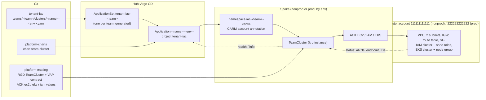

# Plan: Tenant IaC — Self-Service Team Clusters on the Lab Platform

> **Status: Draft for discussion (v0.1, 2026-10-04).** Not approved, nothing executed. Next steps: owner decisions (§7), then peer review (Antigravity), then the usual execute/validate split.

| | |
|---|---|
| **Request** | *"Can I have a new tenant for IaC … a new repo called something like `tenant-iac` … a new kro blueprint … use whatever capability AWS moto has for EKS, EC2, VPC … provide new EKS clusters for a team."* (owner, 2026-10-04) |
| **Idea in one line** | A team asks for a cluster with one small file in a new `tenant-iac` repo. The platform turns it, through the same GitOps path as tenant apps today, into a VPC, subnets, security group, IAM roles, an EKS cluster and a node group in the team's cloud account (moto) |
| **Reuses** | per-tenant ApplicationSets (B.2), golden chart (`platform-charts`), kro blueprints + admission contract (`platform-catalog`), ACK with per-environment accounts (CARM), required PR checks (Track A), the lab's CI toolkit, monitoring |
| **Author** | Claude (Opus 5.5) |

---

## 1. What "an EKS cluster" means in this lab (read first)

Probed live on 2026-10-04 against the lab's moto (`motoserver/moto@sha256:91fd602a…`), in a scratch account `333333333333` that was cleaned up afterwards:

| Capability | moto | Consequence |
|---|---|---|
| VPC, subnets (2 AZs), internet gateway (attach), security group, `DescribeVpcAttribute` | ✅ | full network layer possible |
| EC2 `RunInstances` | ✅ | (not needed for EKS) |
| IAM roles (cluster role, node role) | ✅ | |
| **EKS `CreateCluster`** | ✅ **immediately `ACTIVE`**, ARN, version `1.31`, an `endpoint` and CA data | the cluster exists **as a cloud record only**: the endpoint is fake, **there is no Kubernetes behind it** |
| EKS node group, Fargate profile | ✅ `ACTIVE` (records) | scaling config stored, no nodes |
| EKS **access entries, add-ons, cluster versions** | ❌ HTTP 404 (not implemented) | the blueprint must not use them; the spike (P0) checks that the ACK EKS controller does not call them for a plain cluster |

ACK controllers available (`public.ecr.aws/aws-controllers-k8s`): **ec2-chart 1.21.2, eks-chart 1.23.1, iam-chart 1.9.1** (the lab runs sqs-chart 1.7.1 today).

**So, with moto alone:** teams get the *whole self-service IaC flow*. That covers the request in Git, the review and guardrails, the platform-owned network and IAM design, per-environment accounts, status (ARN, endpoint, VPC/subnet IDs), deletion and retention policies, and observability. But **not a cluster they can `kubectl` into**. If a usable cluster is wanted, see option **P6** (a real lightweight cluster per request, alongside the moto records). That is owner decision **O-1**.

## 2. Target design



**The request, written by the team** (example; the format is settled in P3):
```yaml
# tenant-iac/teams/team-data/clusters/analytics-dev.yaml
team: team-data
name: analytics            # cluster name prefix; resources are named analytics-dev-*
env: dev                   # dev | test | prod  -> spoke + AWS account, as for tenant apps
kubernetesVersion: "1.31"  # from an allowed list
nodeGroup:
  instanceType: t3.medium  # from an allowed list
  desiredSize: 2           # bounded per env by the contract
vpcCidr: 10.100.0.0/16     # from the platform pool; unique (CI)
```

**What the blueprint creates** (kro RGD `TeamCluster`, platform-owned):

| Resource (ACK) | From | Notes |
|---|---|---|
| `ec2.services.k8s.aws/VPC` | `vpcCidr` | DNS hostnames on |
| `Subnet` × 2 | two /20s inside the VPC, AZ a and b | EKS needs 2 AZs |
| `InternetGateway`, `RouteTable` | VPC | public subnets (lab simplicity; private + NAT later if wanted) |
| `SecurityGroup` | VPC | cluster SG |
| `iam.services.k8s.aws/Role` × 2 | fixed trust policies | cluster role (eks.amazonaws.com), node role (ec2.amazonaws.com) |
| `eks.services.k8s.aws/Cluster` | version, subnets, SG, cluster role | |
| `Nodegroup` | instance type, scaling | |
| **status** | | `clusterARN`, `endpoint`, `vpcID`, `subnetIDs`, `ready` |

## 3. Guardrails (same layers as tenant apps)
| Layer | Rule |
|---|---|
| Git | `tenant-iac` `main` = **pull request + required check** (ruleset as on `tenant-workloads`); CODEOWNERS on `teams/*/clusters/*-prod.yaml` |
| CI (`cluster-checks`) | JSON Schema; file name = `<name>-<env>.yaml`; `team` = directory; **unique name per env** and **non-overlapping `vpcCidr`** across all teams; render through the real ApplicationSet + chart, then kubeconform with the `TeamCluster` CRD schema (Track A toolkit) |
| Admission (VAP `teamcluster-contract`) | allowed versions and instance types; `desiredSize` 1–3 (dev/test), 2–5 (prod); `vpcCidr` inside the platform pool (e.g. `10.100.0.0/14`), /16 only. Enforced even if CI is bypassed |
| Argo CD | AppProject `tenant-iac`: destinations `iac-*` namespaces only. Kinds stay `*` for **visibility** (narrowing kinds hides kro's child resources in the UI, the owner's standing preference); the VAP does the restricting |
| Accounts | env → account by the platform (CARM namespace annotation), never by the team |
| Lifecycle | nonprod: ACK deletion policy `delete`; prod: `retain` (as the SQS blueprint) |
| Quotas | max clusters per team (CI count; optional ResourceQuota on `teamclusters.kro.run`) |
| Schema evolution | kro refuses breaking changes to an RGD schema (Phase 3 D-14): design the fields up front, keep constraints in the VAP. The existing `rgd-schema` CI stage (`ci/check-rgd-schema.py`) guards it |

## 4. Phases

| Phase | Content | Gate | Effort |
|---|---|---|---|
| **P0 Spike** (throwaway k3d cluster + moto scratch account) | Install ACK ec2/iam/eks controllers pointed at moto. Reconcile VPC, Subnet, IGW, RouteTable, SG, Role, Cluster, Nodegroup. Record every API call that fails (moto 404s: access entries, add-ons). Check deletion order and finalizers. Check kro can wire the ACK outputs (IDs, ARNs) between resources | all resources `ACK.ResourceSynced=True`; clean delete. **If the EKS controller cannot work against moto:** decide between (a) network + IAM only, plus the EKS record via a platform Job (less GitOps-pure), or (b) stop at P0 | S–M |
| **P1 Platform capability** | ACK ec2/iam/eks in `addons-spoke` (values in `platform-catalog/controllers/`, digest-pinned images, moto endpoint, CARM); kro RBAC aggregation for the new kinds; Prometheus scrape; `SpokeControllerDown` covers the new controllers; PSS `restricted` on their namespaces | controllers healthy on both spokes; CI green | M |
| **P2 Blueprint** | RGD `TeamCluster` + VAP `teamcluster-contract` (CEL compiled by the CI); chart `team-cluster` 1.0.0 in `platform-charts` (PR + `chart-checks`) | a `TeamCluster` applied by hand in a scratch namespace reaches `ready`; contract denies out-of-range values | M |
| **P3 Tenant repo** | new repo `tenant-iac`: layout, README, JSON Schema, CODEOWNERS, CI workflow (`cluster-checks`, via the toolkit), ruleset (PR + required check) | negative tests red in CI (bad CIDR, overlap, unknown version, duplicate) | S–M |
| **P4 Control plane** | AppProject `tenant-iac`; per-team ApplicationSet `tenant-iac-<team>` from a template + generator script (as `tenant-workloads-<tenant>`); namespace metadata (PSS restricted, CARM); `post-bootstrap` / orphans aware of the new namespaces; CI stage `tenant-appsets` extended | first team (`team-data`) self-serves `analytics-dev` end to end via a PR | M |
| **P5 Operations** | Argo CD health for `TeamCluster` (kro instance state); Grafana panel *Team clusters* (state, ARN, age); alert `TeamClusterNotReady`; runbook (request, change, delete, prod promotion) + a drill (delete a VPC out of band, ACK recreates it); smoke stage | runbook + drill executed; alert fired once | M |
| **P6 (optional, O-1)** | **Real, usable clusters:** per `TeamCluster`, also start a lightweight Kubernetes the team can actually use, e.g. a **vcluster** in the spoke namespace (no extra k3d cluster), kubeconfig delivered as a Secret, optionally registered in Argo CD as a deploy target. The moto EKS record stays the "cloud" view | team can `kubectl` into its cluster; Argo CD can deploy to it | M–L |

The tracks are executed and validated by different parties, as for the remediation plans. The lab's rebuild (`full-rebuild-and-acceptance.md`) must still pass after P4 and P6.

## 5. What changes where
| Repo | Changes |
|---|---|
| `tenant-iac` (new) | registrations, schema, CI workflow, CODEOWNERS, README |
| `platform-catalog` | `controllers/ack/values-{ec2,iam,eks}.yaml`, `blueprints/team-cluster-rgd.yaml`, `blueprints/team-cluster-policy.yaml`, `blueprints/kro-rbac-team-cluster.yaml` |
| `platform-charts` | chart `team-cluster` |
| `gitops-control-plane` | `addons-spoke` elements, AppProject `tenant-iac`, ApplicationSet template + `scripts/tenant-iac-appset.sh`, CI toolkit (`check-tenant-iac.sh`, CRD schemas regenerated), observability, runbooks, README |

## 6. Risks
| Risk | Mitigation |
|---|---|
| ACK EKS/EC2 controllers expect AWS behaviour moto lacks (calls that 404, eventual-consistency waits) | P0 spike first, with an explicit go/no-go; pin controller versions that pass |
| Expectation gap: "EKS cluster" without Kubernetes | §1 stated up front; O-1 decides whether P6 is in scope |
| Laptop resources: 3 more controllers × 2 spokes (+ vclusters in P6) | measure in P0/P1 (requests/limits as for SQS: 50m/64Mi); P6 only for a few clusters |
| CIDR conflicts between teams | platform pool + CI overlap check + VAP |
| RGD schema cannot change in place (kro) | design fields up front; `rgd-schema` CI stage; version the kind if needed |
| Deleting a prod cluster by removing a file | prod `retain`; CODEOWNERS + PR review on `*-prod.yaml` |
| moto restarts empty | as today: ACK recreates from the Kubernetes objects; the new records get new IDs/ARNs (documented) |

## 7. Decisions to discuss
| ID | Question | Author's recommendation |
|---|---|---|
| **O-1** | moto-only "cloud records", or also **real usable clusters** (P6, vcluster)? | Start moto-only (P0–P5); decide P6 after seeing it work |
| **O-2** | Tenant model: one `tenant-iac` repo for all teams (`teams/<team>/…`), like `tenant-workloads`? | Yes: one repo, one ApplicationSet per team |
| **O-3** | Network: teams pick a `vpcCidr` from the pool, or the platform assigns it? | Team picks from the pool, CI + VAP check it (simple, visible in Git) |
| **O-4** | Where do the ACK ec2/iam/eks controllers run? | On the spokes, per environment, exactly like ACK SQS (accounts via CARM) |
| **O-5** | Prod clusters at all, and with which gate? | Yes, with the existing pattern: PR + required check + CODEOWNERS, `retain` deletion policy |
| **O-6** | Which teams/names to start with? | `team-data` with `analytics-dev`, then `-test`/`-prod` as the promotion example |
