# Runbook: Argo CD CLI, SSO Login and Temporary Users

> **Status: Current.** Created 2026-10-04. Every screenshot is from this lab, taken with the temporary SSO users this runbook describes (§7). The terminal images are real CLI output, rendered as images, and the browser images are real sessions. Long one-time login URLs are shortened with `…`.

**Related:** [README](../../README.md) (URLs, users, `make password`), [lifecycle runbook](host-reboot-and-cluster-lifecycle.md) (Issue G: SSO unavailable), [full rebuild runbook](full-rebuild-and-acceptance.md).

---

## 1. Why the CLI matters in this lab

The UI is great for looking; the CLI is how this lab is **operated, automated and checked**:

| Situation | Why the CLI |
|---|---|
| **Argo CD manages itself** (`argo-cd` Application, **manual sync by design**) | Every Argo CD change is `argocd app diff argo-cd` (see exactly what changes) followed by `argocd app sync argo-cd`. One wrong sync of Argo CD can lock you out, so you diff first |
| **Automation** | `post-bootstrap.sh`, `register-spokes.sh` and `renew-credentials.sh` drive Argo CD with the CLI, each with its **own** `--config`, so they never read or change your session |
| **Keycloak down** | The local **break-glass** account `platform-admin` works without SSO (§3.2) |
| **Proving access rules** | `argocd account can-i …` answers "may this identity do X?" without trying it. The RBAC checks below rely on it |
| **Fast inventory** | `app list`, `appset list`, `cluster list`, `proj list`: the whole platform in four commands |
| **Same rules as the UI** | The CLI talks to the same API server with the same RBAC. It is not a back door: a tenant user gets *PermissionDenied* for platform apps in both |

## 2. Connecting to this lab

Hub Argo CD is behind Traefik on `http://localhost` (also `http://argocd.localhost`). Use these flags on every login:

| Flag | Why |
|---|---|
| `--grpc-web` | Traefik forwards HTTP/1.1; plain gRPC would fail |
| `--plaintext` | The API is served over HTTP. HTTPS on 443 only redirects to HTTP (Track I) |
| `--skip-test-tls` | Without it, `argocd login` first probes TLS on 443 and **stops at an interactive `Proceed insecurely (y/n)?` prompt** (the lab certificate's mkcert CA is trusted by Windows, not by WSL). Scripts would hang |
| `--config <file>` | Keeps separate sessions apart (your own, a temporary user, break-glass). Default: `~/.config/argocd/config` |

Client and server versions (client 3.5.0, server 3.5.3, compatible):

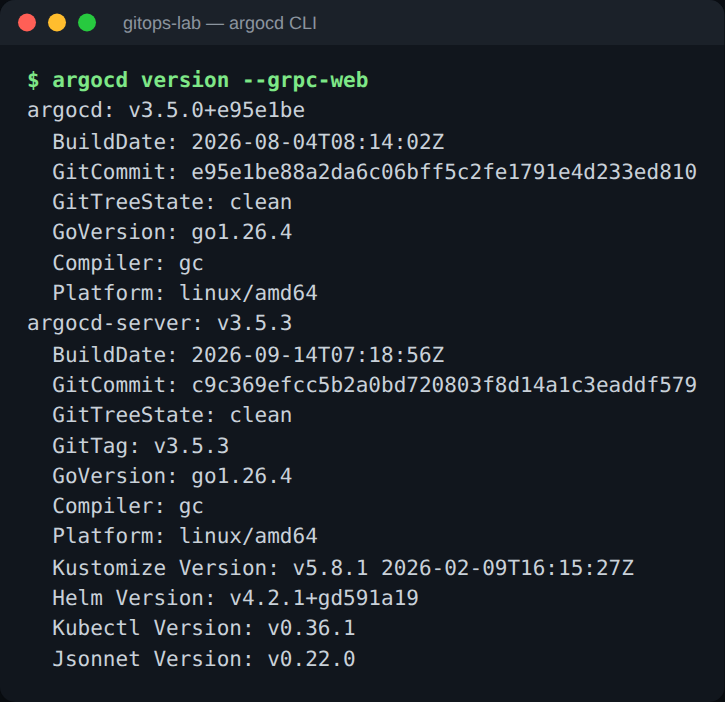

## 3. Logging in

### 3.1 Single sign-on (normal use)
<!-- doc-test: skip reason="interactive browser SSO login" -->
```bash
argocd login localhost --sso --grpc-web --plaintext --skip-test-tls
```
The CLI opens a browser at Keycloak (realm `lab`) and waits on `http://localhost:8085/auth/callback`, a redirect URI registered for the `argocd` client in the realm.
* **In WSL:** if no browser opens, add `--sso-launch-browser=false` and paste the printed URL into your Windows browser. WSL2 forwards Windows' `localhost:8085` to the waiting CLI (verified 2026-10-04).
* **Users:** `platform-user` (group `lab-platform-admins`) or `tenant-a-user` (group `lab-tenant-a`). Their password files are listed by `make password`.

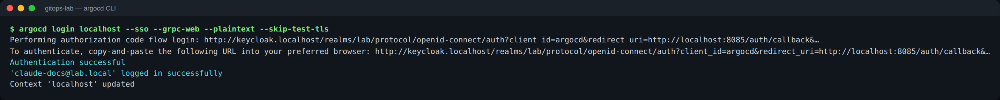

Who am I, and with which groups (here the temporary admin user from §7)?

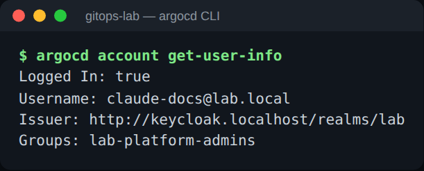

The Argo CD UI shows the same identity under **User Info**:

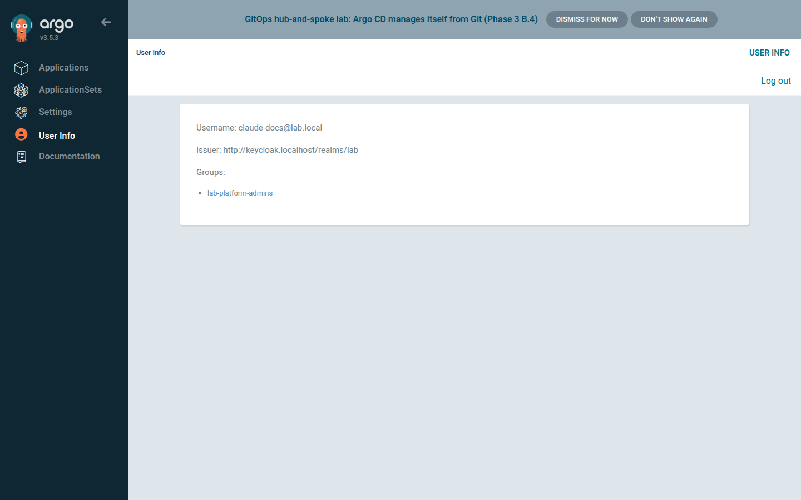

### 3.2 Break-glass local account
`platform-admin` is the only local account; the built-in `admin` is disabled. It works while Keycloak is down, and the lab's scripts use it. Take the password from its file and never type it on the command line:
<!-- doc-test: covered by="bats:Gate 10d" -->
```bash
argocd login localhost --username platform-admin \
  --password "$(cat ~/.config/gitops-lab/argocd-platform-admin.password)" \
  --grpc-web --plaintext --skip-test-tls --config ~/.config/argocd/breakglass.config
```
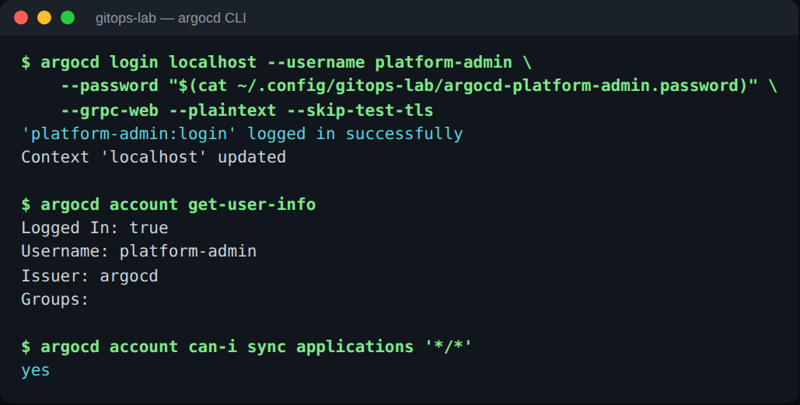

Note the RBAC resource form `<project>/<app>`. `can-i sync applications '*'` answers **no** even for an admin, because the policy is written for `'*/*'`.

### 3.3 Sessions
* `argocd logout localhost --config <file>` ends a CLI session.
* An SSO session is renewed with Keycloak's refresh token; when that fails (user deleted or disabled, SSO session over), log in again.
* Use one `--config` file per identity and purpose. Never point automation at your personal `~/.config/argocd/config`.

## 4. Everyday commands

**Inventory: every Application, its cluster, project and state** (`cut` only shortens the wide table):

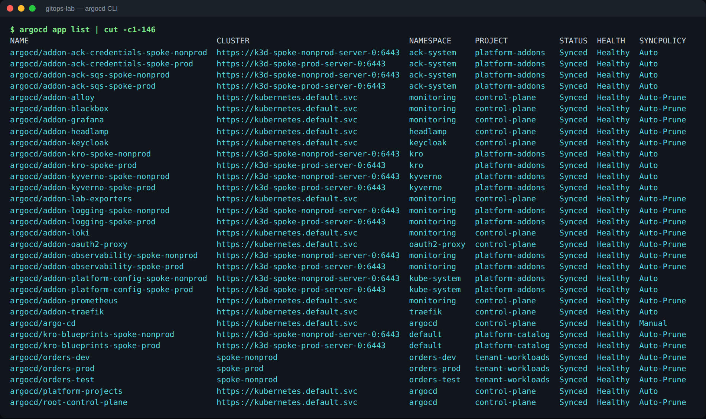

**One Application:** sources (golden chart `1.0.0` from GHCR plus the values at a pinned commit for prod), sync policy, resources:

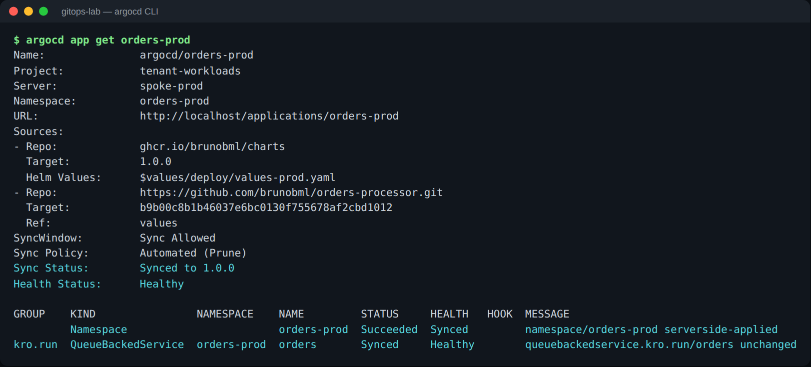

**Per-resource health** (including the lab's custom checks for kro and ACK kinds) is in the tree view: `argocd app get orders-dev --output tree`. Argo CD 3.x does not copy it into the Application object, so `kubectl get application … -o yaml` shows no health under `status.resources`. That is expected, not a broken check. See [What `Synced` and `Healthy` actually mean](devops-student-rebuild-guide.md#what-synced-and-healthy-actually-mean).

The same Application as a tree in the UI (QueueBackedService → Deployment, Service, Ingress, ConfigMap, NetworkPolicies):

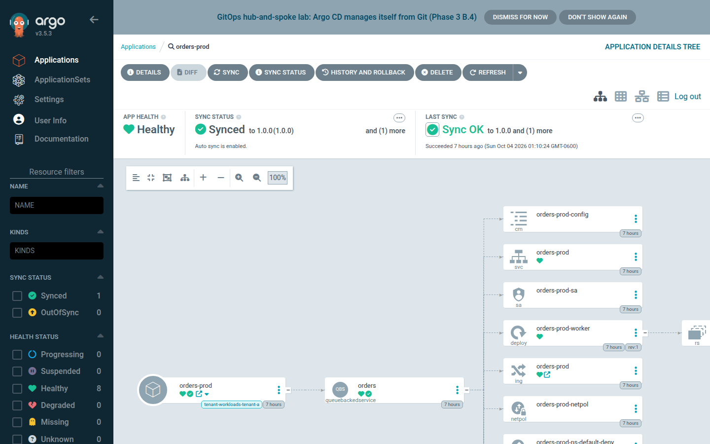

**Before any manual sync: diff, then history.** Exit code `0` means live matches Git (here `argo-cd`, the manual-sync app):

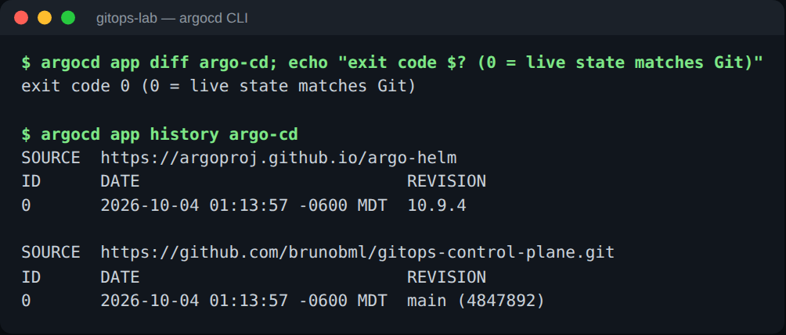

**The platform's building blocks:** ApplicationSets (one `tenant-workloads-<tenant>` per tenant), registered clusters, AppProjects:

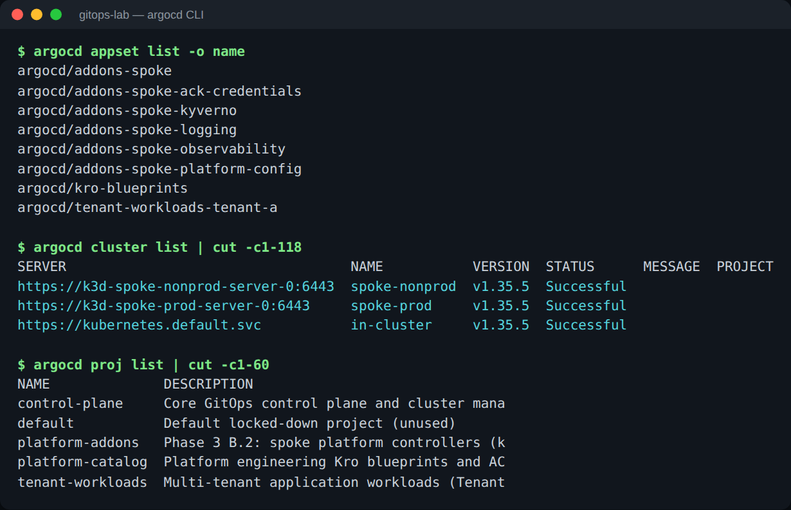

## 5. Changing things safely
| Do | Don't |
|---|---|
| Change Git, let Argo CD sync | Edit generated Applications: their ApplicationSet reverts the change (Drill 3) |
| `argocd app diff argo-cd`, then `argocd app sync argo-cd` (admin or `platform-admin`) | Sync `argo-cd` without a diff |
| Prod tenant change = a PR in `tenant-workloads` (required check `registration-checks`) | Bypass it with a CLI sync of `orders-prod` (tenants cannot anyway, §6) |
| Plain `argocd app sync <app>` | `argocd app sync --force` on server-side-apply apps: rejected (`--force cannot be used with --server-side`) and left retrying (Phase 3 D-31) |
| After a change that touches **only** an Application's sync policy (e.g. `managedNamespaceMetadata`), sync once by hand | Wait for auto-sync: it fires once per revision, and the revision did not change (2026-10-03 C.1) |
| To hold an outage on purpose, scale the hub application controller to 0 (Drill 3) | `argocd app set --self-heal=false` on generated apps (reverted) |

## 6. Who can do what (RBAC)
| Identity | Argo CD role | Can |
|---|---|---|
| Keycloak group `lab-platform-admins` (e.g. `platform-user`) | `role:admin` | everything |
| Keycloak group `lab-tenant-a` (e.g. `tenant-a-user`) | `role:tenant-a` | see project `tenant-workloads`; read its apps and logs; **sync `orders-dev` and `orders-test` only** |
| local `platform-admin` | `role:admin` | everything (break-glass, automation) |
| anyone else | none (`policy.default: ""`) | nothing |

A tenant session, captured with the temporary tenant user from §7. It sees only its three apps, may sync dev but not prod, and is denied a platform app:

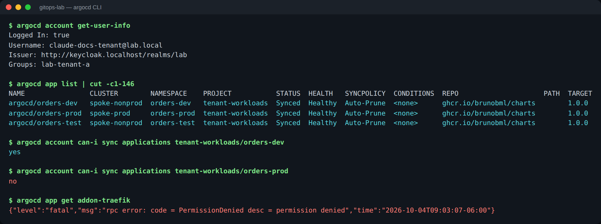

## 7. Temporary SSO user (Keycloak, Argo CD, Headlamp, Grafana)
For a demo, screenshots or a pairing session, create a short-lived user instead of sharing `platform-user`'s password.

<!-- doc-test: mutating subst="<name>=doctest-learner,[lab-tenant-a|lab-platform-admins]=lab-tenant-a,[hours]=1" expect="doctest-learner" -->
```bash
scripts/temp-sso-user.sh create <name> [lab-tenant-a|lab-platform-admins] [hours]   # default lab-tenant-a, 8 h
scripts/temp-sso-user.sh list                                                      # leftovers, with expiry
scripts/temp-sso-user.sh delete <name>                                             # removes user, sessions, password file
```
* **Least privilege by default:** `lab-tenant-a`. Use `lab-platform-admins` only when the task needs the whole platform. The admin screenshots in this runbook needed it, so they were taken with a 4-hour `lab-platform-admins` user that was deleted afterwards.
* **Password:** generated into `~/.config/gitops-lab/keycloak-<name>.password` (mode 600), never printed, removed by `delete`.
* **Marking:** the user is marked *Temporary until <UTC time>* (first and last name), which `list` uses. Expiry is **not** enforced automatically, so delete it when done. A Keycloak restart also removes it: Keycloak runs without a persistent database and re-imports only the permanent users.
* **Refused:** the script will not touch `platform-user` or `tenant-a-user`.

**One sign-in, four apps.** Signing in once at Keycloak opens Argo CD, Grafana, Headlamp and the Keycloak account console without another password prompt. That is single sign-on through one realm and one session:

| App | Sign in | What the temporary admin user sees |
|---|---|---|
| **Argo CD** `http://localhost` | *Log in via Keycloak* (UI) or `argocd login --sso` (CLI) | all Applications (32 when captured on 2026-10-04; 42 since tenant IaC) |
| **Grafana** `http://grafana.localhost` | *Sign in with Keycloak* | role Admin (group `lab-platform-admins`); a `lab-tenant-a` user gets Viewer |
| **Headlamp** `http://headlamp.localhost` | automatic (oauth2-proxy → Keycloak) | all three clusters (read-only kubeconfig) |
| **Keycloak account** `http://keycloak.localhost/realms/lab/account` | the same session | profile and group membership |

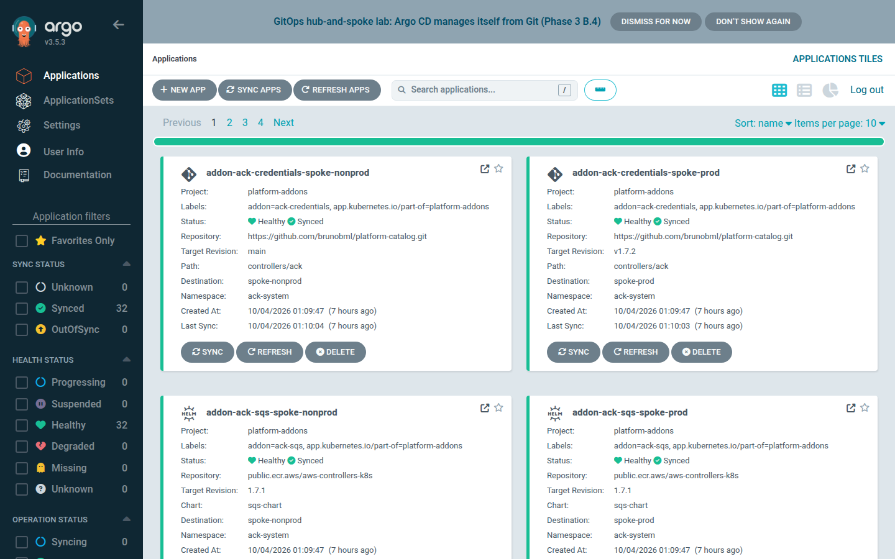

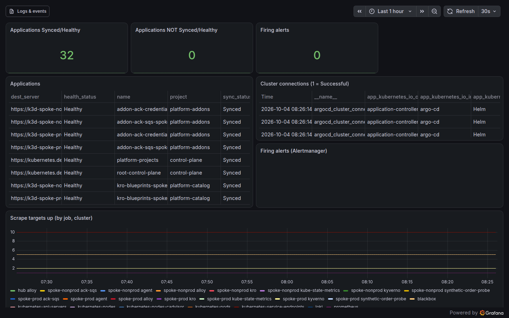

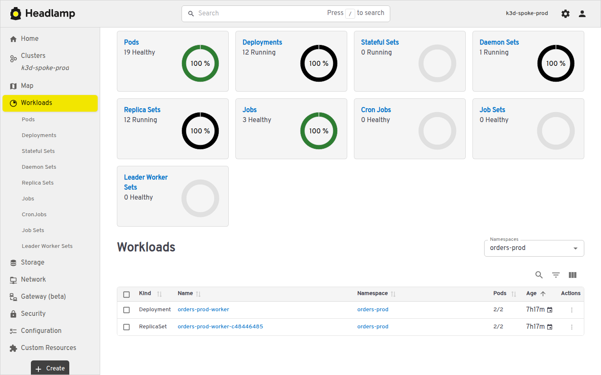

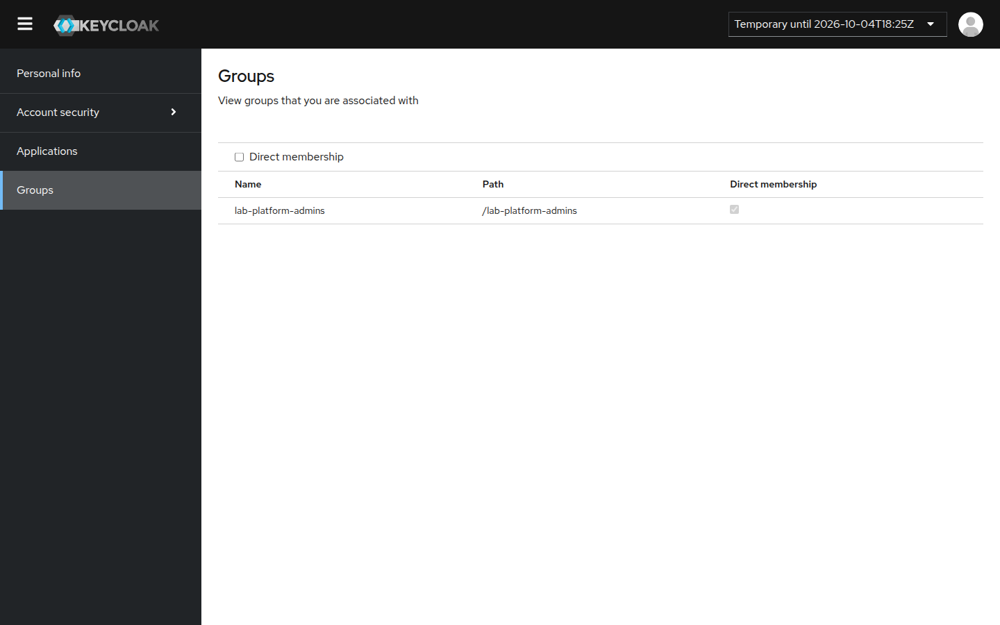

**What deleting the user does to sessions that are already open** (measured 2026-10-04):

Each app was polled every 20 s with the open session's cookies (CLI: `argocd app list`) after `temp-sso-user.sh delete` (which first logs the user out of Keycloak):

| Session | Still worked until | Why |
|---|---|---|
| Keycloak (account console, new logins) | **immediately** ended | user and its Keycloak sessions deleted |
| Headlamp (oauth2-proxy cookie) | **~60 s** | oauth2-proxy re-validates its cookie every minute (`cookie_refresh`) |
| Argo CD CLI (`argocd … --sso` session) | **~280 s**, then `oauth2: "invalid_grant" "Offline user session not found"` | the ID token (5 min lifetime) is accepted until it expires; the refresh then fails |
| Argo CD UI | **~300 s** | same 5-minute token lifetime |
| Grafana | **~600 s** | Grafana keeps its own login session; the measured tail is longer than the token lifetime (mechanism not investigated) |

**So:** deleting the user stops new logins at once, but **open sessions lasted up to ~10 minutes**. The Argo CD tail follows the realm's access-token lifetime (300 s, `accessTokenLifespan` in `addons/keycloak/realm-lab.json`). For a lab demo user, a 10-minute tail is acceptable: the account and its password file are gone, and nothing can start a new session.

## 8. Troubleshooting
| Symptom | Fix |
|---|---|
| `argocd login` stops at `Proceed insecurely (y/n)?` | add `--skip-test-tls` (§2) |
| `rpc error … Unavailable` / HTTP 2 errors | add `--grpc-web` |
| `PermissionDenied` | check identity and role: `argocd account get-user-info`, `argocd account can-i <action> <resource> '<project>/<app>'` |
| `can-i … '*'` says `no` for an admin | use the `'*/*'` form (project/app) |
| `--sso` waits forever | the browser could not reach `localhost:8085`: use `--sso-launch-browser=false` and open the URL in the Windows browser; check nothing else uses port 8085 |
| `token is expired` / `invalid session` | `argocd login …` again (SSO session or user gone) |
| SSO broken (Keycloak down) | break-glass login (§3.2); lifecycle runbook Issue G |
