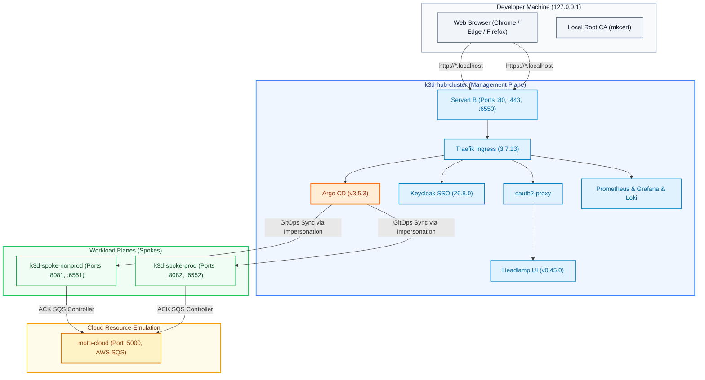
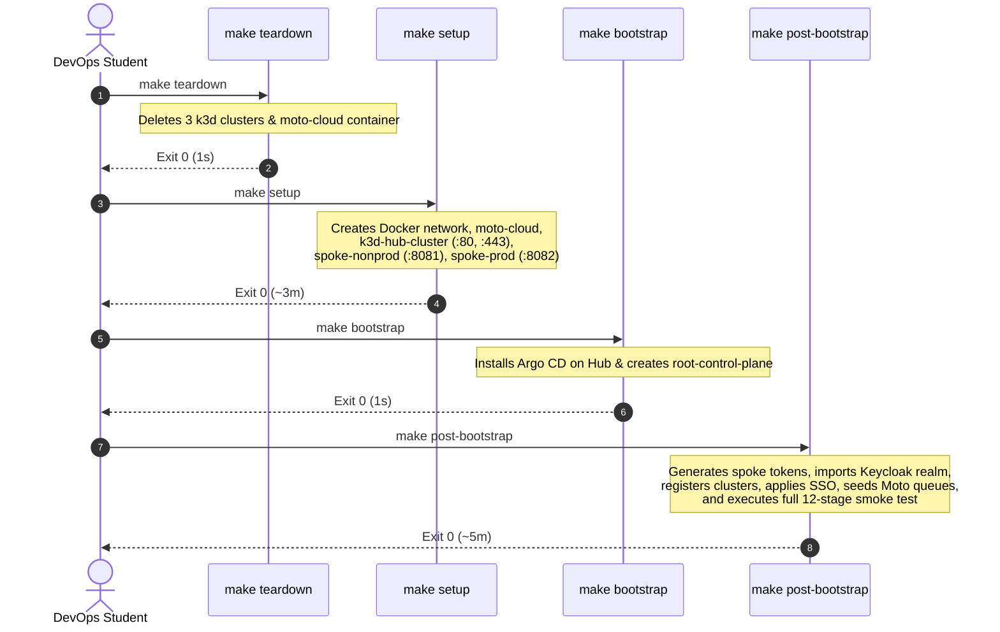

# A DevOps Student's Guide to Multi-Cluster GitOps Rebuild & Operations

> **Status: Current.** An illustrated walkthrough, originally written by Antigravity (2026-10-04) and corrected 2026-10-04: credentials, versions, what `post-bootstrap` does, Pod Security, `make maintain`; the web screenshots now show signed-in sessions. For the authoritative procedure see [`full-rebuild-and-acceptance.md`](full-rebuild-and-acceptance.md); for the CLI and SSO logins see [`argocd-cli.md`](argocd-cli.md).

> **Target Audience:** DevOps, Cloud Platform, and Site Reliability Engineering students.  
> **Repository:** [`gitops-control-plane`](../../README.md)  
> **Platform Version:** Lab Assessment v1.2 (Post-Remediation Acceptance)

---

## 1. What Are We Building?

This platform is a **multi-cluster GitOps control plane** modeling an enterprise Kubernetes environment on a local workstation using Docker and [k3d](https://k3d.io/).



### The Core Architectural Tenets
1. **Git as Single Source of Truth:** Everything running on all 3 clusters is declared in Git across 5 repositories (`gitops-control-plane`, `platform-catalog`, `platform-charts`, `tenant-workloads`, `orders-processor`).
2. **Least Privilege Impersonation:** Argo CD connects to clusters using restricted ServiceAccounts with targeted RBAC rather than raw `cluster-admin`.
3. **Supply-Chain Security:** Production container images are digest-pinned (`@sha256:…`), validated against supply-chain signatures by Kyverno, and constrained to approved registries by Kubernetes ValidatingAdmissionPolicy.
4. **Canonical URLs & Trusted TLS:** Hub web applications answer on standard ports **80** (HTTP) and **443** (HTTPS) via `*.localhost`. No non-standard ports (like 8080 or 8443) are used on the hub.
5. **Lifecycle & Upkeep on Demand:** Routine maintenance (token renewal, orphan clean-up) runs when you call `make maintain`. It is manual by owner decision O-10, with no scheduler; the `SpokeTokenExpiringSoon` alert reminds you 7 days before a token expires.

---

## 2. Prerequisites & Preparation

Before running a rebuild, ensure the following are installed on your workstation (Linux or WSL2):
- **Docker Engine** (or Docker Desktop with WSL2 backend)
- **k3d** (v5.7+)
- **kubectl** & **helm**
- **mkcert** (local certificate authority)
- **jq**, **curl**, and **git**

### Secrets & TLS Leaf Setup
Secrets are **never** committed to Git. Instead, they reside in `~/.config/gitops-lab`:
```bash
# Check that your secrets directory exists and has secure permissions (0700)
ls -ld ~/.config/gitops-lab
```
The lab TLS certificate for `https://*.localhost` is created by `make setup` itself (`scripts/setup-local-tls.sh`). It is issued by **mkcert** when mkcert is installed, and is trusted by your browser after a one-time `mkcert -install` on Windows; otherwise it is a self-signed fallback. If you install mkcert later, run `make local-tls`:
```bash
winget install FiloSottile.mkcert   # Windows, once
mkcert -install                     # Windows, once: trust the local CA
make local-tls                      # WSL: (re)issue the certificate and load it into Traefik
```

---

## 3. The 4-Step Canonical Rebuild Workflow

To tear down an old environment and build a completely fresh, production-grade lab from Git, execute the 4 canonical steps in sequence.



---

### Step 1: Teardown
```bash
make teardown
```
* **What it does:** Destroys all running containers and networks belonging to the lab (`k3d-hub-cluster`, `k3d-spoke-nonprod`, `k3d-spoke-prod`, and `moto-cloud`).
* **Expected duration:** ~1–5 seconds (exit code 0).
* **Terminal output:**


> [!NOTE]
> Notice how the teardown is idempotent: deleting volumes and cluster definitions cleans state without touching external containers or other k3d clusters.

---

### Step 2: Setup
```bash
make setup
```
* **What it does:** 
  1. Verifies that host ports 80 and 443 are free.
  2. Creates the shared Docker bridge network `k3d-cloud-net`.
  3. Launches `moto-cloud` (port 5000) for local AWS emulation.
  4. Provisions 3 k3d Kubernetes clusters:
     - `k3d-hub-cluster`: binds load balancer exclusively to `127.0.0.1:80` and `127.0.0.1:443`.
     - `k3d-spoke-nonprod`: binds load balancer to `127.0.0.1:8081`.
     - `k3d-spoke-prod`: binds load balancer to `127.0.0.1:8082`.
  5. Deploys Traefik Ingress on the Hub and loads the mkcert trusted TLS secret.
  6. Installs Argo CD on the Hub and provisions enterprise `AppProject` definitions.
* **Expected duration:** ~3 minutes (exit code 0).
* **Terminal output:**


---

### Step 3: Bootstrap
```bash
make bootstrap
```
* **What it does:** Applies the root Argo CD application (`root-control-plane`), which instructs Argo CD to begin discovering and reconciling all platform add-ons and tenant workloads declared in Git.
* **Expected duration:** ~1–2 seconds (exit code 0).
* **Terminal output:**


---

### Step 4: Post-Bootstrap
```bash
make post-bootstrap
```
* **What it does:** 
  1. Renews the spoke and Headlamp tokens **only if fewer than 7 days are left** (`make setup` already issued fresh 30-day tokens and registered the spokes).
  2. Waits for the tenant workloads: their namespaces and QueueBackedServices.
  3. Restarts CoreDNS for the `*.localhost` rule, waits for Keycloak (the realm is imported by Keycloak itself at start), and reloads the lab TLS certificate.
  4. Provisions the workers' IAM keys in moto (accounts 111111111111 / 222222222222). The SQS queues and DLQs are created by the **ACK controller** from each QueueBackedService, not by this step.
  5. Restarts worker pods to pick up their new AWS credentials.
  6. Cleans up what deregistered tenant apps left behind (orphans).
  7. Adopts the self-managed `argo-cd` application (manual sync by design) and re-syncs anything stuck.
  8. Runs the full 12-stage smoke test.
* **Expected duration:** ~4–5 minutes (exit code 0).
* **Terminal output:**


---

## 4. Verification & Health Inspection

Once the rebuild completes, verify the state of your clusters using the following commands:

### 1. Verify Port Bindings (R-15 Compliance)
Ensure the Hub load balancer uses canonical ports 80/443 without legacy ports (8080/8443):
```bash
docker ps --format "table {{.Names}}\t{{.Status}}\t{{.Ports}}"
```


> [!TIP]
> Notice that `k3d-hub-cluster-serverlb` exposes strictly `80->80/tcp`, `443->443/tcp`, and `6550->6443/tcp`. Legacy ports 8080 and 8443 are completely eliminated.

---

### 2. Verify Argo CD Application Status
All 32 applications must report `Synced` and `Healthy`:
```bash
kubectl --context k3d-hub-cluster get applications -n argocd -o custom-columns=NAME:.metadata.name,SYNC:.status.sync.status,HEALTH:.status.health.status
```


---

### 3. Verify Pod Security Admission (Track C.1)
Platform namespaces must be protected with `restricted` (or `baseline` for Headlamp):
```bash
kubectl --context k3d-hub-cluster get ns -L pod-security.kubernetes.io/enforce,pod-security.kubernetes.io/warn,pod-security.kubernetes.io/audit
```


> [!IMPORTANT]
> The `restricted` standard requires non-root containers, no privilege escalation, all Linux capabilities dropped and a seccomp profile. It does **not** require a read-only root filesystem. `headlamp` is assigned `baseline` because its chart's container sets neither `allowPrivilegeEscalation: false`, nor dropped capabilities, nor a seccomp profile (the three `restricted` violations Kubernetes reports for it).

---

### 4. Verify Least-Privilege Impersonation
Confirm that Argo CD uses impersonation for sync operations across all clusters:
```bash
bash scripts/audit-impersonation.sh
```


---

### 5. Run the Automated Smoke Test Suite
Execute the automated end-to-end smoke test suite:
```bash
make test
```


---

## 5. Routine Operations: `make maintain` (Track G.3)

In real-world DevOps environments, ServiceAccount tokens expire (in our lab, they have a 30-day lifetime). Running a full post-bootstrap every week is disruptive and unnecessary.

Instead, run the streamlined upkeep command:
```bash
make maintain
```

* **What it does:**
  - Evaluates spoke and Headlamp token expiration times.
  - Automatically rotates tokens if fewer than 7 days remain.
  - Cleans up orphaned namespaces and secrets left behind by deleted tenant apps.
  - Logs results to `~/.config/gitops-lab/logs/maintain.log` (mode `0600`).
  - **Headless resilience:** If Docker or the cluster is stopped, it exits cleanly with code 0 instead of throwing an error.


---

## 6. Accessing the Web Interfaces

All web services are accessible via canonical subdomains of `localhost`:

| Service | Canonical URL | Credentials | Purpose |
|---|---|---|---|
| **Argo CD** | [http://argocd.localhost](http://argocd.localhost) | Keycloak SSO (*Log in via Keycloak*); break-glass: local `platform-admin` (the built-in `admin` is disabled) | GitOps multi-cluster dashboard |
| **Grafana** | [http://grafana.localhost](http://grafana.localhost) | Keycloak SSO: `lab-platform-admins` → Admin, `lab-tenant-a` → Viewer | Metrics, dashboards, and Loki logs |
| **Headlamp** | [http://headlamp.localhost](http://headlamp.localhost) | Keycloak SSO through oauth2-proxy | Multi-cluster Kubernetes viewer |
| **Keycloak** | [http://keycloak.localhost](http://keycloak.localhost) | users: SSO in realm `lab` (`platform-user`, `tenant-a-user`); admin console `/admin/`: `kc-admin` | Central OIDC identity provider |

Passwords are never in Git. `make password` shows the file under `~/.config/gitops-lab/` that holds each one. For a demo or a pairing session, create a temporary SSO user instead of sharing a password ([`argocd-cli.md` §7](argocd-cli.md#7-temporary-sso-user-keycloak-argo-cd-headlamp-grafana)).

---

### Web Interface Gallery
These are signed-in sessions, taken with a temporary SSO user (group `lab-platform-admins`, deleted afterwards). One Keycloak sign-in opened all four apps.

#### Argo CD Web UI
Accessed at `http://argocd.localhost`. Features native Single Sign-On integration with Keycloak. Here: all 32 Applications Synced and Healthy.


#### Grafana Observability Dashboard
Accessed at `http://grafana.localhost`. Displays Prometheus cluster metrics, Blackbox probe results, and Loki log streams.


#### Keycloak Identity Provider
Accessed at `http://keycloak.localhost`. Manages centralized realm users (`platform-user`, `tenant-a-user`) and the group claims the apps map to roles. Here: the account console of the temporary user, showing its group.


#### Headlamp Multi-Cluster Viewer
Accessed at `http://headlamp.localhost`. Protected by `oauth2-proxy` to enforce authenticated SSO sessions before granting cluster visibility.


---

## 7. Common Pitfalls & DevOps Lessons Learned

1. **Bash `set -euo pipefail` Hazard:**
   - *Problem:* When piping `docker ps ... | grep ...`, if `grep` finds no matches, it exits with return code 1. Under `set -e` and `pipefail`, this terminates the entire script unexpectedly.
   - *Fix:* Use `{ grep ... || true; }` inside pipelines that check for optional output.
2. **k3d Port Mutation:**
   - *Problem:* Modifying port mappings on running k3d load balancers with `k3d cluster edit --port-delete` is experimental and drops container proxy rules.
   - *Best Practice:* To change port models, update cluster creation scripts and execute a clean rebuild.
3. **Headless Maintenance Scripting:**
   - *Problem:* If you ever schedule `make maintain` (cron, Windows Task Scheduler), runs while the laptop sleeps or Docker is stopped must not raise false alarms.
   - *Fix:* Always include pre-flight readiness checks that exit cleanly with code 0 when the host environment is offline.
