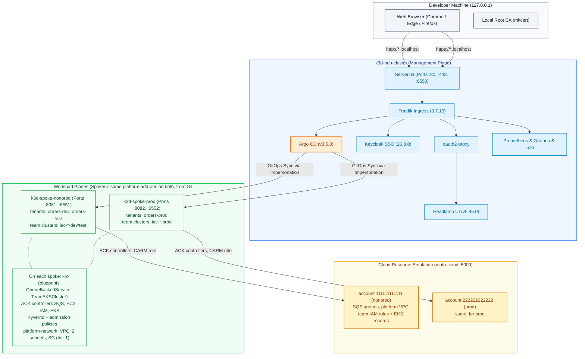
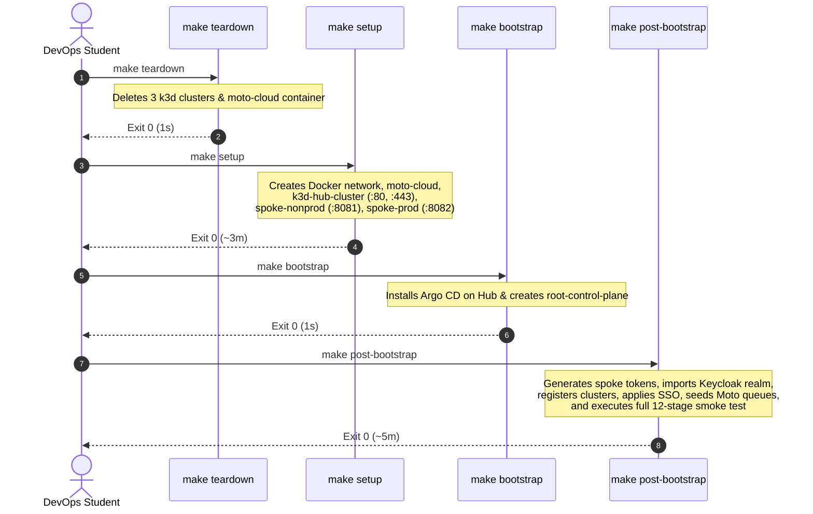
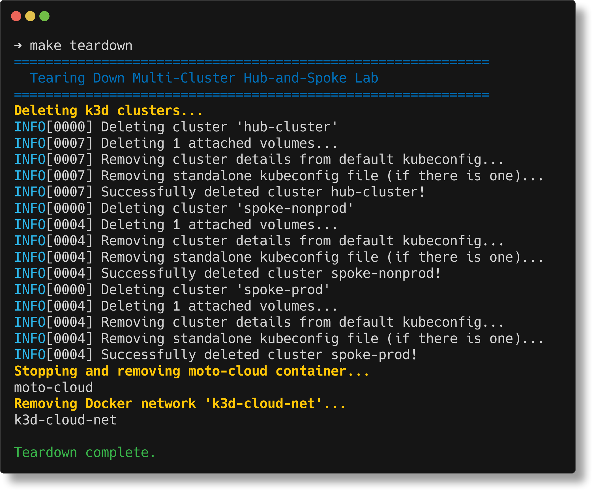

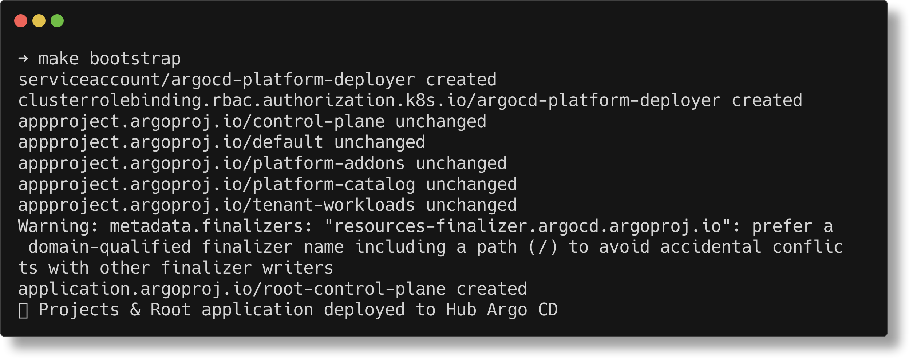
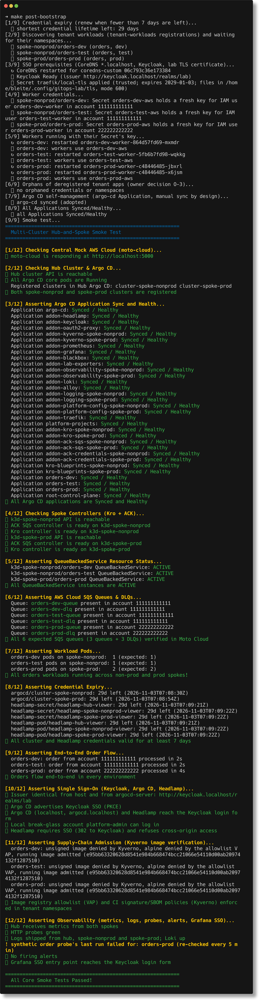
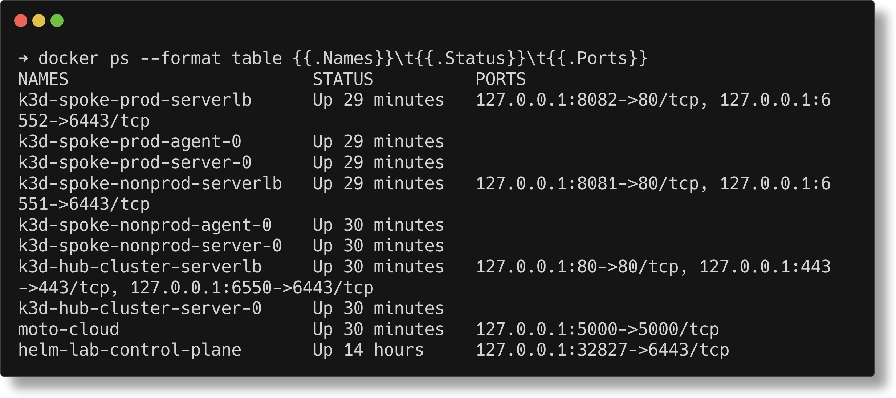
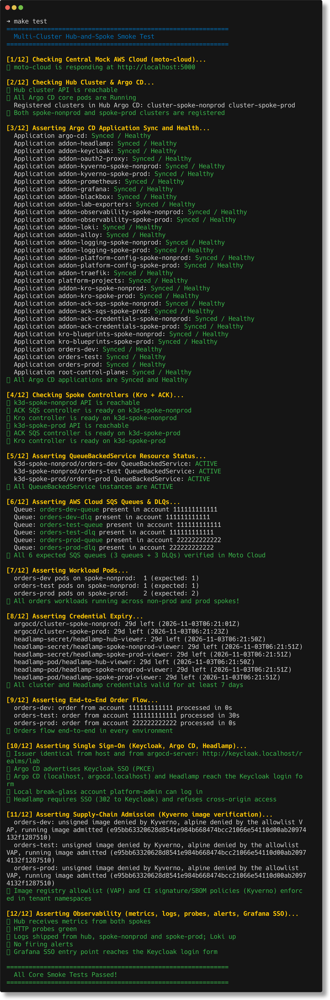

# A DevOps Student's Guide to Multi-Cluster GitOps Rebuild & Operations

> **Status: Current.** An illustrated walkthrough, originally written by Antigravity (2026-10-04) and corrected 2026-10-04: credentials, versions, what `post-bootstrap` does, Pod Security, `make maintain`; the web screenshots now show signed-in sessions. For the authoritative procedure see [`full-rebuild-and-acceptance.md`](full-rebuild-and-acceptance.md); for the CLI and SSO logins see [`argocd-cli.md`](argocd-cli.md).

> **Target Audience:** DevOps, Cloud Platform, and Site Reliability Engineering students.  
> **Repository:** [`gitops-control-plane`](../../README.md)  
> **Platform Version:** Lab Assessment v1.2 (Post-Remediation Acceptance)

### What you will be able to explain after this guide
1. Why one root Application on the hub ends with every platform component, tenant app and team cluster running on three clusters (*app of apps*, ApplicationSets).
2. Which of the **four reconcilers** (ApplicationSet controller, application controller, kro, ACK) owns a given object, and where each one reports its status.
3. The difference between **`Synced`** and **`Healthy`**, and where Argo CD shows health for custom resources.
4. Why a resource deleted in the cloud comes back without Git changing, and who notices (Drill, §4.6).
5. Which state is deliberately **not** in Git (credentials, worker keys, moto's memory), and why.

**You should already know:** `kubectl` basics (contexts, namespaces, `get`/`logs`/`describe`), what a Kubernetes controller and a Custom Resource Definition are, Git branches and pull requests, Docker containers. Helm and AWS SQS help but are explained where they appear.

Terms are defined in [Concepts, Glossary & Self-Check](../concepts-and-glossary.md), which also has self-check questions with answers. Each rebuild step ends with a **Checkpoint**: *predict* before you run it, *observe* while it runs, *explain* afterwards. The suggested answers are folded under each checkpoint; try first.

---

## 1. What Are We Building?

This platform is a **multi-cluster GitOps control plane** modeling an enterprise Kubernetes environment on a local workstation using Docker and [k3d](https://k3d.io/).



### The Core Architectural Tenets
1. **Git as Single Source of Truth:** Everything running on all 3 clusters is declared in Git across 6 repositories (`gitops-control-plane`, `platform-catalog`, `platform-charts`, `tenant-workloads`, `tenant-iac`, `orders-processor`).
2. **Least Privilege Impersonation:** Argo CD connects to clusters using restricted ServiceAccounts with targeted RBAC rather than raw `cluster-admin`.
3. **Supply-Chain Security:** Production container images are digest-pinned (`@sha256:…`), validated against supply-chain signatures by Kyverno, and constrained to approved registries by Kubernetes ValidatingAdmissionPolicy.
4. **Canonical URLs & Trusted TLS:** Hub web applications answer on standard ports **80** (HTTP) and **443** (HTTPS) via `*.localhost`. No non-standard ports (like 8080 or 8443) are used on the hub.
5. **Lifecycle & Upkeep on Demand:** Routine maintenance (token renewal, orphan clean-up) runs when you call `make maintain`. It is manual by owner decision O-10, with no scheduler; the `SpokeTokenExpiringSoon` alert reminds you 7 days before a token expires.

### One change, four reconcilers

"GitOps" is not one monolithic program. In this lab, declaring, provisioning, and operating an enterprise workload relies on **four independent controllers** acting as a layered reconciliation chain. Each one watches one kind of object, writes another, and reports its own status. When something does not appear, the question is always: *which of the four stopped?*

```
[ Git: tenant-workloads (registration) + orders-processor (values) ]
      │  ① Argo CD ApplicationSet controller (hub)
      ▼     turns each registration file into an Argo CD Application
[ Application orders-dev (hub) ]
      │  ② Argo CD application controller (hub)
      ▼     renders the golden chart (GHCR) with your values, applies the result to the spoke
[ QueueBackedService orders (spoke-nonprod, ns orders-dev) ]
      │  ③ kro (spoke)
      ▼     expands the blueprint: Deployment, Service, Ingress, ConfigMap, NetworkPolicies,
      │     PDB (only if replicas > 1), two ACK Queue objects
[ Queue orders-dev-queue, orders-dev-dlq (spoke) ]
      │  ④ ACK SQS controller (spoke)
      ▼     assumes the role of the namespace's account (CARM) and calls the SQS API
[ SQS queues in moto, account 111111111111 ]
```

| | Reconciler | Watches | Writes | Its status | Its logs |
|---|---|---|---|---|---|
| ① | ApplicationSet controller | registration files in `tenant-workloads` | `Application` objects on the hub | `kubectl --context k3d-hub-cluster -n argocd get applicationset tenant-workloads-tenant-a -o jsonpath='{.status.conditions}'` (`ResourcesUpToDate=True`) | `kubectl --context k3d-hub-cluster -n argocd logs deploy/argo-cd-argocd-applicationset-controller` |
| ② | Application controller | the `Application`: chart `queue-backed-service` (GHCR) + values commit | the `QueueBackedService` on the spoke | `argocd app get orders-dev` or `kubectl --context k3d-hub-cluster -n argocd get application orders-dev -o jsonpath='{.status.sync.status} {.status.health.status}'` | `kubectl --context k3d-hub-cluster -n argocd logs statefulset/argo-cd-argocd-application-controller` |
| ③ | kro | the `QueueBackedService` | the Deployment, Service, … and the ACK `Queue` objects | `kubectl --context k3d-spoke-nonprod -n orders-dev get queuebackedservice orders -o jsonpath='{.status.state}'` (`ACTIVE`) | `kubectl --context k3d-spoke-nonprod -n kro logs deploy/kro` |
| ④ | ACK SQS controller | the `Queue` objects | the queues in moto | `kubectl --context k3d-spoke-nonprod -n orders-dev get queue.sqs.services.k8s.aws` (condition `ACK.ResourceSynced`, `status.queueURL`) | `kubectl --context k3d-spoke-nonprod -n ack-system logs deploy/ack-sqs-controller-sqs-chart` |

**Reconciliation in action: Full provisioning vs values-only updates**
- **Full provisioning chain (new workloads & infrastructure):** Registering a new application (a new file in `tenant-workloads`) exercises all four tiers: ① ApplicationSet controller creates the Application &rarr; ② Application controller renders the chart and applies the `QueueBackedService` &rarr; ③ kro expands the blueprint into Deployment, Service, Ingress, ConfigMap, and ACK `Queue` CRs &rarr; ④ ACK creates and syncs the SQS queues in AWS/Moto.
- **Queue setting change in the values file** (e.g. `retentionPeriod`): ② → ③ → ④. Not ①: the registration file did not change, so the Application stays the same.
- **Values-only workload update (`replicas: 3`):** Pushing `replicas: 3` to `orders-processor/deploy/values-dev.yaml` does not exercise the full chain. It wakes up only **②** (Argo CD application controller notices the values commit and updates `QueueBackedService`) and **③** (kro updates the Deployment spec), followed by the core Kubernetes Deployment/ReplicaSet controllers starting the third pod (`readyReplicas` reaches 3). Controllers **①** and **④** have nothing to do: the registration file did not change, so the Application definition stays identical, and no queue settings were touched. Tenant IaC uses the same chain with a different blueprint: a `TeamEKSCluster` becomes ACK IAM `Role`, EKS `Cluster` and `Nodegroup` objects (see the [tenant IaC runbook](tenant-iac-operations.md)).

---

## 2. Prerequisites & Preparation

Before running a rebuild, ensure the following are installed on your workstation (Linux or WSL2):
- **Docker Engine** (or Docker Desktop with WSL2 backend)
- **k3d** (v5.7+)
- **kubectl** & **helm**
- **mkcert** (local certificate authority)
- **jq**, **curl**, and **git**

### Secrets & TLS Leaf Setup
Secrets are **never** committed to Git. Instead, they reside in `~/.config/gitops-lab`:
```bash
# Check that your secrets directory exists and has secure permissions (0700)
ls -ld ~/.config/gitops-lab
```
The lab TLS certificate for `https://*.localhost` is created by `make setup` itself (`scripts/setup-local-tls.sh`). It is issued by **mkcert** when mkcert is installed, and is trusted by your browser after a one-time `mkcert -install` on Windows; otherwise it is a self-signed fallback. If you install mkcert later, run `make local-tls`:
```bash
winget install FiloSottile.mkcert   # Windows, once
mkcert -install                     # Windows, once: trust the local CA
make local-tls                      # WSL: (re)issue the certificate and load it into Traefik
```

---

## 3. The 4-Step Canonical Rebuild Workflow

To tear down an old environment and build a completely fresh, production-grade lab from Git, execute the 4 canonical steps in sequence.



---

### Step 1: Teardown
```bash
make teardown
```
* **What it does:** Destroys all running containers and networks belonging to the lab (`k3d-hub-cluster`, `k3d-spoke-nonprod`, `k3d-spoke-prod`, and `moto-cloud`).
* **Expected duration:** ~1–5 seconds (exit code 0).
* **Terminal output:**



> [!NOTE]
> Notice how the teardown is idempotent: deleting volumes and cluster definitions cleans state without touching external containers or other k3d clusters.

---

### Step 2: Setup
```bash
make setup
```
* **What it does:** 
  1. Verifies that host ports 80 and 443 are free.
  2. Creates the shared Docker bridge network `k3d-cloud-net`.
  3. Launches `moto-cloud` (port 5000) for local AWS emulation.
  4. Provisions 3 k3d Kubernetes clusters:
     - `k3d-hub-cluster`: binds load balancer exclusively to `127.0.0.1:80` and `127.0.0.1:443`.
     - `k3d-spoke-nonprod`: binds load balancer to `127.0.0.1:8081`.
     - `k3d-spoke-prod`: binds load balancer to `127.0.0.1:8082`.
  5. Deploys Traefik Ingress on the Hub and loads the mkcert trusted TLS secret.
  6. Installs Argo CD on the Hub and provisions enterprise `AppProject` definitions.
* **Expected duration:** ~3 minutes (exit code 0).
* **Terminal output:**



> **Checkpoint: topology.**
> * *Predict:* after `make setup`, which cluster runs Argo CD? Are kro and ACK already running on the spokes?
> * *Observe:* `k3d cluster list`; `docker ps --format '{{.Names}} {{.Ports}}' | grep serverlb`; `kubectl --context k3d-spoke-nonprod get pods -A`.
> * *Explain:* why does the hub own ports 80/443, while the spokes only expose `127.0.0.1:8081`/`8082`?
>
> <details><summary>Suggested answers</summary>
>
> Only the hub runs Argo CD, the single control plane that manages all three clusters. The spokes have **no** kro or ACK yet: since Phase 3 they are not installed by a script but delivered from Git by Argo CD after `make bootstrap` (the `addons-spoke` ApplicationSet). The hub serves every human-facing UI (Argo CD, Grafana, Headlamp, Keycloak) on standard ports; the spokes only serve their tenants' ingress, on their own local ports.
> </details>

---

### Step 3: Bootstrap
```bash
make bootstrap
```
* **What it does:** Applies the root Argo CD application (`root-control-plane`), which instructs Argo CD to begin discovering and reconciling all platform add-ons and tenant workloads declared in Git.
* **Expected duration:** ~1–2 seconds (exit code 0).
* **Terminal output:**



> **Checkpoint: one Application, many.**
> * *Predict:* `make bootstrap` creates **one** Application. How many will exist a few minutes later, and on which clusters will they deploy?
> * *Observe:* `kubectl --context k3d-hub-cluster -n argocd get applicationsets` and `… get applications -w`; open `bootstrap/root-app.yaml` (its `path: applicationsets`).
> * *Explain:* what is the difference between the Applications in `applicationsets/` and the ones the ApplicationSets *generate*?
>
> <details><summary>Suggested answers</summary>
>
> `root-control-plane` points at the folder `applicationsets/`. Argo CD applies everything in it: a few plain Applications (e.g. `argo-cd`) and many **ApplicationSets**. Each ApplicationSet is a template plus a generator: the *cluster* generator produces one Application per registered spoke (e.g. `addon-kro-spoke-nonprod`, `addon-kro-spoke-prod`), the *Git files* generator one per registration file (`orders-dev`, `team-data-analytics-dev`, …). That is how one root becomes 42 Applications (2026-10-06) without anyone writing 42 manifests, and why adding a spoke or a tenant file adds Applications automatically.
> </details>

---

### Step 4: Post-Bootstrap
```bash
make post-bootstrap
```
* **What it does:** 
  1. Renews the spoke and Headlamp tokens **only if fewer than 7 days are left** (`make setup` already issued fresh 30-day tokens and registered the spokes).
  2. Waits for the tenant workloads: their namespaces and QueueBackedServices.
  3. Restarts CoreDNS for the `*.localhost` rule, waits for Keycloak (the realm is imported by Keycloak itself at start), and reloads the lab TLS certificate.
  4. Provisions the workers' IAM keys in moto (accounts 111111111111 / 222222222222). The SQS queues and DLQs are created by the **ACK controller** from each QueueBackedService, not by this step.
  5. Restarts worker pods to pick up their new AWS credentials.
  6. Cleans up what deregistered tenant apps left behind (orphans).
  7. Adopts the self-managed `argo-cd` application (manual sync by design) and re-syncs anything stuck.
  8. Runs the full 12-stage smoke test.
* **Expected duration:** ~4–5 minutes (exit code 0).
* **Terminal output:**



> **Checkpoint: what Git does not hold.**
> * *Predict:* if Git is the single source of truth, why is there a script after bootstrap at all? And why is the `argo-cd` Application on **manual** sync?
> * *Observe:* `ls -l ~/.config/gitops-lab/` (files only, never `cat` them); `kubectl --context k3d-spoke-nonprod -n orders-dev get secret orders-dev-aws` (it exists, but not in any repository).
> * *Explain:* name three things `post-bootstrap` creates that must not be in Git.
>
> <details><summary>Suggested answers</summary>
>
> Git holds the *desired state of the platform*, not secrets or state that only exists at runtime. `post-bootstrap` handles exactly that: cluster tokens and passwords (files in `~/.config/gitops-lab`, mode 600), the workers' **IAM keys** (created in moto, stored as Kubernetes Secrets), the TLS certificate, and moto's in-memory state that a restart wipes. Argo CD manages itself through the `argo-cd` Application, and a bad automatic sync of Argo CD could lock you out of Argo CD, so it is synced deliberately after `argocd app diff argo-cd` (see the [Argo CD CLI runbook](argocd-cli.md#5-changing-things-safely)).
> </details>

---

## 4. Verification & Health Inspection

Once the rebuild completes, verify the state of your clusters using the following commands:

### 1. Verify Port Bindings (R-15 Compliance)
Ensure the Hub load balancer uses canonical ports 80/443 without legacy ports (8080/8443):
```bash
docker ps --format "table {{.Names}}\t{{.Status}}\t{{.Ports}}"
```



> [!TIP]
> Notice that `k3d-hub-cluster-serverlb` exposes strictly `80->80/tcp`, `443->443/tcp`, and `6550->6443/tcp`. Legacy ports 8080 and 8443 are completely eliminated.

---

### 2. Verify Argo CD Application Status
**Every** Application must report `Synced` and `Healthy`. On 2026-10-06 there are **42**: 37 platform (projects `control-plane` 13, `platform-addons` 20, `platform-catalog` 4) + 3 tenant apps (`orders-dev/test/prod`) + 2 team clusters (`team-data-analytics-dev/prod`). The number grows when teams register apps or clusters, so count instead of memorising it:
```bash
kubectl --context k3d-hub-cluster get applications -n argocd -o custom-columns=NAME:.metadata.name,SYNC:.status.sync.status,HEALTH:.status.health.status
kubectl --context k3d-hub-cluster get applications -n argocd --no-headers | wc -l                  # how many
kubectl --context k3d-hub-cluster get applications -n argocd --no-headers | grep -v "Synced *Healthy"  # expect no output
```


#### What `Synced` and `Healthy` actually mean

They are two **independent** questions:

| Status | Question it answers | Compared against | Example of the *other* status |
|---|---|---|---|
| **Sync** (`Synced` / `OutOfSync`) | Do the live objects equal what Git renders? | Git (rendered chart + values) | `Synced` but `Degraded`: Git was applied exactly, and the pod it describes is in CrashLoopBackOff |
| **Health** (`Healthy` / `Progressing` / `Degraded` / `Missing`) | Is the thing *working*? | A health check on the live object | `OutOfSync` but `Healthy`: someone edited the Deployment by hand (self-heal will revert it), and it still runs fine |

**Where health comes from.** Argo CD has built-in health checks for core kinds (a `Deployment` is healthy when its rollout is complete). It knows nothing about custom resources: a kro `QueueBackedService` or an ACK EKS `Cluster` only has a health status because **the platform defines one**, as a Lua check in `clusters/values-argocd-hub.yaml`:

```yaml
resource.customizations.health.kro.run_QueueBackedService: |
  if obj.status ~= nil and obj.status.conditions ~= nil then
    for _, c in ipairs(obj.status.conditions) do
      if c.type == "Ready" and c.status == "True" then
        return {status = "Healthy", message = c.message or "Ready"}   -- kro says the whole graph is ready
      end
    end
  end
  return {status = "Progressing", message = "Waiting for service"}
```

**Where to read it.** In Argo CD 3.x, per-resource health is shown in the **UI** and by `argocd app get <app> --output tree` (login: [Argo CD CLI runbook](argocd-cli.md#3-logging-in)):
```text
$ argocd app get orders-dev --output tree
QueueBackedService/orders            Synced  Healthy  queuebackedservice.kro.run/orders created
├─Queue/orders-dev-dlq                        Healthy
└─Queue/orders-dev-queue                      Healthy
```
It is **not** copied into the Application object: `kubectl get application orders-dev -o yaml` has the app's overall `status.health.status`, but no per-resource health under `status.resources`. Don't conclude from that the checks are missing: a reviewer of this lab once did exactly that.

> **Pause and predict.** You delete the SQS queue `orders-dev-dlq` directly in moto (not in Kubernetes). Will the `orders-dev` Application turn `OutOfSync`? Will it turn `Degraded`? *(Answer in the Drill 4 milestone, [§4.6](#6-milestone-watch-a-controller-heal-the-cloud-drill-4).)*


---

### 3. Verify Pod Security Admission (Track C.1)
Platform namespaces must be protected with `restricted` (or `baseline` for Headlamp):
```bash
kubectl --context k3d-hub-cluster get ns -L pod-security.kubernetes.io/enforce,pod-security.kubernetes.io/warn,pod-security.kubernetes.io/audit
```


> [!IMPORTANT]
> The `restricted` standard requires non-root containers, no privilege escalation, all Linux capabilities dropped and a seccomp profile. It does **not** require a read-only root filesystem. `headlamp` is assigned `baseline` because its chart's container sets neither `allowPrivilegeEscalation: false`, nor dropped capabilities, nor a seccomp profile (the three `restricted` violations Kubernetes reports for it).

---

### 4. Verify Least-Privilege Impersonation
Confirm that Argo CD uses impersonation for sync operations across all clusters:
```bash
bash scripts/audit-impersonation.sh
```


---

### 5. Run the Automated Smoke Test Suite
Execute the automated end-to-end smoke test suite:
```bash
make test
```



### 6. Milestone: Watch a Controller Heal the Cloud (Drill 4)

The most important behaviour in this lab, in five minutes. You will delete a cloud resource **behind the platform's back** and watch who notices.

> **Predict** (write it down): you delete the dead-letter queue `orders-dev-dlq` directly in moto, not in Git and not in Kubernetes.
> 1. Does the `orders-dev` Application turn `OutOfSync`? `Degraded`?
> 2. Which component brings the queue back, and how long will it take?

**Act** (account 111111111111 is the nonprod account; `aws_as` is the helper from [developer tutorial Step 4](../developer-tutorial.md#step-4-interacting-with-simulated-aws-via-aws-cli)):
```bash
aws_as 111111111111
aws --endpoint-url=http://localhost:5000 sqs delete-queue --queue-url http://localhost:5000/111111111111/orders-dev-dlq
```

**Observe** (repeat every 20 s):
```bash
aws --endpoint-url=http://localhost:5000 sqs get-queue-url --queue-name orders-dev-dlq --output text   # NonExistentQueue … until it is back
kubectl --context k3d-hub-cluster -n argocd get application orders-dev -o jsonpath='{.status.sync.status}/{.status.health.status}{"\n"}'
kubectl --context k3d-spoke-nonprod -n orders-dev get queue.sqs.services.k8s.aws orders-dev-dlq \
  -o jsonpath='{.status.conditions[?(@.type=="ACK.ResourceSynced")].status}{"\n"}'
kubectl --context k3d-spoke-nonprod -n ack-system logs deploy/ack-sqs-controller-sqs-chart --since=10m | grep '"created new resource".*orders-dev-dlq'
```

<details><summary><b>Explain</b>: what was observed on 2026-10-06, and why</summary>

| Time | Queue in moto | Application | ACK `Queue` object |
|---|---|---|---|
| deleted | missing | `Synced/Healthy` | `ResourceSynced=True` |
| +50 s | **recreated** (ACK log: `created new resource`) | `Synced/Healthy` | `ResourceSynced=True` |

* **Nothing in Argo CD changed.** Argo CD compares Git with *Kubernetes objects*, and no Kubernetes object changed. It cannot see cloud-side drift, and the dashboard stayed green during the outage.
* **The ACK object did not change either**, until the ACK SQS controller's **periodic resync** (every 300 s; `reconcile.defaultResyncPeriod` in `platform-catalog/controllers/ack/values-sqs.yaml`) read the real queue, found it missing and created it again. Controllers react to *watch events* on Kubernetes objects instantly, but cloud state is only re-read on the resync schedule, so recovery takes between a few seconds and 5 minutes (observed 11 s, 50 s and 150 s in different runs).
* **Lesson:** "GitOps is green" means *the cluster matches Git*. Whether the *cloud* matches the cluster is the cloud controller's job, on its own clock. In production you would watch the cloud side separately (here: the synthetic order probe and `OrdersNotProcessed`).

More failure drills, with timings and alerts: [operational drills](operational-drills-and-failure-injection.md). *Drill 1 (moto restart) predates the tenant-IaC platform network: use [`make moto-restart`](tenant-iac-operations.md#runbook-5-moto-cloud-restart--disaster-recovery-moto-restart) as recovery, and treat it as an operator drill, not a first exercise.*
</details>

---

## 5. Routine Operations: `make maintain` (Track G.3)

In real-world DevOps environments, ServiceAccount tokens expire (in our lab, they have a 30-day lifetime). Running a full post-bootstrap every week is disruptive and unnecessary.

Instead, run the streamlined upkeep command:
```bash
make maintain
```

* **What it does:**
  - Evaluates spoke and Headlamp token expiration times.
  - Automatically rotates tokens if fewer than 7 days remain.
  - Cleans up orphaned namespaces and secrets left behind by deleted tenant apps.
  - Logs results to `~/.config/gitops-lab/logs/maintain.log` (mode `0600`).
  - **Headless resilience:** If Docker or the cluster is stopped, it exits cleanly with code 0 instead of throwing an error.


---

## 6. Accessing the Web Interfaces

All web services are accessible via canonical subdomains of `localhost`:

| Service | Canonical URL | Credentials | Purpose |
|---|---|---|---|
| **Argo CD** | [http://argocd.localhost](http://argocd.localhost) | Keycloak SSO (*Log in via Keycloak*); break-glass: local `platform-admin` (the built-in `admin` is disabled) | GitOps multi-cluster dashboard |
| **Grafana** | [http://grafana.localhost](http://grafana.localhost) | Keycloak SSO: `lab-platform-admins` → Admin, `lab-tenant-a` → Viewer | Metrics, dashboards, and Loki logs |
| **Headlamp** | [http://headlamp.localhost](http://headlamp.localhost) | Keycloak SSO through oauth2-proxy | Multi-cluster Kubernetes viewer |
| **Keycloak** | [http://keycloak.localhost](http://keycloak.localhost) | users: SSO in realm `lab` (`platform-user`, `tenant-a-user`); admin console `/admin/`: `kc-admin` | Central OIDC identity provider |

Passwords are never in Git. `make password` shows the file under `~/.config/gitops-lab/` that holds each one. For a demo or a pairing session, create a temporary SSO user instead of sharing a password ([`argocd-cli.md` §7](argocd-cli.md#7-temporary-sso-user-keycloak-argo-cd-headlamp-grafana)).

---

### Web Interface Gallery
These are signed-in sessions, taken with a temporary SSO user (group `lab-platform-admins`, deleted afterwards). One Keycloak sign-in opened all four apps.

#### Argo CD Web UI
Accessed at `http://argocd.localhost`. Features native Single Sign-On integration with Keycloak. Here: all Applications Synced and Healthy (32 when this screenshot was taken on 2026-10-04; 42 since tenant IaC).


#### Grafana Observability Dashboard
Accessed at `http://grafana.localhost`. Displays Prometheus cluster metrics, Blackbox probe results, and Loki log streams.


#### Keycloak Identity Provider
Accessed at `http://keycloak.localhost`. Manages centralized realm users (`platform-user`, `tenant-a-user`) and the group claims the apps map to roles. Here: the account console of the temporary user, showing its group.


#### Headlamp Multi-Cluster Viewer
Accessed at `http://headlamp.localhost`. Protected by `oauth2-proxy` to enforce authenticated SSO sessions before granting cluster visibility.


---

## 7. Lessons Learned

### Concepts (what this lab is really about)
1. **Green means "matches", not "works".** `Synced` says the cluster equals Git; `Healthy` is a separate judgement made by health checks, and for custom resources only because the platform defines them ([Synced vs Healthy](#what-synced-and-healthy-actually-mean)).
2. **Every layer has its own reconciler and its own clock.** Kubernetes objects are repaired within seconds (watch events: kro recreated a deleted ConfigMap in about 1 s); cloud resources only on the cloud controller's resync (≤ 300 s, Drill 4). Argo CD never sees cloud drift.
3. **Ask "which of the four stopped?"** When something is missing, walk the chain: ApplicationSet → Application → kro instance → ACK object → cloud ([four reconcilers](#one-change-four-reconcilers)).
4. **The namespace decides the account.** CARM maps each namespace to an AWS account; an empty answer from the AWS CLI usually means you asked the wrong account, not that nothing exists.
5. **Git holds desired state, not secrets or runtime state.** Tokens, keys and moto's memory live outside Git on purpose; `post-bootstrap` and `make moto-restart` rebuild them.
6. **Deleting in Git is a request; `retain` protects only the cloud side.** See [what deletes what](../concepts-and-glossary.md#2-what-deletes-what-git-kubernetes-and-the-cloud).

Check yourself with the [self-check questions](../concepts-and-glossary.md#4-self-check-questions).

### Operator pitfalls

1. **Bash `set -euo pipefail` Hazard:**
   - *Problem:* When piping `docker ps ... | grep ...`, if `grep` finds no matches, it exits with return code 1. Under `set -e` and `pipefail`, this terminates the entire script unexpectedly.
   - *Fix:* Use `{ grep ... || true; }` inside pipelines that check for optional output.
2. **k3d Port Mutation:**
   - *Problem:* Modifying port mappings on running k3d load balancers with `k3d cluster edit --port-delete` is experimental and drops container proxy rules.
   - *Best Practice:* To change port models, update cluster creation scripts and execute a clean rebuild.
3. **Headless Maintenance Scripting:**
   - *Problem:* If you ever schedule `make maintain` (cron, Windows Task Scheduler), runs while the laptop sleeps or Docker is stopped must not raise false alarms.
   - *Fix:* Always include pre-flight readiness checks that exit cleanly with code 0 when the host environment is offline.
